    作者: 陈凯（诸葛就是不亮）
    出版社: 中信出版集团
    出品方: 中信·商业家
    副标题: 如何构建属于自己的投资体系
    出版年: 2019-11
    页数: 320
    定价: 68
    装帧: 假精装
    ISBN: 9787521711073

[豆瓣链接](https://book.douban.com/subject/34898982/)

- [如何跳出散户思维](#如何跳出散户思维)
  - [交易方法](#交易方法)
    - [投机简介](#投机简介)
    - [套利和对冲简介](#套利和对冲简介)
    - [无风险套利简介](#无风险套利简介)
    - [固定收益简介](#固定收益简介)
  - [交易理念](#交易理念)
    - [盈亏同源](#盈亏同源)
    - [风险控制和资金管理](#风险控制和资金管理)
    - [自洽的交易哲学](#自洽的交易哲学)
    - [循序渐进的交易方法](#循序渐进的交易方法)
- [如何正确理解投机](#如何正确理解投机)
  - [杠杆等级](#杠杆等级)
  - [流动性等级](#流动性等级)
    - [按流动性等级划分交易品种](#按流动性等级划分交易品种)
    - [流动性的价值](#流动性的价值)
    - [交易的本质](#交易的本质)
  - [风险等级](#风险等级)
    - [晋级三部曲](#晋级三部曲)
  - [交易框架](#交易框架)
    - [投机要素](#投机要素)
    - [牛市来了买什么](#牛市来了买什么)
    - [牛市来了怎么办](#牛市来了怎么办)
    - [如何判断牛熊转折](#如何判断牛熊转折)
    - [熊市和震荡市生存](#熊市和震荡市生存)
- [如何正确认识自己](#如何正确认识自己)
  - [认识你自己](#认识你自己)
    - [短线交易需要的性格特点](#短线交易需要的性格特点)
    - [长线交易需要的性格特点](#长线交易需要的性格特点)
    - [交易成功者的性格特点](#交易成功者的性格特点)
- [如何才能不再亏损](#如何才能不再亏损)
  - [面对亏损](#面对亏损)
    - [亏损的原因](#亏损的原因)
  - [停止亏损](#停止亏损)
    - [短线止损的技巧](#短线止损的技巧)
    - [中线和长线止损的技巧](#中线和长线止损的技巧)
    - [浮动止盈的技巧](#浮动止盈的技巧)
- [如何正确参与市场](#如何正确参与市场)
  - [市场参与者](#市场参与者)
  - [市场生态](#市场生态)
    - [A股的操纵问题](#a股的操纵问题)
    - [庄股的来龙去脉](#庄股的来龙去脉)
    - [庄股游戏规则](#庄股游戏规则)
    - [参与庄股的要诀](#参与庄股的要诀)
    - [基金买卖的特点](#基金买卖的特点)
    - [主动型基金的致命弱点](#主动型基金的致命弱点)
    - [阳光私募的操作方式](#阳光私募的操作方式)
    - [游资的特点](#游资的特点)
  - [散户进化](#散户进化)
    - [A股的常胜逻辑](#a股的常胜逻辑)
    - [A股的盲点](#a股的盲点)
- [如何看分时图和盯盘](#如何看分时图和盯盘)
  - [短线入门](#短线入门)
    - [分时图的意义](#分时图的意义)
    - [均线的意义](#均线的意义)
    - [均线的标志](#均线的标志)
    - [追单和突破](#追单和突破)
    - [强弱的判断](#强弱的判断)
  - [分时图形态](#分时图形态)
    - [守均线走势](#守均线走势)
    - [盘跌后快速提升走势](#盘跌后快速提升走势)
    - [守均线和盘跌提升分时图连贯形态](#守均线和盘跌提升分时图连贯形态)
    - [快速极限走势](#快速极限走势)
    - [突破均线走势](#突破均线走势)
    - [震荡整理走势](#震荡整理走势)
    - [快速极限突破均线震荡整理分时图连贯形态](#快速极限突破均线震荡整理分时图连贯形态)
    - [前波浪尾盘涨停走势](#前波浪尾盘涨停走势)
    - [短线平台出局形态](#短线平台出局形态)
    - [短线杀跌形态](#短线杀跌形态)
    - [前波浪尾盘涨停短线平台出局短线杀跌分时图连贯形态](#前波浪尾盘涨停短线平台出局短线杀跌分时图连贯形态)
    - [快速极限走势](#快速极限走势-1)
    - [均线压制走势](#均线压制走势)
    - [低位震荡走势](#低位震荡走势)
    - [快速极限均线压制低位震荡分时图连贯形态](#快速极限均线压制低位震荡分时图连贯形态)
    - [分时图结论](#分时图结论)
    - [背离的操作](#背离的操作)
  - [日内盘口](#日内盘口)
    - [日内精髓](#日内精髓)
    - [对盘价和挂单量](#对盘价和挂单量)
    - [对盘价的缺陷](#对盘价的缺陷)
    - [委比和成交比](#委比和成交比)
    - [换手率](#换手率)
  - [K线常见出货特征](#k线常见出货特征)
  - [分时图常见的出货特征](#分时图常见的出货特征)
- [如何做短线交易](#如何做短线交易)
  - [短线交易](#短线交易)
    - [短线交易的原则](#短线交易的原则)
    - [超短交易的技巧](#超短交易的技巧)
    - [超短交易的经验](#超短交易的经验)
    - [日K核心](#日k核心)
  - [周期](#周期)
    - [周期框架](#周期框架)
    - [周期共振](#周期共振)
    - [周期的运用](#周期的运用)
    - [周期的传导](#周期的传导)
  - [短线和宏观](#短线和宏观)
    - [情绪的扩散](#情绪的扩散)
    - [情绪的技术度量](#情绪的技术度量)
    - [短线交易应当避免的问题](#短线交易应当避免的问题)
- [如何看K线和实战](#如何看k线和实战)

# 如何跳出散户思维
## 交易方法
眼下全市场的交易方法，基本有四大类：投机、套利和对冲、无风险套利、固定收益。

### 投机简介
**1. 短线**

如果你是做短线的，你的初衷就是短线，那你的交易角度就应该着眼于短线。对于短线，我们看什么？需要研究上市公司业绩吗？不需要。我们做短线做的是什么？**做的是情绪，是短期预期，是市场感染力和传染力，说白了就是图形**。图形好看，大家往上的情绪就很高；图形不好看，大家往下的情绪就很高。图形也有很多讲究，比如我们到底在做什么周期。周期几乎是短线的核心。

**2. 中线**

中线也叫`波段`。大家可以把K线图拉开来看，波段清晰的个股的特点是什么？是高低点的变换节奏非常有规律。

**波段的重点是高低点节奏，关键是寻找阻力、压力和支撑**。我们研究的是整个走势高低点的结构：是高点越来越高，还是低点越来越低；是高点变低、低点变高的夹板，还是高点变高、低点变更高的明显上升通道；是横盘整理往下去，还是往下打，打不漏又强硬地起来。

至于这家公司正常的业绩，它的ROE（净资产收益率）是什么样的，两年之后新的投资会产生什么样的收益，这些很少体现在短线里，一般也不会体现在中线里，大部分都体现在长线里。

**3. 长线**

**做长线的要诀是找便宜的**。长线让我们赔大钱的，不是买的股票不好，而是买的股票都很好，但是买得都很贵。比如中国石油，这只股票不好吗？非常好。为什么赔钱？因为是以每股48元买的，要是以每股4.8元买，肯定不会赔钱。做长线关键是找到好价格。那么，做长线选什么样的个股？

1. 和人类的衣食住行密切相关的个股。这是人类永恒的需求，这些需求不会因为风格转变或者科技进步出现大的变化。大家可以想一想，巴菲特为什么不买科技股？因为科技更新得太快了。例如，我们现在去考察一些中概股、“互联网+”概念的股票，你敢做长线吗？不太敢，这些股票明年这个时候说不定就不在了。
1. 行业的主流和政策重点扶持的股票。这种企业一定代表着比较主流的行业发展前景，而且多数都是政策扶持的重点。我们不可能去夕阳行业里选长线股，那等于是在沙子里面淘金。为什么不直接去金矿里面淘金呢？
1. 与同类企业的股票比贵一点点的股票。跟同类型企业的股票比，它的股票价格总是贵那么一点点。为什么会贵了一点点？因为它的气质确实跟别的公司不一样。比如我比较喜欢的医药股天士力，当年医药股整体的PE（市盈率）都是35倍左右，而它是45倍，它后来的表现就是好。

**4. 技术面**

争议最大的就是技术面和基本面。先说技术面，道氏理论有三个前提：第一，市场交易价格涵盖一切信息；第二，历史会重演；第三，价格以趋势方式演变。但实际上以我个人的经验来看，历史绝对不会重演，市场的交易也不可能体现所有的信息。那么，我们应该怎么看待技术分析？

我讲一下自己的经历。2002—2004年，我纯粹是以技术面做股票的，做得非常短，大概每天打一个来回，全部卖完，全部买完，第二天重复这样做。在这个过程中，我对技术分析的看法发生了根本性转变。我以前喜欢看一些经典技术图形和技术指标，后来我发现这些都不是关键点。那什么东西最关键？**其实我们做短线，做的是市场的情绪。市场情绪激昂的时候，我们要勇敢地往里冲；市场情绪出现转折的时候，我们要敏锐地感觉到，该了结的时候要了结**。

**5. 情绪的技术度量**

情绪有两个问题需要解决：第一个是情绪的方向，即所谓的转折点在哪儿；第二个是怎么去度量。只要解决了这两个问题，基本上短线就应该做出来了。
因为在我的交易哲学里，我认为市场是错的。如果市场是错的，那我永远都在猜测，或者说是在度量和感受市场相应的拐点，在这些拐点上，去进行一些操作。在识别拐点的时候，我用的是背离，用MACD（指数平滑异同移动平均线）指标。当价格出新高，MACD没出新高，我认为这是`顶背离`；当价格出新低，MACD没出新低，我认为是`底背离`。判断MACD是高还是低，我用DIF（差离值）指标，这个指标是用长的减短的或者用短的减长的，取的是绝对值，我把这个指标稍微修正一下，变成一个相对数，然后在软件上乘以10 000，放大1万倍，让它看起来更清晰。

DIF指标修正前后的公式如下。

原来的：

    DIF：EMA(CLOSE，SHORT)-EMA(CLOSE，LONG)

修改后的：

    DIF：(EMA(CLOSE，SHORT)-EMA(CLOSE，LONG))/EMA(CLOSE，LONG) * 10 000

**6. 基本面**

大家思考一下，基本面是通过什么在发生作用？是通过市场情绪来发生作用的。大多数时候，**事实是什么不重要，预期才重要；甚至预期也不重要，预期的转折才重要**。

**7. 技术面派和基本面派的区别**

因为基本面的东西是通过预期作用到价格上的，所以，我们就有两种交易方式：第一种方式，去提前交易基本面的预期将产生的力量；第二种方式，忽略预期，直接去交易技术面发生的结果。这就是基本面派与技术面派的根本区别。

### 套利和对冲简介
**1. 套利**

关于套利，我举个最简单的例子。2013年广药吸收合并白云山，吸收合并价格和当时的价格刚好有偏差，如果想参与吸收合并，持有广药或者白云山的股份，那么，它俩哪个更便宜，就买哪个。永远买便宜的那个，这是最朴素的只占便宜不吃亏的套利思维。

还有更复杂一点的套利。比如，把中国石油和中国石化的历史数据都用复权价复上去，用中国石油的股价除以中国石化的股价，可以得出一个比价。因为两者的业务差不多，当它们的比价明显在上轨的时候，意味着中国石油比中国石化的股价高；反之，在下轨的时候意味着中国石化比中国石油的股价高。那么，在上轨的时候，可以把中国石油的股票换成中国石化，在下轨的时候再换过来，这样就把相对收益做成了绝对收益。

再举个例子。在上一轮牛市刚起来，2014年年底到2015年年初的时候，当时还没有上证50和中证500指数。我跟几个朋友说，如果有兴趣的话，你们现在应该买沪深300指数，买这个指数的ETF（交易型开放式指数基金）。当期指大升水的时候，拿现货；当期指升水回落，拿期指。这样不光做了整个指数上涨的收益，连期现套的收益也做了。

还有一些更加复杂的操作。比如，有个朋友问我：中证500指数贴水10%，可不可以买中证500指数的期指，同时买大量的创业板，或者买中证500指数的A类分级？他的逻辑是什么呢？期指贴水10%，允许有10%的下跌，如果继续下跌，整个分级基金B类下折，就会导致A类涨起来。这个思路非常好，但是难点在哪儿呢？难点在于两边资金怎么配。

**2. 对冲**

所有的股票或者证券组合的波动，我们可以分为两个部分：跟随系统上涨或者下跌的，我们把它叫作`贝塔`；完全不跟随系统变化的，我们把它叫作`阿尔法`。因为系统性风险是我们不能控制的，所以，我们希望把系统性风险冲掉，这就是对冲。

对冲的注意事项主要有以下几点。

1. 不要为了对冲而对冲。对冲，冲的是什么？冲的是无法克服的风险，这是一个大前提。现在，很多人在盲目地做对冲，比如：有人买了点白糖，觉得自己不抛点东西心里不舒服，于是抛了点棉花；还有人买了点股指，抛了点螺纹钢。这样做对吗？也许对，但是这样对冲意义不明显。真正的对冲，一般都有很深刻的含义或者现实的逻辑。
   - 举个例子，我觉得全世界的资金要从发展中国家向美国本土回流，基于这个大的逻辑框架，应该怎么构建一个对冲模型？构建这样一个模型是比较简单的。这些资金去美国，要去干什么？去买美国的资产。美国资产有两类：一类是债券，一类是股票。资金从东南亚市场流出，对东南亚的股市和资产不利，那我可以买美股，空东南亚股。这种对冲隐含的含义是：在比烂的情况下，发展中国家的股票不如美国的股票；在比优异的情况下，发展中国家的股票仍然不如美国的股票。比烂的情况下，发展中国家的股票更烂，比好的情况下，美国的股票更好。
   - 对冲有时候也会体现在具体的某一个商品上。比如，我们买铁矿石和焦炭，同时抛螺纹钢，变相地做了一个虚拟的钢厂。当炼钢的盘面利润很大，我认为利润会收窄的时候，买铁矿石和焦炭，同时抛相应份额的螺纹钢，我这是在做空钢厂的利润。反之，当知道要阅兵、提倡环保，短期我可以反向操作，这又是另外一种对冲。
2. 要痴迷于逻辑。我们一直关注逻辑点，然后通过这个逻辑去扩散。就好比一张网，两个相关联的逻辑点就是网的两个点，我们把它们拎起来之后，网就被拎起来了，这个网有先有后，有主有次。比如：2013年，可以轮着做空各个国家的货币；2014年，轮着做多各个国家的股票；2015年又反过来，轮着去做空各个国家的股票。
   - 比如美国要加息，资本要回流，所以我们看到新加坡、马来西亚、泰国的经济状况都很差，因为美联储前主席耶伦说，中国和希腊都很重要，而中国是最大的不确定因素，于是风险传染，美股也暴跌。最后，日本80万亿日元的QE（量化宽松）还在进行中，竟然也破位了。它是一层一层塌陷的，那么在这个塌陷的过程中，有没有人可以做到先空这个，空完，再换到另一个空？当然可以，只要能把整个网拎起来，就可以做到。我身边就有这样的人，他空了全世界，而且空得有前有后，出去玩一趟回来，保证金还翻了好几番。
3. 主线逻辑链条只能有一个。有一点希望大家明白，在套利的链条里，主线逻辑只能有一个。我曾经说过，不能因为一个事实去发明一个逻辑，不能因为一个现象去发明一个逻辑。这是做套利的人最容易产生的误区。自认为这个逻辑完美地解释了现实，所以这个逻辑是对的，其实他已经掉沟里了，下一次可能错得很致命。
   - 我做得最多的美盘是大豆和玉米。在美国，大豆和玉米的种植地是重复的，这些地被分成了三部分：一部分种大豆，一部分种玉米，另外一部分轮休。如果玉米的收益很好，第二年还会种玉米。当玉米的收益很差时，第二年会换种大豆。那么大豆和玉米的价格，一定只有一个主线逻辑，就是争地，哪个的产出更好，我就愿意多种哪个。你说会不会有特别聪明的农民，今年种的这个特别好，明年坚决不种。有，但是这样的农民少，还有可能在行情好的时候他已经预售了。所以，主线逻辑链条必须只有一个，这才是套利，绝对不能主线关系一会儿是这个，过一阵子又变成那个。这样的话，到底听谁的？到底哪个东西在起作用？你已经乱了。
4. 关注逻辑点。当下商品市场，很多人的逻辑链条是在来回变的，他们把这个叫作“交易哪一段逻辑就去谈哪一段逻辑”，其实已经把套利做成了短线。那么，这种思维不对？那也未必，毕竟人家挣钱了。赔钱的人是没有资格嘲笑挣钱的人的，谁要能告诉我一个始终错误，但稳定赚钱的方法，我可以拜他为师。
   - 这只能说明他们对市场的感受更加敏锐，可以从一个主链条里衍生出很多次要的矛盾和逻辑，他们也知道哪些次要矛盾和逻辑在哪一个时间点可以变成主要的东西，甚至他们就是中间的推手。比如：这阵子他们在做多，然后大肆渲染，开闭门会，开沙龙，讨论，在微博上使劲发表言论，向空头劝降；过一阵子准备做空了，又倒过来了，“你们赶紧跟着我把多头打死，打不死也要打”。这也是一种方式，我们要尽量识别它。
5. 做一下贝尔宾测试。有朋友问投机和套利是不是可以结合。二者可以结合，但是对从业者的要求会更高，从业者既要关注宏观层面，又要关注微观层面，既要带望远镜，又要带显微镜，确实是比较难的。我推荐大家做一做贝尔宾测试，想在套利和对冲上做得好，你的PL分值不能太低。我们把交易员分成伟大的、优秀的、普通的、平庸的，你如果想从优秀的交易员变成伟大的交易员，那么PL分值一定要很高。

### 无风险套利简介
**1. 衍生品交易**

期指、期权和现货基本是一个三角，大体的构筑类型是，买现货抛期指，哪个贵就把空单甩在哪个上面，哪个便宜就把多单甩在哪个上面，只占便宜不吃亏。我们拿上证50指数来举例。我们有上证50期指，有50ETF，有50ETF的个股期权，有新加坡A50期指，这实际上是四个部分。如果这些都构筑好了，就是一个逻辑非常严密的闭环。只要在这个逻辑框架内，市场所有的无效性都能够瞬间地被捕捉到。只占便宜不吃亏，长年累月地做下来，你就真的是大赢家。

**2. 吸收合并**

吸收合并是出现在一级市场的一些机会。比如，广汽长丰合并成广汽集团整体上市。

再来看B股的一些机会。我在2015年3月的时候说过：我认为B股的机会，会出现在美元纯B股里边。为什么是美元纯B股？因为它要解决问题，榜样已经出来了，新城B直接B转A。

为什么我说不要做港币的纯B股，因为港币的榜样是万科B。大家可以看一下万科B，从B股变成港股涨了吗？根本没涨。那我们为什么不去做美元的纯B股呢？美元纯B股还有二次现金选择权，简直是无风险收益。

**3. 可转债转股**

可转债转股虽然是有机会的，但是还存在一种风险：它当天不能完成，当天有融券的话可以，当天不能融券就不能完成。它的逻辑很简单，比如，我100元买一张可转债，然后按照转股价转成股票，同时把股票卖掉。

我如果兜这么一圈把100元变成103元，那就赚了3元，如果钱变少了，那我就赔钱了。

**4. ETF瞬时套利**

是机器在盯着。比如ETF的瞬时套利，ETF的现货价格和净值有价差，一下子就有人做了。可能有上千亿元的资金在盯着，我们基本上抓不到这样的机会。

**5. 分级基金简介**

分级基金现在机会很大，A加B的折溢价非常多，而且现在大部分的券商都已经支持盲拆了，这就导致市场的有效性和原来相比不一样了。分级基金的流动性是最大的问题。比如今天申购母基金，明天盲拆，后天A加B到账才可以卖，这两天的隔夜，怎么规避掉？

当初我是用期指来规避的，我做银华深证100指数。还有一种方法，我直接去拟合，比如把沪深300指数按照各个行业进行分类，根据行业分级的权重，以及这个分级母基金的持仓，构建一个现货篮子，同时抛上相应的期指，整个系统的贝塔就等于1了，我就可以去做一些无风险的合并套或拆分套。

### 固定收益简介
固定收益也是一项非常专业的内容。大家可以去搜索一下`“美林时钟”`，它在大类资产配置中的大逻辑框架是很清楚的。固定收益和权益类资产轮动效应是比较紧密的，权益类动完之后，固定收益类大多数情况下也要动。

## 交易理念
### 盈亏同源
盈亏同源有两层含义。

1. 你的性格和你的交易模式是匹配的。因为你的性格很勇敢，所以可能在需要勇敢的时候，你总能抓到很好的收益；相应地也会因为勇敢，去冲动地做一些事情，导致亏损。
2. 亏损是交易的一部分。认识到亏损是交易的一部分是很关键的，只有认识到这一点，你才会愿意接受停损这个概念。

### 风险控制和资金管理
关于风控，我一直有个比喻。你对面的绿灯亮了，在两侧是红灯的情况下，你敢闭着眼睛过马路吗？当结果不能承受的时候，哪怕风险再小我们都不应该去尝试。保证自己不死，这是风控的第一要素。

对于资金管理，我们能做什么？识别什么时候用多大的仓位，也就是我说的大行情大做，小行情小做。我以前说过：知道买，知道卖，知道加减，近道矣。我们做交易就是要解决这三个问题：什么时候买，什么时候卖，什么时候加减。这个加与减指的就是资金管理。这需要靠自己不断地去摸索，因为可能我的加与减，并不适合你的加与减。

### 自洽的交易哲学
什么叫自洽？就是你能自圆其说。我一直跟大家说盲人摸象的道理，盲人摸了象的某个部分，就认为象是这个样子。市场就是头大象，我们每个人都在摸市场的一部分，只要摸到了这一部分，就够了。摸到这一部分之后，专注地做这一部分，只要这一部分是可以自洽的，那就可以了。

比如，我认为市场是错误的，所以就选择能够识别出市场是错误的技术指标，然后选择对应的交易模式去做拐点。只做这个拐点，当拐点向趋势演进的时候，可能我的获利已经足够了，那我就平仓，然后去等下一个市场扭曲的机会。这是我的自洽，每个人不同，无标准答案。

### 循序渐进的交易方法
交易方法循序渐进，体现在三个方面。

1. 交易系统是可以修改的。
1. 要有应对意外的办法。比如我是做顶背离的，顶背离我必须空进去，但是如果我的顶背离错了呢？下一个顶背离又出来了，股价出新高了，面对这两种情况我怎么办？那就出来呗，该砍砍，执行就行。虽然你的交易系统是自洽的，但也要有应对意外的办法。
1. 交易方法要和交易哲学匹配。

每个人的交易哲学都在不停地演变，就像我自己，2002—2004年，我认为市场是对的，2009年忽然发现我找到了一种更舒服的交易方式，我的整个交易哲学完全变了。这跟自洽的交易哲学实际上是相关的，今天你认为市场是对的，你就用市场是对的方法，用趋势类指标做；明天你认为市场是错的，那就用背离或者拐点去做。两者必须是互相匹配的。

# 如何正确理解投机
## 杠杆等级
表2-1 杠杆等级表

## 流动性等级
### 按流动性等级划分交易品种
表2-2 流动性等级表

交易品种 | 交易制度
-----|-----
债券、可转债 | T+0
A股 | T+1
B股 | T+0回转交易，T+3交收
ETF | 延时T+0
期指 | T+0

### 流动性的价值
市场需要流动性，大部分时候是应该给流动性一个溢价的。什么叫溢价？因为流动性好，所以定价高一些。

### 交易的本质
有交易产生是大家对这个价格认可，还是不认可？假如你是买方，在10元的价位买了一只股票，其实你的购买行为里有两层含义：第一，你心里认可10元是你可以接受的价格；第二，你心里认为10元钱卖的是个傻子。多头空头对骂，“真傻，你在这儿做多”，“真傻，你在这儿做空”。所以，**交易的本质是对价格不认可**。

## 风险等级
表2-3 风险等级表

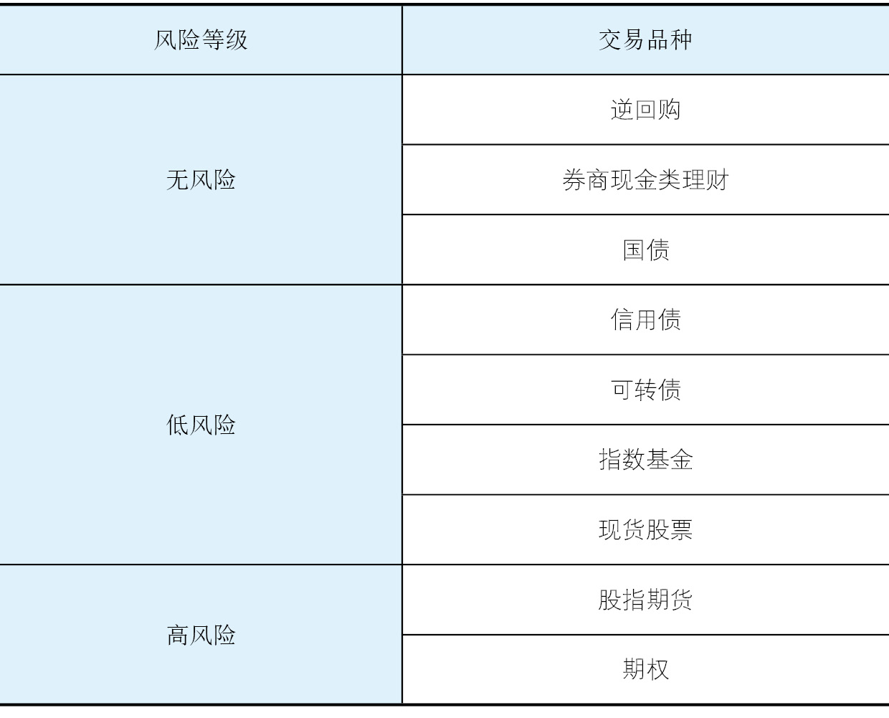

### 晋级三部曲
想迈向成功，必须要经过三步。

1. 经历过一轮牛市，知道挣大钱的感觉是什么。
1. 经历过一次大的亏损，知道为什么赔钱。赔大钱都是源自性格的某个缺陷，早点认识它，在自己成长起来之前认识到，比到后来一次输到爬不起来要强很多。
1. 知道买，知道卖，知道加减，足矣。

## 交易框架
### 投机要素
投机要素表达包含两层含义。第一，在什么时候买什么投机品。这其实关系到资产配置的问题。比如：当觉得房地产很火的时候，去买房子；牛市来了的时候，去买股票。第二，在什么时候干什么事。这其实具体到了操作的问题。

### 牛市来了买什么
通常来讲，当你确认牛市趋势出来的时候，应该去买杠杆最高的东西，满仓大杠杆。这是好手的标志。这时候你就可以运用杠杆等级表（参见表2-1）、流动性等级表（参见表2-2）、风险等级表（参见表2-3）这三个工具，自己去选择。

### 牛市来了怎么办
1. 要选好“武器”。你随时都可以认为牛市来了，只要做好风险管理就行。比如，2013年6月，期指大贴水，我觉得这时行情应该已经到比较低的位置了。但是，我既不敢做多股票，也不敢做多期指，于是，选了可转债。我从2013年年底做到了2014年七八月，到了2014年9月，终于被个股的火爆给“勾引”进去了。
1. 要做好防御。以牛市看涨为例：第一种，融资做多个股，不涨不跌，亏资金利息，如果跌了，两边都亏；第二种，买期指，如果期指月月升水，亏升水的费用，这实际上是时间价值；第三种，买看涨期权，有可能会损失权利金；第四种，做多分级基金的B份额，不涨的话，分级B的溢价就是损耗；第五种，做多指数基金。有很多做法可以选择，关键要确定自己的底线在哪里，知道错了之后怎么办。

### 如何判断牛熊转折
确定牛市来了，在我的交易框架里有很多因素，比如2013年，我为什么认为牛市要来了。
1. 长期阴跌，大部分个股绝对价格很低。翻一翻那个时候的K线图，你会发现，从2010年3月到2013年五六月，指数从3 000点跌到2 000点，跌下去了1/3，股价为三四元的股票一抓一大把。
1. 市场长期萧条，绝大多数人不谈论股票了。比如，从业人员找不着对象。这是一个非常好的判断依据。
1. 市场好手在往里扑。在这次牛市前面，我印象特别深刻的是，在55168论坛，我看见我的一位朋友竟然在选权益类的产品，选个股，准备往里扑。因为我俩都是偏好低风险和无风险套利的，偏好低风险的人选择高风险产品通常有两种情况：一种是在长期阴跌的情况下，觉得价值来了；还有一种是面对连续的暴涨，终于被勾引进来了。第二种情况很危险，但前一种，我认为是一个好的判断标准。
1. 在牛熊转折的同时，图形上也会有背离出现。我的经验是：在大趋势的转折中，大多数的人都是对的。可以想象一下，大盘跌到1 800~1 900点的时候，到底是看多的人多，还是看空的人多？肯定是看多的人多。在这个大趋势里大部分人就是对的，只不过在行情一点点走的过程中，这些原来判断对了的人，逐渐走到了对立面去。随着走到对立面的人越来越多，下一个转折又来了，于是他们的判断又对了。
1. 在散户从一边往另一边走的过程中，要去关注那些熟手。但不是大V，大V因为他们的立场问题，粉丝一多，就不愿意认错了。如果将来我有这个倾向的话，大家一定要提醒我，也算是帮了我。

### 熊市和震荡市生存
比如，在震荡市，看一看期权的波动率是不是特别大。如果隐含波动率很大，在震荡市是会逐渐收窄的。那么你可以卖出上证50ETF期权，卖买权、卖卖权都可以，或者两个都卖，拿权利金。当波动率持续收窄，到某一个区间，你要特别警惕，因为这个震荡区间有可能随时被打破。

比如，《华尔街见闻》曾说，VIX恐慌指数飙升到40%，全球恐慌情绪上来了。这是什么意思？在过去几年美股长牛的过程中，VIX指数的波动率始终在12%左右，而飙升到40%，意味着该指数的波动率翻了三倍。而VIX指数是有期权的，保证金极低，你如果花5万美元满仓做，这一把能做到将近100万美元。国内波动指数，我们现在能够想到的就是期权，用上证50ETF期权去看。

# 如何正确认识自己
## 认识你自己
### 短线交易需要的性格特点
1. ME、CW高。在贝尔宾测试中，ME代表你的执行力，CW代表你的决心，即英文中的determination。我不知道大家玩不玩游戏，如果玩足球类的游戏，在找罚点球的球员时，一定要找CW好的球员。为什么？因为CW好意味着他敢果断出手。那么，ME是什么？ME是敢出手，而且敢按照自己的方式和方法执行。做短线交易，我们要的就是这两点。CW和ME一定要高，一项高一项低、瘸腿不行。
2. 简洁明快。短线交易员的性格特点是：简洁明快。什么叫简洁明快？说去哪儿就去哪儿，现在就走。说干什么事情，目的清晰，态度明确，方法得当，到了就做，做完就走。
3. 执行力好。根据我的观察，身边做短线交易做得好的，A型血的人居多，B型血的人也多，AB型血的人就没有。O型血的人做得好的也有，但最多的是A型血的人，为什么呢？A型血的人守纪律、执行力好。AB型血的人通常比较纠结，最不利于做交易。
4. 依靠系统，纪律严明。做短线的要诀，就是八个字：依靠系统，纪律严明。依靠系统是什么？是你的决断力，到这个系统位置我就要做，一定要做。其实是系统给了你做决断的勇气。纪律严明，该做的时候就要做，不该做的时候就要平。这是最关键的。

### 长线交易需要的性格特点
1. 心态开放不偏执。为什么心态要开放？我在雪球上发帖子的时候就发现，有些人就是来跟你抬杠的，你说朝东，他一定说要朝西。他要的根本不是观点，他只是为了反对而反对。这种人就属于略偏执，或者说是杠子头。偏执型的人，不要做长线，会严重亏损的。我一直强调，我们不能去做不能错的事情，特别偏执的人去做长线，他一定会错的。
2. 自信。自信体现在哪里？体现在对自己坚信的东西有底线的自信。无底线的自信，有可能会带来比较大的灾难。比如，在高位大量去融资的、想一年赚10倍的，往往都是没给自己设定底线。
3. 有底线。比如，2015年某期货大佬的期指多单，你说他有底线吗？他成功过，平时挺有底线的，但是在这个当口，他的底线就逐步在往后退。自信和有底线，这两者本身略有一些矛盾，前者是去做的问题，后者是执行的问题。如果一个人很自信，认为这只股票非常好，愿意去赌，没问题，但亏了多少钱必须出来。这就是有底线的自信。
4. 大局观。很多人在做长线的时候，眼睛盯在每天股价的涨跌上：昨天涨了五毛，今天跌了三毛，后天涨了两毛，大后天又跌了五毛……其实，这样是不对的。做长线要求的是大局观，在大概率的时候，去做大概率的事情就可以了。
5. 高情商。高情商体现在哪里？体现在对事物的发展变化比较敏感，当这个事物起变化的时候，能够比较早地感受到。比如，2007年的时候，我朋友做中粮屯河，2007年那么大的牛市，这只股票没怎么涨；2008年大盘跌的时候，它开始涨，大盘从5 500点跌到3 000多点，而它的股价翻倍了。当时，很多买了这只股票的人喜出望外，但是他感觉不对，这只股票该涨的时候它不涨，该跌的时候它不跌，应该已经到头了。

### 交易成功者的性格特点
1. 温和。什么叫温和？不抬杠。有抬杠的工夫我干什么都行。你可以看一看，在网络上，只要是跟粉丝对骂的，基本没戏。你连别人的不同看法、对你的评价都忍受不了，怎么去接受市场对你的评价？市场的评价，可从来不会风平浪静、如你所愿。你看涨，市场马上下跌，抽你一耳光；你刚看空，市场马上又上涨，再抽你一耳光。你能怎么样？这地方专治各种不服、不温和，三天就让你精神分裂了。
2. 谦虚。我自己的经验是：我看所有人的观点，都是以一种去找他漏洞的方式，会在心里揣摩。现实中我不能这样，这样的话攻击性太强，别人就不愿意跟我交流了。比如有人说了很多话，那么我就会在心里想：他说的这些话，在逻辑上有没有问题，有没有漏洞？我会尝试着拿自己的疑问去问他，如果他的回答没问题，那我就认为这个逻辑是对的。你接受任何一个观点都应该是这样的：看到一个观点，首先要问一问，它的逻辑在哪里，或者你自己总结它的逻辑在哪里。这个逻辑有没有漏洞？如果有漏洞的话，可以去问问他，看看他怎么回答。
3. 攻击性差。交易做得好的人，通常都有一个口头禅：“你说的有道理”，“有道理”。10句话里面至少有两句是这样的。大多数交易者，对于事物的观察都是比较细致的，对于谎言的识别特别敏感。你说两句话，他马上就知道你是不是言过其实，是不是在吹牛。

# 如何才能不再亏损
## 面对亏损
### 亏损的原因
**（一）短线亏损的原因**
1. 交易的随意性。短线亏损的原因，排在第一位的，是我们出手的次数太多，交易的随意性太强。对此，我深有体会。我在2002—2003年这两年做的量非常大，当时我统计的成功率是40%多，其中我做的随意性很强的交易，通常都是赔钱的。这是短线产生亏损最重要的原因。
2. 成功率的“极限容忍度”。我们对于交易的成功率是有容忍度的。比如：成功率达到了80%，我们的心情可能特别好；而成功率为50%时，我们就没那么开心；当成功率为40%时，因为错的时候比对的时候多，我们很容易进入一种特别焦灼的状态，从而导致技术水平失控，马上还可能会亏损一笔大的。
3. 大仓位。由此，衍生出来短线交易的仓位问题。对此，我的主张是：如果你是一个纯短线的爱好者，那么你在短线交易的时候就应该满仓做。为什么？第一，因为是短线交易，所以每次的亏损幅度都很小，是限定死的；第二，相应来说，你的盈利幅度也不会太大。因此，如果不满仓做的话，意义不大。至于杠杆类的交易，比如期货交易，如果做短线，更应该把杠杆用足。
4. 满仓需谨慎。因为是满仓操作，所以需要相当谨慎。我自己的经验是：当满仓去做一件事情的时候，我们总是比较谨慎的。反而是不满仓操作时，比如你有100万元，先投入了30万元，你可能就没那么谨慎了。
5. 频繁交易。在短线交易里，频繁交易的后果是：一方面会导致成功率大幅度下降，另一方面也会让交易成本激增。最关键的是，这样操作对于修复交易心理特别不利。每个人都是有承受极限的，我自己的承受极限是三次。连着错三次，我可能就不太会去下手第四次了，肯定要休息一下。

**（二）中线亏损的原因**

我所说的中线就是波段操作。在板块轮动、慢牛市，或者一些宽幅震荡的行情里，我们做波段的概率会比较大。一般会选一只自己熟悉的股票长期做，或者中长期做。

1. 波段区间。波段操作的前提是：贵的时候卖，便宜的时候买。但是这种格局，是会被打破的。它被打破的标志是：原来的低点或者高点被打穿。高点被打穿，意味着加速，至少是一个区间扩大；低点被打穿，有可能是一个破位，这个时候应该离场。在波段操作里，大部分时候并不是“我卖了，把它给卖飞了”，因为那代表后面行情上涨时没捡着钱。多数情况都是打漏了低点，没有平。出现这种情况，一般是由于一些人长期做某只股票，自认为对它很熟悉，缺乏警惕性。面对这种情况，只能用严格的交易纪律来规避。
2. 波动率。大家记住我的结论：市场中长期高波动率的个股，是不可能跑赢指数的。也就是说，在高波动率的个股上做中线的波段操作，在大势上是跑不过市场的。我们应该关注波动率从低向高的个股，这些个股才具有强的可操作性。我认为：波动率是相当精准的判断依据之一。比如，一只强势个股，如果它的波动率变低，那你一定要提防它阴跌。因为波动率变低，意味着这只个股里的资金不活跃，而资金不活跃，会导致这只股票在原有的趋势上产生转势，如果它之前是强势的，立刻就会转为弱势。与之相应的是，如果一个长期低波动率的个股突然间上下乱蹿，那么这是变盘的前兆。尤其是长期慢牛的股票，基本上每天都有1%的涨幅，突然高位加速，然后一根大阳线接着一根大阴线，这是非常明显的信号。
3. 振幅。大家可以把波动率指标加到自己的观察要素表里。波动率以振幅来计算，我们可以用贝塔系数来描述。举个例子，大盘每天的上涨下跌区间是1%，如果有只股票，它的上涨下跌区间是5%，那么我们就认为它的贝塔系数是5。一只股票的贝塔系数越大，说明它的波动率越高。相应的，在选板块、选股票时，如果你要在短线和中线上有操作性，一定要选波动率高的股票。但是在长线上，你一定要选波动率低的股票。

**（三）长线亏损的原因**

长线亏损最主要的原因，不是你选的股票不好，而是你买得太贵。这句话希望大家好好地体会。比如中国石油上市的时候，发行价是16.8元，第一天开出来是48元。你说这家公司好不好？当年上市的时候它是亚洲最赚钱的公司，非常好的一家公司。

## 停止亏损
### 短线止损的技巧
1. 建仓区间概念。首先，我们得明白建仓区间的概念。什么意思？我要买一只股票，假如这只股票现在的价格是10元，那么通常情况下，我认为在9.8~10.2元这个区间都是建仓区间。在这个区间内，我们可以把止损设到9.8元以下，跌破9.8元我再止损。建仓区间概念对大资金来说可能更关键，当然大资金也会有一个砍仓区间，股价到警戒位置，必须往下杀。在建仓区间里，我们既不谈止盈，又不谈止损。
2. 止损的位置。止损的位置在哪儿，这是最关键的问题。为什么关键？因为它决定了你的执行，到哪个位置你要退出。
3. 止损的设定。止损位置的设定，在短线上有三个标准：
   1. 技术图形上的支撑位，这是一个具体价位。因为做短线，大家都是在做情绪、做波动的。股价波动的原因是资金的进出，而资金进出的原因是情绪问题。既然短线是在做情绪，那么相应来说，技术图形看起来也就更加简单一点。因为很多人的情绪在技术图形上都是有共振的，所以具体的价位可以很简单地在技术图形的支撑位或者阻力位上明确地设定。
   2. 突发事件和新闻，我把这叫作事件止损。什么意思？你是做短线的，买进去8天了没反应，是不是该走？或者突然听说这家公司的董事长被抓了（当然，牛市的时候经常出现董事长被抓是重大利好的情况，可能是因为这意味着公司马上就要进行重组了），或其他一些新闻，遇到这种情况时，第一时间毫不犹豫地出来再说。
   3. 某个看着很不爽的人，这是一个超级反向指标。因为有很多人的反射弧比较长，市场都狂欢完了，他最后一个跳起来。他只要一跳起来，那行情真差不多了，但是你不能跟他说，你说了，他的心情会很不愉快。我们有个研究员，就是这种风格。反正他一激动基本上这波行情就到头了：恐惧到头了，兴高采烈也到头了。

### 中线和长线止损的技巧
1. 震荡区间被打破。举个例子，有一只股票在漫长的震荡行情中，顶底在12元到9元之间来回磨。突然有一天，12元这个顶部被突破了，你第一时间应该先把你的多头仓位守住，如果你在12元往下抛了点，先把抛的那些捡回来。为什么？因为也许突破是对的。区间一旦被打破，你一定要很小心。比如一根中阴线把你的支撑位、重要的均线支撑位全部打漏，然后MACD指标迅速扩大，绿柱马上放大，震荡区间明显被打破了，一定不能再去做顶底操作。
2. 背离的形成被扭转。高位顶背离，低位底背离，如果一个顶背离之后没多久，同时间周期又形成了一个冲破前一次顶背离的指标，那就说明这个背离已经被扭转了，原来的顶背离已经不再是顶背离了。比如MACD出新高了，这时，我们在操作上就不能再用波段的眼光去看待了。这时如果用波段去做的话，你的止损一定要设得很小。可能随时一个爆拉，直接就把你拉出去了，也许趋势就要来了。
3. 周期的共振。在波段操作中，也是有周期的。如果是在日K线级别做波段的话，正常情况下，你要关注的是比日K线高一个周期的周K线和比日K线低一个周期的小时线。通常，我们应该等小时线和周K线的方向一致，但是刚好和日K线方向相反的时候，去做买入或者卖出。
   - 什么叫**顺大势，逆小势**？我们把周期划分成大、中、小三段。在大周期和小周期上，我们方向要一致，而在中周期上，也就是我们正常观察的这个周期上刚好是逆着的。比如说我要做买入，那么首先，周K线要是上升趋势，小时线也开始上升趋势，并且日K线刚好调整到位，从一个下降趋势中均线走平，这个就是典型的顺大周期小周期的势，逆你目前操作的中周期的势。这就是顺大势、逆小势的交易。首先，你的短周期切入点很敏感，另外，长周期是往上的。相应的，如果我们看到周K线趋势都走坏，然后小时线再次走坏，这基本上就是一次加速突破的形成。这种交易会让大家的切入点非常好，无论是做中线还是做长线，买入就赢利，对增加你持仓的信心有帮助。
4. 买卖逻辑要一致。在波段操作和长线交易中，最容易犯的错误是，买卖逻辑不一致。

### 浮动止盈的技巧
1. 用利润去冒险。浮动止盈和止损其实是一回事儿。我们没挣钱，那是止损，有盈利了之后，浮动止盈就要跟上。这里的核心思想就是一句话：挣的钱，落袋为安，一定要先揣一部分到兜里，这等于是我在用盈利去赌未来。10元买的股票涨到15元了，好，我想得很清楚，跌到13元我就卖，最起码这5元利润，我留住了60%；股票从15元又涨到了20元，那我就有10元的盈利了，回吐40%就是4元，我也觉得有点多，那就只吐20%。这实际上是一种最朴素的思维，要尽量把本金保住，可以用利润去适当冒险，甚至可以用利润去进行特别大的冒险。
2. 利润回吐之后强制平仓。在利润回吐一部分之后，要强制性地平仓。这实际上就是我们常说的止住亏损，让利润奔跑。大家可以仔细地观察一下自己持有的赚钱的股票，看一看这些股票，最大的调整幅度能有多少。你可以给自己设一个止盈比例，这一比例是因人而异的。
3. 为什么不愿意止盈。怕的是本来你只打算吐20%的利润，可吐了20%之后，你又觉得我可以再吐20%跟它赌一赌，这就完了。开平仓不一致，制订的计划不执行。浮动止盈最根本的一点就在于，我们一定要意识到机会是很多的。可很多人不愿意止盈，为什么？因为他们觉得自己手上的就是最大的机会，不愿意走。

# 如何正确参与市场
## 市场参与者
表5-1 市场参与者定位表

市场参与者 | 定位
------|---
公募 | 大散户
散户 | 韭菜
绝大多数的私募 | 偏韭菜
游资和犀利私募 | 收割机
产业资本 | 配置和择时

## 市场生态
### A股的操纵问题
**1. 有没有操纵**

对于A股市场是否有操纵，大家一直有争议：有人说操纵得非常精确，连收盘价都可以被操纵，想多少点就多少点；还有人说，不可能有操纵。我觉得两者都极端了。大盘能够被具体地操纵到某一个点吗？这是不可能的。因为任何一个点位，你都能找到无数解释，比如：“520”代表“我爱你”，那“525”就代表“我爱我”了？通过对数字的解读，就认为市场可以被任意操纵，想往哪儿走就往哪儿走，这个思路是不对的。

但没有操纵也是不可能的。市场操纵分两大类：一类是短期，另一类是长期。还有一种分法，也可以分为两类：一类是操纵个股，另一类是操纵大势。比如2014年到2015年上半年这次跨市场的大行情，为什么上面一直说要慢牛，因为希望通过资本市场稳定来解决一些现实中的问题。对于个股的操纵，长期的是庄，短期的是势。

**2. 短期的情绪操纵**

有网友问：短线高手预测大盘的点位很精确，你怎么解释？这是技术测量的一种技巧，如果很多人在用道氏理论，那么这个市场对道氏理论就会有一种天然的反应，到均线位置，大家都开始做，都开始往里边卖。

比如，美股在2015年9月25日反弹那么多，我本来是想等它到碰均线的时候再买回来，但是后来看不行了，那我就直接追着买了。但是如果碰均线的话，我一定买。这其实就是盯着技术图形在做。所以，我们不能把这种情况认为是有谁在操纵。但是短期的情绪操纵是一定有的，比如游资突然扎进去，20秒就把股价拉涨5%。

**3. 长期的整体操纵**

有长期的操纵吗？有啊，坐庄嘛。现在，二级市场还遗留着很多庄，至今无法完全杜绝。比如某个资本在某只股票里始终不出来，每年能做一两波行情。

### 庄股的来龙去脉
**（一）第一阶段**

**1. 无股不庄**

20世纪90年代开始有股市的时候，上市公司非常少，市场上仅有8只股票，那么当时有没有庄？几乎没有，当时全是电话报单，没有庄存在的土壤。后来，交易电子化，随着交易方式的变化，庄股开始大量出现，到2000年的时候已经是无股不庄。

我最早入行的时候就是帮主力报单的，亲眼见证了主力怎么运作一只股票。短短一两年，在它们的运作下，股价从13元涨到18元，回到13元，涨到16元，又回到13元，又涨到18元，然后再次回到13元，它们把现金打进来，走的时候再带走这么多现金，还带走同等数量的股票。

在这个阶段，庄股表现得特别好，大家通过技术分析跟庄炒股。这其实就是两只羊的思维，两只羊互相商量：我们去那块草地上吃草吧。为什么？因为那里有狼。

**2. 绝大多数庄股被消灭**

从2001年开始的大熊市，消灭了绝大多数的庄。没有走的庄，也几乎都被闷死在里面。大家可以想象一下，股价为23元的股票，最后跌得只剩3元，股价为三四元的股票遍地都是，八九元的算高价股。股价从上面一路跌下来，里面有多少资金、多少庄都没用。

**3. 庄股时代退潮的标志**

庄股时代退潮，标志性的事件就是，最有坐庄能力的人在这个市场上坐庄失败。大家可以想一下，当时最有坐庄能力的人是谁？证券公司。最典型的两家公司我不点名了，但它们做的那两只股票，我可以跟大家讲：一只是哈药集团，一只是宁沪高速。

当时在哈药集团的大股东名单里，根本没这家证券公司，但是出了问题之后，大家发现它持股95%。一家证券公司持有一只股票的95%，多可怕。

宁沪高速也是同样的问题，只不过那家证券公司抓住机会逃了。它抓住了什么机会呢？2002年6月23日，国有股减持被国务院叫停；星期一，即当年的6月24日，大盘开盘后出现井喷，几乎以涨停开盘，个股就像疯了一样；10点半之前，几乎所有股票都涨停了。在我印象里，只有三只股票没涨停，宁沪高速当时就在卖。铺天盖地的卖单让宁沪高速始终只涨3%，为什么？它终于有机会跑了，那天全市场的量太大了。当时，全市场平均一天的成交量，两市加起来连50亿元都不到，但是那天，全市场成交了380多亿元，第二天成交了500多亿元。

为什么哈药坐庄失败？因为当天它在加仓。有朋友说：唉，它买那么多有什么意义？你以为它想买？它也不想买，但不买股价就往下跌，跌得让它受不了。那怎么办？它跟客户说：你也不会做股票，干脆把钱借给我，我来做股票，我用你的账户买，反正股票还在你名下，我每年给你一定的收益，咱们签协议。可这是一个三方监管的委托理财协议，是违法的。当这个协议的盖子被揭开的时候，相关部门一去清理整顿才发现：天啊，一家公司买了一家上市公司95%的流通股！这家公司破产了，标志着无股不庄的时代结束。

**（二）第二阶段**

**1. 抱团坐庄**

市场经历了2005年的黑暗期、2006年的爆发期，2007年出现了另外一种百花齐放的模式。2007年，公募的力量已经很强大，开始有“抱团坐庄”的情况出现。什么叫抱团坐庄？你买点儿，我买点儿，大家都买点儿；你锁2 000万股，我锁2 000万股，这只股票的流通盘越来越少，很小的力量就能把价格弹起来。

一直到2009年，抱团坐庄都还有遗留，但是坐庄的主力已经变了，不再是所谓的长线庄或者传统意义上的“老庄”。为什么？因为证券市场开启了一个新的制度：三方存管。

**2. 二级清算制度**

最初，我们所有股民买卖股票的钱，都是存在证券公司的大账户里，买卖股票必须通过券商进行，因为中国证券登记结算有限责任公司（以下简称“结算公司”）只跟机构不跟个人进行清算交割。所以，再厉害的股民也得到证券公司去开户。证券公司把所有股民的钱存到自己的账户，去结算公司开立保证金账户，用保证金账户跟结算公司进行当天的资金清算和交收。换句话讲，券商不需要把股民所有的保证金都存到规定的结算公司账户，因为当天有买的有卖的，只要把轧差存到结算公司就可以了。

比如：我是一家券商，在我们这里开户的有1万个股民，这1万个股民今天有500亿元的买入，498亿元的卖出，那么结算公司的账户里只要有2亿元的备付金，就可以完成当天的清算和交收；当天跟清算公司做完清算和交收之后，我再去跟客户清算和交收。这就是“二级清算制度”。第一级清算是登记公司和券商清算，第二级清算是券商和客户进行清算。

全世界的券商都用这种运营模式，这种模式最大的问题就是存在券商私自挪用客户保证金的现象。国外到现在也存在这个问题。在国外，为什么大家不去找小券商，因为小券商可能把你的钱挪走，而大券商挪用客户资金的概率低。为什么国外一些投行也有自己的银行？因为如果没有银行做背景，把钱存在那儿，将来它跑了怎么办？这是我们最初的清算交割模式，直到现在也是这样，只不过我们国家对券商和客户之间的清算和交收，做了详细的规定。

**3. 三方存管**

为了杜绝券商挪用客户保证金，国内监管层想到了一个办法是：客户证券账户的保证金不再存券商处，而是存银行，券商不能再管理客户的保证金。客户在券商端开户，开立一个资金账户，悬挂自己的股东卡，形成一个标准的客户码；同时，还必须去银行开立第三方存款账户，虚拟生成一个证券保证金结算账户。

实行三方存管以后，券商每天做第二级清算的时候，要先用资金账户的资金余额和资金流水与在银行端生成的证券保证金监控账户进行一次对账，然后才是与客户的资金清算和交收。这样做的结果是：第一，券商再也无法挪用客户的证券保证金；第二，在现有情况下，在进行一级清算时，券商结算备付金账户的钱是自有的，跟客户的三方存款账户有一个时间差；第三，所有客户在开户的时候，必须用真实的银行卡和身份信息，不然三方存管上线这一关过不了。

所以，当时光大证券出问题，很多人问：“这家证券公司买卖股票怎么不要钱？”它不是不要钱，而是证券公司的自营席位或者交易通道，它自己出来的这些委托单，确实是不检查保证金账户里边的钱到底够不够的，因为检查要浪费时间。光大证券厉害就厉害在这儿，虽然多买了几十亿元，但是在日中的时候它自己垫钱完成了清算。

**4. 账户清理**

我们回过头再来谈庄股，在任何一个客户都必须去开立银行三方存款账户的前提下，庄股就没有了生存模式。为什么这么说？因为之前庄股为了便于操纵，使自己不暴露在前十大股东名单上，肯定是分仓的。

分仓时，可以用多个身份证，甚至是多个假证实现。这种操作曾经离谱到什么程度？可以随便开一个账户，比如开一个叫“刘德华”的账户，因为深圳的账户可以多地托管，随便挂一个股东账户卡进去，就可以做交易。但是现在这种模式就不行了，必须开立银行账户做三方关联。所以，2006—2007年进行账户清理时，清理的几乎都是庄股。2008年3月，所有A股投资者的保证金必须上线三方存管。从那个时候起，庄股最基本的分仓模式已经不存在了。所以我们看到，第二阶段的抱团坐庄，几乎没有原来的老庄股。

**（三）第三阶段**

现在实际上正在经历第三阶段。遗留的一些庄，还有一些短线庄，在股东明细、年报、季报中才会披露。由于只做三天行情，它们不需要披露股东明细。包括一些闪电庄，日内做一下就完了。

**（四）第四阶段**

将来我们可能会经历第四阶段——产业庄。比如说德隆当年做不了的，现在实行市值管理化以后，全都是无缝减持，这时候可能就有一些产业资本要把整个生态链打通，包括一些所谓的生态庄。

比如腾讯。腾讯的经营思路就是：你干得好，我出来跟你对着干；干不过，我就把你买了。它如果在国内上市了，完全可以用这样的方式，定向增发把你收购了，这是另外一种玩法。包括产业庄，在海外其实都有。

**（五）庄股产生和发展的分界线**

大家可以思考一下：庄股产生乃至发展的关键是什么？第一，有方便交易和操纵的工具；第二，市场容量不大；第三，监管存在盲点。实际上，今后市场的发展方向和这个刚好是相反的，所以庄股以后一定不是主流。

为什么我从2012年就跟大家说：没有庄了！大家再去研究跟庄，已经没有意义了。市场上畅销的一些炒股书籍全是在教大家怎么跟庄，这些作者见过庄吗？所谓的短线庄、闪电庄，其实就是游资正在引爆整个市场，它们如何做势，如何去利用势，如何识别市场的情绪和波动？它们实际上是在做这些。庄只是表象，势才是关键。

### 庄股游戏规则
庄也好，势也好，都有完整的游戏规则。在这些规则里，我们要解决以下几个问题。

1. **定价是否有效**。把股价打这么高，有人认吗？大部分庄“死”的原因都是出不来，而它出不来的根本原因就是它的定价无效，在顶上根本没有人愿意买。
2. **与全市场为敌还是引导市场情绪**。曾经有一段时间，大家都在谈论嘉能可的问题，“有色金属跌这么多，是因为嘉能可不行了，嘉能可持有大量的锌、镍、铝、铜，现在嘉能可把别的头寸砍掉了，在保铜的仓位”。为什么会出现这种情况？因为嘉能可在过去的两年里是与全市场为敌，大家都在做空，而它在囤货。商品市场上这样的例子太多了，比如2008年的华联三鑫、2010年的沙钢，都是跟全市场为敌。这是一条不能错的路，只要错一次就死了。所以，这个市场最残酷的地方在于，你再痛苦也不会有人饶了你。
3. **把人群赶来赶去的办法**。把人群赶来赶去，把散户从一边赶到另外一边，赶过去再赶回来，这个过程就是赚钱的过程。庄股就是这样，在股价最便宜的时候你们最好都卖给我，等你们卖完了，我一点一点吸引你们的眼球让你们来，高位的时候再全部倒给你们，把你们从一边赶到另外一边。
4. **系统性风险怎么去规避**？这是最核心的问题。你很厉害，但是在大熊市时，你想子弹无限？那是不可能的。所以，现在再去考虑庄股，其实就是这四个问题。包括我们做势，也是这四个问题。将来大家做大了，深度介入一只股票时，还是这四个问题。如果你的体量还不足以去影响市场，那么第二个问题和第三个问题不用考虑，但第一个问题和第四个问题一定要多考虑。

### 参与庄股的要诀
1. 短线资金流汇聚地。短线我们在做势，所以做短线更多是考虑势的形成。势，通常都是用资金推出来的，所以我们实际上是在考虑资金流汇聚的问题。一般资金流汇聚，会有以下几个特点。
   1. 这只股票的波动会由小变大，从原来每天1%的涨跌，到每天3%~4%的涨跌，会有一个不断放大的过程。
   2. 成交量会被推高，这是一定的。
   3. 它应该刚好是话题讨论的中心，眼球效应很强，如果还有一些板块效应的话，会更好。比如，曾经的上海本地股，既有国企改革概念，又有迪士尼概念。所以，参与短线，就是在做资金流汇聚。
2. 长期价值发现地。长线要做什么？要去参与一些价值发现类型的股票。这实际上是什么？这实际上是抱团取暖，相当于在做基金的预期，预期公募或私募会陆续进来，把这只股票的流动性一点点买光。包括现在很多银行股粉丝，根本就不知道将来要挣谁的钱。那些银行股的粉丝，一定要问问自己：想要挣谁的钱？来结账的是谁？现在买银行股，是因为判断将来会有越来越多的人追着买自己的股票，这才是长期做价值发现的原因。
3. 尽量不碰老庄股。庄股的特点是个人股东多，上、下影多，K线上的不规则放量多，公司成立时间长，发生的事件多，一般以本地股为主，比如界龙实业。这些股票大家自己去看，我不一一点名。我劝大家不要碰老庄股，你在它身上长期是挣不到钱的，它玩的时候真的是会玩死人的。创业板中既有新庄股，也有抱团取暖的，将来如果有些跌下去，也是会令投资者损失惨重的。

### 基金买卖的特点
为什么我说基金是大散户？

**1. “双十”红线**

一只基金持有一家公司发行的证券，其市值不得超过基金资产净值的10%；同一基金管理人管理的全部基金持有一家公司发行的证券，不得超过该证券的10%。所以，任何基金都不能突破“双十”红线。

**2. 禁止双向交易**

比如，我是华安基金，我有一号、二号、三号、四号……一共20只基金，这20只基金全部都买了浦发银行。当一号基金当天做了浦发银行的卖出没有成交，那么全部20只基金当天都不能做浦发的买入，不管是买入委托还是买入成交。为什么要禁止基金双向交易？因为它们的资金量太大了，特别容易操纵市场。

**3. 交易制度和风控流程**

基金有严格的交易员下单流程和交易制度，主要通过股票池和交易指令单控制风险。基金经理想买股票，必须买已经在股票池内的，基金经理不能决策，由交易员根据交易指令单交易。

整个风控环节的流程是：开投资策略报告会→觉得这只股票好→纳入股票池→进行长期跟踪。这些研报有可能是刚入行三个月还没转正的研究员跑一圈，给了基金经理。大家论证，觉得这只股票可以配一点，至于配多少、什么时间配、以什么价位配，基金经理不能决策，要由决策委员会做投资决定，并向交易员下达交易指令：在哪天以前，多少价位以内，买够多少股。

那么，在交易员拿到交易指令单后，他的第一反应是什么？把交易指令单完成了就行。指令单上要求以不高于10元的价格，买够100万股，眼下价格是9.25元，只要在10元以下买够，就是完成指令单了，至于是10元的成本，还是9元的成本，交易员不会管。完成指令单年底就有年终奖，如果这笔单子没完成，下个月就会被扣钱，所以，他一定是以完成指令单为目标。

为什么我们会看到基金一窝疯地高位建仓？就是因为它们刚开过决策会要配，要大家集中去买。私募的风控更灵活，其中一些基金经理的话语权更大一些，几个知名的基金行业“一哥”，等于是自己在做。还有一些封闭式基金，管起来真的是像管理自己的孩子一样。而开放式基金是控制不了的，所以它们就像大散户，它们的余地甚至比我们的还要小。

### 主动型基金的致命弱点
1. **持仓比例受限**。主动型的基金既有持仓上限，也有持仓下限。比如一只股票型基金，看空市场，想清仓，可以吗？不可以。看空，还不能低于上限，多难受。
2. **申购赎回受大众牵引**。比如，这只基金并不看好市场，但是申购这只基金的人很多，本来是满仓10亿元规模，一天又申购10亿元，原来满仓也只剩50%了，于是要买到80%以上，被动多买6亿元的货。赎回更是这样，本来仓位很轻，比如偏股型基金75%的持股下限，假如100亿元的资产，25亿元的现金，结果一天就把25亿元赎回了。不想卖也得卖。申购和赎回受大众的牵引。
3. **买卖不自由**。基金的风控流程导致它们买卖不自由，从决定买到完成买，中间有很多过程。交易员拿到交易指令单后，他想的不是尽量少买一点或者不动声色，不影响这个市场的股价，而是一把就上去了。因为买得不精细，所以它的利益输送就无法避免。
4. **利益输送**。搞内幕交易的基金经理，开决策会准备买入，到厕所发个短信“某只股票，赶紧”，然后被抓了。

### 阳光私募的操作方式
阳光私募在2010年之后开始快速发展，主要走信托的通道，走基金专户和券商通道的较少。现在主流的阳光私募操作方式，除了类基金的股票池以外，主要是两类：第一类是阿尔法，比如空的期指买的现货，只要你的持股超越市场，就能赚到钱；第二类是量化，是全球通行的一种做法，用多种对冲工具来进行对冲操作，做的是绝对收益，所以在海外又叫对冲基金。

### 游资的特点
**1. 对情绪的引导和放大**

游资最大的强项在于对情绪的引导和放大。大概是在2003年或2004年，有一天《上海证券报》报道了一篇“关于上海市国资委准备启动上海市国有资本改制与改革”的文章（大意）。当天上午，行情波澜不惊；下午一开盘，我印象里是轻工机械（旧名）、丰华圆珠（旧名）领涨，两只股票直接涨停，并引起上海本地股全线大涨；第二天又是高开，连涨了三天。而当时的市场行情是长期熊市、市场低迷，这其实就是情绪的引导和放大。

包括股灾后救市时，大家说的“王的女人”。第一次披露的“王的女人”是谁？梅雁吉祥，证金概念，还有人说是证金借壳概念，这当然是胡扯。其实有“王的女人”的时候市场跌幅很大，但是这种概念只要敢往上高举高打，市场是会跟的，而且往上冲的人很多。包括2015年第一次股灾后的特力A，其走势完全让人看不懂，但是会对情绪有引导和放大作用。

在游资的操作中，对于情绪的渲染，最早的时候它们不懂，全靠市场口碑，后来变成大家去挖掘，去看龙虎榜。2005—2006年，股吧为什么火？是因为游资开始买股吧。如果某只股票的股吧里，人气特别旺，置顶帖子一大堆，基本上这只股票就没戏了、到头了。这也是引导和放大情绪的一个办法。很多莫名其妙的逻辑，都是从那儿来的。

**2. A股莫名其妙的逻辑**

比如，吸筹、拉升、震荡、洗盘。股票不是期货，我没见过做股票洗盘的。那么，期货为什么在往上拉升之前会先往下打？因为可以双向开仓，既开空又开多，等到真的往上拉的时候，可以平空单往上拉。股票怎么打压建仓？你打压，人家买走了，你打吧。比如中国中车，涨了10倍的股票在高位放大量，很多人说这是震仓、洗盘。开玩笑，它就是出货。

**3. 关键时刻敢于出手**

游资还有一个特点：在关键时刻，非常敢出手。做交易，有一个因素你要考虑，就是性格上要勇敢，游资在这一点上特别棒。它为什么勇敢？因为它有严格的交易纪律做保护。没有严格的交易纪律，它敢勇敢吗？勇敢一次就死了，对不对？

**4. 严格的交易纪律**

当然，游资赔大钱的时候也很多，游资凡是想跟公募搞股票，基本上都会被公募卖傻。比如，2008年6月3日，游资高举高打做联通，一下被公募套在山顶，第二天砍仓出来。如果没有严格的交易纪律，游资那次就被坑死了。
游资在市场上最清晰的还是体现在大的格局上，尤其是一些小票和概念票，它们玩得炉火纯青。在操作上，如果你想短线做热点，应该跟游资做。但是要记住：游资出得非常快，势的过程非常短，所以不要恋战。

## 散户进化
### A股的常胜逻辑
1. **冬播**
   1. 什么叫冬播？A股历来有一个特点，除了超级的跨年牛市行情以外，四季度基本都是一个低点。也就是说，四季度和第二年一季度的行情都还可以。反例是哪年？2007年、2008年。在2007年的10月，也就是第四季度见高点，这是非常少见的。
   2. 国内A股市场的行情，其实只跟资金有关系，国内资金投放收回的特点是年底银行结账，年初银行放贷。为什么说四季度是一个相对低点，因为有很多钱在四季度要回银行，要去结账，那么这些钱的权益类资产就会被卖掉。过完元旦之后，银行基本上在一季度会放掉全年贷款的一半，因为有很多项目已经批了，年初放款导致一季度的资金是最充裕的，因此整个市场就有这样一个冬播效应。这是第一个逻辑——“冬播春长夏收秋藏”，八个字。
2. **Sell in May**。这是什么意思？记得5月把它卖掉。美国人特别爱说：Sell in May and go away（5月卖掉，出去度假）。因为人们在一季度就做完了，做完了之后到5月就开始清仓，休息一阵子。其实2015年就是这个样子，不光是2015年，历来熊市年全是这样，很多熊市年还会提前到3月底。2001年是6月中旬出的高点，2002年是5月，2003年也是5月，2004年是4月，2005年全年都在跌。这是第二个逻辑：5月，我们通常见高点。
3. **年报行情**
   1. 年报玩什么？高送转。这是A股经久不衰的魅力。只要逢年报，你就找高送转，不要去找浦发银行。年报非常好有用吗？没用，它从来不送。它送转，也许有用。
   2. 或者炒第一份年报，你可以看年报预披露时间。我举个例子：第一份年报如果是创业板的一只股票，你应该怎么办？可以买的。你看第一份年报，某高速，那就别买了，没意义。有没有哪一年第一份年报是巨亏的？我印象里没有。这是年报行情，在年报行情里面找高送转。
4. **市场热点**。看地图炒股，看《新闻联播》炒股。最典型的例子是，2010年国务院部署中国十大产业调整与振兴规划，政策取向非常清晰。哪些板块有可能成为市场热点，你去做哪个，短线做三天，闭着眼睛做，效果很好。包括做上海自贸区，也是看地图做。

### A股的盲点
**1. 绝对收益与相对收益**

比如你买了中国石油，如果做绝对收益的话可以只买中国石油，但如果做相对收益的话，你应该把中国石油和中国石化列出来看看，如果中国石油比中国石化涨得多了，可以卖中国石油买中国石化。也有人曾经“搬砖”，搬银行股。大家有没有想过，银行股是不是值得长期投啊？如果值得长期投的话，那就买一只现在最便宜的，过一个月后比较一下哪只涨幅最大、哪只涨幅最小，换到涨幅最小的上面去。这就是“搬砖党”做的，把绝对收益做成了相对收益。

**2. 产业资本的分析角度**

第二个盲点，很多人没有从产业资本的角度去分析问题。我们应该站在产业资本的角度，尽量把产业资本的立场考虑进去。虽然它不一定对，但最起码，我们可以看到它的态度。比如在这个位置，产业资本愿意去增持某只股票，那我们就应该对这只股票保持一定的兴趣；如产业资本不要这只股票，或者是在卖，那我们可能就要保持一份警惕了。这不需要特别高的水平，看看定增、看看它搞的这些关联交易到底在干什么就行了。

**3. 基于换股、合并、要约、收购的无风险收益**

比如，有人在上周五满仓买了招商地产，这其实就是基于要约做的一种套利，包括招商、城投，都会有这样的机会。

我印象最深的是当时参与广汽长丰的吸收合并，广汽的收购条款非常优越，给了二次现金选择权。该选择权规定：吸收合并上市第一天，如果股价跌破9.08元的发行价，股东有二次现金选择权，可以以9.08元把股票卖给广汽集团。这其实意味着保本价格为9.08元，当然只保一天的本。大家记着：现金选择权是我们做这些套利的安全垫，当然前提是监管通过。

该新股上市，我印象里最高涨到18元，其实这已经溢价20%，但我当时就觉得才涨20%，这新股上市不得涨百分之四五十啊。后来，我脑子还算清醒，没有完全去赌。结果当天一看，9.08元的二次现金选择权，9.09元上有几千万股的买单，广汽集团搞来10亿元托这个盘子，我一看没啥戏，就全部卖了。后来，该股从9元多跌到5元多。

这就是经验，不要太理想化，也不要觉得收益会很高，这种都是看得到底牌的东西，收益率不会太高。比如：帝亚吉欧收购水井坊，直接就杀下来了；熔盛重工收购全柴动力，更是收购失败。所以在熊市里，换股、合并、要约、收购都很难成功，有可能会失败。

这里最大的经验是：要做国有企业。为什么呢？国有企业在落实到合同里时才会真正执行，国有企业失败的概率很低。但是私营企业，包括外资企业很有可能会失败，尤其是在熊市。

# 如何看分时图和盯盘
## 短线入门
### 分时图的意义
大多数做短线的人都看重均线，很多的买卖操作都是在均线附近。图6-1是一个分时图，分时图上有三个部分：第一部分是成交价格线（白线），成交价格线有上有下；第二部分是成交价格均线（黄线）。第三部分是最下边这些代表成交量的线，这些量有高有低。我们在看分时图的时候就看这三个部分：白色的价格抖动线，黄色的均线和下面的成交量线。

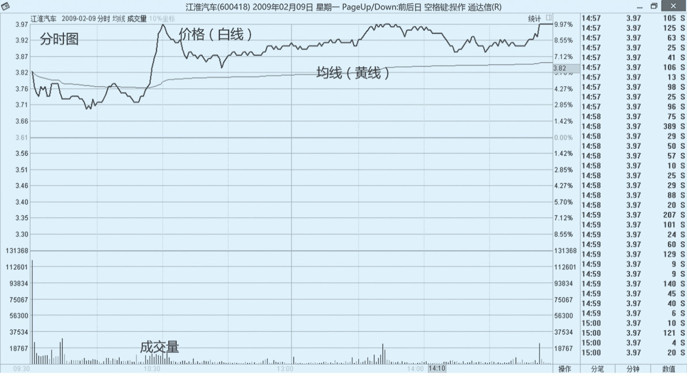

_图6-1 分时图_

### 均线的意义
在分时图上最关键的，是那根黄色的线，尤其是做期货和股票日内T+0的，一定要密切关注这根黄色的均线。那么，这根均线有什么意义？

均线，顾名思义就是从开市到这个时点，所有成交价的算术平均值，揭示了暂时的市场平均成本。如果在均线上，说明此前市场的平均成本是比较低的，现在价格上来了。反之也是一样。

所以，基于市场平均成本去考虑，它往往是人们情绪的一个爆发点。什么叫爆发点？举例来说就是，一直到下午2点钟，所有人今天的均线成本都是在10元一线，突然间，以旱地拔葱的形态涨到10.20元，那么短线的人就会来。为什么？因为他们认为这个突破是有效的，这是第一种买法，追突破；第二种买法是，第一次不买，等回调到10元，如果还下不去再买，这是买回踩的价位。

### 均线的标志
均线在技术派的眼里是三个标志：第一，突破的标志；第二，压力的标志；第三，缠绕盘整黏度的标志。

什么叫盘整黏度？参见图6-1，在这个图上，上半天的盘整一会儿在均线上，一会儿在均线下，上午10∶15左右上了均线，然后就再也没有下来过。整个上午，几上几下又在中间跨了好多次，这就属于黏度比较大的，完全没有偏离均线，也可以找一个波动率指标去衡量它的幅度到底有多少，这实际上说明它上午是没有明确方向的。在这种行情里，当发现均线短期内三五趟地上穿下穿，这个时候我们做得更多的是等待。为什么呢？因为太不明确了，短线没有办法去操作。

### 追单和突破
大家可以思考一下，如果买卖都在均线附近，会是什么样的操作？我一位朋友的操作，基本上买卖都是在均线附近的。他是在做日内突破，买卖点基本上都在均线附近。我刚开始摸索均线，也是这样的操作模式，在均线上，弹起下来，再弹起下来，我们做的是均线的弹性。这种操作，主要是以突破和追单的思路为主。

### 强弱的判断
在分时图上，我们经常会谈到“强”和“弱”，我们怎么去衡量强和弱？
1. 在均线上边强，在均线下边弱。
2. 看分时图的斜率。均线在分时图上，上涨也好，下跌也好，是有斜率的。比如，45度角的斜率和60度角的斜率，明显是不一样的（前提是你的时间周期选择是一样的，如果一个是半天周期的，一个是日K线的，两个斜率可能完全不一样）。斜率的绝对值越大，说明走势越强，不管是强势上涨，还是强势下跌。
3. 看反复的次数。是不是均线一会儿上，一会儿下？来回上下，强弱就无从谈起，就不明确。不明确的东西就不要谈强弱，我们要避免这样的操作。
4. 看日内盘整的标志。如果你看到一开盘，前20分钟，均线来回上下蹿了三五趟，那么当天盘整的概率极大。还有一种形态是当天一开盘一路往上推，推完了之后高位守着均线就不动了。这种形态在期货上最常见，比如高开10元，一把拉升1%，然后围着均线就不动了。在这种情况下，其实在拉升了1%之后，后边都是垃圾时间，你要很谨小慎微地做。

## 分时图形态
### 守均线走势
图6-2是典型的守均线走势。在强势开盘，涨了一波之后，后边开始盘整。开盘低开一点点，盘整了不到半个小时，然后一把起来，起来之后在高位就开始守着均线。请大家记住，这是基金建仓常见的形态。基金建仓的特点是什么？是交易员拿着交易指令单，他的工作就是完成交易指令单。那么，他完成交易指令单，是用什么样的方式和方法？交易指令单上只有三个要素：买卖的时间、买卖的股数、成本区间。他拿到这个单子之后，一定会在成本区间内以最快的速度来买够要求的股份。所以我们可以看到，图6-2立竿见影地拔起来，拔起来之后，他就买完了。买完了以后怎么样呢？市场的力量不足以让它回落，很多人也在盯着这只股票，短线客也在进场买入，但是又没有追高的资金加入，于是它就变成了守均线的走势。

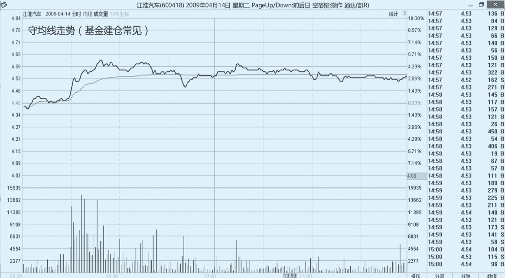

_图6-2 守均线走势图_

那么，我们在具体交易的时候该怎么做？如果你关注的股票连续3天，甚至5天都是这样的走势，一定要密切关注。大家可以去看一看2006年年底的普洛康裕（旧名），普洛康裕在启动之前，有连续3天的上影线碎步小阳线，全是这个形态；后边两天基金没动，然后紧接着基金集中买入，打了一波11天翻倍的行情，后劲非常足。除了基金建仓，这种形态还会出现在不停地发研报的股票中。

### 盘跌后快速提升走势
图6-3也是很常见的一种走势，盘跌之后快速提升。这种走势是基金建仓第2天经常出现的。如果你们看到这样的形态，前3天都是守均线的，第4天盘跌，但是到下午又拔起来，建仓没结束，有可能就是启动在即，基本上都是这样。而且我们关注一下快速提升的这个点（A位置），这个点的标志是突破了均线压制，之后会以非常陡峭的方式拔出来，走势越陡交易的参与度越强。如果做日内T+0的话，像这种形态，波动幅度在4%，至少能够拿到1.5%的利润。这种股票要密切关注，尤其是要和守均线走势联系在一起。

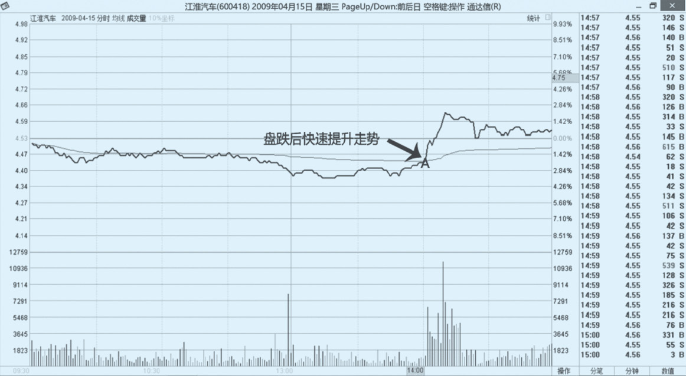

_图6-3 盘跌提升走势图_

### 守均线和盘跌提升分时图连贯形态
图6-4是当时整个K线形态发生的位置，就是图中的A位置，盘跌之后迅速提升，后边短线有两天的涨幅，后边大盘调整又砸下来一天，后边又起来。大家不要去看后边，因为这是短线的技巧，我们只关心分时图发生的后边两三天（B位置、C位置）就行了，这里有非常好的获利。

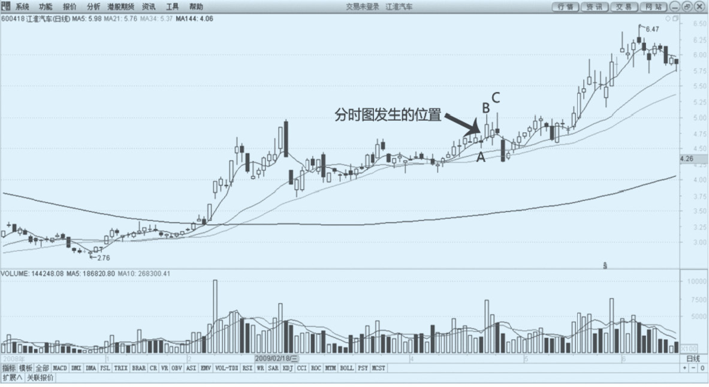

_图6-4 守均线后盘跌提升走势图_

### 快速极限走势
快速极限走势（参见图6-5）是游资的拿手好戏，高开3%或者5%，你还没有反应过来，股价已经被推到涨停板了。这个图中的速度还不够快，但是形态是一模一样的，快速极限走势非常强，直接就上去了。这种形态是“敢死队”操作时常用的。

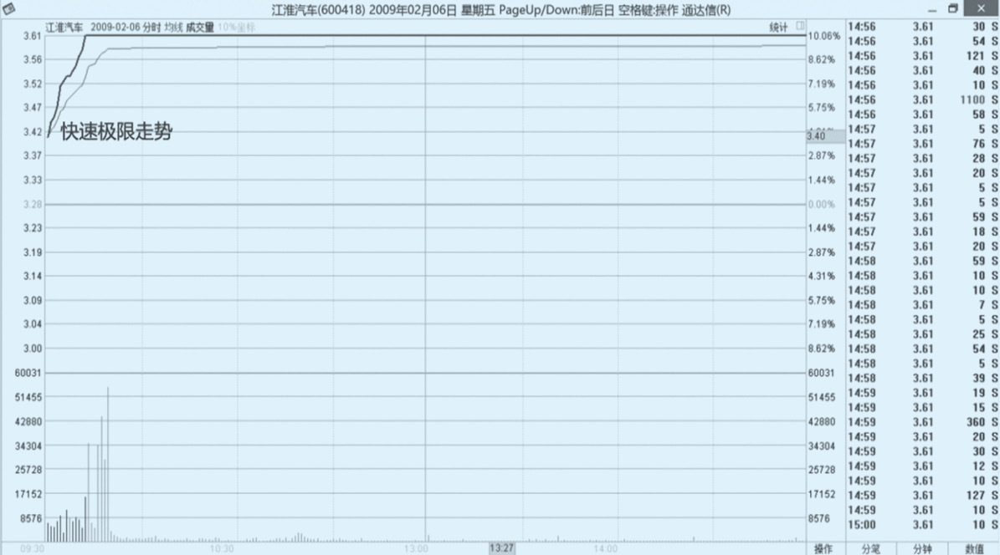

_图6-5 快速极限走势图_

### 突破均线走势

_图6-6 突破均线走势图_

前一天是快速极限走势（参见图6-5），图6-6是第二天的走势，高开被均线压制，但是在盘中突破了均线，全天站在了均线上面，并且再次摸到涨停。这说明头一天的突破是有效的。那么这个时候，你就会面临选择：头一天，我如果在8%追到的，那在第二天平开往下跌了2%的时候，走不走？到底赌不赌？对此，每个人的风格是不一样的：有些人是愿意赌的，有些人是不赌的，有些人原来愿意赌但现在不赌了。这跟性格和交易体系有关，没有所谓的对和错。盈亏同源，你挣钱是这么挣的，赔钱也会这么赔。

### 震荡整理走势
图6-7是紧接着图6-6，下一个交易日的震荡整理走势。这种震荡整理，我认为还是偏强的，当天大部分时间是在均线上，而且收盘也是收在均线上的。

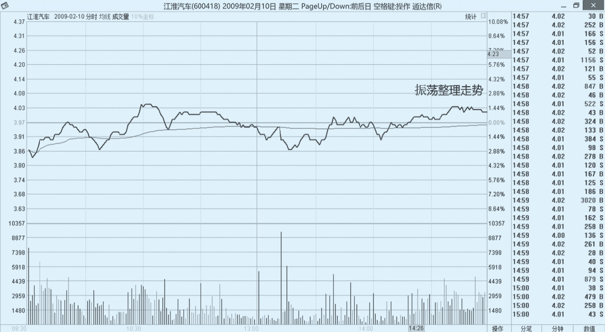

_图6-7 震荡整理走势图_

### 快速极限突破均线震荡整理分时图连贯形态
图6-8是图6-5、图6-6、图6-7所处的日K线位置，第一根K线（A位置）涨停，第二根（B位置）最后也摸到涨停板，第三根（C位置）是强势整理，后边还有一个半涨停板。这是快速极限走势比较常见的一些后续展开。

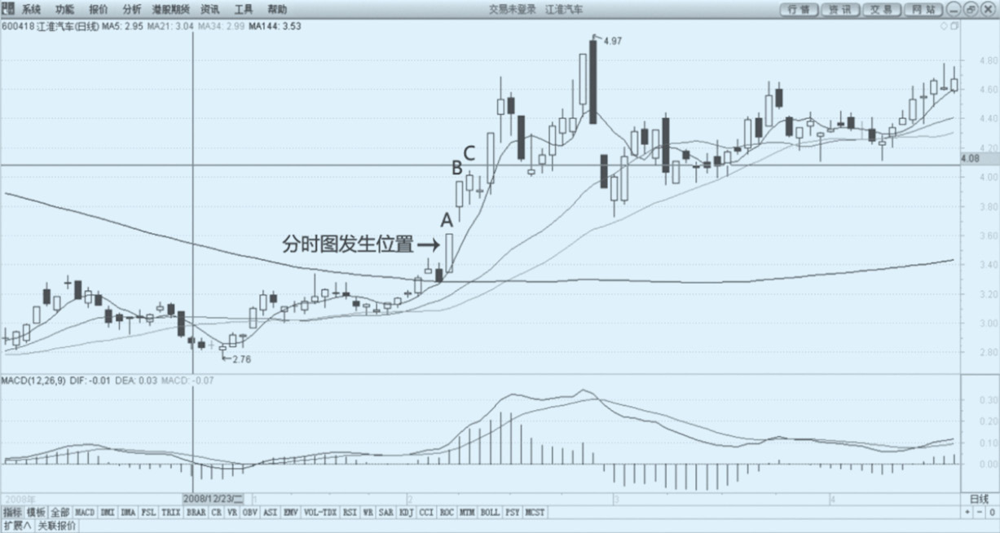

_图6-8 快速极限的后续展开走势图_

### 前波浪尾盘涨停走势
图6-9的形态也是比较常见的，如果大家在实战中遇到的话，要小心一点。为什么呢？它前面都是大波浪，一会儿跌，一会儿涨，最后尾盘拔到涨停板，或者说是拔到比较高的位置。越靠近尾盘，上涨幅度越大，越说明有问题。为什么这么说？有实力的人会在前边做，不会在后边做，一般来讲，这种走势都面临着变盘的问题。大幅度的宽幅震荡，最后收盘的时候收了一根长阳线，但实际上第2天就萎靡不振，说明市场人气有点儿散了。

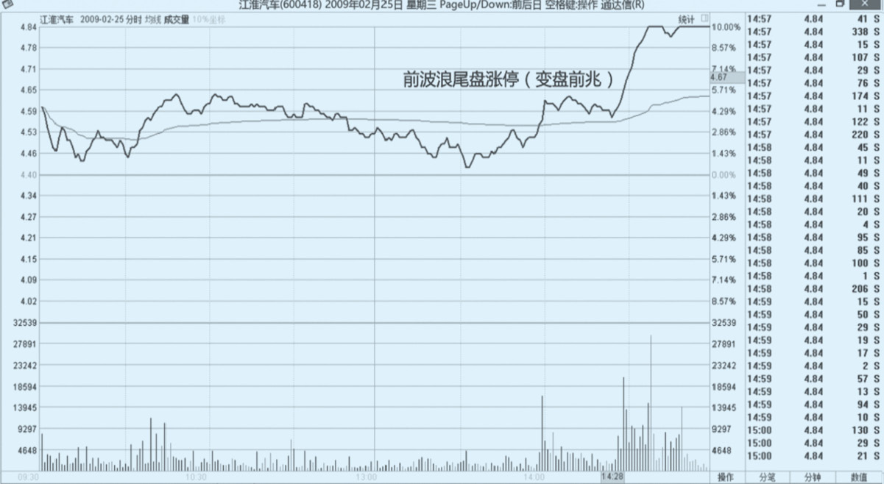

_图6-9 前波浪尾盘涨停走势图_

### 短线平台出局形态
图6-9尾盘涨停，结果第二天出现了什么情况呢？见图6-10，第二天一直被均线压制，就没起来过，尾盘杀跌停。这说明什么？说明这个短线已经完全不行了。如果你在前一天还抱有一些幻想的话，看到第二天开盘高开一点，然后下杀，上冲乏力，被均线压制向下，在这个位置的时候（A位置），你就应该进行了结了。如果是我的话，会毫不犹豫地止损。如果是日内做T的话，这一天应该是逢高一路空下去的，因为这个短线平台彻底坏掉了。

_图6-10 短线平台出局形态图_

### 短线杀跌形态
图6-11是第三天的情况，图6-9前一天杀完，后边又来了一次，这天的杀跌非常猛。这种杀跌在熊市里很常见，在牛市里强势个股回吐涨幅的时候也是这种方式，所以大家一定要记着这个形态。这个形态其实就是波动率突然间异常变大了，异常大的时候一定要当心，尤其是还有一些个股是平开跌停涨停，然后再杀跌，最后收大阳线，大家对此一定要非常小心。

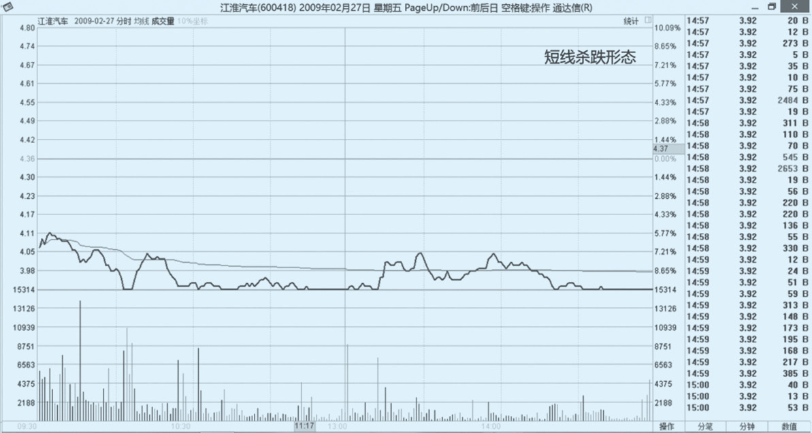

_图6-11 短线杀跌形态图_

### 前波浪尾盘涨停短线平台出局短线杀跌分时图连贯形态
图6-12是尾盘拉升变盘杀跌连贯形态。分时图发生的位置（A位置，参见图6-9），在当天涨停之后，第二天跌停（B位置，参见图6-10），第三天又跌停（C位置，参见图6-11）。后边什么样我们不管，也许后边会涨回来，也许这个平台破位了之后就变成长期压力了。就短线而言，如果你头一天没有警惕（参见图6-9），第二天没跑出来的话（参见图6-10），你短线交易就是不合格的。

_图6-12 尾盘拉升变盘杀跌连贯形态图_

### 快速极限走势
图6-13和图6-5形态是一样的，但是图6-5第二天的走势是很强的，是突破均线走的（参见图6-6），而图6-13后续是不一样的走法。

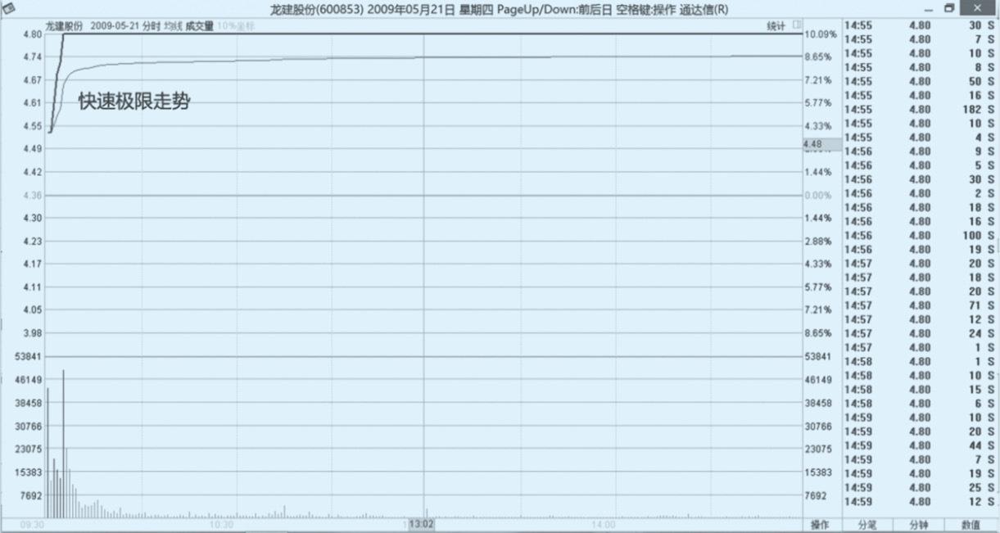

_图6-13 快速极限走势图_

### 均线压制走势
和突破均线（参见图6-6）不同，图6-13快速到极限，第二天被均线压制一天（参见图6-14）。这就是典型的游资出货时的走势。

游资是怎么做的呢？头一天快速拉板，第二天不想做了，就抛掉了。它如果想做，走势可能就是图6-6；不想做，走势就是图6-14。很多人不解，为什么溧阳路这个图形我今天追能追到，换一天就不灵了？原因就在这儿。对于有些个股，它只做了一天，而对于另一些个股，它愿意做好几天。那么，它是做一天还是做几天，区别就在于第二天是不是被均线压制。如果被均线压制，你要很小心，因为它非常有可能当天就在走，只做一天。我还是那句话：不要怕错过机会。看到图6-14这种走势图，你头一天追涨，第二天高开6%，然后吐下来，上去，均线却没上（A位置），这时你要很警惕了；再下来到这里还没上去（B位置），你就不要想了，赶紧走。

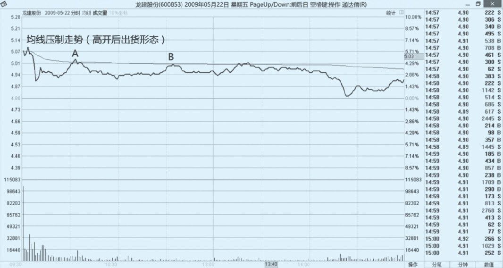

_图6-14 均线压制走势图_

### 低位震荡走势
图6-15是第三天的走势。第一天是快速极限走势（参见图6-13），第二天是均线压制走势（参见图6-14），第三天彻底低开在低位震荡（参见图6-15），其实就是短线走坏了。也就是说，那一波炒作已经结束了，就是一个一日游的行情。

很多人问我，怎么去识别一日游行情？其实，大盘是会给你这些蛛丝马迹的，关键是你能不能抓住它的精髓并总结出来。比如，前一天开盘10分钟已经涨停了，第二天全天冲不过均线，你说这是为什么？不就是有人卖嘛。前一天10分钟把它买到涨停板，第二天为什么没人要了呢？那一定是有人往下卖，如果这个卖的力量大，但它就是过不去均线，那我们也扭头走，就是这个思路。

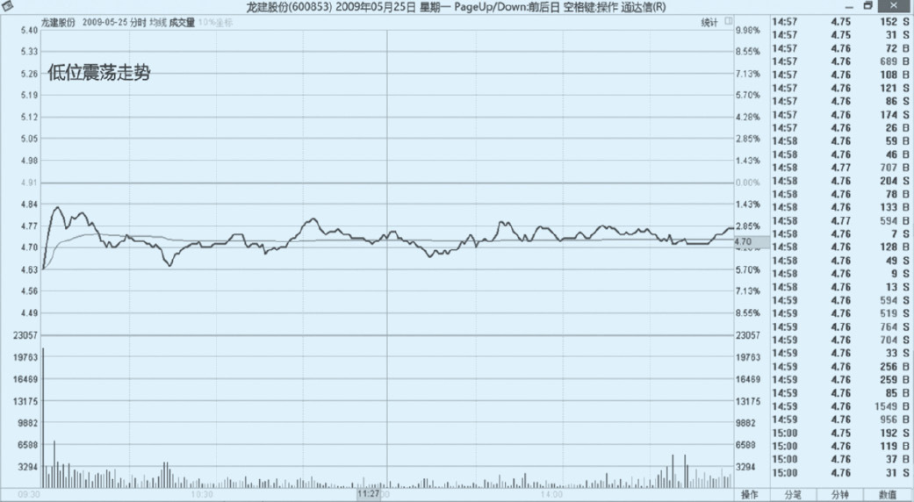

_图6-15 低位震荡走势图_

### 快速极限均线压制低位震荡分时图连贯形态
图6-16，快速极限走势（A位置，参见图6-13），均线压制（B位置，参见图6-14），低开（C位置，参见图6-15），下跌（D位置），把前一天的涨幅全部都跌回去了。

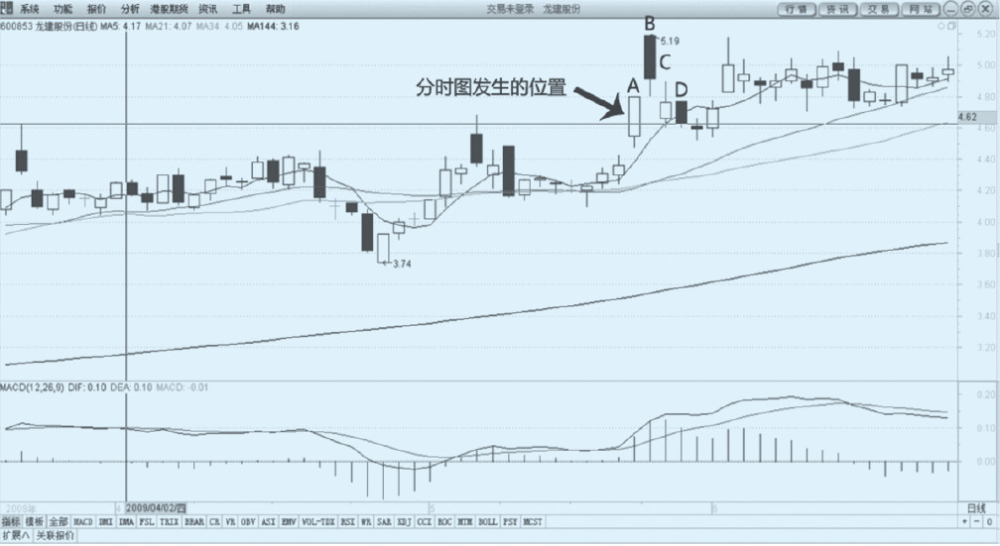

_图6-16 游资出货图_

### 分时图结论
1. **前半小时和后半小时分时图的意义**。对于前半个小时的分时图，除了快速极限走势以外，大部分都不具备指导意义。因为前半个小时是市场博弈刚刚形成的时候，这个时候你在短线上，只有一种情况可以表态，就是去追涨停板。你一定要知道，你在前半个小时的操作，都是因为你看准了。大家看一看商品期货的走势，会发现大多数商品只在前5分钟有行情，后边行情就很小了，因为商品跟股票是相反的，大家做的周期完全不一样，股票行情变化的速度比较慢。很多时候，比较有意义的操作会出现在最后半个小时，尤其是在熊市或者震荡偏弱的熊市。
2. **分时图上最重要的是均线**。好好地去研究均线的价值，因为布林线指标、分钟图上的背离都是基于均线的一些计算。包括MACD的一些计算，都跟分时图的均线密切相关。尤其是分时图一直缠绕在均线上，始终没有脱离的股票，比如说这只股票弹性很好，今天一反常态，从开盘就在均线上来回绕，一路绕到下午两点40分，这个时候如果做短线的话，一定要格外注意，如果出方向就会是一个很大的方向
3. **成交量的配合与验证**。成交量要和上涨、下跌有所搭配。突破往上涨一定是要带量的，突破往下去也是要带量的。这个量我们怎么考量？比如盘子上对盘量很大，但是成交量很少，盘子在往上走，这说明有垫单在过来。成交的量价配合，永远是盯盘的重点。
4. **分时图的形态要辩证地看**。分时图是有连贯性的，虽然我们每天只交易4个小时，但实际上今天的4个小时和明天的4个小时是有关联的。如果当天强势，第二天不强势，一定要想一想其中的原因。如果头一天快速极限起来，立旗杆一样地往上涨，肯定要追。当然追错的概率也有，盈亏同源，追错就认了。2002—2003年，我基本上都是这么做的。商品可能更加激进一点，头一天涨停，第二天往跌停板砸的都有，因为它牵涉博弈的问题。另外，由于是T+0交易，商品的交易周期比股票要短很多，有人甚至用Tick（日内超短线操作），这等于是以毫秒级在做，这里边的周期就没法谈了，肯定不如股票这么稳定

### 背离的操作
大家思考一下，在远离分时图均线的位置，如果做回归的话，是什么样的操作？这刚好跟做均线附近的买卖点是相对应的一种操作，是在做一个背离的操作。这么做可能会出现什么情况呢？10次中，你成功8次，每次挣百分之零点几，但是错一次可能就亏5%，所以这种操作对交易的纪律性要求很高，相对来讲也比较难掌握。

## 日内盘口
### 日内精髓
1. 日内原理。股票日内交易的原理是什么呢？你手上有长期看好的一些股票，或者说是长期持股的股票，那么你利用交易规则，拿原有的股份做当天的T+0买卖。
2. T的意义。这么做的意义就在于，你可以利用自己的短线交易能力，去获取一些短线交易利润。这个短线交易利润丰厚到什么程度呢？我们稳定的交易员大概能够做到一天2‰到3‰，大家可以计算一下，这个收益率是非常高的。对于日内T+0的利润原理，形象的比喻就是把方便面拉直了吃。我举个例子，如果一只股票从10元涨到20元，绝对值涨了10元，如果它没有波动，你就获取了这10元的绝对差价。
3. 操作风险。首先，要预防股价下跌的风险。比如，一个交易员每天能T出2‰的利润，但这只股票3个月内股价跌去了80%，那做T就没有意义。其次，要预防一些系统性风险。比如，做融券或者买现货抛期指，在成分股里找弹性好的个股做T，当然这对资金的需求量比较大。我自己原来做交易，就是买两只喜欢的股票，然后盯着这两只股票做日内T。做着做着，我会发现某一只股票的弹性越来越好，那就把弹性不好的卖掉，换到弹性好的股票上去，这样会更加简单一点。
4. 盯盘要素。做日内交易，我们关注的就是分时图和对盘价，对盘价非常关键。
5. 操作精髓。操作精髓就是：落井下石或锦上添花。本质上，我们在利用股价运行的惯性，所以特别怕突如其来的买单或卖单破坏其原有的惯性。比如，本来趋势挺好的，正在突破往上涨，一笔5 000张的大卖单直接砸下去好几个价位，这块价位空了，这时候你不走，下一把马上要套你；你走，下面没有价位打（买单）。所以，做日内T大多数时候赔钱是赔在这儿了。如果赔在别的地方，说明你的日内T还没有入门。在操作技巧上，我们要学会利用惯性，同时也要承认惯性有时会被突如其来的买单或卖单给打破，这是我们交易的一部分。
6. 对手盘弱。一定要记得这三个字：晚表态。表态太早，很容易被套。我一直跟我的交易员们说：开盘的前半个小时要小心，不要过早地或者特别频繁地表态，这都是不对的。另外，还有对手盘的问题。对手盘是我们最大的盈利来源，因为做期货本身就是T+0交易，所以大家都很聪明，你抓不住。但是股票做T+0，你的对手盘就是那些没办法做T+0的人。

### 对盘价和挂单量
**1. 成交比**

成交量分为内盘成交和外盘成交，在交易软件里，外盘都是以红色显示的，内盘都是以绿色显示的。以买价成交，就是内盘，也叫主动性卖盘；以卖价成交，就是外盘，也叫主动性买盘。

那么，哪种成交比好呢？由于股票市场很难做空，当然是外盘数越大越好，内盘数越小越好。外盘数大，说明主动性买单多，主动性抛单少。但是对于这一点要辩证地看，如果主动性的买单很多，但是股票不涨，你说是不是有问题呢？

**2. 委比**

委比是所有委托买入的手数和所有委托卖出的手数的比值。通俗来讲，委托买的都是要买的，委托卖的都是要卖的。如果股价要上涨的话，应该委托买的更多一点，是这样吗？不一定。因为很多钱是在外面虎视眈眈地等着，不会挂在上面，所以委比不是很靠谱。

如果一只股票，虽然委比买单量很大，成交比外盘量很大，但价格就是不涨，说明什么？说明有人在垫单出货。什么叫垫单出货？就是所有的买单都垫在买二、买三、买四、买五，买一永远不挂单，然后卖单都在卖一。这时很多人会觉得：这要追涨啊，下面这么厚的垫单，国家队要来救市了？所以他们就会主动地往卖一上去买。结果发现，卖一上永远买不完，买了5 000张又出来5 000张，买了8 000张又来8 000张。这就是垫单出货。

**3. 价格是否连续**

我们很多时候会看到一些股票价格在迅速地跳涨，一角钱、两角钱地往上涨，比如，现在的股票成交价是10元，买一是10.00元，卖一是10.01元，卖一到卖五是10.01元、10.02元、10.03元、10.04元、10.05元，那么，当一笔大单子直接推到10.10元，把10.01元到10.10元的卖单全部扫空，这个时候，如果买一迅速变成了10.10元，对盘价变成了10.10元的买单，对着10.11元、10.12元、10.15元的卖单，我们仍然认为它的价格是连续的。怕的是一笔大单扫到10.10元了，买价还在10.00元，没有跟上来，这种就是价格不连续。

价格不连续的时候，追涨很危险，比如，你刚追到10.10元，下一笔成交又回到10.00元了，第二笔成交到9.98元了，亏损1%，再加上手续费等于亏损1.2%了。短线日内做T的话，会让人非常心疼。

这种情况你一定要密切关注，如果一只股票经常出现这样的大单上扫，但是买单跟不上，这个时候，你要小心，不能去做追涨。相反，你如果想投机的话，应该高位挂着“钓鱼”。但我不主张这么“钓”，因为在我的交易体系内，我从来不做挂单，要买就直接买，要卖就直接卖，要么条件止盈止损，肯定是不会挂单等成交的。

**4. 重要价位挂单量**

什么叫重要价位？举个例子，20天线的支撑位置是10.00元，同时10.00元这个价位是一个整数价位，又是一个平台下沿，你说10.00元是不是重要的价位呢？当然是。那么在这个重要价位上挂单挂了多少呢？比如上面的挂单都是4位数的，到这儿一看，不到1 000张单子，是3位数的，那说明什么？说明几乎没有阻力，一会儿一定被买掉。此刻千万不能买，要观察，至少要等它买掉了之后，看一眼10.00元这个位置有没有单子补上来，如果没有单子补上来，这个位置是能做空的。

所以，一定要密切关注重要价位的挂单量，如果挂单量很好，那你就去关心这个挂单量是怎么被买掉的。是一点一点被买掉了，还是两笔就被买掉了？如果是两笔就被买掉，买掉的速度非常快，要勇敢地往里冲，后边惯性可能会很好。关键价位挂单量越大越不怕，一定要牢记这一点。

很多人一看，上面有个1万张的单子，吓坏了：这还能买？不要这么想。要看这1万张单子是怎么样消失的，如果不消失，永远不入场。如果第1笔是3 000张，第2笔8 000张就没了，赶紧往里冲吧，后边应该有一个惯性的上涨。

如果大家做商品炒单的话，会对这一点有非常深刻的认识。尤其是在一些关键的价位上，我们怎么去识别真突破和假突破？就像刚才说的10.00元这个价格，既是重要的支撑位，又是价格整数关，也是平台的下沿，还是20天均线，纠缠了好多次后，跌破10.00元，它会往哪儿去？它会很迅速地到9.90元以下。如果它跌破了10.00元之后，在9.98~9.97元纠缠，你是可以买一次的，为什么呢？因为下不去。这么关键的位置，这么好的整数关，又有大单子垫着被打漏掉，竟然没有下去，只下去了两三分钱。这说明什么？说明下去是假的。有这样的辩证思路，你才能用重要的价位挂单量去衡量这个是强还是弱。

**5. 成交是否连续**

成交是否连续和价格是否连续大体上是一回事，区别在于：最新价有没有大幅度跳跃。如果有大幅度跳跃，往往是好事，因为它的方向趋势性会更明显一点。怕的是上跳一下，下跳一下。这种情况我遇到过，有一只股票股价为7元多，买盘卖盘的差价为3角，就在里面来回杀，一把在涨幅，一把在跌幅，来回打脸，中间散户全是炮灰，这种股票就属于典型的成交不连续。这种情况是绝对不能介入的。它不光价格不连续，连成交都没有了，比如券商股在2015年4月之后，有很长一段时间就是这个样子。为什么会出现这种不连续？因为多空分歧巨大，大家在打架，一般都伴随着基金甩货，或者游资出货。

**6. 与大势是否一致**

与大势一致体现在共振上。如果一只股票，大盘翘头的时候它翘得凶，大盘回调的时候它跌得少，我们就说这只股票强势。所以在做强势股追涨的时候，比如在10.00元这么关键的价位打漏了，大势在往下走，就应该勇敢地追。大势没有往下走，你追了一下，或者说你没追，它在9.97~9.98元就停住了，这时候大势在往上勾头，那你就应该勇敢地买。这实际上就是跟大势做同一个方向。

### 对盘价的缺陷
图6-17是交易软件的三个部分。左边是我们经常看到的买卖五档。中间显示，上午10：27分，12.48元成交593张，这个B就是主动性买单，记在外盘里。但实际上，对盘价之前是12.46对12.47，之后变成了12.45对12.46，而原先12.45和12.46上1 000多张的买单，只剩下200多张。这说明这500多张外盘的单子大部分是成交在12.46元，小部分成交在12.45元。但是为什么软件显示12.48成交、外盘、B、红色上涨？

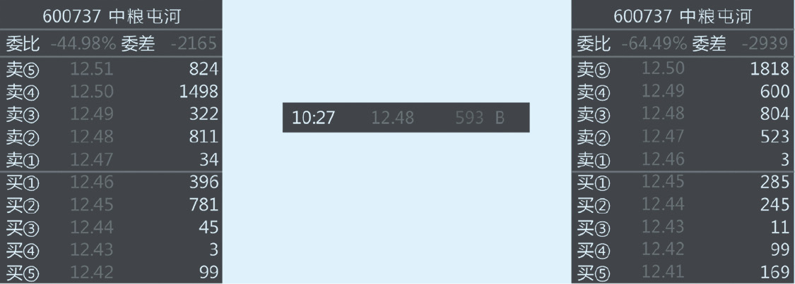

_图6-17 对盘价_

这是因为整个交易系统有6秒的统计区间。所有行情软件显示的都是汇总数据，如果6秒前面很多笔都是往下卖，只有6秒的最后一笔是往上买，软件就会把它识别成一笔买单。但实际上它是成交在了卖价上。盯对盘价，就是盯这个。

这是交易系统的缺陷，一定要看清楚到底是真的买单，还是以为的买单。而且一旦行情显示12.48、593、B，内外盘计算它已经计入了买盘，那很多技术指标都以它为计算依据了。虽然影响不大，但是当天如果这种事情出现很多次，那么交易系统的清晰度是要打折扣的。这是交易系统的缺陷，甚至有时候很离谱，交易软件上从来没有看到过这个价位，但是当天的最高价或最低价里有它。出现这种情况也是系统6秒撮合的原因。

### 委比和成交比
**1. 是不是委比越红买盘越大越好**

不一定。买盘越大，意味着买入力量强，但如果买入力量很强，它就是不去成交呢？如果看到一笔100万股的买单，托在买二或者买三上，但是买二和买三，既不是关键价位，也不是整数关口，这个时候就该问一问，这是谁，为什么要这么买？一般人没这么强的实力，基金的交易员绝对不会挂这样的单子，那是谁挂的？他要干什么？如果上面的抛单很密，价位都很结实，又不往上买，说明他只是不想让价位跌而已。甚至要问一问，他到底是真不想让跌，还是假不想让跌？如果一会儿一路阴，在这个价位变成了买一的时候，他撤了，说明什么？他也不是真想买。所以，委比不一定是越红越好。曾经有一段时间国家队救市，委比量大得一塌糊涂，全是6位数的买单堆在买一和买二上，就是不出手。这有什么意义？就是吸引大家跟风，他能少买点。

**2. 最容易被误解的成交比**

因为对盘价有6秒撮合缺陷，所以内外盘有时候是不准的。我们只需要关注涨跌停时内外盘的成交比，这个是最准的。

如果股票涨停了，前面主动性的买盘冲上去，这是大量的红盘，封停之后是大量的抛盘，如果这两个力量是外盘量比内盘量大，在通常情况下，这个涨停板是可以持续的。如果涨停板的股票，外盘量比内盘量要小，尤其是出现那种涨停打开又封住，打开又封住，有出货嫌疑的，遇到这种情况就应该先溜。

### 换手率
**1. 换手率的计算**

换手率是另外一个比较重要的指标，这个指标最原始的计算方法是成交的股份数除以总股本。但实际上，我认为应该除以流通股本，甚至应该除以实际流通股本。因为很多股份是不流通的，比如建设银行，流通股份一共也没多少，包括中国石油、中国石化，流通股份都是不多的。所以在算换手率的时候，一定不要有误区。

**2. 换手率多少算好**

那么，换手率多少算好呢？我的经验是：3%以下基本上是不活跃的；3%开始温和地活跃；7%属于比较活跃；10%就属于很活跃，一般都是游资票了；15%有出货嫌疑；如果一天换手率超过20%，要么后边有波澜壮阔的大行情，要么就是出货。

一定要记得，换手率不是越大越好。换手率越大，意味着股票的交易摩擦成本越高，一只每天换手10%的股票，这是多少交易成本？它还能长期跑赢大盘？绝对不可能。如果做日内，换手率应该超过3%，因为不活跃很难做；同时也不要超过15%，超过15%可能也做不了几天了。如果换手率连着四五天达到15%，然后一天爆出30%的巨幅换手，那行情已经走完了，之后会是长期阴跌。

**3. 极端换手出现的位置**

对于换手率的观察，要看特别极端的换手情况。比如，换手率特别大时，换手率出现的位置是在高位还是低位，是在山脚、山腰还是山顶？

**4. 涨幅的判断**

比如，这只股票已经有了3~5倍的涨幅，现在爆20%的换手率，那大概率就是山顶。比如中国中车，涨10倍出现高换手，还不走，这就是不应该的。常识判断都可以让我们规避掉很多大的陷阱。

比如，价格长期都是这样，几乎套住了所有人，那它就是山脚。比如，一只股票涨了30%~40%，这个位置有可能是山腰，但是在熊市这说不定就是山顶。所以，我在熊市里，比如说趋势不好、大环境不好、不配合的时候，山腰都当是山顶了。比如5元的股票，低位大部分的成本区间是5元，涨到8元出现20%的换手率，我当它是山顶了，也许后边是山腰，不要了。机会很多，可以做别的。

有没有在低位换手特别频繁的？极少。我印象里低位出现高换手率，是什么情况呢？比如某只股票长期横在3元多，然后它停牌了，复牌之后，从3元的无量涨停板涨到4.5元，这个时候爆了大量，我们应该不应该关注？应该关注，毕竟它的绝对值不高，涨幅也并不是很离谱，如果有特别好的突变的话，后边也许会有很好的机会。

长牛股最理想的状态是什么呢？它的换手率有一个从低到高再缩窄的过程。比如原来的换手率不到2%，但是绝对股价并不高，走着走着，换手率跑到了7%，开始活跃，然后从7%又逐渐地缩回到了2%、3%。它在缩回到2%、3%的过程中，是马不停蹄地碎步小阳线往上走的，这实际上是超级大牛股的特点。我们把这个过程叫“放量突破，缩量上涨”，这种股票是极其稀少的。如果遇到这样的股票，一定要抓牢，有可能十几天就翻倍了。

**5. 和分时图结合**

所有关于换手率的内容，都要和分时图的形态结合起来看。只有这样，我们的判断依据才能更多一些，判断的成功率才会更高一些。

## K线常见出货特征
K线常见出货特征主要有以下几个。

1. **数倍股高位巨量换手**。数倍股高位巨量换手，通常是出货特征。不要迷信10倍股，不要追求10倍股，这个市场上的10倍股很少。大多数抓住一回10倍股赚了很多钱的人，通常情况下还会把赚到的这些钱，全部赔在寻找下一个10倍股的路上。涨幅巨大的个股，高位巨量换手，必须回避。
1. **连续跌停巨量开板**。现在很多游资出货，或者老庄股出货都是这种方式，不计成本往下卖，为什么呢？打到绝对低位才会有人过来抢反弹，甚至是自己来抢反弹。比如，我是原来里边的老庄股，手上有很多这只股票，没有人买，这时我该怎么出？第一个跌停卖没人买，第二个跌停卖没人买，第三个跌停卖还没人买，在我已经腰斩了之后，短线客都在盯着，都希望它哪天开板。然后到了某一天，我自己挂跌停自己买，边买边撤，然后把跌停板打开，弹起来的时候，今天做了一趟T，第二天卖光了。这就是庄股自救，连续跌停，巨量开板，在开板的过程中跑了。
1. **高位下影线频频出现**。比如已经涨了50%~60%的股票，在平台横着，下影线天天有，都比较长，而且这些下影线的收回都是尾盘收回来的。它在干什么？拉尾盘是最没水平的表现，因为拉尾盘成本低，20万股就搞定了。换成上午9∶30试试看，20万股刚搞定，又被砸下去了。所以，高位下影线频频出现，一定是有问题的。这一点可以推广到大盘上，如果大盘经历了一段比较大的涨幅，这个比较大的涨幅有可能是30%~40%，在高位形成平台，下影线很长，并且经常出现，这个时候你一定要警惕。为什么？这其实是一个洗脑的过程，“有钱难买牛回头”，大多数股民看到下影线都是要往里冲的，尾盘进去，下影线全出来了。这与连续多日尾盘托价原理是一样的。
1. **连续多日尾盘托价**。这么多的下影线，这么多的尾盘托价，为了什么？都是为了走。白天卖了一天，尾盘20万股打起来，明天以这个价位继续卖。今天卖便宜了5角，尾盘拉上来5.5角，股价还是红的。为什么？明天多卖5角的时候，有人在下面等着接呢。这种出货对于个股的杀伤力是很强的，只有老庄股或者在里面长期运作的资金，才会用这样的出货方法。

## 分时图常见的出货特征
分时图常见的出货特征有以下几个。

**1. 钓鱼线**

大家闭上眼睛想象这样一个图形：固定的斜率，45度角向右上角飘，突然间大幅杀跌，迅速把涨的5%全部杀光；然后从这个点起来，继续以45度的斜率再往上涨，涨了半个小时之后又有两笔大卖单全部杀光，这就是“钓鱼线”。想象一下你把鱼竿拎起来，鱼线垂下来的样子，这种钓鱼线就是典型的出货。这种图形现在很少见，常见的是大单买二。

**2. 一字断魂刀**

股价跟去世的人的心电图一样，一直是横着的，突然间下来4角，继续横着，然后又下来4角，一天跟下楼梯一样，全是“一”字形的，然后中间断头一样掉下来，这是典型的出货。而且这和大单买二经常是搭配的。它横在那儿为什么是“一”字形呢？因为大单垫在买二，在卖一上挂了卖单，股价下不去。

一字断魂刀的原理其实比较简单：因为我要出货，又不想出货的时候价位跌得太凶。比如，现在价位是15元，那么我所有的买单都托在14.99元上，所有的卖单都挂在15.01元上。

想象一下，我的卖单挂的量级肯定小，15.00元、14.99元、14.98元、14.97元上都是4位数，甚至5位数的买单，然后在15.01元上，我的卖单都是400手、800手这样的单子。很多散户看见下边有大托单，是往上冲的，把这800手买完了之后，成交多少我再挂多少，还有800手等着，这800手永远出不完，这就导致它是一个“一”字形。过了20多分钟、半个多小时，大家已经疲惫了，觉得你就是在玩花样，买入的力量已经没了。好，一把下去5角，在14.5元这个位置，咱们再来这一套。有人一看：跌这么多，大买单又出来了，可以抄底了。再来一次。一天可以这么来回好多趟，杀好几个台阶。甚至不一定要往下，等到了尾盘把它拉回来，虽然今天一天白跌了，但我已经出了这么多，明天继续。所以，这些方式互相结合很难识别，但是看到这种典型的特征，先跑了再说。

**3. 大单买二**

大单买二和一字断魂刀基本上是同一个手法，包括后面的一些出货手法，也会用到大单买二。

大单买二有时候也会被买掉，但问题是，在这个市场上，刚开始出货的时候，持仓量肯定是很大的，是不太怕有人打的。这一点出货的人心里其实是有数的，没有人有这么多货。如果真有这么多人卖出来了，那他只能接了。所以将来等你们交易量大了，也可以吓吓他们。有时候游资出货，被基金和里边的个人大户给砸了的情况也会存在。

**4. 涨停出货**

涨停板打开、封死、打开、封死，甚至是封死不打开。以前在涨停板上做出货，卖多少，底下买单可能还补多少，现在有时候连补都不补了，就敲开，敲开完了之后，再买到涨停，跟单跟上来之后，把单子一撤，集中成交，又把它打开了。打开之后、再封上、再打开、再封上，就是为了卖，就是为了成交。

**5. 固定斜率巨幅换手推升**

固定斜率巨幅换手往上推，一直推到涨停板，这种是最有迷惑性的，让人总以为那是快速极限走势。

比如，一分钟涨两分或五分钱，一点一点推上去，直接推到涨停板，看上去是固定斜率，股价在高位，换手巨大，量也很好，但是这种也有出货的嫌疑。为什么呢？这么出，有可能是大单买二一路往上垫的。

如果大单买二垫上，但是卖单在卖一上不停地往外放，那就是一字断魂刀；但如果是大单买二、买三上面不放货，而是隔一个价位，一点点往上放，那就是固定斜率巨幅换手推的。这个推升不是他自己推的，而是市场的力量推的，因为只要大单买二垫上去，想买的人就只能往买一上垫，他在把散户赶来赶去。

你有没有想到，这些操作方式不都是在逼散户先表态吗？买二垫上了，你怎么办？买一跟不跟，买一不跟，可能就是一字断魂刀；买一跟得多一点，他就继续把单子从买二挪到买一上去，然后买一就变成了买二，过一会儿新的买一上单子多了，他在这些单子后边，再往上推，再垫到买一上，这个买一又变成买二，这样一路垫上去，你会发现换手率很大，突然间，他单子一撤，一下子就出货走了。

# 如何做短线交易
## 短线交易
### 短线交易的原则
什么叫短线交易？我认为其实就是三个原则。

1. **持股时间短**。短线的持仓时间基本上是以天为依据的，前提是它不表现了，如果天天涨停板，哪怕涨一个月，我肯定愿意拿一个月。它只要不表现了，可能就要被处理掉了，所以相对来讲，持股时间是比较短的。换句话讲，我既不参与它的震荡，也不参与它的调整，只想拿到主升浪的一段；可能从8元涨到20元的这一部分里，我只拿到了从12元涨到15元这3元的部分。但是这3元可能赚得很快，比如一天半，或者两天就拿到手。
2. **参与结构短**。所谓参与结构短就是，在正常情况下，一只股票从8元涨到20元的过程中，它可能是先从8元到13元，然后从13元回到11元，从11元迅速到16元，又从16元回到14元，然后一波又到20元。这里可能有三波、四波，甚至五波。那么我们在做短线的时候，是不会把这5波结构全部拿走的。如果想把这5波结构都拿走会更累，要浪费时间和精力。
3. **情绪转折快**。什么叫情绪转折？就是对某只股票，半小时之前还比较悲观，还在卖，但是半小时之后发现卖错了，马上就再追回来，这就是情绪转折比较快。那么，情绪转折快的要求是什么呢？是泯灭掉大方向上的依据。你可以在宏观上对这只股票有一个猜测，比如，你认为这只股票处于上升通道，但是在操作中，你要时刻警觉，它也许在上升通道里是来回振的。只要是做短线，你就一定要有两个方向的感觉。

### 超短交易的技巧
1. **尽量不看K线**。分时图均线是做短线最好的参考，反映得最快。为什么这么说？K线是比较慢的。因为分时图是根据成交价画出来的，K线是根据分时图画出来的，所以尽量不要去看K线。
2. **要学会看分时图**。希望大家再去好好看一看第六章有关分时图的内容，把常见的分时图形态，仔细地体会一遍。如果在实战中遇到，最好能抓住一次，或者躲过一次。这样的话，记忆就会更深刻一些。
3. **对盘价是重要参考**。
   1. 我举个例子。如果盘子上的价位，每一个价位都是比较实的上千张的单子，突然有两笔大买单，直接扫上去，把上千张单子全部扫空了。这时候有两种情况：第一种情况是后续的买单垫上去把买单垫起来了；还有一种情况是后续的买单没有垫上去，买盘的价位是空着的。那么，作为做交易的人，面对这两种情况，我们怎么应对？如果遇到第一种情况，买单垫上来了，如果做短线的话，可以勇敢地去追一下试试；如果是后一种情况，买盘的价位很空，则不能追。为什么？我举例说明。比如一只股票在10元上有大单，两笔大买单一扫，卖一价已经跑到10.10元了，只要一追，基本上成交在10.07元或者10.08元；如果抛单压下来，股价又回到10.01元对10.03元的时候，这个位置是当成自己买错了平掉呢，还是再等等，看会不会还有两笔抛单继续打漏？这是很难判断的，相当于做了一笔把握不大的交易。可做可不做的时候不应该做。但是在第一种情况下应该去做，下面的买盘很多，随时都可以以一个很好的价位平出来。
   2. 还有一些对盘价需要记忆。比如10元到10.05元之间是卖一到卖五，那么10.03元被打漏了之后，看到10.08元上面挂了8 000张卖单，这个时候股价可能立刻就下去了，然后等到下一轮再推上来的时候，要记得10.08元上原来是有一个大单子的。这是一种本能。经常这样操作之后自己就会记住的，就会养成自己的交易习惯。为什么要记住呢？因为要去想那8 000张单子到底是被买掉了还是被撤掉了。如果是被买掉的，要马上去看一下，买掉的数量到底是多少，是买了5 000张，撤了3 000张，还是买了1 000张，撤了7 000张，还是买了8 000张，一张也没撤。要去看对盘价和即时成交价格，如果都成交，上面8 000张一晃，10.08元没有了，赶紧往右下角看。在右下角分笔成交明细中，如果有9 000张的成交，那在正常情况下，应该是买掉了，下面买盘垫起来的话，是应该追涨的。但是如果只成交了300张单子，8 000张都不见了，那就是撤了。在这种情况下，要很小心，就算垫单垫起来，也要小心。为什么？因为说不定这8 000张随时一笔就砸下来了。因为能撤掉8 000张，说明什么？第一，这些单子很整齐，可能是一个人的单子，也可能是听一种命令的单子，不然怎么会都撤了呢？这时，要提防着刚上去之后，这8 000张单子突然出来，又重新砸下去。但是如果成交2 000张之后又撤了，这种情况下它砸下来的概率就比之前要小多了，因为2 000张和300张比起来，代表当时的买盘已经很强，如果这个8 000张的卖盘真想出，可以继续挂在那等着成交。撤单就表示抛售的心理没有那么迫切了，或者想等更好的价位抛售。
   3. 有没有卖盘故意压着的情况呢？也很常见，有的卖盘就是压着，不仅压着，当这个卖盘被买完后，甚至会在同一个价位继续挂同样数量的卖盘，继续压着。这种情况我们偶尔会在一些个股上看到。碰到这种情况要很小心，如果正巧这只个股之前的走势还有一些典型游资票的特点，那么大概率就是游资在出货。
4. **后表态**。如果是挂单买卖股票，那这些人根本就不理解什么是后表态。因为后表态的人是很少去挂单的。为什么要挂单呢？要买的话直接对着盘子买就行了，挂单很麻烦的，因为钱可能不够，挂了这个单子，想马上再买还得把挂的那笔单子撤了，这样做既丧失速度，还表态太早。你挂了个跌停板，让人一看就知道你是等着跌停板捡货的，意图被发现。包括猜支撑、猜阻力、提前去挂单，都是有问题的。宁可学会预埋单，或者叫条件单，也不要去挂单。

### 超短交易的经验
1. **学会“痛打落水狗”**。痛打落水狗，打完一定要记得跑。我举个例子，两个人打架的时候，我们怎么去选择帮助其中的一个人？一定不是他俩还没打，你就已经站出来了，“我帮你”，结果帮了个弱智；你也不可能等他们打完了，再过来痛打落水狗，人家都已经躺地上不动了，你去踹，得不到最大的实惠。真正好的办法就是让他俩先打，打到一方眼看着不行了，你再来给他一脚。打完一定要记得跑，要小心自己很爽的时候被咬一口。
2. **重要价位的单子一定要看买掉的速度**。举个例子，10元是强阻力位，并且上面放了很多张卖单。正常情况下，到了这里，如果是这么强的阻力位，而且是整数位关口，还是这么大的单子，如果真要突破的话应该是很快的。如果5 000张单子用了两分钟才买掉，那根本就起不来。反之，如果买掉了之后，两分钟都不往上涨，那也没戏。这就是重要价位的单子，一定要看速度，一笔两笔买掉和等两分钟或者三四十秒买掉是截然不同的。
3. **该涨不涨应看跌**。该涨的时候不涨，有多单一定要小心。比如2001年北京申办奥运会成功，第二天，北京城建等集体高开，但大概10分钟全部收了阴线。这是不是该涨不涨？这其实就是所谓的利好兑现。还有一些是该强的时候不强。比如，今天股票集体反弹，所有的个股，大多数板块都在弹，只有这个板块不弹，那么这个板块就是弱的，后市如果要空的话，就去空这个弱的，这就是买强抛弱。所谓的强和弱，就是这么观察的。
4. **加速破位勤止盈**。在加速的过程中先丢掉贪婪的想法，不要加仓。大家去翻一翻恒生指数，2015年7月8日和9日那两天的走势，加速破位暴跌，敢往上加空吗？加完了，第二天弹1 000点，直接就被打爆了。所以，最后一段加速破位的时候，一定要学会止盈。要理解最后那段加速破位是怎么形成的，是以增仓的方式形成的，还是以砍仓的方式形成的？如果是以砍仓的方式形成的，后边一定是巨幅的反抽，因为对手盘都没了，怎么还会再往一个方向去呢？如果是以增仓的方式形成的，可以再等等，但是这个位置加速还有人敢增仓，也要小心，对手也不都是傻子。在这种情况下，是散户抄底的多，还是真正有实力的资金，或者产业资本，或者现货商在进来抄底？在大扩仓的情况下，一定是后者的概率更大。
5. **均线附近可操作**。为什么在均线附近做操作？如果上涨回档均线附近稳住，那可能买点就在这儿；如果破均线之后，又从均线下面往均线上翻头，没翻过去，那可以在均线这个位置把它卖了。所以，均线附近给我们的一些提示是比较关键的，因为大多数做技术的人都是看着它在做，所以在均线附近要多操作一些。
6. **耐心等待好时机**。一定要学会耐心等待，可做可不做的时候不做。不管做什么样的交易，我们都是一个猎人，这个猎人绝对不是拿着冲锋枪在森林里面来回扫射。
7. **对惯性的认识和利用**。什么叫惯性？惯性就是保持原来的力量。在股票市场上，这个惯性其实是一些资金作用导致的，大量的资金追进来，都会有一个惯性上涨，这种惯性来自短线客的追涨杀跌，也就是所谓的情绪。要学会利用这种惯性。比如早盘很迅速地追涨停板，那么这个涨停板一定是越陡越好，但是相应地，越陡抓住它的概率就越低。这里有一个矛盾的地方就是，大家既希望抓到那种最陡的急速上冲的，又希望自己交易的难度低一点。
   1. 如果分时图上是以低于30度的固定斜率往上推的，基本上都没有太大的参与价值，甚至可以认为是假的，因为这个节奏有点不太对。什么样的节奏更好？第一波的角度小，比如涨幅3%，这一波是以30度的角度上来的，然后下去之后，到了均线上就稳住了，然后第二波以45度的角度起来，第三波以60度的角度起来，这种是最好的图形。这种股票非常好做，其实就是惯性在逐渐增大。这里的角度怎么看？看一天的分时图，白线跟零轴的角度用眼睛大概扫一下，不用量。把握一个原理：角度越来越大最好，而不是相反。如果第一波涨60%，第二波涨45%，第三波涨30%，这种情况在分钟线上说不定已经是顶背离了，角度越来越小，波峰一波比一波平，这其实是圆弧顶的表现。

### 日K核心
隔夜短线就是所谓的日K，里面有三个核心问题：明确买卖依据，提前规划交易，按照计划执行。这其实就是事前规划、事中执行、事后恢复。这个恢复既包括心情，也包括资金管理。

## 周期
### 周期框架
1. 周期分类。我把周期分为三类，而不是两类：一个大周期，一个中周期，一个小周期。
2. 周期选择。在交易的时候，我们要选哪些是可操作的？第一个就是要选大、小周期形态相同的。大周期向上，小周期也向上，这个时候我才去做；同时，我们要去逆中周期。简单的记忆方法就是：大小同涨跌，中期猜底顶。
3. 逆中周期。大小周期如果都是涨的，中周期下来，就要关注，等它调整到位，如果是个底部，就是短线的最佳切入点。反过来，大小周期都是跌的，那么中周期在顶部往下的时候，可能就是做空的。
4. 周期划分。周期的划分以均倍数为宜。什么叫均倍数？就是小周期和中周期是几倍时间，那么中周期和长周期应该也是几倍时间。不能说小周期是1分钟的，中周期是15分钟的，长周期是1小时的，这样不对。15分钟是1分钟的15倍，1小时是15分钟的4倍，这两个周期的倍数不一样，这样度量一定是有问题的，度量周期的倍数要统一。

### 周期共振
1. **周期设定**。比如我现在讲到的日K线级别的短线交易，那么我自己的做法是小时线、日K线和周K线。为什么这么做？小时线到日K线是4倍，日K线到周K线是5倍，差得不太多，是可以的。
2. **周期共振**。举个例子，大家可以查看2015年3月9日，上证指数结束盘整，突破那天的情况：长周期在周K线上明显是长趋势没走完，在高位强势整理；在短周期的小时线上，在当天下午2点钟的时候，一根中阳线直接起来；第二天，又是一根小时级别的中阳线起来；而在日K线上，它刚好回调到了20天和30天均线黏住的位置，这就是特别好的一个日K线级别的买点。为什么这么讲？主要有三点原因：第一，长周期往上，周K线是大涨趋势，因为周K线是从2014年11月末一直涨到了春节前，春节后周K线是在做高位盘整，明显没坏；第二，短周期的小时线在爆量突破，明显也是在涨，是在突破；第三，中周期的日K线，刚好到了一个支撑位的相对底部，这属于共振类的买点。
3. **共振买点**。共振买点，如果在个股上出现，会有更强烈的共振效果出来，但是看指数可能更清晰一点。因为有很多股票，它从小周期到中周期的传导可能是比较快的，大势从小周期到中周期的传导都是有一个过程的。这也是为什么我做了很久的交易之后，自己不太愿意再去做个股，即便做个股，也是以别的方式去参与的原因。我希望自己这么多年交易经验形成的东西，能用在一个更稳定的系统内。对于指数来讲，它的稳定性要比个股强很多，所以我宁可去做期指。

### 周期的运用
**1. 大小同涨（跌），中期均线企稳（压制）——做多（空）信号**

以三个周期都是往上跑为例。大周期在涨，小周期也在涨，我们要在中周期回踩的时候去做买点，介入以后，中周期回踩完了之后，也开始朝上。这就是我们享受利润的那一段，这一段是最好的。

所以，一定要从大小同趋势，中期逆趋势介入；到三者同趋势的时候，拿住单子。这个时候是主趋势，是共振起来了。这个时候一定要拿死，千万不要出去。等到小周期变坏，大小逆向的（所有逆向一定是在小周期先发生的，不可能在中周期和长周期先发生）的时候，一定要警惕，观察会不会因为小周期出现拐点而传导到中周期，如果有传导，先出来。

**2. 大小逆向，耐心等待**

当我们看到大小周期是逆向的时候，一定要先等等，等大小周期同向。大小周期同向有两种可能。一种是小周期重新回归。小周期变化的速度比较快，等它重新回到和大周期相同的方向上，我们再去等中周期逆向。还有一种情况，小周期下来了，中周期也下来了，慢慢地大周期也下来了。这是什么？这不就是另外一个方向又开始了吗？如果可以做空的话，小的可以空，大的也可以空，然后找机会在一个中周期的高点去空。如果持有的话，当看到小周期已经朝下，中周期被传导的时候，要走；或者是到了某一个度量指标该出场的时候，也是要走的。

小周期走坏很常见，关键是小周期走坏会不会传导到中周期。小周期走坏，中周期开始背离，这就是传导了，如果小周期走坏，中周期还很健康，在往上走，那还能够再坚持坚持。我们不需要提前做预判，中周期就是日K，只要走坏，设个标准，比如跌破了某个价位，或者回吐涨幅的5%，浮动止盈跟上，那就该溜了。

**3. 大小同涨（跌），中期顶（底）背离，持有多（空）但不追**

大小周期同涨，中周期是顶背离，意味着什么？意味着有可能短线的某一个趋势，已经濒临中周期的转折点。在实战中，这个时候有可能会出现中周期比小周期先调整，但更大的概率是中周期的这个背离是假的，小周期会忽然再来一下。所以这个时候，我给的办法就是持有，但是绝对不追了，赢利肯定不加仓了，这是其一；其二，浮动止盈一定要跟上去，因为这个时候一旦中周期顶背离成功，这种调整幅度是很深的。为什么在交易框架上，我先跟大家讲设定止损，再跟大家讲浮动止盈？就是为了避免这种情况。

所以，在三周期理论中，大周期是我们用来对整个行情定性的，中周期和小周期是指导我们操作的。我们主要的操作依据实际上是在大、中、小三周期的相互关系上。可以做的一共就这三种情况，剩余的情况基本上都不做。

### 周期的传导
**1. 大小同周期向大小逆周期传导**

所谓传导，就是大小同周期向大小逆周期过渡。从同周期到逆周期总会有一个变化过程，一般来讲不会大周期先动，肯定是小周期更敏感一些。

当小周期动的时候，比如小周期在高点背离，然后跌破某一个重要的均线位置，支撑跌破了，短周期的形态坏了。坏了之后，我们这时要看中周期，中周期刚开始是没有什么太大反应的，在中周期上可能就是一根上影线，所有的指标都是往上走的。但是过了一会儿，比如又过了3个小时或者4个小时，中周期上也开始出现一些背离形态，这就是我说的传导。这种周期的传导，如果是从小周期到中周期到大周期全部被传导了，就是趋势反转了。这个转势杀伤力也许会很大，而且这个转势的时间会比较长。

大家可以看一下上证指数在2007年11月摸顶的形态，那是非常典型的传导，最终形态彻底坏掉。在我印象里，是先跌到了5 000点，短周期彻底坏了，又抽上去几天，然后，2008年3月再杀下来。那个时候，是三个周期全部往下，直接歇了。2015年5月的情况也差不多：5月28日，小周期先坏掉，中周期一直在顶部做圆弧顶，大周期还没动。最终，大周期真正破位是在什么时候？大家可以去看周K线，大周期真正破位是在6月的第3周，就是交易所出来说“这是正常调整”的时候。那个时候其实已经破位了，当时的周K线已经坏了。

**2. 中周期被小周期传导**

三个周期都被传导了之后，全部逆向了，这时应该勇敢去做空。在多数时候，如果我们做空，其实不用特别介意去逆中周期的势，中周期的势很难逆，因为恐惧的释放非常快。我们可以在上涨的过程中，逆中周期一点点地买。因为涨的时候总是有节奏感，一波涨，又一波涨，再一波涨；但是杀跌的时候，破位是非常快的，像闪电。

所以做空的时候，更像在做左侧。比如说，小周期、中周期、大周期本来都是往上走的，过了一阵子小周期往下，再过一阵子中周期往下，大周期还没有往下破位，我可能都已经想要进去了。当然有的时候也会吃苦头，因为后边可能会再被扯出来，美股就曾出现过这样的情况：它本来是三周期全部向下了，结果一天小周期回来，到了第三天中周期也回来了。

破位的标准跟自己的设定有关系，怎么设都行，其实真正的破位，画根趋势线就行了，如果能用对数坐标的话更好一点。如果整个均线形态全部都坏了，比如一根K线已经把所有的均线全部打穿了，那一定是破位；如果是震荡，回调到某一个趋势线上就继续回来，并且反复这样，这属于没走坏的。

## 短线和宏观
### 情绪的扩散
1. **宏观引发的市场情绪反映在技术层面怎么度量**。可能有很多种度量的方法，比如，我是用背离来度量的，当然你也可以用KDJ、MACD，可以用多种多样的数学方式去度量它，但是要理解，在技术图形层面，度量的标准是什么。
2. **宏观引起的热点发散**。什么叫热点发散？举个例子，在上海本地股中，突然有一天，迪士尼板块集体起来了，第二天，在迪士尼板块维持强势的时候，商业板块也起来了，这说明什么呢？说明整个市场的情绪是在扩散的，而不是消退。
3. **逻辑扩散**。迪士尼的概念起来了，迪士尼总要建吧，于是基建类的股票会先起来；第二类是周边地产类的股票，谁周边有地，谁就占便宜；迪士尼开园对于上海的哪些行业最有利，肯定是旅游商业；游客来了，不可能只去迪士尼玩，别的地方不去了，全上海的商业，比如徐家汇、上海九百、豫园商城，这些股票都在涨；然后是轨道交通类的股票。这其实是热点在发散，当然发散是有极限的，故事讲到一定程度就不能再讲。这个时候你会发现，市场热点发散到一定程度，前期的一些龙头个股开始做热点切换，如果龙头个股的切换速度越来越快，板块的发散越来越快，你要小心了。为什么？因为这轮行情快到头了。
4. **学会拥抱题材股**。“这是一个基于谎言的游戏，我们要假装相信了这个谎言去参与它，并且在这个谎言破灭之前抽身而走。”

### 情绪的技术度量
**1. 波动率的度量**

当波动率变得很离谱的时候，情绪一定是到了一个需要释放的当口。或者说波动率从正常往离谱去的过程，就是情绪在释放的过程。波动率指标比较简单的算法，就是用最高价减去最低价，股票软件上有日内振幅。那么，对于指数的波动率我们怎么去测算？用期权，期权一目了然。

**2. MACD背离**

第二种方法是我比较爱用的。在长周期里面，我用MACD的背离。注意，我说的是长周期。很多朋友跟我说，1分钟的MACD背离了，怎么老不发生作用？1分钟离谱了点，不往闪电图上用已经很给我面子了。

MACD背离，最准的其实是周K线、日K线。看到周K线的MACD顶背离，我是撒丫子就走。这就是我孜孜不倦地去空标普的原因，看看标普的形态，2 100点上的标普就是周K线的顶背离，所以我敢在2 100点附近去大量地空标普，但是它杀下来之后又弹起来不少，这里边也会有一些操作技巧的问题。但是在大方向上，我认为没什么错，除非它把这个周K线的顶背离重新打破，变成周K线不再是顶背离，或者用另外一次背离去超越它，那么我可能觉得这个跌势进行不下去了。但是从当时的情况来看，长达3个月的周K线的顶背离，不可能特别快地结束。

**3. KDJ钝化**

KDJ的钝化，我们经常会看到，尤其是KDJ指标的参数设置得特别短。我以前用得多，最近用得少，因为这个钝化在个股上不是很好用，在指数上用MACD可能更适合。

**4. K线形态**

K线形态，我们留到第八章再详细讲。我们为什么去度量情绪？大家情绪很高的时候，股票是不是该涨？这是很显然的。情绪非常高，应该涨。但是它为什么不涨？该涨不涨，可能就是在从强转弱。

### 短线交易应当避免的问题
1. **买卖点中途半端**。中途半端是什么？比如某只股票，突破位置是10.25元，支撑位置是10元，结果10.15元就买了，这就属于中途半端。要么买突破点，要么买支撑位，买突破点是因为我觉得这个突破是有效的，买支撑位是因为我觉得这个支撑是有效的，买点都很清晰，但是买在中间，既不是突破位又不是支撑位，这就属于中途半端，这种买卖点绝对不要去设。很多短线做得不好的人，主要问题就在这里。
2. **了结点不明确**。大家只要掌握了浮动止盈和硬性止损这两个技巧，了结点不明确就可以避免。
3. **管住自己的手**。关键是第三点，可做可不做的交易不要做，太随意的交易不要做。一定要好好地理解第三点，管住自己的手。

# 如何看K线和实战
