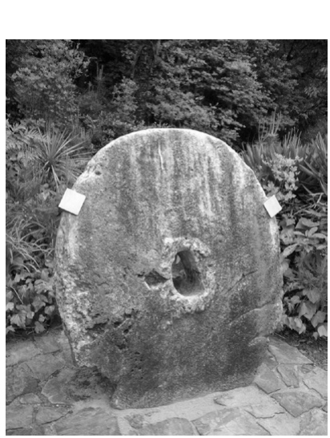

    作者: 尼尔·梅塔 / 阿迪蒂亚·阿加什 / 帕斯·底特律
    出版社: 电子工业出版社
    副标题: 货币革命进行时
    译者: AI人工智能翻译组
    出版年: 2020-9-7
    页数: 264
    定价: 69.00元
    装帧: 平装
    ISBN: 9787121393747

[豆瓣链接](https://book.douban.com/subject/35217239/)

- [比特币和区块链](#比特币和区块链)
  - [纸币的弊端](#纸币的弊端)
  - [雅浦岛石币](#雅浦岛石币)
  - [挖矿](#挖矿)
  - [区块和链](#区块和链)
  - [分支和欺诈](#分支和欺诈)
  - [随机值游戏](#随机值游戏)

# 比特币和区块链
2008年万圣节，一位自称中本聪的计算机科学家发表了《比特币白皮书》。比特币是一种加密数字货币，人们无须通过银行、信用卡或其他金融机构就可以进行兑换。

## 纸币的弊端
**由中间人调度的货币**

人类发明了由类似银行或地方长官等受信任的机构调度的货币。银行账户、银行贷款、信用卡、支票等都属于这一类。通过信任中央机构或中间人，你可以解决大部分实物货币存在的问题。
- 把钱存入银行一定比把钱放在家里安全。
- 可以进行快速的在线支付，此时付款就像让你存钱的银行和收款方存钱的银行更新你们的账户余额一样简单（你们的存款余额只是某个数据库里的数字）。
- 当一个受信任的权威机构能精确地追踪每个人有多少钱时，伪造货币就变得很困难了。（因为没有关于每个人有多少现金的中央记录，所以识别假币的唯一方法就是你自己能区分假币和真币。）
- 如果你相信中间人能保管你的钱，你就不需要随身携带它们了。

由中间人调度的货币必须通过中间人，这导致这一类货币具有以下几个缺点。
1. 当你的钱通过中间人流转时，你必须遵守他们的规则，这通常意味着你必须支付费用。当你用信用卡付款时，商家并不会收到全款，因为它们必须向信用卡组织支付费用。维萨信用卡、万事达信用卡、发现卡的费率一般为1.5%～2.5%，运通卡的费率为2.5%～3.5%。
2. 只有获得使用权限，才能使用由中间人调度的货币。这意味着世界上20亿没有银行账户的人不能进行任何涉及银行账户的交易，拥有不良信用或无信用的人不能使用信用卡。
3. 在你把钱委托给中间人的同时也把你的个人数据委托给了它们。银行擅长保管你的钱，但是金融机构在保障数据安全方面表现不佳

**无形性**

我们真正需要的货币是无形的。由中间人调度的货币通过引入中间人为货币的无形性提供了可能：如果你委托机构为自己管理和转移资金，你就不需要持有实物货币了。

## 雅浦岛石币
雅浦岛上的流通货币是一种被称为“雅浦岛石币”的巨型石环。这种石头币很大：有些直径达3米，与卡车的重量差不多。

部落居民无法拖着这些巨大的石币来进行交易。他们会一起记住每块石币由谁拥有，并且在心里记下关于每块石币的交易记录。例如，如果酋长的女儿从木匠那里买了一艘船，她会告知部落居民，她拥有的那块石币（如海滩上的那块）现在归木匠了。部落居民再相互告知：酋长女儿在海滩上的那块石币现在归木匠所有。

_雅浦岛上的一种传统的货币形式——雅浦岛石币。_

_来源：维基媒体_

如果木匠之后想把那块石币给别人，部落居民会同意，因为每个人的心理记录都表示，那块石币现在属于他。简单来说，如果大多数村民认同某人拥有一块石币，那么他就可以花掉它。

**无形的**

雅浦岛石币这种货币系统最令人印象深刻的部分是，所有的经济活动都可以在石币完全不移动的情况下发生。

**无中间人的**

雅浦岛石币这种货币系统是民主的。如果大多数人认同你拥有某块石币，那你就的确拥有它。不像由中间人调度的货币系统那样——将你的钱委托给某个人或机构，雅浦岛石币被委托给了整个部落的居民。

从雅浦岛石币这种货币系统汲取的经验是，无形的货币体系要求信任。只有当你相信某物或某个人会准确记录你的钱时，你才会放弃对你的钱的实际控制。雅浦岛石币的创新之处在于，你意识到你可以信任系统，而不是中间人。在雅浦岛上，值得信赖的系统就是雅浦岛部落居民共享的交易心理记录。通过信任一个由一群遵循共享规则的人构建的共享的、共识驱动的系统，而不是一个人或一个实体，你可以得到不需要中间人的无形的货币。

## 挖矿
所有比特币用户都可以使用他们的计算机来验证挂起的交易，并且只将有效的交易添加到区块链上。为了提高效率，交易被分成区块，每个区块有几千笔交易。

**激励**

因为比特币自认为是“数字”黄金，验证者投入工作来挖取全新的货币，这个验证过程被称为“挖矿”，而验证者被称为“矿工”。（你在用计算机挖矿，而不是用镐和铲子，但它们的商业模式大致相同。）

## 区块和链
比特币的区块链以线性“链”的方式存储区块，每个区块在数学上都指向前一个区块。

_区块链以线性“链”的方式存储区块。“Txn”是比特币交易的缩写。_

**哈希**

在比特币中，每个区块都有一个相关的哈希。每个区块的哈希部分基于它的前一个区块的哈希。通过这种方式，每个区块都指向它的前一个区块。所以，如果你有一个无序的区块列表和与它们相关的哈希表，你可以很容易地对区块进行排序。

_区块由它们的哈希连接在一起。每个哈希都是根据前一个区块的哈希计算得到的。_

## 分支和欺诈

_多个区块可以将任何给定的区块作为它们的前一个区块，因此区块链确实可以分支。_

**区块树**

当两个矿工同时挖出一个区块时，区块树有时会产生一个新的分支。这种情况很少见，但确实会发生。当这种情况发生时，两笔交易会从最近的交易中分离出来，一个新的区块分支就诞生了。

**最长链原则**

为了保证线性的正式历史，比特币使用了名为“最长链原则”的经验法则。这条法则指出，拥有最多区块的“区块树”的分支就是正式的区块链。最长链决定了你有多少钱、过去发生过什么交易等。如果某件事不在最长链上，它就不会发生。

在比特币用户的计算机上运行的比特币软件，只向在最长链上添加一个区块的矿工支付报酬，从而贯彻最长链原则。这通常足以使矿工们保持秩序。（不过，它有一个副作用。如果两个矿工同时开采出一个区块，就会产生两个分支，但只有一个分支会胜出，成为最长链。另一个分支成为“孤儿”并被抛弃，而在挖掘出该分支底部区块的不幸矿工将得不到任何钱。这种“孤儿”事件一天会发生好几次。）

**挖矿劫持**

如果一个不正当的矿工创造了一个新分支，并且能比其他矿工更快地挖掘区块，从而使他的分支比合法的分支更长，不正当的矿工的分支将成为最长链，所以它将成为正式的区块链。

_攻击者如何通过比其他人更快地挖掘区块来劫持区块链。_

设想一下，不正当的矿工用比特币购买了数千美元的商品，并把交易放在区块链上。然后，他执行攻击，建立一个比正式区块链更长的新链。他支付给商家的交易数据将被丢弃，因为这些交易数据所在的区块不在最长链上。这就好像他一开始就没有付款一样。所以，他最终得到了所有的商品，但从来没有为它付钱！

## 随机值游戏

