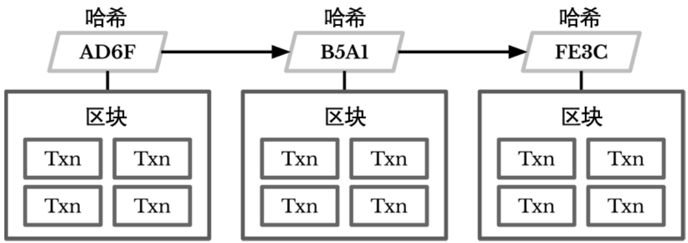
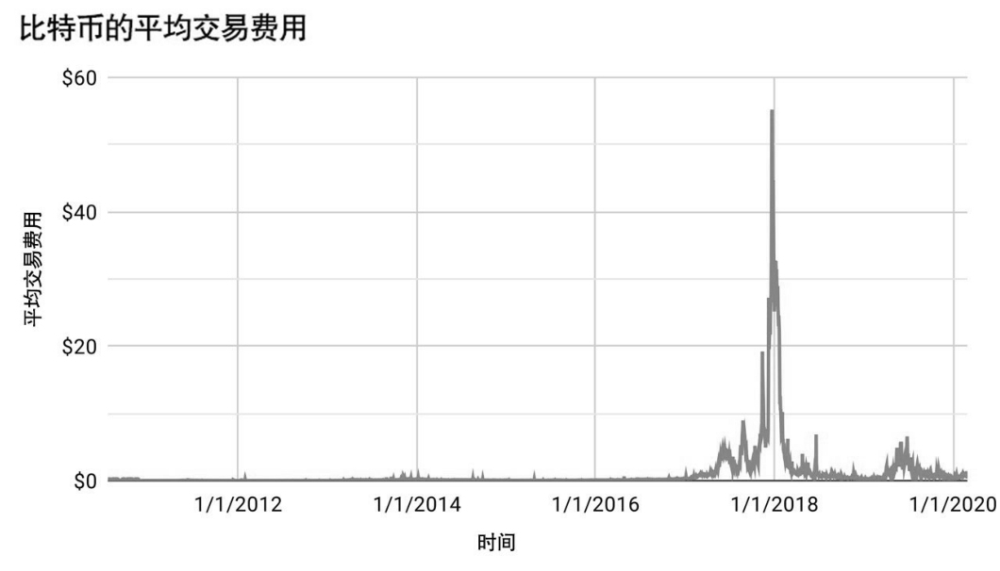
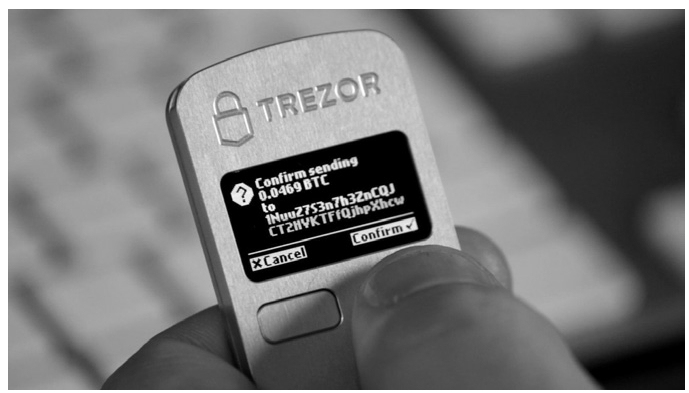
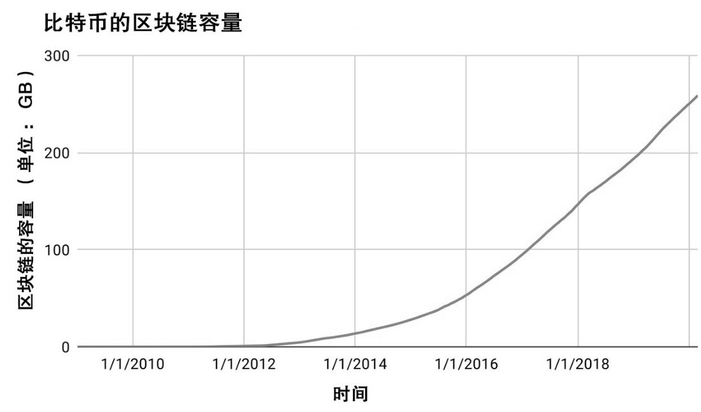
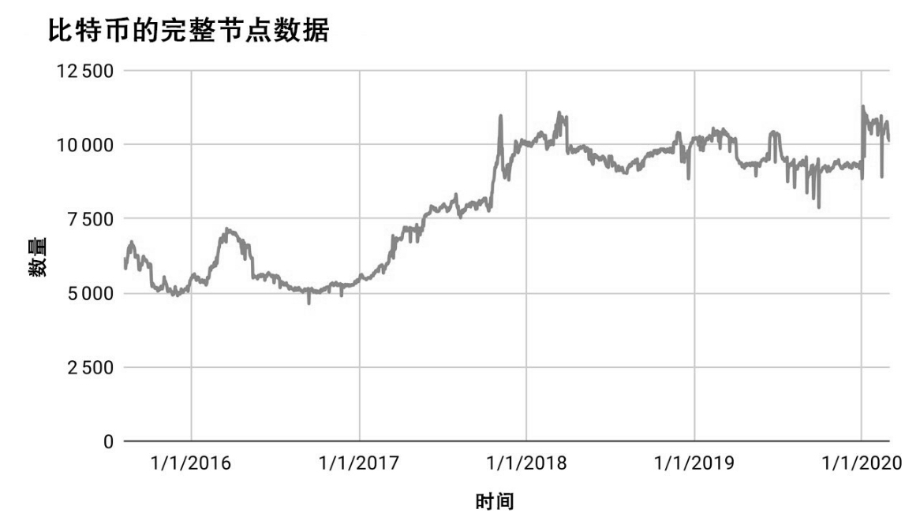
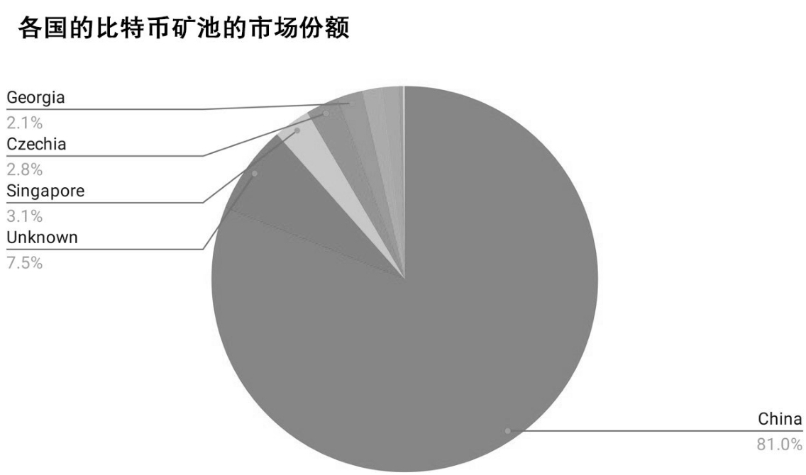

    作者: 尼尔·梅塔 / 阿迪蒂亚·阿加什 / 帕斯·底特律
    出版社: 电子工业出版社
    副标题: 货币革命进行时
    译者: AI人工智能翻译组
    出版年: 2020-9-7
    页数: 264
    定价: 69.00元
    装帧: 平装
    ISBN: 9787121393747

[豆瓣链接](https://book.douban.com/subject/35217239/)

- [比特币和区块链](#比特币和区块链)
  - [纸币的弊端](#纸币的弊端)
  - [雅浦岛石币](#雅浦岛石币)
  - [挖矿](#挖矿)
  - [区块和链](#区块和链)
  - [分支和欺诈](#分支和欺诈)
  - [随机值游戏](#随机值游戏)
  - [凭证](#凭证)
- [比特币经济学](#比特币经济学)
  - [价值9千万美元的比萨](#价值9千万美元的比萨)
  - [比特币的供应](#比特币的供应)
  - [比特币的需求](#比特币的需求)
  - [通货膨胀的因素](#通货膨胀的因素)
  - [通货紧缩](#通货紧缩)
  - [进行投资或持有货币](#进行投资或持有货币)
- [比特币的失策](#比特币的失策)
  - [扩容的问题](#扩容的问题)
  - [Mt.Gox事件](#mtgox事件)
  - [中心化](#中心化)
- [山寨币](#山寨币)

# 比特币和区块链
2008年万圣节，一位自称中本聪的计算机科学家发表了《比特币白皮书》。比特币是一种加密数字货币，人们无须通过银行、信用卡或其他金融机构就可以进行兑换。

## 纸币的弊端
**由中间人调度的货币**

人类发明了由类似银行或地方长官等受信任的机构调度的货币。银行账户、银行贷款、信用卡、支票等都属于这一类。通过信任中央机构或中间人，你可以解决大部分实物货币存在的问题。
- 把钱存入银行一定比把钱放在家里安全。
- 可以进行快速的在线支付，此时付款就像让你存钱的银行和收款方存钱的银行更新你们的账户余额一样简单（你们的存款余额只是某个数据库里的数字）。
- 当一个受信任的权威机构能精确地追踪每个人有多少钱时，伪造货币就变得很困难了。（因为没有关于每个人有多少现金的中央记录，所以识别假币的唯一方法就是你自己能区分假币和真币。）
- 如果你相信中间人能保管你的钱，你就不需要随身携带它们了。

由中间人调度的货币必须通过中间人，这导致这一类货币具有以下几个缺点。
1. 当你的钱通过中间人流转时，你必须遵守他们的规则，这通常意味着你必须支付费用。当你用信用卡付款时，商家并不会收到全款，因为它们必须向信用卡组织支付费用。维萨信用卡、万事达信用卡、发现卡的费率一般为1.5%～2.5%，运通卡的费率为2.5%～3.5%。
2. 只有获得使用权限，才能使用由中间人调度的货币。这意味着世界上20亿没有银行账户的人不能进行任何涉及银行账户的交易，拥有不良信用或无信用的人不能使用信用卡。
3. 在你把钱委托给中间人的同时也把你的个人数据委托给了它们。银行擅长保管你的钱，但是金融机构在保障数据安全方面表现不佳

**无形性**

我们真正需要的货币是无形的。由中间人调度的货币通过引入中间人为货币的无形性提供了可能：如果你委托机构为自己管理和转移资金，你就不需要持有实物货币了。

## 雅浦岛石币
雅浦岛上的流通货币是一种被称为“雅浦岛石币”的巨型石环。这种石头币很大：有些直径达3米，与卡车的重量差不多。

部落居民无法拖着这些巨大的石币来进行交易。他们会一起记住每块石币由谁拥有，并且在心里记下关于每块石币的交易记录。例如，如果酋长的女儿从木匠那里买了一艘船，她会告知部落居民，她拥有的那块石币（如海滩上的那块）现在归木匠了。部落居民再相互告知：酋长女儿在海滩上的那块石币现在归木匠所有。

_雅浦岛上的一种传统的货币形式——雅浦岛石币。_

_来源：维基媒体_

如果木匠之后想把那块石币给别人，部落居民会同意，因为每个人的心理记录都表示，那块石币现在属于他。简单来说，如果大多数村民认同某人拥有一块石币，那么他就可以花掉它。

**无形的**

雅浦岛石币这种货币系统最令人印象深刻的部分是，所有的经济活动都可以在石币完全不移动的情况下发生。

**无中间人的**

雅浦岛石币这种货币系统是民主的。如果大多数人认同你拥有某块石币，那你就的确拥有它。不像由中间人调度的货币系统那样——将你的钱委托给某个人或机构，雅浦岛石币被委托给了整个部落的居民。

从雅浦岛石币这种货币系统汲取的经验是，无形的货币体系要求信任。只有当你相信某物或某个人会准确记录你的钱时，你才会放弃对你的钱的实际控制。雅浦岛石币的创新之处在于，你意识到你可以信任系统，而不是中间人。在雅浦岛上，值得信赖的系统就是雅浦岛部落居民共享的交易心理记录。通过信任一个由一群遵循共享规则的人构建的共享的、共识驱动的系统，而不是一个人或一个实体，你可以得到不需要中间人的无形的货币。

## 挖矿
所有比特币用户都可以使用他们的计算机来验证挂起的交易，并且只将有效的交易添加到区块链上。为了提高效率，交易被分成区块，每个区块有几千笔交易。

**激励**

因为比特币自认为是“数字”黄金，验证者投入工作来挖取全新的货币，这个验证过程被称为“挖矿”，而验证者被称为“矿工”。（你在用计算机挖矿，而不是用镐和铲子，但它们的商业模式大致相同。）

## 区块和链
比特币的区块链以线性“链”的方式存储区块，每个区块在数学上都指向前一个区块。

_区块链以线性“链”的方式存储区块。“Txn”是比特币交易的缩写。_

**哈希**

在比特币中，每个区块都有一个相关的哈希。每个区块的哈希部分基于它的前一个区块的哈希。通过这种方式，每个区块都指向它的前一个区块。所以，如果你有一个无序的区块列表和与它们相关的哈希表，你可以很容易地对区块进行排序。

_区块由它们的哈希连接在一起。每个哈希都是根据前一个区块的哈希计算得到的。_

## 分支和欺诈

_多个区块可以将任何给定的区块作为它们的前一个区块，因此区块链确实可以分支。_

**区块树**

当两个矿工同时挖出一个区块时，区块树有时会产生一个新的分支。这种情况很少见，但确实会发生。当这种情况发生时，两笔交易会从最近的交易中分离出来，一个新的区块分支就诞生了。

**最长链原则**

为了保证线性的正式历史，比特币使用了名为“最长链原则”的经验法则。这条法则指出，拥有最多区块的“区块树”的分支就是正式的区块链。最长链决定了你有多少钱、过去发生过什么交易等。如果某件事不在最长链上，它就不会发生。

在比特币用户的计算机上运行的比特币软件，只向在最长链上添加一个区块的矿工支付报酬，从而贯彻最长链原则。这通常足以使矿工们保持秩序。（不过，它有一个副作用。如果两个矿工同时开采出一个区块，就会产生两个分支，但只有一个分支会胜出，成为最长链。另一个分支成为“孤儿”并被抛弃，而在挖掘出该分支底部区块的不幸矿工将得不到任何钱。这种“孤儿”事件一天会发生好几次。）

**挖矿劫持**

如果一个不正当的矿工创造了一个新分支，并且能比其他矿工更快地挖掘区块，从而使他的分支比合法的分支更长，不正当的矿工的分支将成为最长链，所以它将成为正式的区块链。

_攻击者如何通过比其他人更快地挖掘区块来劫持区块链。_

设想一下，不正当的矿工用比特币购买了数千美元的商品，并把交易放在区块链上。然后，他执行攻击，建立一个比正式区块链更长的新链。他支付给商家的交易数据将被丢弃，因为这些交易数据所在的区块不在最长链上。这就好像他一开始就没有付款一样。所以，他最终得到了所有的商品，但从来没有为它付钱！

## 随机值游戏
如何阻止这样的攻击？让攻击者很难比诚实的矿工更快地挖出区块是个办法。为此，中本聪的设计是，挖出一个区块需要花费非常多的时间。

没有被纳入区块链的交易被搁置在交易池等待审核和确认。交易池也被称为内存池。如果你想要挖掘一个区块，你就要从中选择几千条交易，验证它们，然后才能挖掘出你的区块。

在完成上述操作后，你所要做的就是为你的区块生成一个哈希，之后就可以把这个区块放在区块链上，并且得到你的奖励。

但是生成哈希并不是一件容易做到的事。哈希函数需要三个输入：前一个区块的哈希、交易和一个你选择的被称为`随机值（nonce）`的特殊数字。

问题是，输入不同的随机值将输出不同的哈希值，而只有当哈希以正确数量的“0”开头时，你才被允许将区块添加到区块链中。所以，如果你选择的随机值不能产生正确的哈希，你就必须一次又一次地尝试。

_哈希函数使用3个输入来生成一个区块的哈希。_

_改变随机值会输出一个完全不同哈希。_

**猜测和检验**

计算机运行的哈希函数往往是所谓的单向函数，即在给定输入的情况下很容易计算得到输出，但在给定输出的情况下，猜测输入几乎是不可能的。

这意味着“破解”哈希函数的唯一方法是猜测所有的输出。所谓“破解”哈希函数就是根据输出计算出输入。强行破解计算机的哈希函数是非常困难的。破解比特币的SHA-256哈希函数将花费数百万年的时间，成本极有可能达到数百万美元甚至数十亿美元。

你不能试图逆向找到正确的随机值。所以挖掘一个区块的唯一方法就是一遍又一遍地猜，直到你猜中。

**矿机**

出于一些显而易见的原因，专业的矿工不会使用笔记本电脑来挖矿。他们购买的是功能强大的计算机，这种计算机配备有专用的`计算机芯片（ASIC）`，这种芯片针对比特币的哈希算法进行了高度优化。用来挖矿的ASIC能以惊人的速度猜测随机值，但它们不能做其他事情。

_一个专门运行比特币哈希算法的ASIC。来源：维基媒体_

一台售价2000美元的中型的、配备ASIC芯片的挖矿计算机每秒可以输出大约56万亿个哈希，这意味着它每秒可以尝试输入56万亿个随机值。但是由于很难猜测出正确的随机值，所以即使有这么强大的硬件，成功挖掘一个区块也需要大约38年的时间。

**工作证明**

回想一下前面的恶意的矿工想开挖一条比合法区块链长得多的诈骗链的例子。要做到这一点，他的挖矿速度需要比其他所有诚实的矿工的速度总和还快，所以他需要控制世界上超过50%的哈希能力。这种攻击被称为51%攻击。51%攻击是可能实现的，但它的代价也是高昂的，这个恶意的矿工需要购买所有这些配备了ASIC的超级计算机。而且，除非这个恶意的矿工能够控制51%的哈希能力，否则他就没有机会篡改区块链。

简而言之，要挖掘比特币，你就必须投入大量的工作和资金。因为工作量庞大，比特币挖掘系统被称为工作证明。赢家是那些为挖矿付出最多努力的人。

## 凭证
**去中心化的账户**

`私钥`是一个只有你才应该知道的长且完全随机的字符串。它通常是52位的由字母和数字组成的字符串。这种编码方式被称为Base58。私钥在比特币中扮演着密码的角色。

可以用私钥运行一个被称为椭圆曲线数字签名算法的单向函数来生成一个被称为`公钥的中间数字（intermediary number）`。

然后运行比特币挖矿中著名的SHA-256和RIPEMD-160这两个单向函数，并且进行更多的数学调整，以获得一个压缩版本的公钥。这个`公钥`被称为`比特币地址`。比特币地址是一串由字母和数字组成的26～35位字符串，也是由Base58这种编码方式生成的。比特币地址是比特币最接近用户名的东西：它是公开的，能用来识别你的身份。

**交易签名**

一旦有了私钥和地址，你就可以开始发送和接收比特币了。为了证明你是一笔交易的发送方，你可以使用自己的私钥在交易上创建一个“标记”，从而对交易进行数字“签名”。任何人都可以使用你的公钥（当然可以，因为它对所有人是可见的）来确认应用标记的人是你，但是没有人可以根据标记反向推出你的私钥。

_我们生成了一个随机的私钥和地址。不要把钱发送到这个地址，因为任何有这个私钥的人都可以获得里面的钱。这张图片叫作纸钱包。你可以打印出你的私钥，这样就可以把它保存在一个安全的地方了。_

# 比特币经济学
## 价值9千万美元的比萨
**拉兹洛的交易**

2010年3月，第一家比特币交易所成立。你可以在这个网站上将比特币兑换成美元，也可以将美元兑换成比特币。在这家比特币交易所成立时，比特币对美元的汇率是，1枚比特币可以兑换0.3美分。

同年5月，美国佛罗里达州一名叫拉兹洛·汉尼什的男子在一个比特币论坛上发帖，只要有人给他送比萨，他就给那个人1万枚比特币（当时价值41美元，1枚比特币可以兑换0.4美分）。他的条件很灵活：“你可以自己做比萨，或者在外卖店帮我订比萨。”但是他也很坚持：“我不想吃鱼或诸如此类的奇怪的东西。”

**主体间性**

历史学家尤瓦尔·赫拉利所说的`主体间性`：你之所以认为这件事有价值，是因为你知道别人也认为它有价值。农贸市场的农民之所以会很乐意你用20美元从他那里买他自制的果酱，是因为他知道他可以用这20美元从别人那里买杂货、农具或其他他需要的东西。

## 比特币的供应
经济价值源自稀缺性，而稀缺性源自供应的有限性。因此，维持比特币价值的一种方式是限制比特币的供应量：比特币的流通数量被人为设定了上限，而且其供应量的增长速度每天都在减慢。

**放缓的奖励**

比特币软件会通过设定哈希值的前导零的数量来自动调整挖矿的难度，平均每10分钟挖出一个区块，由此每10分钟就会产生一批新比特币。

但问题是，区块奖励总是在减少。比特币软件每4年将区块奖励减半。2008年，最初的区块奖励为每个区块奖励50枚比特币。2012年，区块奖励减半至25枚比特币。2016年又减了一半，降至12枚比特币。等到2020年5月，区块奖励的比特币数量下降至6.25枚。

如果根据区块奖励每4年减半进行计算，你会发现，在2140年进行第33次减半后，区块奖励将正式归零。届时，总共被挖出来的比特币共有2100万枚，而比特币的供应量将永远不会再增加。

**丢失的比特币**

有趣的是，比特币的供应量实际上会随着时间的推移而减少。比特币所具有的高度去中心化的体系意味着，如果你丢失了自己的私钥，就无法找回你的比特币。

## 比特币的需求
**易用性理论**

我们认为，拉动比特币需求的现实因素还有两个。一个因素是比特币的投资门槛越来越低。在2010年代中期，持有比特币的主要方式是在电脑上运行笨拙的软件，找一个合法的比特币交易平台，在某些情况下，为了买一些比特币还要进行手续烦琐的跨境银行支付。当时的比特币投资只适合真正专注于比特币的人。

但是现在，任何人都可以投资比特币。你可以在一些网站上用借记卡购买比特币，可以用某些App购买和发送比特币。一些流行的股票交易App也提供比特币的买卖服务。你甚至可以通过富达或德美利证券等证券经纪人购买比特币的ETF。降低比特币投资的准入门槛，这又消除了比特币需求的一个上限。

**投机理论**

另一个因素是纯粹的旧猜测（plain old speculation）——在我们看来也是影响力更强的因素。大多数比特币的用户都是希望赚钱的投机者。与股票市场相比，比特币的价格波动较大，监管相对不足，而且投资门槛的降低使其成为一种令人兴奋的、相对容易投机的投资工具，这对于年轻人来说尤其如此。

随着时间的推移，比特币供应量的增长速度会越来越慢，需求对比特币价格的影响也会越来越大。如果需求的上升趋势能持续下去，比特币将继续升值。但如果需求消失，比特币的价格体系将崩溃。

将持续的低供应和反复无常的需求结合起来，你就能了解比特币的价格变化历史：剧烈波动，但长期来看仍保持增长趋势。

## 通货膨胀的因素
**通货膨胀的定义**

如果你仔细研究通货膨胀的定义，你会发现它给比特币带来了一个问题。通货膨胀是根据多年来实物商品（如装满一辆购物车的商品）价格的变化来计算的。比特币的问题在于，你无法真正用比特币购买实物商品。即便有少数商店允许你用比特币购买实物商品，如床垫，但你通常不会直接用比特币付款。相反，你的比特币会自动转换成美元（或当地货币），商家最终收到的也是美元（或当地货币）。

因此，除了借助其他货币，你无法用比特币买到很多东西。你可以用一“篮子”货币来衡量通货膨胀。例如，你可以统计每年购买100美元、100欧元和1万日元所需的比特币数量。问题在于，由于外汇市场的波动和通货膨胀，这些货币的价值也总在变化。

因此，如果兑换一“篮子”货币的比特币价格发生了变化，你无法判断是比特币还是一“篮子”货币造成了这种价格变化。（与此同时，我们衡量通货膨胀率的实物商品的价值是固定的。一盒麦片的价值在十年前和今天是一样的。）简而言之，用一“篮子”货币对比特币汇率的变化来衡量通货膨胀不是好方法。

## 通货紧缩
**减少供应**

其实，通货紧缩对比特币的投资者来说是个好消息。比特币的供应量减少了，他们持有的比特币就显得稀有，因此更有价值。但显而易见，通货紧缩对经济来说是不健康的。在通货紧缩的经济环境中，随着时间的推移，钱会变得更有价值，所以你有足够的动机去囤积它，而很少有动机去投资或消费。

**通货膨胀的效益**

通货紧缩使人们储蓄，不进行消费和投资。与此同时，维持小幅且稳定的通货膨胀率能促使人们投资，因为他们意识到如果不进行投资或理财，自己的钱就会贬值。适当的通货膨胀有助于维持经济的健康增长。

如果人们囤积现金（或比特币）而不是努力发展业务，经济就会陷入停滞。因此，虽然在比特币的世界里，通货紧缩对投资者来说可能是一件好事，因为他们只要持有比特币就能看到潜在的巨额回报，但这会为比特币成为国家（或世界）货币奠定糟糕的基础。

## 进行投资或持有货币
**稳定和增长**

使投资变得有效率的东西与使货币变得有效率的东西是不同的。谷歌的股票是十分理想的投资产品，但你不会希望它成为美国唯一的法定货币，因为商业交易将因此变得困难许多。（消费者不会买任何东西，既然用同样数量的股票在几个月后能买到更多东西，现在为什么要消费呢？商家则会犹豫是否接受股票，因为他们担心它的价值会崩溃，他们会因此赔钱。）

另一方面，美元是非常稳定的，这使得它成为商业交易和经济运行的重要基础。你可以相信，你花费或赚到的美元不会大幅升值或贬值。但投资者不会把美元作为他们投资策略的核心，因为美元没有利润可赚，而且，通货膨胀实际上慢慢地吞噬了美元的价值。

换句话说，好的货币的价值具有稳定性，而好的投资产品的价值具有增长性。当然，稳定性和增长性是相互排斥的。一种金融工具不可能在保持稳定的同时还保持增长。

**比特币——彻头彻尾的投资**

比特币是一种奇怪的金融工具。它既是一种货币，也是一种投资产品。你可以使用比特币在网上买卖东西，也可以购买并持有比特币，以期能够盈利。

金融工具不可能同时是增值的货币和增值的投资产品。在两者间必须做出选择。从技术上讲，比特币是一种货币，但它表现得更像是一种投资产品。

如果你看看比特币的价格变化，很明显，比特币选择成为一种投资产品。比特币币值的不稳定性是出了名的：它可以在一个星期内下跌或飙升20%。在2017年12月的一个特别疯狂的日子里，一枚比特币的价格从早上的1.5万美元涨到了午餐时间的逾1.9万美元，到下午晚些时候，回落至约1.6万美元。比特币币值的增长仍然是不可预测的，但是到目前为止，从长远来看，它增长得非常快。

# 比特币的失策
## 扩容的问题
**交易费用和延误**

首先，需要考虑的是交易费用。请记住，矿工对一个区块内的每笔交易都要收费。每笔交易在纳入区块前都要指定其可以支付的交易费用，然后才能进入所有未被确认的交易的内存池。矿工可以选择纳入下一个区块的交易。你能想象到，他们会选择支付交易费用最高的交易。

**交易阻塞**

交易费用的问题更多地出现在交易阻塞的时候。当人们进行交易的速度远远快于矿工将交易打包成区块的速度时（请记住，区块只能每10分钟制作一次），需求的增加将推高平均交易费用。

以2017年12月的情况为例。比特币长达一年的涨势在这个月达到顶点：一枚比特币的币值从2017年1月的不到1000美元飙升至2017年12月的逾1.9万美元。在这个月，试图买卖比特币的人持续增多，交易的数量达到了前所未有的高度，这导致交易的平均费用飙升（一度超过55美元）。

_比特币的交易费用通常不到1美元，但在需求旺盛的时候会飙升——平均交易费用一度超过55美元。数据来源：Bitinfocharts.com_

**根本问题**
即使在最好的情况下，比特币也不适合小额支付。据早期著名的比特币开发者迈克·赫恩估计，比特币系统每秒只能处理大约3笔交易。最新数据显示，比特币系统每秒只能处理3.5～4笔交易。

但是，维萨的系统每秒可以处理更多笔交易。对此，我们很难说出一个确切的数字。摩根士丹利表示，维萨和万事达每秒可以处理5000笔交易。维萨曾经吹嘘，称其系统每秒可以处理11000笔交易。而有一些白皮书显示，维萨每秒最多可处理45000笔交易。无论哪个数据是真实的，维萨处理的交易数量远远超过比特币。

## Mt.Gox事件
Mt.Gox于2010年在东京成立，它允许世界各地的人们将美元、日元等政府发行的法定货币兑换成比特币，反之亦然。Mt.Gox实际上是在2009年为卡牌游戏《万智牌》（Magic：The Gathering
）交换卡牌而诞生的。“Mt.Gox”这个名字源自“Magic：The Gathering
OnlineExchange”。Mt.Gox很快转向了比特币。Mt.Gox发展迅速，到2013年，全球超过70%的比特币交易都通过该平台进行。

**盗窃**

Mt.Gox早在2011年就遇到了麻烦，但是大多数用户并不知道。Mt.Gox将用户的账户余额存储在特定的钱包中（钱包只是针对私钥和地址对的术语）。2011年，不知真实身份是黑客还是Mt.Gox的流氓雇员的一名攻击者从Mt.Gox的服务器上复制了一个名为“wallet.dat”的文件；这个文件里存有Mt.Gox钱包的私钥。

在接下来的几年里，有Mt.Gox私钥的小偷慢慢挪走了Mt.Gox钱包里的比特币。Mt.Gox完全不知道失窃事件。

目前，还不清楚小偷从Mt.Gox偷了多少枚比特币。有20万枚比特币后来被找到，但有大约60万枚仍下落不明。

**其他选择**

比特币社区已经开发了避免此类黑客攻击事件再次发生的技术。在这类技术中，最引人注目的是`冷钱包`，它将私钥存储在一个不连接互联网的平台上，可以防止网络攻击或任何此类漏洞。

冷钱包有两种常见的形式。第一种是`纸钱包`，即私钥和地址被印刷在一张纸上（这张纸应被放在一个安全的地方）。这和把写有你的银行卡密码的便利贴放在书房里没什么两样：用起来不方便，也容易放错地方，但这能确保黑客的攻击不会得手。

_上图为纸钱包的一个示例。最左边的代码是地址，最右边的代码是私钥。你也可以通过扫描二维码来更便捷地输入私钥和地址。来源：BitcoinPaperWallet_

第二种是`硬件钱包`，即将私钥存在一个优盘上。硬件钱包是安全的，因为你的私钥存在优盘里。请永远不要丢掉这个优盘。交易时你需要用私钥进行签名，利用硬件钱包，你可以在（联网的）计算机没有存储你的私钥的情况下交易。

更重要的是，一些硬件钱包还需要你按下一个物理按钮来批准交易。因此攻击者不可能拿走你的钱，除非他们能得到你的硬件钱包。在科技领域，用实物来补充数字登录的策略已经变得相当普遍。如果你曾经使用过双因素身份验证，例如用你的手机批准登录，那么你对这种方法不会陌生。

_上图为硬件钱包的一个示例。私钥被存在这个小设备上，它通过USB端口插入计算机。需要使用物理按钮来批准交易。来源：维基媒体_

## 中心化
**一些节点**

比特币的区块链是巨大的：在撰写本书时，它的容量已经超过了250GB，并且每年还要增加50GB。比特币的区块链太大了，很多笔记本电脑已经无法存储了。

出于这个原因，大多数比特币用户不会将完整的区块链存储在他们的设备上。相反，他们只在设备上存储部分的区块链，这些存储部分区块链的设备就是所谓的轻量级节点。他们依靠其他人运行的完整节点或存储了整条区块链的计算机，来验证交易并确保新的区块被添加到了区块链上。这样做的风险是，使用轻量级节点的用户不能百分之百确定他们获得的所有交易都是合法的；他们必须信任完整节点的所有者。

_随着交易数量的增多，比特币的区块链容量稳步增加。数据来源：Blockchain.com_

问题是，维护一个完整节点是没有报酬的，但完整节点对比特币的运行至关重要，因为它们是唯一存储正式区块链的节点。专家表示，由于缺乏金钱激励，而且维护完整节点的难度越来越大，这意味着一般的比特币用户不会再维护完整节点。相反，完整节点将由矿池公司、像比特大陆这样的ASIC制造商、云挖矿公司等几家盈利颇丰的大公司维护。

很难确切知道是谁在运行这些节点，但已经很清楚的是，尽管人们对比特币的兴趣日益浓厚，但完整节点的数量没有继续增加。在撰写本书时，比特币完整节点的数量还维持在过去两年的1万多个。

_自2018年以来，比特币完整节点（存储整条区块链的计算机）的总数一直变化不大。数据来源：CoinDance_

如果这些专家的数据是正确的，那么一些强大的实体将真正控制区块链的未来，从而控制比特币的未来。

**相同的软件**

比特币中心化的第二个例子体现在完整节点所运行的软件上，即所谓的比特币客户端。在撰写本书时，比特币客户端Bitcoin Core在97.5%的完整节点，即10605个节点中的10341个上运行。排名第二的比特币客户端Bitcore只在111个完整节点上运行。

事情并不一直是这样的，其他比特币客户端在过去也有一定的竞争力。2015年，Bitcoin XT在超过1000个完整节点上运行，占当时所有完整节点的15%以上。Bitcoin Classic的运行量在2016年达到峰值，它在超过2000个完整节点上运行，占比达30%。在撰写本书时，只有2个完整节点在运行Bitcoin XT，3个完整节点在运行Bitcoin Classic。自从2018年年初比特币客户端比特币无限（Bitcoin Unlimited）倒闭以来，Bitcoin Core就没有遇到过任何激烈的竞争。

_在过去，比特币客户端软件的市场竞争相当激烈，但Bitcoin Core很快就击败了竞争对手。数据来源：CoinDance_

令人不安的是，Bitcoin Core背后的团队主要由一家名为Blockstream的区块链公司资助。更令人不安的是，Blockstream公司雇用了大量的Bitcoin Core团队的核心成员。

这让所有支持去中心化的人感到担忧：比特币的核心软件主要由一小群人拥有和维护，而这群人受雇于同一家公司。可以想象，由Blockstream公司引发利益冲突和“用户难以操作”的可能性很高。

**一些矿池**

哈希能力集中到了少数几个矿池手中。而最顶尖的矿池总是处于竞争关系。一些矿池会出现，一些矿池会倒闭，但是，我们发现，最顶尖的15家矿池挖出了大约95%的比特币区块。另外，前5大矿池控制了60%～75%的哈希能力。

_在撰写本书时，排名前4的矿池控制了约56%的哈希能力，这意味着它们挖出了56%的区块。数据来源：Blockchain.com_

在某些情况下，一些实力雄厚的矿池可以控制整个比特币网络的大部分或接近大部分的哈希能力。2014年，现已不存在的矿池GHash.io控制了比特币网络总哈希能力的55%，而比特大陆的矿池（BTC.com和蚂蚁矿池）曾经拥有比特币网络总哈希能力的42%。

这些事实之所以令人担忧，不仅因为垄断企业通常存在的问题，还因为51%攻击的威胁。

**中国的管控**

中心化的另一个惊人之处在于，大多数顶级矿池都位于中国。在撰写本书时，中国的矿池控制着比特币网络80%的哈希能力，从而挖出了全球80%的比特币，这一数字与历史估计相符。

_最热门的矿池大多是中国的：币印矿池（Poolin）、鱼池（F2Pool）、BTC.com、蚂蚁矿池、ViaBTC、BTC.TOP、1Thash & 58COIN、OKExPool、百特矿池（BytePool）和WAYI.CN。其他国家几乎没有矿池。数据来源：Blockchain.com_

# 山寨币

