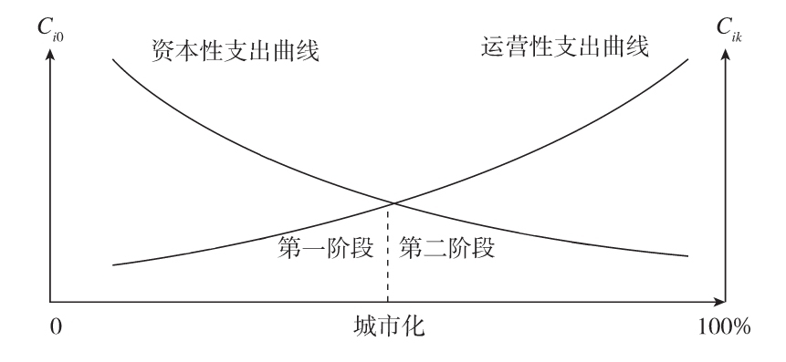
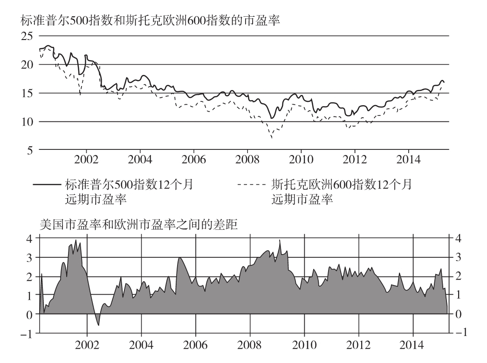
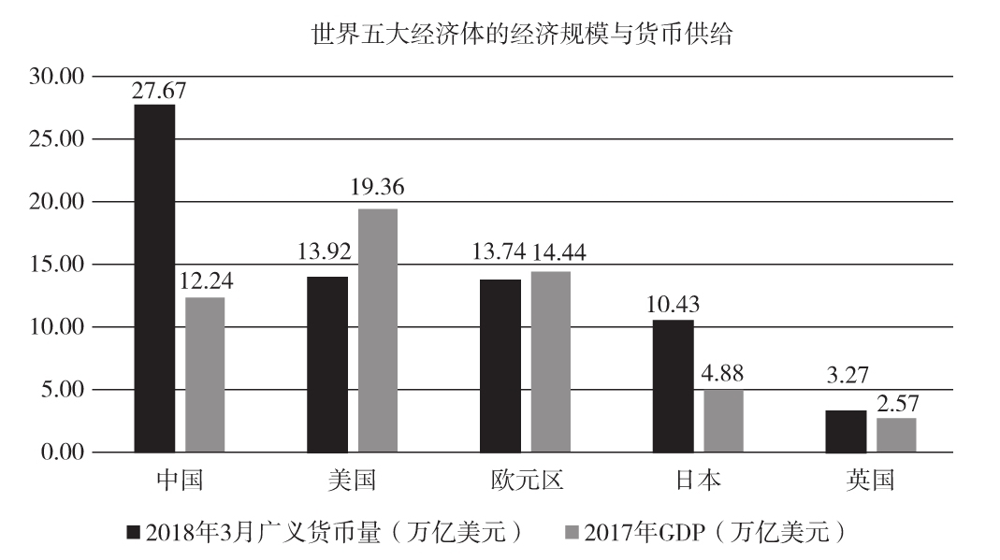
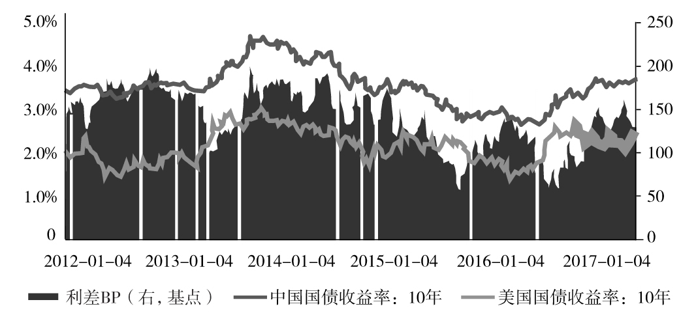

    作者: 赵燕菁
    出版社: 中国人民大学出版社
    副标题: 中国经济的增长与转型
    出版年: 2023-1-1
    ISBN: 9787300309705

[豆瓣链接](https://book.douban.com/subject/36167160/)

- [增长](#增长)
  - [城市的制度原型](#城市的制度原型)
    - [重新思考城市问题](#重新思考城市问题)
  - [“土地财政”的历史与逻辑](#土地财政的历史与逻辑)
    - [“土地财政”之“功”](#土地财政之功)
    - [“土地财政”的问题与风险](#土地财政的问题与风险)
    - [“土地财政”的升级与退出](#土地财政的升级与退出)
- [转型](#转型)
  - [城市化转型——从高速度到高质量](#城市化转型从高速度到高质量)
    - [增长的阶段与转型](#增长的阶段与转型)
    - [城市化、土地金融与地方政府](#城市化土地金融与地方政府)
    - [城市化转型对策建议](#城市化转型对策建议)
- [全球博弈](#全球博弈)
  - [资本与劳动的两难](#资本与劳动的两难)
  - [中美博弈的关键战场](#中美博弈的关键战场)
    - [货币与资本市场](#货币与资本市场)
    - [中美资本市场的差别](#中美资本市场的差别)
    - [特朗普的盲区与中国的主场](#特朗普的盲区与中国的主场)
    - [中美贸易战的主角](#中美贸易战的主角)
  - [大国博弈的货币视角](#大国博弈的货币视角)
    - [纸币就是信用货币吗？](#纸币就是信用货币吗)
    - [货币供给不足怎样解决？](#货币供给不足怎样解决)
    - [货币增发可以降低利率吗？](#货币增发可以降低利率吗)
  - [资本竞争的最优贴现倍数](#资本竞争的最优贴现倍数)
    - [信用与贴现倍数](#信用与贴现倍数)
    - [管理贴现倍数](#管理贴现倍数)
    - [回到“双轨制”](#回到双轨制)
- [财富分配](#财富分配)
  - [资本市场再设计](#资本市场再设计)
    - [制度设计](#制度设计)
  - [乡村振兴——从输血到造血](#乡村振兴从输血到造血)
    - [振兴举措](#振兴举措)
  - [平台经济——从盯住垄断到盯住产权](#平台经济从盯住垄断到盯住产权)
    - [“企业群落”及其结构](#企业群落及其结构)
    - [初始资源的权属](#初始资源的权属)
    - [平台企业的制度演进](#平台企业的制度演进)
    - [平台企业公众化](#平台企业公众化)

# 增长
## 城市的制度原型
### 重新思考城市问题
根据城市的制度原型，城市及其体系的形成可以视作“自然”、“制度”和“交通”三个过程空间效果的叠加：
1. 想象一个均质无差异的空间。自然、气候、土壤、区位的不同，使得空间的拓扑形态产生变化，塌陷成不同的“自然洼地”。“自然洼地”的深度，并非由“自然”决定，而是取决于当时所拥有的技术。比如，当交通技术进步时，运输成本降低，原来具有交通地理优势的区位相对其他地区的优势（洼地深度）就会减少。轮船技术的进步会使原来铁路枢纽的重要性下降，甚至使其被港口枢纽取而代之。同样，农业技术的进步、水资源利用技术的进步，都会强化或弱化某些区位的相对优势。要素（主要是人口）为了降低成本，向这些“洼地”汇聚，但这些“洼地”还不能算是“城市”。
2. 随着城市生产者在特定的空间提供公共服务（比如防卫），空间上相应地会形成“制度洼地”。这时，真正的城市开始产生。为了降低成本，城市的“生产者”往往会选择“自然洼地”以增加“制度洼地”的深度。城市基础设施的提供，则进一步增加了特定区域相对于周边竞争区域的深度。城市对要素的吸引力（洼地的深度），取决于两个“洼地”的叠加效果。
3. 城市的出现又会通过交通的“成本效应”使周边地区出现新的“皱褶”和“塌陷”，从而为次一级的城市形成新的“洼地”。德国传统的经济地理只描述了城市形成过程中的最后一步。他们研究的是关于城市体系的理论，描述的是城市与周边地区的关系，而非城市本身。

按照城市的制度原型，空间不再是简单的“城”与“乡”两极，而是由不同公共服务水平组成的连续谱系。**城市化的过程，就是一个城市（更准确地说是公共服务水平）从谱系的低端向谱系的高端移动的过程**。因此，纯粹基于人口数量比较纽约和北京的城市规模大小，就没有什么学术意义，因为这本质上是在比较不同的东西。同样，我们说纽约的地价高于南宁的地价也是没有意义的，因为两个地价所包含的公共服务存在巨大差异。当我们对不同城市进行指标比较时，不应孤立地进行比较，而应同时考虑公共服务“质量”和“水平”的差异（不同的公共产品集合）。唯有如此，才可以使城市比较研究立足于可靠的基础。

## “土地财政”的历史与逻辑
### “土地财政”之“功”
**信用：城市化的催化**

公共服务是城市土地价值的唯一来源。城市不动产的价值，说到底，就是其所处区位公共服务的投影。无论城墙还是道路，或是引水工程，公共服务都需要大规模的一次性投资（fixed cost）。

所谓“计划经济”，本质上是通过自我输血，强行完成原始资本积累的一种模式。在计划经济条件下，经济被分为农业和工业两大类，国家通过工农业产品的剪刀差，不断将农业部门的积累转移到工业部门。依靠这种办法，中国建立起初步的工业基础，却再也没有力量完成城市化的积累。超强的积累窒息了中国经济，使生产和消费无法实现有效的循环。改革开放前，中国的城市化水平在百分之十几到百分之二十几之间。

**中国城市化的“最初的信用”**

中国城市化模式的大突破，始于20世纪80年代后期。当时，依靠农业部门为中国的工业化提供积累的模式已难以为继。深圳、厦门等经济特区仿效香港，尝试通过出让城市土地使用权，为基础设施建设融资。1986年，深圳改变了原有的无偿划拨模式，逐步形成了国有土地流转市场。1987年12月1日，深圳首次公开拍卖了一个面积为8 588平方米的地块，敲响了1949年以来国有土地拍卖的“第一槌”。第二年，宪法修正案在第10条中加入“土地的使用权可以依照法律的规定转让”，城市土地使用权的流转获得了宪法依据（张千帆，2012）。从此，深圳开创了一条以土地为信用基础，积累城市化原始资本的独特道路。这就是后来广受诟病的“土地财政”。

1994年的分税制改革，极大地压缩了地方政府的税收分成比例，却将当时规模还很小的土地收入划给了地方政府，奠定了地方政府走向“土地财政”的制度基础。

随着1998年住房制度改革（“城市股票上市”）和2003年土地招拍挂（即招标、拍卖、挂牌由卖方决定市场）等一系列制度创新，“土地财政”不断完善。税收分成大减的地方政府不仅没有衰落，反而迅速暴富。急剧膨胀的“土地财政”帮助政府以前所未有的速度积累原始资本。城市基础设施建设不仅逐步还清欠账，甚至还有部分超前（高铁、机场、行政中心）。成百上千的城市，日新月异地崛起。无论是城市化速度还是城市化规模，都超过了改革之初最大胆的想象。

**美国的“土地财政”**

有人或许认为中央政府的土地收益和地方政府的“土地财政”不能混为一谈。但在笔者看来，“土地财政”的本质，就是将土地收益用于公共服务。地方政府和中央政府的差异，仅仅是提供的公共产品种类不同（比如前者可能是自来水，后者可能是国防）。除此之外，没有本质差异。

**“土地财政”的本质是融资而非收益**

中国城市政府出售土地的本质，就是直接销售未来的公共服务。**如果把城市政府视作一个企业，那么西方国家城市是通过发行债券来融资，中国城市则是通过发行“城市股票”来融资**。

因此，在中国，居民购买城市的不动产，相当于购买城市的“股票”。这就是中国城市的积累效率远高于土地私有化国家的重要原因。也正是依靠这一做法，中国得以一举完成工业化和城市化两个进程的原始资本积累。

这就解释了为什么中国住宅有如此高的收益率——因为中国住宅的本质就是资本品，除了居住，还可以分红——不仅可分享现在公共服务带来的租值，还可以分享未来新增服务带来的租值！当然，居住和分红从流动性等金融性质方面来看并不完全相同，但就融资功能而言，本质是一样的。

近年来，中国M2持续高速增长，但并未引发经济学家所预期的超级通货膨胀。一个重要的原因，就是M2的规模是有实际需求支撑的。现在有一种流行的做法，就是拿M2和GDP做比较。2012年，M2余额为97.42万亿元，GDP约51万亿元，M2与GDP的比值达190%。有人认为，M2与GDP的比值逐年高企，说明资金效率和金融机构的效率较低。更有人担心通货膨胀回归和房价反弹。

但实践表明，M2和GDP并不存在严格的对应关系。1996年是个分水岭。从这一年开始，在中国M2超过了GDP，但此后却长期保持低通货膨胀，甚至局部时期还出现通货紧缩。而改革开放后几次大的通货膨胀都出现在此之前。这是因为，合意的货币发行规模，取决于货币背后的信用而非GDP本身。如果说税收财政信用与GDP存在正相关关系，“土地财政”提供的信用与GDP的这种相关性就可能相较于同样GDP的税收财政成倍放大。

布雷顿森林体系瓦解后，曾经以黄金为“锚”的世界大部分货币处于“漂流”状态。**美元通过与大宗商品，特别是石油挂钩，重新找到了“锚”，使得美元可以通过大宗商品涨价，消化货币超发带来的通货膨胀压力**。欧元试图以碳交易为基准，为欧元找到“锚”，但迄今仍未成功。日元则基本上以美元为“锚”，它必须不断大规模囤积美元，其货币超发，只能依靠美元升值消化。

**“土地财政”却给了人民币一个“锚”**。土地成为货币基准，为中国的货币自主提供了基石。2013年，美联储宣布要逐步退出“量化宽松”，新兴市场国家立刻出现资本外流、货币贬值、汇率波动，而人民币的汇率却屹立不动。这说明人民币已脱离美元来定价，找到自己内生的“锚”。这个“锚”就是不动产：不动产升值，货币发行应随之上升，否则就会出现通货紧缩；货币增加，而不动产贬值，则必然出现通货膨胀。也就是说，货币超发须借由不动产升值来吸收，否则，过剩的流动性就会导致通货膨胀。日本面临通货紧缩时，安倍经济学企图通过日元贬值走出通缩，在笔者看来，这不过是日本货币战争的障眼法，其目的是用货币贬值对冲高负债率可能带来的通货膨胀。一旦美国要求日元升值，超发的货币就会泛滥。

1998年的住房制度改革虽然没有使GDP增加，却使“城市股票”得以正式“上市流通”，全社会的信用需求急速扩大。同日本一样，囤积的大量美元是人民币信用的另一个来源。美元升值，人民币就可以多发。如果人民币贬值，不动产就必须升值，否则，就会导致通货膨胀。因此，在美元贬值的背景下，打压房价，就是打压人民币。房价下跌，必定导致通货膨胀，其后果可能远比我们大多数人想象的巨大、复杂。之所以没有发生通货膨胀，乃是因为房价上升导致全社会信用规模膨胀的速度比货币更快。

**中国和平崛起的重要基础**

西方国家经济崛起的历史表明，效率较低的税收财政无法完全满足城市化启动阶段对原始资本的需求。为避开国内政治压力，外部殖民扩张、侵略便成为大多数发达国家快速完成资本积累的捷径。货币作为一种“流量”，它对应的是整个经济规模。

这就是为什么在中国模式出现之前的西方模式必然带来扩张和征服，新崛起的国家一定会和已经崛起的国家发生碰撞和冲突。如果不能从发展模式上给出令人信服的解释，仅仅靠反复声称和平愿望，很难使其他国家相信中国的崛起会是一个例外。

清末和民国时期的开放历史表明，市场开放对交易双方的好处并不像“比较优势”理论认为的那样是无条件的。国际投资和贸易既可帮助中国企业在全球“攻城略地”，也方便了国际资本的经济殖民，利弊得失依赖双方的资本实力——全球化只对竞争力较强的一方有利。为何发达国家经济长期作为更有竞争力的一方？一个重要的原因，就是其凭借完善的“税收—金融”体制可以以很高的效率融资，从而获得全球竞争优势。因此，通常条件下，最卖力推动全球化的，往往也是资本最雄厚的国家。

但中国的“土地财政”打破了这一规则，在短短十几年的时间内，创造了一种比西方国家更有效率的融资模式。中国产品风靡全球，中国则出人意料地成为可与西方国家比肩的资本强国。

反倾销历来是发达国家对付其他发达国家的经济工具，现在却被用来对付中国这样的发展中国家；以前从来都是城市化发展快的国家出现资本短缺，完成城市化的国家出现资本剩余，现在却反过来了，是中国向发达国家输出资本。在这些“反经济常识”的现象背后，实际上都有赖于“土地财政”融资模式的超高效率。

**中国之所以能“和平崛起”，原因恰恰离不开“土地财政”这种融资模式，这使得中国不必借由外部征服，就可以获得原始资本积累所必需的“初始信用”。高效率的资本生成，缓解了原始资本积累阶段的信用饥渴，确保了中国经济成为开放的和在全球化中获利的一方**。因此，即使处于发展水平较低的城市化初始阶段，中国也比其他任何国家更希望维持现有国际经济秩序，更有动力推动经济全球化。“土地财政”的成功，确保了“和平崛起”成为中国模式的内置选项。

### “土地财政”的问题与风险
**“土地财政”的问题**

1. “土地财政”必定使得不动产变成投资品。“土地财政”的本质是融资，这就决定了土地乃至为土地定价的住宅必定是投资品。买汽车公司股票的人，并不一定是因为没有汽车。同样，买商品房（“城市股票”）的人，也并非一定因为没有住房。只要存在“土地财政”，不动产就不可避免地会是一种投资品。无论怎样打压住房市场，只要不动产的收益和流动性高于股票、黄金、储蓄、外汇等常规的资本贮存形态，资金就会持续流入住房市场。
1. 拉大贫富差距。“土地财政”不仅给地方政府带来巨大财富，同时也给企业和个人快速积累财富提供了通道。靠投资不动产在一代人之内完成数代人都不敢想的巨额财富积累，成为过去十余年的注脚。但与此同时，没有机会投资城市不动产的居民与早期投资城市不动产的居民的贫富差距迅速拉开。房价上涨越快，贫富差距越大。房地产如同股票，会自动分配社会增量财富。正是这一功能，阻碍了不同社会阶层上下流动的渠道。
1. 占用大量资源。如果说中国经济“不协调、不平衡、不可持续”，房地产市场首当其冲。同虚拟的股票甚至贵金属不同，以不动产为信用基础的融资模式，会超出实际需求制造大量只有信用价值而没有真实消费需求的“鬼楼”甚至“鬼城”。为了生产这些信用，需要占用大量土地，消耗掉本应用于其他发展项目的宝贵资源。资本市场就像水库，可以极大地提高水资源的配置效率，灌溉更多的农田。但是，如果水库的规模过大并因此而淹没了能真正带来产出的农田，水库就会变为一项负资产。
1. 带来金融风险。既然“土地财政”的本质是融资，就不可避免地存在金融风险。股票市场上所有可能出现的风险，也都会在房地产市场上出现。2012年全国土地出让合同价款为2.69万亿元，虽然低于2011年的3.15万亿元，与2010年的2.7万亿元基本持平，但这并不意味着土地融资在全资本市场上比重的降低。
截至2012年年底，全国84个重点城市处于抵押状态的土地面积为34.87万公顷，抵押贷款总额为5.95万亿元，同比分别增长了15.7%和23.2%。全年抵押土地面积净增4.72万公顷，抵押贷款净增1.12万亿元，在数额上远超减少的土地出售收入。这些土地抵押品的价值，实际上都是参考房地产市场的价格来定的。打压房价或许对坐拥高首付的银行住房贷款产生不了多少威胁，但对高达6万亿元、以土地为信用的抵押贷款却影响巨大。

### “土地财政”的升级与退出
**有区别，才能有政策**

“土地财政”只是专门用来解决城市化启动阶段原始信用不足问题的一种特殊制度。随着原始资本积累的完成，“土地财政”也必然会逐渐退出，并转变为更可持续的增长模式。

具体做法是，在空间和时间上，把城市分为已完成城市化原始资本积累的存量部分和还没有完成的增量部分。在不同的部分，区分不同的利益主体，分别制定政策，分阶段逐步过渡到更加可持续的税收模式：
1. 对企事业单位和商业机构，可率先征收财产税；
2. 对永久产权（如侨房、公房等），可以开征财产税；
3. 对小产权房、城中村，可以结合确权同时开征财产税；
4. 对有期限的房地产物业，70年到期后开征财产税的同时转为永久产权；
5. 在老城区新增住宅用地拍卖时就规定要缴纳财产税；
6. 可以缩短老城区及附近新出让项目的期限，如从70年减少到20年或30年，到期后，开征财产税；
7. 所有已经有完整产权的物业，需以公共利益为目的才可以强制拆迁，物业均按市场价进行补偿；
8. 愿意自行改建的，在容积率不变且不恶化相邻权的条件下，允许自我更新；
9. 愿意采取集体改造的，自行与开发商谈条件。个别政府鼓励的项目（如危旧房改造），可以以容积率增大等方式予以奖励，这可以很好地解决“产权分别到期、涉及的利益分别出现”这一问题。

财产税可以有不同的名目，直接对应相关的公共服务。通过区别不同的政策对象，按照不同的阶段，将完成城市化的地区渐进式地过渡到可持续的“税收财政”，同时，建立与之相对应的、以监督财税收支为目的的社区组织。比如，小区物业费对应小区物业服务，学区物业费对应学校教育升级，社区物业费对应环卫、路灯等公共服务，地方政府物业费对应消防、治安、交通等公共服务。针对企业的服务，也可以通过直接转换成股份的方式进行减税。

城市新区部分则应维持高效率的“土地财政”积累模式。但维持并不意味着无须改变。其中，最要紧的，就是尽快将不动产分为投资和消费两个独立的市场。现在的房地产政策之所以效率低下，一个很重要的原因，就是我们希望用一项政策同时达成“防止房地产泡沫破裂”和“满足消费需求”两个目标。要想摆脱房地产政策的被动局面，就必须将投资市场和消费市场分开，并在不同的市场分别达成不同的经济目标——在投资市场上，防止泡沫破裂；在消费市场上，确保居者有其屋。

**“人的城市化”**

**真正用来满足需求并成为经济稳定之锚的，是保障房供给**。这部分供给应当尽可能地大。理想的状态，就是要做到新加坡式的“广覆盖”。所谓“广覆盖”，就是除了有房者外，所有居民都可以以成本价获得首套小户型住宅。如果不能做到“广覆盖”，保障房反而会加剧而不是减少社会不满，“寻租”行为就会诱发大规模腐败（赵燕菁，2011）。而要做到“广覆盖”，首先必须解决的问题就是资金。总体而言，中国金融系统的资金非常丰沛，关键是如何设计出足够的信用将其贷出来。目前的保障房不能进入市场。这种模式决定了保障房无法像商品房那样利用土地抵押融资。依靠财政有限的信用，必定难以满足大规模建设的巨额资金需求。要借助“土地信用”，就必须设计一种路径，使抵押品能够进入市场流通。

如何既能与商品房市场区隔开来，又可以进入市场流通以便于融资？一个简单的办法就是“先租后售”——“先租”的目的是与现有商品房市场区隔开来；“后售”则是为了解决保障房建设融资问题。由于这一做法牺牲了地方政府出让商品住宅用地的收入，地方政府很难主动实施。

举例而言，假设50平方米保障房的全部成本是20万元（土地成本2 000元/平方米，建安成本2 000元/平方米），一个打工者租房支出大约500元/人/月，如果是夫妻俩，每年就是约1.2万元，10年就是12万元，15年就是18万元。届时只需补上差额，就可获得完整产权。

这是个假设的例子，各地的具体数字可能不同，但理论上讲，只要还款年限足够长，辅之以政府补助和企业公积金（可分别用来贴息和支付物业费），即使从事收入最低的职业，夫妻两人也完全有能力购买一套拥有完整产权的住宅。

由于住房最终可以上市，因此土地（及附着其上的保障房）就可以成为极其安全有效的抵押品。通过发行“资产担保债券”（coveredbonds）等金融工具，利用社保、养老金、公积金等沉淀资金获得低息贷款，只需政府投入（贴息）少许，就可以一举解决“全覆盖”式保障房的融资问题。近年来，社保基金、养老基金和公积金进入股票市场的呼声不绝于耳。但低迷的收益和有限的规模，使得股票市场难以满足保值的需要。如果我们拓宽视野，就会发现，房地产（特别是保障房）市场其实是比股票市场更大、更安全的资本市场。

“先租后售”模式，看似解决的是住房问题，实际上却意味着“土地财政”的升级——都是以抵押作为信用获得原始资本。这一模式同以往“土地财政”的一个重要不同，就是以往“土地财政”是通过补贴地价来直接补贴企业，而“先租后售”保障房制度，则是通过补贴劳动力来间接补贴企业。2008年以后，制约企业发展的最大瓶颈已经不是土地，而是劳动力。沿海城市由于居住成本高昂，劳动力价格不断上涨，缺工现象大面积蔓延。采用“先租后售”的保障房制度，可以大幅降低劳动力的生活成本，从而抑制劳动力价格的上涨。令企业头疼的员工流动性过大问题也可以得到缓解。

“土地财政”的另一个后果就是“空间的城市化”并没有带来“人的城市化”——城市到处是空置的住宅，农民工却依然在城乡间流动。现在很多研究都把矛头指向户口，似乎取消户籍制度就可以在一夜之间消灭城乡差距。取消户籍制度，如果不涉及背后的公共服务和社会福利，等于什么也没做；但如果所有人自动享受公共服务和社会福利，那就没有一个城市负担得起。

户籍制度无法取消与“土地财政”密切相关。由于没有直接的纳税人，城市无法甄别谁有权利享受城市的公共服务，就只好以户籍这种笨拙但有效的办法来限定公共服务的供给范围。要想取消户籍制度，就必须改间接税为直接税。户籍制度同公共产品付费模式密切相关。改变税制，如前所述，制度风险较大。

但就算能够用财产税取代户籍制度，也还是解决不了农民转变为市民的问题——今天因为缺少财产而无法拥有城市户籍的非城市人口，明天也一样会因为缺少财产而无法成为合格的纳税人。如果不创造纳税人，而只是简单取消户籍制度，放开小产权，结果就会是南美国家常见的“中等收入陷阱”。坠入“中等收入陷阱”国家的一个共同特征，就是大量进入城市的居民不为城市公共产品付费。城市贫民窟同小产权房一样，本质都是为了逃避为公共产品付费。一旦坠入“中等收入陷阱”，城市化就会半途而废，除非将这些不为公共产品付费的人口也作为城市人口。

因此，研究怎样让农民获得持续增值的不动产，远比研究如何取消户籍制度更有意义。

实际上，“先租后售”的保障房制度，使得户籍制度本身变得无关紧要。它为非农人口获得城市资产和市民身份直接打开了一条正规渠道——新市民只需居住满一定时间，就可以通过购买保障房，成为为城市纳税的正式市民。“先租后售”制度就相当于“城市公司”的期权。缴纳10～15年的房租后，就可以以“房改”的方式兑现期权，成为城市的正式“股东”。这同发达国家有关移民的绿卡制度类似：先获得居留权，缴纳足够税额后，转为正式居民。“先租后售”的保障房制度把住房问题转化为建立公民财产，这同美国当年的《宅地法》在本质上是一样的——创造出有财产的纳税人。这样，转向税收财政才可能有可靠的基础。

**寻找货币之锚**

保障房制度建立后，我们就可以有效地将投资市场和消费市场区隔开来，从而组合利用价格和数量两个杠杆，使政策的“精度”大幅提高。**在投资市场上（商品房），控制数量**。比如，将供地规模同保障房供给挂钩，放开商品房价格，避免不动产价值暴跌触发系统性危机。**在消费市场上（保障房），控制价格增长幅度，满足新市民进入城市的基本消费需求**。这就像把公司股票和产品分开一样——股价的上升，有时更有利于产品价格的降低。

在“土地财政”下，中国货币信用的“锚”就是土地。人民币是“土地本位”货币。中国经济之所以没有产生超级通货膨胀，关键在于人民币的信用基石——“土地”——的价值和流动性屹立不倒。在某种意义上，正是因为土地的超级通货膨胀，才避免了整个经济的超级通货膨胀。一旦房价暴跌，土地就会大幅贬值，信用就会崩溃，从而引发金融动荡。

防止土地大幅贬值的关键，在于防止房价暴跌。防止房价暴跌的有效办法，就是控制供给规模。唯有大幅降低商品房供地规模并切断信贷从银行流向房地产的路径，才能减少土地信用在市面上的流通，从而避免资产价格暴跌。如果说商品房对应的是城市公司的“流通股”，“先租后售”的保障房就是职工“内部持有股”。减少“流通股”的供给，才能保持股价的稳定。而“内部持有股”不贬值，才能为抵押融资创造更多的信用。

# 转型
## 城市化转型——从高速度到高质量
### 增长的阶段与转型
表4-1 两阶段增长模型中各变量的含义

类型 | 收人 | 支出 | 剩余
---|----|----|---
资本型 | 家庭持有的股票和房地产，企业获得的贷款，政府发行的债券等 | 家庭购买住房和耐用消费品，企业购买设备和土地，政府投资建设基础设施、提供教育和支持研发等 | 家庭、企业和政府融资的结余
运营型 | 家庭获得的工资和房租，企业剩余的利润，政府征到的税款等 | 家庭支付的电费、水费等日常支出，企业支付工人工资、纳税和资本付息等，政府给公务员发工资、基础设施折旧和日常维护等 | 家庭收入中支付水费、电费和其他各项日常支出后的结余，企业付完工人工资、原材料费用、税款等成本后的净结余，政府的预算结余等

在以上划分的基础上，经济增长的过程可以用以下两个公式表示：

    资本性收入-资本性支出=资本性剩余
    Ri0-Ci0=Si0（Si0≥0）　（4-1）
    运营性收入-运营性支出=运营性剩余
    Rik-Cik=Sik（Sik≥，k=1,2,3,…）　（4-2）

### 城市化、土地金融与地方政府
**中国的城市化**

任何类型企业的运行都必须服从“收入减去成本有正的剩余”的约束条件，经营城市公共产品（服务）的政府同理。根据两阶段增长模型，城市的发展分成两个阶段：以资本型增长为主的投资阶段，即城市化1.0阶段；以运营型（劳动型）增长为主的运营阶段，即城市化2.0阶段。就一个完整的经济增长而言，城市经营成功应该体现为其在运营阶段获得的收入多于其在投资阶段的支出。

**土地金融与资本市场**

所谓泡沫，就是对未来现金流的估值，反映在贴现倍数上。在实物商品货币时代，按照格雷欣法则会出现“劣币驱除良币”的现象；但在信用货币时代，则是“高泡沫驱除低泡沫”。美国凭借其制度、军事和文化，在债市、股市等资本市场上，将更多的未来收益贴现，给同样的现金流以更高的估值，创造并支撑全球最大的资本市场泡沫，助力其经济独步全球。现在，中国在美国之外创造了一个具有更高贴现倍数的资本市场。中国房价行情网站数据显示，2018年北京楼市的售租比为55年，即买房出租要660个月才能收回成本。而在国际上，房地产的售租比一般界定为17~25年。一线城市里，深圳的房地产售租比高达59年，在上海达到56年，在广州也要53年。在厦门更是高达83年。反观股市，上证指数的滚动市盈率只有11.74倍，远低于道琼斯指数21倍的市盈率以及印度23倍的市盈率。从个股来看，截至2018年11月，有1 600多只个股的滚动市盈率低于30倍，占比接近47%。并且，中国由土地形成的这个资本市场几乎完全不受美元周期的影响，这种情况与当年苏联面临的情况完全不同。

中国巨大的房地产市场和房地产市场的高贴现倍数，使美国意识到中国已经成为其最强劲的竞争者，这是导致中美博弈的深层次原因之一。

### 城市化转型对策建议
在城市化的资本型增长阶段，政府工作的重点在于解决资本缺口问题，由于资本性支出会随城市化水平的提高而下降，因此一旦进入城市化的运营阶段，随着运营性支出增加，资本缺口困难将会被现金流缺口困难所取代，如图4-2所示。在城市化的1.0阶段，增加固定资产投资是“好的”增长，说明城市政府的信用好，并能借此融资；但进入城市化2.0阶段，城市所需的固定资产投资已经基本完成。这就像一个工厂，在厂房建好和设备装好后，再建更多的厂房并不会带来实际的增长。城市建设也是相同的道理。此时再继续增加固定资产投资，通常只能带来“坏的”增长。从长期来看，由GDP增长结构是“好”还是“坏”最终会影响经济增长绩效。

图4-2 转型经济的成本结构

# 全球博弈
## 资本与劳动的两难
**货币与全球化**

货币的增加不仅改变了经济体内部资本与劳动的比率关系，还解除了对交易半径的约束，使得资本可以在全球范围内配置。如果过剩的资本输出到劳动过剩的经济体，资本又会因为“资本—劳动”镜像关系获得定价权。这时，世界上就会形成资本输出的“中心国家”（发达国家）和劳动输出的“边缘国家”（发展中国家）。在这种二元结构下，原本因为资本不足被排除在分工和交易之外的劳动，因资本增加得以加入全球分工体系，这也就是所谓的“全球化”。

**全球阶级分化**

随着全球化的推进，“中心国家”劳动密集的制造环节开始大规模转移到“边缘国家”，凡是不能成功实现在全球配置资本与劳动的产业链都会被市场淘汰。资本密集阶段和劳动密集阶段的空间分离，使得“中心国家”内部代表资本阶层和劳动阶层的财富迅速分化，财富不断缩水的劳动阶层对坐拥巨大财富的资本阶层表达出越来越强烈的不满。风起云涌的反全球化、占领华尔街运动，就是这种不满的具体表达。

特朗普上台的深层次原因，正是基于在全球化进程中丧失就业机会的美国劳动者对美国金融和高科技集团产生的不满。特朗普上台后的政策——减税以吸引制造业回归，对中国产品加征关税，打击在全球化中获利的美国金融和高科技集团……都是围绕“重构美国在全球产业链中的实体经济”这一核心来设计的。

2019年香港发生乱象的根源，也在于这一地区的劳动密集型产业大量外移，导致劳动报酬长期停滞。而在全球化进程中获益的金融和房地产集团拉高当地消费成本的同时，特区政府没有通过类似于新加坡的保障性住房政策，对劳动者进行财富补偿。怎样重新获得在全球化中受损的香港劳动者的支持，是解决香港问题的核心。

**百年变局**

推行“一带一路”倡议和人民币国际化，成立亚投行，国内经济出现高杠杆、高房价以及劳动密集型产业衰落……这些无不显示出作为一个资本大国才有的特征。中国的土地金融拥有一个非常重要的特点：它是世界上唯一与美元周期脱钩的大型资本市场。特别是中国土地市场的资本估值（售租比）比世界上最强大的股票市场——美国股市的资本估值（市盈率）更高，泡沫更大。按照格雷欣法则，廉价的资本赋予了中国资本密集型企业更大的竞争优势。在如此短的时间内就拥有这样强大的资本市场，是现有的“中心国家”都不曾做到的。这就是美国在贸易摩擦中不断强调“竞争中性”的原因。在贸易谈判中，美国的一个关键诉求就是一定要切断中国政府（土地金融的核心角色）与高科技产业之间的联系。

正是中国成为资本创造大国的趋势，才动摇了已经维持百年的国际分工秩序。而土地金融创造的巨大资本，正是触发中国“百年变局”的深层次动力。一旦中国成为资本创造大国，劳动必然不足，产业就一定要升级到资本密集阶段。全球长期以来资本剥削劳动的财富分配模式就难以为继，富裕的“中心国家”就要让渡更多的利益给“边缘国家”。因此，阻止中国成为资本创造大国，让中国继续为资本提供劳动，是所有“中心国家”（特别是美国）的核心利益所在。

**战略选择**

在过去十余年中，凭借土地金融，中国从一个劳动大国变成了一个资本大国，从而使中国有了在“资本优先”还是“劳动优先”之间做出战略选择的可能。如果选择资本优先的发展战略，首先要对两个基本问题做出判断：
1. 中国的资本足够吗？这将决定中国的高科技企业能否在资本型增长阶段打败已经占据主导地位的发达国家的高科技企业。
1. 中国新增的财富能被公平地分配吗？这决定了中国能否在不依赖外部市场的情况下消纳凭借大量资本创造出的大量产品。

先看第一个问题：中国的资本足够吗？资本的多寡取决于信用创造，中国的股票市场和债券市场还远远满足不了资本创造的需求，只有房地产市场才有可能创造出远超其他资本大国的信用，这是由中国独特的土地金融制度决定的。只要中国不重蹈当年日本打压房地产市场的覆辙（比如大规模征收财产税），仅这个市场本身就可以为资本生成提供源源不断的信用。如果再能汲取美国资本市场的教训，彻底改造现有的股票市场和债券市场等资本市场，则中国在资本创造上的能力就会举世无双。

再看第二个问题：中国新增的财富能被公平地分配吗？这涉及资本市场与消费的关系。均衡分布的资本会带来财富的广泛增加，这是形成中产阶级消费群体的关键，也是市场规模扩张的关键。中国的房地产市场在3亿多城市人口中的资本分布，要远比其他国家的股票市场在人口中的资本分布均衡，这也是过去十余年中国中产阶级财富增长远快于其他国家、消费市场超越其他国家的主要原因。只要剩余的10亿多中国人继续沿着这条路径向中产阶级攀升，中国就有可能形成人类历史上前所未有的消费市场。依托这一市场，中国就会在大多数贸易问题上成为规则的制定者。

## 中美博弈的关键战场
### 货币与资本市场
决定利息高低的最主要因素，就是货币供给的多少。相对于巨大的人口规模，在古代中国，货币极其稀缺，利息长期高于欧洲、日本，这一点成为中国跨过工业化和城市化资本门槛的最大羁绊。而率先跨过资本门槛的国家，无一不是首先解决了货币问题的国家。

现代经济已经从传统的以商品（金银等）为主的货币转向以信用（未来收益）为主的货币。资本市场是信用的最大来源。一个国家的资本市场越强大，创造的货币就越多，利息也就越低。长期以来，依托无人能敌的股票市场，美国创造出全球最多的信用，美元也就成为世界上利息最低的资本。即使是资本能力最接近美国的欧洲，也难以挑战美国的资本市场（见图7-1）。

图7-1 欧洲股票市场与美国股票市场的估值对比

_资料来源：Thomson Reuters Datastream。_

高市盈率、高售租比和低利息一样，体现的都是高贴现倍数。贴现倍数越高，表明一种经济的信用越好。当股价上升时，信用就会增加，其创造货币的能力也就会增强，长远结果就是更低的利息。可以说，资本市场乃是信用货币下现代经济竞争最主要的战场之一。

### 中美资本市场的差别
布雷顿森林体系瓦解后，美元的贴现倍数事实上成了所有同美元挂钩的货币的贴现倍数。只要美元进入加息周期，处于高贴现倍数环境下的资本市场就会因为美元供给收缩出现流动性不足。20世纪90年代中期的那次加息周期，引爆了亚洲金融危机（俄罗斯也深受影响）。中国因资本市场没有开放躲过了一劫。

2004年，美元又进入加息周期，中国经济和世界经济再次变得艰难。发达国家市场先后被引爆。但这一次，中国资本市场不仅扛到美国次贷危机爆发，还有余力在2008年发起号称“四万亿”的投资扩张（见图7-3），其中房地产市场创造的信用扮演了决定性角色。低息货币环境中孵化出大量新科技公司，它们的商业模式开始从以往的追随美国变为与之并驾齐驱。

图7-3 经济规模和货币供给的对比显示出中国超凡的资本生成能力

在2008年的金融海啸中，中国资本市场的收缩之所以能坚持到美国资本市场爆仓之后，最主要的原因就在于支撑中国货币信用的房地产泡沫比美国的股票泡沫更坚硬，这是当年日本房地产泡沫没能做到的。1999—2015年，北京房价上涨了4.7倍，平均每年涨幅为10.3%，上海房价上涨了6.9倍，平均每年涨幅为12.9%。2002—2015年，广州房价上涨了3.5倍，平均每年涨幅为10%，深圳房价上涨了6.4倍，平均每年涨幅为15.5%。虽然从1990年到2017年，上证指数从95.79涨到3 132，大约上涨了32倍，平均年涨幅也有13.7%，但如果将所有可交易的住房视作流通股，房地产市场的规模远大于股票市场的规模，房地产市场渗透率（自有住宅率）也远高于股票市场渗透率。

### 特朗普的盲区与中国的主场
过去20余年，中国房地产市场是世界上唯一脱离美元周期的大型资本市场。它为巨量人民币提供了强大的信用，使中国成为唯一在低息资本（远低于银行利息）上能和美国一拼的经济体。

房地产市场同其他资本市场一样，是否崩盘取决于是否可以维持正的信用冗余。特朗普依靠减税为资本市场补充现金流，显著地增加了股票市场的信用冗余；而中国如果此时给房地产市场加税，将进一步减少其所剩无几的信用冗余。

### 中美贸易战的主角
当中美贸易战进入摊牌时刻，比拼的则是谁的信用更强，谁的利率更低、更可持续。特朗普宁可冒着国债增加的风险，也要给资本市场增信；不惜冒着通货膨胀的风险，也要对中国发动贸易战，这不是为了证明美国更强大，反而恰恰说明美国精英们已经意识到，只要在美国之外还存在一个规模更大、信用更强的资本市场，美国维护百年霸权便时日无多。

在中美博弈中，从表面上看，美国在进，中国在退，但实际上主动权恰恰掌握在中国手中——中国无须进攻，只要找到办法给资本市场大规模输血，就可以对冲美国咄咄逼人的贸易战。那么，怎样输血？应当仿效美国给企业减税吗？

如果把资本市场粗略地分为债券市场、房地产市场和股票市场三个市场，那么，债券市场主要是由中央政府信用创造的，房地产市场主要是由地方政府信用创造的，股票市场则主要是由企业信用创造的。

在这三者中，企业在美国的资本市场中扮演着主要角色，地方政府在中国的资本市场中扮演着主要角色。如果在三者中选择一个最需要输血的，显然，在美国应当是企业，在中国应当是地方政府，因为，支持房地产高贴现倍数背后的信用，主要是来自地方政府。对资本市场而言，给中国地方政府补充现金流和给美国企业减税是等价的。

中国资本市场的信用主要不是来自股票市场，而是来自房地产市场；中国政府的现金流主要不是来自个人，而是来自企业。这是和美国最大的不同。美国给企业减税，政府损失的收入有限，对股票市场的效果显著；中国给企业减税，政府债务立即增加，而带给房地产市场的好处不大。地方政府信用不倒，中国就可能在贸易战中挺到最后。在中美势均力敌的比赛中，输血对象的选择极为重要。

## 大国博弈的货币视角
### 纸币就是信用货币吗？
只要货币发行者承诺可用货币兑换实物商品而非未来收益，这种货币就不是信用货币。不仅人民币不是，布雷顿森林体系瓦解之前的世界货币（包括民国时期的法币）都不是严格意义上的信用货币。真正的信用货币起源于西方的债务市场。未来收益得以流通，是过去200年东西方社会“大分流”的主要原因。中国纸币的历史虽早，但真正的信用货币的出现却是改革开放以后的事情。

### 货币供给不足怎样解决？
1994年汇改将人民币与具有高流动性的美元挂钩（这和国民政府当年为应对白银流失实施的法币制度改革类似）。从那以后（特别是中国加入WTO以后），巨大的顺差通过强制结汇机制带来美元的大规模流入，其效果与大航海时代白银流入中国的效果类似；货币增加没有像纸币增加那样导致通货膨胀，而是带来分工的深化和商品经济的空前繁荣。正如朱嘉明先生所说：“中国之所以持续对外贸易，固然有对产品的需求，但更重要的是换取境外的黄金与白银。”

空前规模的顺差没有导致货币输出国的萧条，也没有导致保护关税增加，更没有导致战争，乃是拜布雷顿森林体系瓦解所赐。正是由于布雷顿森林体系瓦解，信用货币取代了商品货币，无限的“未来收益”取代有限的“过去积累”成为货币新的“锚”，货币不足的历史性难题才得到了解决。基于非货币分工的计划经济在解除了货币约束的市场经济面前迅速瓦解，退出了历史舞台。

过去10余年，中国货币生成机制逐渐开始摆脱结汇转向预期收益，开始像发达国家那样通过贷款创造货币。在博尔顿和黄海洲（2017）的开创性研究中，他们比较中国与美国、日本、英国三个国家的资本结构后，发现这四个国家的一个共同点就是几乎没有外债。就1993—2013年外债与GDP之比而言，美国是0.05%，英国是1.1%，日本是0.14%，中国是0.5%。

他们把各国发行的货币加上其以本币发行的国债视作类似于公司股权的资本，结果发现：1993—2014年，就国家股权与GDP之比而言，美国从120%上升到180%，英国从不到100%上升到250%，中国从100%上升到210%，日本从215%上升到300%，都是外债较少而股权比例极高。这和其他发生债务危机的国家（阿根廷、巴西、土耳其）形成了鲜明的对比。据此，他们认为“从这个意义上看，中国已经迈入成功国家之列了”。

发展中国家的资本市场几乎都很弱小，没有非常发达的国内资本市场，高积累、低外债就几乎是不可能的。但中国却做到了。“在发展中大国中，国家资本结构与主要发达国家相当的只有中国。”（博尔顿和黄海洲，2017）那么问题来了，中国是如何在股票市场和债券市场都相对落后的条件下，避免了大规模对外举债的？答案只有一个——房地产市场。没有房地产市场创造的信用，央行根本生成不了那么多的货币！中国只能像其他发展中国家那样依赖外债来获得资本。

### 货币增发可以降低利率吗？
现代银行里的基础货币本质上都是“纸币”，只有将它放贷出去，它才能被发行并成为真正的“货币”。“贷款创造货币”是信用货币生成的必经产道，市场上如果没有足够的信用，再多的基础货币也都是废纸。

货币不是央行“印”的，而是市场“生成”的，这是很多人理解货币出错的地方。只有市场上的货币有“信用”做“锚”，才意味着有流动性支持，才是真正的货币。委内瑞拉、津巴布韦以为不经过市场的产道就可以直接把货币生出来，就是犯了这个典型的错误。货币的价格，取决于市场对信用的标价。美国国债收益率低，那是因为美国政府的信用好，政府信用好则货币流动性高。那些没有流动性的货币，利息再低也没有人要。

在笔者的概念系统中，低息资本和高信用资本是同一概念。美国国债低息不是因为发债者对美债的估值低，而是因为美债的信用好，所以即使回报率很低，在市场上还是供不应求。而越是供不应求，美债生成的美元流动性就越好。

所谓低息货币环境，是指一个经济具有高流动性、资产特别丰裕的环境。货币的利息可以简单视作资产贴现倍数的倒数。比如，一套住房每年租金100元，抵押后获得贷款1 000元，10倍的贴现倍数，进入市场的1 000元货币的利息就是贴现倍数的倒数，即10%。假设租金不变，房价上涨到10 000元，贴现倍数的倒数就是1%。相对于前者，高房价生成的流动性就是低息货币。显然，在未来收益不变的情况下，信用越好，贴现过来的未来收益越多，生成的货币越多，资本也就越“便宜”。

房地产如此，换成债券、股票也是一样。7%的债券收益率，大约对应10倍的贴现倍数。收益率（贴现倍数的倒数）越低（比如美债收益率不到3%），意味着信用越好，贴现倍数越高。股票也是如此，信用越好，市盈率就越高，生成的资本越便宜（见图8-1）。高贴现倍数信用生成的货币，意味着可以承担更高的成本和风险，而基础研究、高技术、发明创造、创业活动等都具有回报周期长、风险大的特征。这就是为什么只有在低息货币环境中，产业的升级迭代才会加快；当然，相应地，经济暴露在风险下的概率也就越高。

图8-1（a） 国债生成的信用：美国的贴现倍数大于中国的贴现倍数

图8-1（b） 中国和美国国债收益率及欧洲与美国股票市场市盈率的比较

## 资本竞争的最优贴现倍数
### 信用与贴现倍数
现代经济和传统经济的区别在于资本的获取与生成途径。传统经济中的资本来自融资主体对过去剩余的积累，现代经济中的资本则来自将某种资产所能创造的未来现金流性剩余提前贴现。如果用R0表示现代经济中资本的`现值`，用Ri表示某种资产所能创造的现金流性剩余，用k代表贴现倍数（俗称`“杠杆”`），i代表贴现期数，则有：R0=kRi（i=1，2，3，…）。

根据这个公式，本章提出一个基本假设：任何资本都有两个独立的贴现倍数，分别为真实贴现倍数k和临界贴现倍数K。前者是指资本现值与资本创造的真实现金流性剩余的比值；后者则是指最大化的资产估值与资本创造的真实现金流性剩余的比值，也即资产估值最大化时的边际贴现倍数，超过这一贴现倍数，资产的价值就会由于资本市场崩盘而消失。如果将临界贴现倍数K与真实贴现倍数k之间的差值Δk定义为信用冗余，即Δk=K-k，则风险就可以表示为r=K/Δk。显然，临界贴现倍数越大，风险越大；信用冗余越小，风险越大；而一旦Δk<0，资产的价值就会被重估。纵观美国股市的波动，自1928年以来，美国股市共出现过13次崩盘，而每次崩盘时，美股大都处于高市盈率（贴现倍数逼近临界贴现倍数）状态，其间美股的市盈率都在80%分位数以上，有9次甚至高于90%分位数，如图9-1所示。这显示出高市盈率与泡沫崩塌存在高度的相关性，按照对信用冗余的定义，此时意味着信用冗余较少。

图9-1 美国标准普尔500指数市盈率历史分位数与牛市崩盘的关系

_注：该图是根据Wind数据库数据重新绘制的，图中分位数为1929年1月之后各时点市盈率的历史分位数。_

_资料来源：东亚前海证券研究所.东亚前海策略：复盘美股13轮牛熊转换 三因素或致泡沫破灭.界面新闻，2021-09-14._

根据前文对临界贴现倍数的分析，就资产自身而言，其估值与风险成正比，这意味着对资产的估值最高时，也就是风险最大时。提高资产估值的途径有三种：
1. 增加现金流性剩余Ri
，这主要取决于生产效率的提高；
2. 提高真实贴现倍数k，这取决于资本市场的信用，就相同的现金流性剩余而言，资本市场的信用越好，资产的估值就会越高；
3. 提高临界贴现倍数K，这取决于市场预期，随着预期的变化，临界贴现倍数会上下浮动。由于预期的不确定，临界贴现倍数K只有在信用崩溃时（Δk<0）才会被真正找到，这就意味着真实贴现倍数k可以放大到何种程度是不可知的。但可以确定的是，信用不是无限的，临界贴现倍数K一定存在。

### 管理贴现倍数
**美国两次不同的“去杠杆”之第一次典型的“去杠杆”行动**

与中国类似，推动美国早期经济增长的动力也主要来自土地。美国政府靠卖地获得大把收入。1832年，仅美国的联邦政府土地总署年收入就已经多达250万美元，到1836年更是暴增到2 500万美元（同年美国联邦政府的总收入也不过5 080万美元）。美国当时的总统杰克逊对当时的情景描述，就像是在说今天的中国——“土地拥有证只是到银行贷款的信用凭证，银行把它们的银行券贷给投机者，投机者再去购买土地。很快，银行券又回到了银行，接着又被贷出去，银行券在这个过程中仅仅充当将宝贵的土地转移到投机者手里的工具。实际上，每一次投机都酝酿着更大的投机”。与土地市场的火热发展相对应，美国的银行业在此期间也飞速发展，而其中很多银行券是以房地产作为担保，大量的流动性傕生了美国经济的空前繁荣。

1829年，对债务、投机以及纸币深恶痛绝的杰克逊当选美国总统。他的金融政策非常简单：尽快还清国债，关闭美国第二银行。到了1834年，杰克逊“在美国历史上是第一次——实际上也是任何现代大国历史上唯一的一次——完全清偿国债”。完成了宏观层面的“去杠杆”后，1836年杰克逊将“去杠杆”推向了房地产市场。7月11日，杰克逊签署行政命令，要求8月15日以后购买土地都必须以金币或银币支付。从信用货币倒退回金属货币意味着流动性的急剧收缩，银行券的持有者开始要求用银行券兑换金银铸币，银行不得不尽快收回贷款。由于当时的美国政府有大量的财政盈余，没有负债，因此释放出的金银铸币没有进入流通领域，而是被置于国库或“被宠幸的银行”，货币的临界贴现倍数K由于流动性减少急剧降低。持有金属货币较少却发行了大量银行券的银行纷纷倒闭，股市开始下跌，破产随之蔓延……“美国历史上的大牛市终于首次被大熊市所替代”，这次激进的“去杠杆”行动不仅没有像预期的那样带来更大的经济繁荣，反而终结了原来的繁荣。好在当年还没有经济全球化条件下的竞争性资本市场，否则美国财富被其他资本市场洗劫是在所难免的。

**第二次典型的“去杠杆”行动**

美国历史上的第一次大萧条，正是因为不理解信用在货币生成中的重要作用，错误地“去杠杆”所致。在2008年金融危机期间，美国汲取了此前大萧条的教训，没有刺破临界贴现倍数，而是用国家信用为资本市场增信（“扭曲操作”），通过提高临界贴现倍数K，使得信用冗余Δk由负转正，渡过了金融危机的险滩。按照前文的分析，资产的临界贴现倍数在根本上仍是建立在未来真实现金流性剩余基础上的，通过减少未来现金流性剩余打压下来的不是真实贴现倍数k（因为其已经实现），而是临界贴现倍数K（因为还是预期）。正确的“去杠杆”行动应该提高临界贴现倍数，而不是相反。

**中国应该如何“去杠杆”**

今天的中国，尤其是地方政府层面，也面临着与美国当年类似的高贴现倍数环境，我们该如何正确地“去杠杆”？经济史反复证明，压低临界贴现倍数“去杠杆”与提高真实贴现倍数“加杠杆”的最终结果是等价的——都是减少信用冗余，这显然是错误的“去杠杆”方式；而正确的政策取向应该是中央政府向下让渡信用，以增加地方政府的信用冗余。

在改革开放最初的三十年，中国经济之所以能够取得成功，很大程度上是因为加入了美元体系。布雷顿森林体系瓦解后，与美元挂钩的人民币通过贸易顺差和强制结汇生成了高能的基础货币，极大地缓解了信用短缺对经济增长的制约。但当中国的经济体量逐渐与美国接近时，中国经济对货币的需求就超出了美元所能提供的信用规模。从1987年深圳土地使用权第一拍开始到2004年全国土地公开出让市场正式形成，中国在无意中（甚至是不情愿地）创造了一个基于土地的资本信用来源。正是因为在流通货币领域土地信用成倍地放大了基础货币规模，才彻底解决了困扰中国千年的货币不足问题。

而与之相伴的是，地方政府的现金流缺口越来越大，财政面临危机，这一现象在很大程度是由1994年财政分权后，中央和地方的财权与事权不匹配造成的。在推行分税制的早期阶段，由于中国的城市化水平较低，城市的资产存量较少，政府的一般性公共支出（现金流性支出）有限，财政分权改革将主要的现金流性收入（税收）划归中央，留给地方的主要是资本性收入（土地使用权出让金），这一财政划分方案正好满足了城市化建设阶段地方政府的发展需求，这一阶段地方政府的现金流性缺口并不突出。一旦城市从资本型增长转向运营型增长，地方政府的现金流缺口就会急速扩大，在维持税制不变的情况下，随之而来的就是地方债务大幅增加。

面对这一困境，开征房地产税似乎就成了顺理成章的选择。基于前文的分析，开征房地产税意味着房地产市场未来的现金流性剩余减少，相当于打压房地产市场的临界贴现倍数。征收房地产税是将已经形成的资本还原为现金流，属于资本化的逆过程——只要税率足够高，房主的现金流（房租）就会减少，一旦引发大规模抛售，房地产市场就有崩盘风险。不仅如此，由于中国的流通货币生成与房地产市场高度相关，房地产市场信用消失将引发更严重的后果，即通货紧缩。更进一步，开征房地产税就是从居民处攫取新的现金流，以弥补地方政府的财政缺口。在经济紧缩周期里，这一改革就算在政治上可行，阻力也一定会非常大。基于上述分析，中国经济“去杠杆”的正确做法，首先应当是将分税制改革后中央政府征收的超出事权的现金流留给地方政府——加大地方政府在税收中的分成比例，让地方政府的财政恢复自主运转。

### 回到“双轨制”
正如前文所述，不同的资本市场之间的竞争和不同的货币之间的竞争导致多重贴现倍数下的“格雷欣效应”，其结果会导致市场主体不断追求高贴现倍数。而如果不同的资本市场和货币市场分属实体经济和虚拟经济，这一效应还会导致经济不断虚拟化。比如，假设实业A每年的利润为10元，股价为100元，其公司股票拥有10倍的市盈率；而实业B每年的租金也是10元，但房价为1 000元，该实业的售租比（市盈率）是100倍。两项资产同时被拿到银行抵押，B通过贷款所创造的每1元货币所包含的现金流性剩余是A的10倍。根据“格雷欣效应”，在资本市场上“劣信用”会驱除“良信用”，具有高贴现倍数的资产B会通过收购具有低贴现倍数的资产A的方法来套利。最终的结果是，具有低贴现倍数的资产A被迫转变为具有高贴现倍数的资产B，整体经济随之“脱实向虚”。

这一现象几乎出现在每一个采用信用货币的国家。在美国，当政府减税时，很多企业会将由此获得的现金流性收入用于回购股票。在中国也一样，如果缺少相应的配套政策，当中央政府向地方政府转移税收时，地方政府同样会把这部分新增的现金流性收入再次投入土地市场。这并非美国的企业或中国的地方政府的经营思路有问题，而是货币存在多重贴现倍数下的“格雷欣效应”所致。过去十余年，在中国房地产信用成为中国流通货币生成的主要信用来源后，中国也开始了经济虚拟化的进程。

贴现倍数对经济影响的两面性，导致了国家和城市财富管理的两难——虚拟和实体、研发和制造，只能二选一。中国房地产在多重贴现倍数下的“格雷欣效应”驱动下，不断上探临界贴现倍数。在高房价、高股价的市场环境下，以制造业为代表的实体经济一定会因资本套利而萎缩。但在现实中，却仍有少数地方（比如新加坡和我国深圳）在相同的货币环境下，实现了虚拟与实体、“高技术与强制造”的巧妙结合。究其共同点，就是在这些地方，两种极端的住房市场并存。在新加坡是高价的商品房和廉价的组屋并存，在深圳是高价的商品房和廉价的城中村并存。这就提醒我们，建立让“市场的归市场，保障的归保障”的“双重”住房市场，可能比仅拥有单一商品房（房改后）或单一保障房（房改前）的市场更有效率。新加坡和我国深圳的成功，在于通过制度设计，将商品房和保障房严格区分开，使得市场上两种住房能够同时存在：前者的发展形成资本市场，可以在市场上按市场价值流通，给城市的未来收益定价，目的是创造资本（信用）；后者（组屋、城中村）则形成租赁市场，只能在保障市场上流通，房租不体现未来收益。

# 财富分配
## 资本市场再设计
### 制度设计
**偏好与选择1：倾向于企业家还是资本家？**

资本市场制度设计的方向应当是这样的：
1. 正常经营的企业，应由企业家（代表“广泛利益相关者”）而不是资本家（股东）控制；
2. 产业资本利用金融资本而不是相反；
3. 企业的利益优先于股东的利益；
4. 鼓励战略投资者，限制短期投机者。

**偏好与选择2：倾向于造富还是公平？**

寄希望于通过二次分配（高遗产税、所得税、财产税）转移财富来缩小贫富差距，已被发达国家的实践证明无效。

当中国经济处于高速度增长阶段时，资本的分布不均会加剧社会贫富分化。一旦巨大的贫富差距不断被强化并锁定，几乎不可能通过市场的手段自我修复。鉴于资本市场在财富分配上的巨大效应，资本市场制度设计的一个核心原则，就是资本市场的最大收益应当归公众，而不是造就越来越多的超级富豪。

**评估基准**

如图10-1所示，资本市场将来自实体经济的现金流折现，反映实体经济的价值；但资本市场的供求关系也可能扭曲资产估值，对实体经济产生负面影响。当贴现倍数很高的时候，资产价格容易形成泡沫。如果资本利得系统性大于现金流性收益，资金就容易在资本市场内空转，甚至诱使资金抽离实体经济转到资本市场进行炒作和投机。同时，金融衍生品对现货的价格发现和风险管理功能若有效的话，有利于金融部门转移和管理风险，有利于实体经济释放潜在的生产力，但也可能对实体经济产生负面影响。

图10-1 实体经济和资本市场的关系和互动

为此，有必要设计一个基于分红和现金流（E）的股价（P）回报基准，并将其作为资本市场的“锚”。最接近这一要求的市场指标，就是`市盈率（P/E）`。根据2016年彭博社的数据，美国股市的市盈率是18倍，德国、瑞士的是19倍，经济增长较快的印度其股市市盈率也不过23倍。而我国股市的市盈率高达57倍。股价严重偏离实体经济的表现，就可能急剧波动。如果股价长期如此，整个资本市场就会与实体经济脱钩，自身成为转移财富的工具。

## 乡村振兴——从输血到造血
### 振兴举措
**设计价格型政策工具**

土地可分为建设用地和非建设用地（非建设用地主要是农业和生态用地）两类。前者按照不同用途每年上缴建设用地使用金，相关收入用于设立土地保育基金；后者根据不同标准每年按照面积和效果评价获得非建设用地补偿金。获得补偿的耕作者必须达到国家的标准、符合行业需要的资质。获得过国家补助的农民，无权处分享受过国家补贴的资产。耕地保育基金可用于收购自愿退出农业者的耕地，然后返佃给符合务农标准的个人或企业。通过“征收—返还”机制，重建国家和土地使用者之间的“权利—义务”关系。

新的建设用地指标采用公开拍卖的形式，承诺每年建设用地使用金上缴额度较高的村庄拥有下一年度获得建设用地指标的优先权。相对于地票制度，有偿使用建设用地指标的制度设计，可将一次性资本转变为持续性现金流，在为原本低价值的农地带来额外收入的同时，提高农地转用的机会成本，确保新增建设用地可以产生对应的现金流。对农民而言，保护耕地成为有价值的行为；对政府来说，可以通过提高或降低耕地补偿金标准来影响耕地的市场价值。

**创新农村运营模式**

中国疆域辽阔，地区发展不平衡，农村集体产权形成的路径必然多样。将“田底”和“田面”分开，大体上有两种路径：
- 一种路径是自下而上，与业主选择物业公司类似，由拥有承包权（“田面”）的村民自主选择公共服务的最优提供者。采用这种路径的优点是与现有的集体所有制兼容性较好，阻力较小；缺点是协调成本较高（需要经过民主程序），需较高的集体素质，“田底”权利容易被虚置。
- 另一种路径是自上而下，国家收回土地所有权（“田底”），并由其在市场上为村民选择最优的公共服务提供者。这就好比政府指定物业公司提供公共服务，若居民对物业公司不满意，则由政府撤换，居民和物业公司之间不直接发生关系。这种做法的优点是效率高，物业公司不必和千家万户打交道，居民的利益不会因权力不对称而遭到物业公司的侵害。

无论采用哪种路径，都要在宪法层面区分“田底”和“田面”，使国家能够重新获得某种形式的农业资产（主要是耕地）的所有权。通过分解土地产权，重建国家与农民之间的契约关系，为农村公共服务提供必需的制度架构。

## 平台经济——从盯住垄断到盯住产权
### “企业群落”及其结构
正确的反垄断措施绝不是缩小平台企业的规模，更不是降低平台企业的市场占有率，而是限制平台企业“降维”进入应用企业的业务领域。如果将足球职业联赛视为一个平台，那么作为联赛组织者的足协，就不能自己也创办一个足球俱乐部，否则其他俱乐部就无法与足协的球队竞争。同样的道理，一旦提供路网的平台企业自己也生产汽车，提供电网的平台企业也自己发电，提供通信服务的平台企业也自己生产手机，其他应用企业就无法与之公平竞争。按照这个推论，无论微软的市场占有率多高，都不构成将其拆分的理由。正确的反垄断措施应当是拆分Windows操作系统捆绑Office。因为这种捆绑很容易被用来打击Office 的竞争对手（比如WPS）。在现实中，谷歌就是通过剥夺华为手机接入安卓平台的权利来打击华为的终端业务的。

因此，反垄断不是要反对平台企业的水平整合，而是要反对其垂直整合——把电网拆分成国家电网和南方电网是“错误的反垄断”措施，把五大电厂同电网分开则是“正确的反垄断”措施。

### 初始资源的权属
数据平台企业价值的来源是大数据。接下来需要回答的是，在互联网平台上产生的大数据究竟属于个人，还是平台，抑或社会？

一种可以用来参照的资源就是土地。对于城市政府这一平台企业而言，土地是其最主要的初始资源，所有城市都必须经历土地集中——配套基础设施和公共服务——再私有化的过程。其中第一步——土地集中——是城市化第一个也是最难跨越的门槛。我们把英国治下的殖民地分为两类，可以发现，凡是将土地初始产权界定给原住民的经济体，比如印度，基本上都没能完成城市化；而那些将土地初始产权界定给政府而非原住民的经济体，比如美国、加拿大、澳大利亚、新西兰、新加坡，都进入了发达经济体行列。这是因为工业化必须依赖城市这个平台实现轻资产运营，所以凡是不能完成城市化的国家，都被挡在了现代化的门槛之外。

### 平台企业的制度演进
与土地资源国有化路径相反，中国在矿产（特别是煤炭）资源方面探索了一条私有化道路。其结果不仅没有像土地那样创造出数以亿计的中产阶级，反而使得一批正好“家里有矿”的人暴富起来。由于大数据往往是数据平台企业在提供服务的过程中产生的“副产品”，这些企业正好是在大数据这样的“富矿”上，所以大数据就被想当然地视作企业财富的一部分计入了企业市值。那些通过数据平台企业上市大赚一笔的股东，和那些正好“家里有矿”的人没有本质差别，只不过前者卖的不是矿产，而是大数据。

严格来讲，“大数据”是数据平台企业与大众在交易时共同创造的。但多数国家，无论是发达的资本主义国家，还是发展中的社会主义国家，都将“大数据”的产权武断地界定给了平台企业，中国也不例外，原因就是前面讲到的初始产权——初始产权没有界定给平台企业，就根本不会有平台。真正的问题是平台企业本身一定要私有吗？要回答这个问题，就必须触及一个常被讨论的话题——公有制。中国的改革开放是从破除具有“大锅饭性质的公有制”开始的，公有制的特点之一是追求资产安全，而与风险厌恶共生的是难以实现创新。从某种意义上讲，如果中国目前还是实行具有“大锅饭性质的公有制”，根本就不会有以阿里巴巴和腾讯为代表的一批平台企业。

但私人创造却不一定意味着私人拥有。一旦应用企业发展为平台企业，也就开始了从私有企业逐渐向公有企业的演化。最典型的平台就是政府。政府诞生于满足所有人的财产安全需求——居民只要给政府交税，就无须自己供养一支军队。由于其规模效应，政府从创立伊始就是天然垄断的。随着提供公共服务的领域增加，政府就逐渐成为助力整个社会经济活动运行的平台。政府也从“应用企业”变成“平台企业”，实行的所有制也逐渐从一开始的私有变为混合所有，乃至彻底公有。所以大家会看到，在现代国家体制中，纯粹由私人拥有的政府已经非常少见了，哪怕是采用君主立宪制的国家，其君主也都是虚设的，真正的权力是通过议会代表全民拥有的。政府某一时期的领导人不论在任时权力多大，离任时也不能把任期内政府创造的财富带回家。

政府平台化后所有制从私到公的制度演进历史，有助于我们预判基于数据的平台企业未来可能的演进方向：平台企业被私人创造出来后，其公共属性决定了它也一定会逐渐演变为一个公众公司。平台企业的内在逻辑决定了：（1）凡是保留了私有的平台企业的地方，最终一定会产生系统性的贫富分化；（2）凡是有系统性的贫富分化的地方，都可以追溯到深层次的平台私有。互联网企业在其发展的最原始阶段，存在诸如私人“跑马圈地”的现象实属正常，就像最初的政府一样；而一旦互联网企业演变为大数据平台企业，贫富差距就会迫使它迟早会演化为某种形态的公众公司——要么是通过以自我演进为主要特征的制度创新实现，要么是通过以某种外力迫使为主要特征的制度变革实现。

### 平台企业公众化
所谓的公众化，不是简单地没收然后宣布国有，而是要通过制度设计，将使用公共资源创造的价值从平台企业“萃取”出来返给公众。在实践中，有很多制度路径和产权组合可以在不影响平台企业运作的前提下，帮助我们实现这一目标。

首先，应当通过反垄断政策，将数据平台企业的平台部门和应用部门（如天猫和天猫自营、京东和京东自营）分开（这有点像政府从非公共产品领域退出一样），确保平台的应用部门不能依托平台获得相对其他应用企业的额外竞争优势。分离后的平台部门，从监管到运营，从投资到分配，都要有更多的公共利益代表进入，“公进民退”。在非平台部门，可以完全私有化，“公退民进”。对于那些数据资源无法在使用环节拆分的互联网商业模式，可以在分配环节公有化，比如对数据使用征税，然后把税收返给公众。长期以来，像谷歌这样年利润超过1 600亿美元的公司，其非美利润一直在享受个位数的有效税率，仅约为其海外市场平均税率的四分之一。例如，2019年初市值接近7 900亿美元（一度曾突破万亿美元）、2018年净利润高达112亿美元的亚马逊，不仅未缴纳任何联邦税，反而获得了1.29亿美元的退税。这显然是非常不合理的。对比之下，阿里巴巴2018年的缴税总额达到了516亿元。

针对这一问题，各国开始研究对互联网巨头征收数字税。从2020年4月开始，英国带头对脸书、谷歌和亚马逊等企业征收2%的数字税。税收的本质就是作为“平台企业”的政府强制参与作为“依附平台的企业”的分红，然后利用这笔收入来提供公共服务。

更加有效的做法是政府通过PPP代表公众参与对数据平台企业的投资，代表公众持有数据资源的部分公共利益。现在一提到PPP，很多人就以为是单方面的“国退民进”。事实上，PPP的正确做法是政府在退出非平台领域的同时，在平台领域实现“国进民退”。“国进民退”不一定是政府亲自“下场”充当平台，而是在平台企业初创时入股，作为风投，扮演类似当初淘宝创立时孙正义那样的角色。
