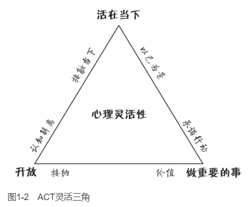
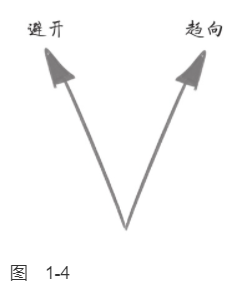
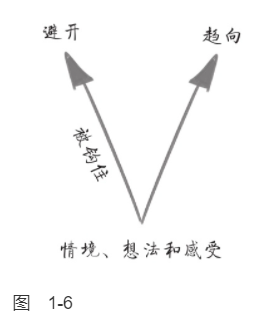
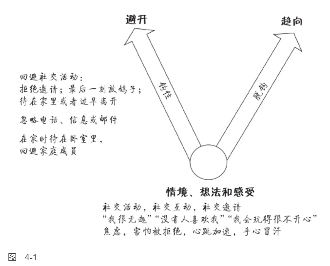
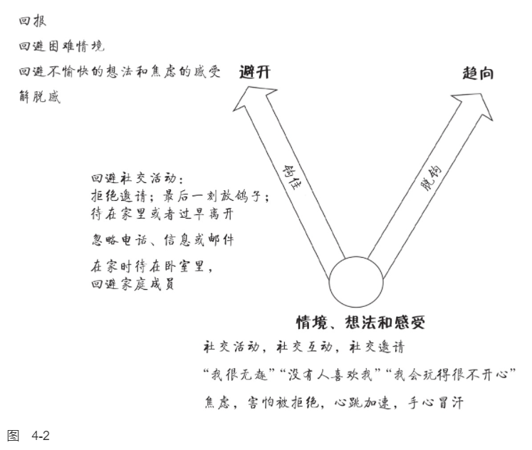
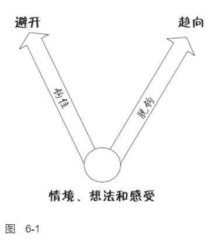
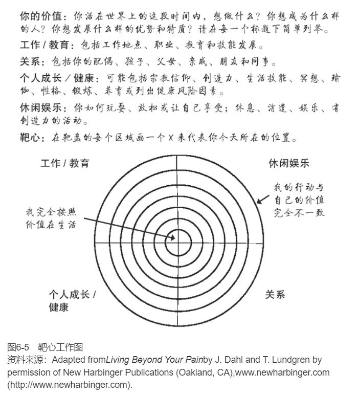

    作者: [澳]路斯·哈里斯
    出版社: 机械工业出版社
    副标题: 接纳承诺疗法简明实操手册(原书第2版）
    原作名: ACT Made Simple
    译者: 王静 / 曹慧
    出版年: 2022-7
    页数: 436
    ISBN: 9787111708575

[豆瓣链接](https://book.douban.com/subject/36009539/)

- [ACT是什么](#act是什么)
  - [人类的挑战](#人类的挑战)
    - [ACT的六个核心治疗过程](#act的六个核心治疗过程)
    - [ACT灵活三角](#act灵活三角)
    - [选择点](#选择点)
    - [选择点、灵活六边形和灵活三角](#选择点灵活六边形和灵活三角)
  - [被钩住](#被钩住)
    - [语言和头脑](#语言和头脑)
    - [认知融合](#认知融合)
    - [有关认知融合与认知解离的简单概括](#有关认知融合与认知解离的简单概括)
    - [有效性](#有效性)
    - [想法和感受不是问题](#想法和感受不是问题)
    - [融合的六大基本类型](#融合的六大基本类型)
    - [经验性回避](#经验性回避)
    - [关于接纳和回避的一个非常重要的观点](#关于接纳和回避的一个非常重要的观点)
    - [融合如何引发经验性回避](#融合如何引发经验性回避)
    - [心理僵化的六大核心病理过程](#心理僵化的六大核心病理过程)
  - [“正念”以及其他含混不清的词](#正念以及其他含混不清的词)
  - [来做ACT极客吧](#来做act极客吧)
- [启动ACT](#启动act)
  - [问题是什么](#问题是什么)
    - [从ACT的视角看问题](#从act的视角看问题)
    - [建立治疗的行为目标](#建立治疗的行为目标)
  - [我从哪里开始](#我从哪里开始)
- [基本要义](#基本要义)
  - [创造性无望是什么](#创造性无望是什么)
  - [放弃挣扎](#放弃挣扎)
  - [抛锚](#抛锚)
  - [注意那个想法](#注意那个想法)
    - [建立联结](#建立联结)
  - [深入认知解离](#深入认知解离)
  - [认知解离自助餐](#认知解离自助餐)
  - [树叶、溪流、云彩、天空](#树叶溪流云彩天空)
  - [“技术过载”及其他风险](#技术过载及其他风险)
  - [活在当下](#活在当下)
    - [僵化注意的代价](#僵化注意的代价)
    - [培养灵活注意](#培养灵活注意)
  - [友善地抱持自己](#友善地抱持自己)
    - [创造你自己的自我慈悲练习](#创造你自己的自我慈悲练习)
  - [知道什么重要](#知道什么重要)

# ACT是什么
## 人类的挑战
>ACT是一种创造性地运用价值和正念技术帮助人们建立丰富而有意义的生活的行为疗法。它基于六个核心过程：价值、承诺行动和四个正念过程，即认知解离、接纳、以己为景、接触当下。我们可以把它们重组为三个更大的过程：活在当下、开放和做重要的事。从技术角度讲，ACT的目的是帮助人们发展心理灵活性：一种专注并投入我们正在做的事情，对我们的想法和感受开放并为之腾出空间，从而在我们的价值引领下有效行动的能力。

在生活中我们每个人都不得不面对的重大挑战是：
1. 生活不易。
2. 完整的人生必然伴随着各种各样的情绪，苦乐参半。
3. 正常的人类头脑会自动放大心理痛苦。

`ACT`（acceptance and commitment therapy）旨在通过以下方式让人们最大程度地发挥潜力来过上丰富且有意义的生活：
- 帮助我们澄清什么是对我们真正重要和有意义的，即澄清我们的价值，并利用这个认知来引导、激励和驱动我们去做那些丰富生活和提高生活品质的事情。
- 教会我们心理技术（“正念”技术），使我们能够有效地处理痛苦的想法和感受，全情投入到当下我们正在做的任何事情中，并欣赏和品味我们生活中充实的方方面面。

### ACT的六个核心治疗过程
ACT中的六个核心治疗过程是接触当下、认知解离、接纳、以己为景、价值和承诺行动。
1. `接触当下（此时此地）`。接触当下意味着灵活地把注意力放到我们正在经历的这一时刻：根据什么是最有用的，来缩小、扩大、转移或维持你的关注点。接触当下应该包括有意识地关注我们周围的物质世界或我们内部的心理世界，或同时关注两者，与我们的体验相联结，并全情投入其中。
1. `认知解离（看见你的想法）`。解离意味着学会“退后一步”并从我们的想法、意象和记忆中脱离或分开。完整的学术名词是认知解离，但通常我们简称为解离。我们退后一步去观察自己的想法，而不是卷入其中。我们看见自己的想法本来的样子，只不过是文字或图片而已。我们只需轻轻地拿着而无须紧紧地攥住它们。我们允许它们引导我们，但不让它们支配我们。
1. `接纳（开放）`。接纳意味着开放，为不想要的个人体验腾出空间：想法、感受、情绪、记忆、欲望、表象、冲动和感觉。我们不是与之抗争，或抗拒、逃避它们，而是对它们开放并为它们腾出空间。我们允许它们在我们的内心自由流动，按照它们自己的安排，想来即来，想在即在，想走即走（只要这有助于我们有效地行动并改善我们的生活）。
1. `以己为景（观察性自我）`。用日常语言来说，头脑中有两个截然不同的部分：一部分是思考，另一部分是观察。当我们谈到“头脑”时，我们通常指的是思考部分——产生思想、信念、记忆、评价、幻想、计划等。我们通常指的不是“观察部分”：我们的那个部分会觉察任何时刻下我们想的、感受的、感觉的或者做的任何事。在ACT中，它的专业术语叫作：“以己为景。”
1. `价值（知道什么是重要的）`。你在生活中想要主张什么？你想怎么度过你在这个星球上生存的短暂时光？你想如何对待自己、他人以及你周围的世界？价值是身体或心理活动的理想品质。换言之，它们描述了我们希望在持续发展的基础上如何表现。我们经常把价值比作指南针，因为它们给我们指引方向，指引我们的人生旅程。
1. `承诺行动（为所当为）`。承诺行动意味着要在我们的价值指导下采取有效行动。它包括身体活动（我们用身体做什么）和心理活动（我们在内心世界做什么）。

如图1-1所示，称之为“ACT灵活六边形”（ACT hexaflex）。

### ACT灵活三角
这六个核心过程可以合并成我所说的灵活三角，灵活三角由三个功能单元组成，如图1-2所示。
1. `以己为景`（也称为`观察性自我`）和`接触当下`都涉及灵活地将注意力分配和投入到当下的体验中去（换言之，“活在当下”）。
1. `认知解离`和`接纳`是指与我们的想法和感受分开，看见它们的真实面目，并为它们腾出空间，允许它们按照自己的节奏自由来去（换言之，“开放”）。
1. `价值`和`承诺行动`包括发起并坚持能够提高生活品质的行动（换言之，“做重要的事”）。

因此，我们可以把心理灵活性描述为“活在当下、开放和做重要的事”的能力。

### 选择点
`选择点`是一个工具，它可以快速地描述问题，确定痛苦的来源，并形成处理问题与痛苦的ACT方案。我们可以在治疗的任意阶段引入它，也可以将它用于许多不同的目的。我通常是在新来访者的首次治疗的中段，作为知情同意（见第5章）的一部分来第一次介绍它。通常，它会这样进行：

治疗师：你同意我花点时间来画点东西吗？就是能帮助我们有效合作的路线图。（治疗师拿出一支笔和一张纸。）这样，你和我，以及这个星球上的任何其他人，我们总是在做一些事情。我们吃、喝、走、说、睡、玩……总是在做事情。即使我们只是盯着墙看，那也是在做事情，对吧？我们所做的一些事情是极为有用的，它们帮助我们趋向更好的生活。所以我称之为`“趋向”（towards moves）`。趋向主要是指那些如果我们在这里的合作成功的话，那你会想要开始做或更多去做的事情。

治疗师在说的同时，画了一个箭头（见图1-3），并写上“趋向”。

治疗师继续说：所以当我们趋向时，这意味着我们正在有效地行动，像我们想成为的人那样行动，去做那些可能使生活更有意义和更圆满的事情。问题是，这不是我们全部的行为。我们还会做效果相反的其他事情：它们会让我们远离我们真正想要的生活。所以我喜欢把这类行为叫作`“避开行为”（away moves）`，当我们避开时，意味着我们在无效地行动，不像我们想成为的人那样行动，做的事情从长期来看往往会让生活更糟。所以基本上，如果我们在这里的合作成功的话，“避开行为”是你将停止或少做的事情。

治疗师一边说，一边画了第二个箭头（见图1-4），然后写上“避开”。

治疗师继续说：这适用于我们所有人，是不是？一天下来，我们都会做出趋向和避开的选择，而且总是在时刻切换。而当生活不太艰难，当事情进展尚可，当我们得到了生活中想要的东西时，做出趋向的选择就会容易很多。但正如你所知的那样，生活中大部分时候都不是这样的。生活很艰难，很多时候我们得不到想要的。所以一天下来，我们总会遭遇各种困难情境，而令人痛苦的想法和感受都会出现。

在图1-5的底部，治疗师写上“情境、想法和感受”。（注：在本书中，“想法和感受”一词被用作想法、感受、情绪、记忆、欲望、冲动、图像和感觉等的简写。所有的个人经验都可以在选择点上被提及或写下来。）

治疗师继续说：问题是，我们中绝大多数人的惯常反应是当这些令人痛苦的想法和感受出现时，我们倾向于被它们“钩住”。它们在某种程度上把我们钩住，让我们卷进去，摆布我们，并且拖着我们到处走。

治疗师在“避开”箭头旁边写上“被钩住”（见图1-6）。

治疗师继续说：所以每个人或多或少都会做一些这样的事情，这很正常。没有人是完美的。但如果这类事情经常发生，就会产生很大的问题。事实上，几乎每一个我们所知道的心理问题——焦虑、抑郁、成瘾，凡是你能想出来的都可以归结为一个基本的过程：我们被痛苦的想法和感受钩住，并且开始避开。

然而，有时我们能够从这些痛苦的想法和感受中脱钩，转而采取趋向行为。我们在这类事情上做得越好……呃，生活就越美好。

在说这些的时候，治疗师在“趋向”箭头旁边写上“脱钩”（见图1-7）。

继续说：所以当我们处于这些充满挑战的情况下，这些痛苦的想法和感受出现时，对我们来说，这里就有一个选择机会：我们将如何应对？我们越是被钩住，就越有可能采取避开行为；但我们越能脱钩，就越容易采取趋向行为。

治疗师继续说：所以如果我们想做好这个（指着“趋向”箭头），我们就需要做两件事：学习一些脱钩技术，以及弄清楚我们想采取什么样的趋向行动。一旦这一切就绪，我们就有更多的选择来应对生活给我们带来的所有困难。这基本上就是这种疗法的全部：学习如何与这些东西脱钩（指着“想法和感受”），减少这些事情（指着“避开”），帮助你更好地做这些事情（指着“趋向”）。

现在，我只想标示出三个要点：
1. 选择点包括外显行为和内隐行为。在ACT中，我们把行为定义为“一个完整个体所做的任何事情”。这包括`外显行为`，如吃、喝、走、说话、观看《权力的游戏》等。外显行为基本上是指身体行为：你用胳膊、腿、手和脚采取的行动；面部表情；你所说、唱、喊或嘟囔的一切；你如何走路、吃、喝、呼吸；你的身体姿势等。然而，“行为”一词也指`内隐行为`，这基本上是指心理行为，如思考、专注、表征、正念、想象和回忆。例如，内隐的避开行为可能包括思维反刍、担忧、注意力分散、不投入、强迫思维，而内隐的趋向行为可能包括认知解离、接纳、重新集中注意力、投入、制定策略和做计划。
2. 要由来访者自己定义什么是避开行为。在治疗早期，来访者可能会将自我妨碍或自我毁灭行为视为一种趋向。例如，一个酒精或赌博成瘾的来访者最初可能会将饮酒和赌博归类为趋向。如果这样，我们也不要和来访者争论这个问题。我们只需要花点时间澄清一下：“我能不能确定一下我们对这些术语的理解是一样的？避开行为是那些如果我们在这里的合作成功了，你想停止或减少的行为，而如果我们在这里的合作成功了，你想开始做或多做的就是趋向行为。”如果来访者仍然将自我妨碍的行为标记为“趋向行为”，那么我们认可这一点，并将其写在趋向箭头旁边。为什么？因为这是来访者的生活掠影——他当下的所见所感，而不是治疗师该如何看待。我们的目标是了解来访者的世界观，了解来访者的自我觉察水平：来访者认为什么是问题，什么不是。在以后的治疗中，一旦来访者有了更高水平的心理灵活性，我们就可以回到这种行为上并重新评估：“你第一次来见我时，你把赌博归为一种趋向行为，现在你还这样认为吗？”通常，随着治疗的推进和来访者心理灵活性的发展，他会改变主意，将自我妨碍的行为归类为避开行为，特别是当他意识到它正在妨碍其他重要的生活目标时。
3. 任何行为都可以是“趋向行为”或“避开行为”，这取决于语境。当我主要是为了避免去健身房或为了拖延一些其他重要的工作而看电视时，或者当我为了逃避无聊或焦虑而不走心地吃了一块巧克力时，我会把它们归类为“避开行为”。但当我把电视作为一种有意识的、价值引导的选择来丰富我的生活时（例如追《行尸走肉》的最新一集），或者作为与朋友庆祝活动的一部分，我用心地吃巧克力，品味其滋味时，我会把它们归类为“趋向行为”。

### 选择点、灵活六边形和灵活三角
灵活六边形和灵活三角进程如何对应到选择点上（见图1-8）。
- `脱钩技术`是指ACT中的四个正念核心过程：认知解离、接纳、以己为景和接触当下。我们可以利用这些过程的任意组合让自己从痛苦的想法和感受中解脱出来，减少它们对外显行为和内隐行为的影响和冲击。
- `“趋向”`指的是身体上的和心理上的由价值引领的承诺行动。
- `“钩住”`指的是认知融合和经验性回避这两个核心过程，ACT认为这两个过程是造成我们大部分心理痛苦的罪魁祸首。认知融合基本上意味着我们被我们的认知“支配”。经验性回避是一种持续的挣扎，以回避或摆脱我们不想要的想法和感受。

## 被钩住
>ACT模型是建立在有效性这一核心概念之上的：你正在做的事情会让你的生活更丰富、更充实吗？ACT的主要病理过程是认知融合，分为六大类：过去、未来、自我概念、理由、规则和评判。融合会产生很多问题，其中最常见的一种是经验性回避，因此，当我们在选择点中使用“被钩住”这个词时，它既指融合又指经验性回避。
>
>核心病理过程包括认知融合、经验性回避、僵化的注意、远离价值、无效行动、与自我概念融合，这些过程在所有人类身上都会或多或少地存在，这就是ACT适用于所有人的原因。

### 语言和头脑
人类语言是一种高度复杂的符号系统，包括文字、图像、声音、面部表情和身体姿势。人类的语言应用分为外显和内隐两大领域。外显语言的表现方式包括讲话、交谈、比画、姿势、书写、绘画、雕刻、唱歌、跳舞等。而内隐语言包括思考、想象、做白日梦、计划、表征、分析、担忧、幻想等。

“头脑”一词指的是一组极其复杂的交互式认知过程，包括分析、比较、评估、计划、记忆、表征等。所有这些复杂的过程都依赖于一套我们称之为人类语言的复杂符号系统。因此，在ACT中，当我们使用“头脑”这个词时，我们将其用作“人类语言”的隐喻。

### 认知融合
`认知融合`，通常简称为融合，基本意思是我们的认知在以一种自我挫败的或有问题的方式支配我们的行为（外显的和内隐的）。换句话说，我们的认知会对我们的行为和意识产生负面影响。

只有来访者在治疗前已经知道这个术语，我才直接用“融合”这个词。大多数情况下，我会用“被钩住了”——一个涵盖了融合和经验性回避的有用术语。我们可以谈论我们的想法和感受如何“钩住”我们：它们钩住了我们的注意力，困住我们，摆布我们，拉着我们偏离轨道。

认知融合主要表现在两个方面：
1. 我们的认知以有问题的方式支配身体行为。
2. 我们的认知以有问题的方式支配意识。

ACT中的一个普遍共识是，只有当这一心理过程导致了问题行为或自我挫败的行为时，才应该使用“融合”一词。

例如，如果我“迷失于自己的想法中”会提升生活品质，例如在度假时躺在沙滩上做白日梦，或者为了重要的演讲于适当的时间在心里进行排练，我们称之为“全神贯注”而不是融合。

### 有关认知融合与认知解离的简单概括
当我们与一种认知融合时，它就像：
- 我们必须遵守、屈从或遵循的某些东西；
- 我们需要避免或摆脱的一种威胁；
- 极为重要的必须占据我们所有注意力的某些事情。

当我们认知解离时，我们可以看到它本来的样子：一组“我们头脑中”的文字或图像。我们可以认识到它：
- 不是我们必须遵守、屈从或遵循的某些东西；
- 绝对不是对我们的一种威胁；
- 可能重要也可能不重要——我们可以选择对它分配多少注意力。

### 有效性
整个ACT模型依赖于一个关键概念：`有效性（workability）`。请将有效性这个词刻入你的大脑皮层，因为它是我们所做的每一次干预的基础。为了明确有效性，我们会问这个问题：“从长远来看，你现在的行为能否给你想要的生活？”如果答案是肯定的，那么我们说这是“有效的”，那就无须改变。如果答案是否定的，那么我们说它“无效”，此时，我们需要考虑更有效的替代方案。

当我们使用有效性的基本框架时，我们永远不需要将来访者的行为评价为“好”或“坏”、“正确”或“错误”；相反，我们可以不带评判地、充满关怀地问：“这是否会带给你想要的生活（对于带给你想要的生活，这是否有效）？”同样，我们也绝不需要把想法视为非理性的、功能失调的或消极的，也不需要去争论它们是真是假。相反，我们仅需要提出如下问题：
- 从长远来看，如果你让那个信念/想法/规则贯穿你的生活/决定你做什么/指导你的行动，它是否有效？
- 如果你被这些想法卷进去/钩住，这有助于你做想做的事吗？
- 如果跟着这些想法走，这会帮助你成为你想成为的人吗？

### 想法和感受不是问题
想法和感受本身不是问题，只有当我们以僵化、不灵活的方式，比如融合和回避，来回应它们时，它们才会带来有问题的结果。

在融合和（过度）经验回避的语境下，想法和感受很容易走极端或使生活扭曲。但是，如果我们灵活地用认知解离、接纳、以己为景和灵活注意来回应它们，那么在这个正念的新语境中，同样的想法和感受会带来不同的结果。当然，它们可能仍然是痛苦的或不愉快的，但它们不再具有损害幸福或生活质量的功能。

### 融合的六大基本类型
临床上有六大类融合需要探寻：与过去、未来、自我概念、理由、规则和评价的融合。

`与过去融合`。这一类是指所有基于过去的认知类型，包括：
- 思维反刍、后悔和沉浸在痛苦的记忆中（例如，关于失败、伤害和丧失）。
- 对过去事件的抱怨和不满。
- 理想化过去：在XYZ发生之前，我的生活曾经很美好。

`与未来融合`。这一类是指所有基于未来的认知类型，包括：
- 担忧、灾难化。
- 假设最坏结果、绝望感。
- 对失败、被拒绝、伤害、丧失等的预期。

`与自我概念融合`。这一类是指所有关于自我描述和自我评价的认知类型，包括：
- 消极的自我评判：我坏、不可爱、一文不值、肮脏、残缺、一无是处、支离破碎。
- 积极的自我评判：我总是对的，我比你好。
- 过度认同一个标签：我是边缘人，我抑郁了，我是酒鬼。

`与理由融合`。人类极为擅长“找理由”：关于我们为什么不能改变、不会改变甚至不应该改变的理由随时会浮现出来。这一类包括所有诸如此类的理由。我不能做X（重要行动），因为……
- 我实在太Y（Y = 抑郁、累、焦虑等）。
- Z可能发生（Z = 糟糕的结果，如失败、被拒绝、让自己看起来像个傻瓜等）。
- 这毫无意义，太难了，太可怕了。
- 我是B（B = 边缘人、害羞的、废物或其他自我概念）。
- C说我不应该（C = 父母、宗教、法律、文化信仰、工作场所要求等）。

`与规则融合`。这一类包括所有我认同的“规则”，是关于我、他人或世界应该是怎样的。规则通常可以通过诸如“应该”“不得不”“必须”“应当”“对”“错”“公平”或“不公平”这样的词来识别。并且它们常常给出限制条件，例如“直到……之前不能……”“不应该……除非……”“绝对不能……因为……”“为了……必须这样”“不能容忍，或不予准许”。下面是一些例子：
- 我绝对不能犯错误。
- 她先改变，我才改变。
- 当我有这种感觉时，我不能去上班。

`与评判融合`。这一类是指任何类型的评判或评估，无论是积极的还是消极的，包括对以下方面的评判：
- 过去和未来。
- 自我和他人。
- 我们自己的想法和感受。
- 我们的身体、行为、生活。
- 世界、地方、人、物、事以及几乎任何东西。
这六种融合类型相互重叠，很容易交织成一种这样的复杂叙事：因为坏事发生在我身上（过去），我受到了伤害（自我概念、评判），这意味着我不能做X（找理由），否则我就永远无法拥有Y（未来）。

### 经验性回避
让我们来考虑一下经验性回避是如何增加痛苦的。`成瘾`就是一个明显的例子。许多成瘾状况是为了回避或摆脱不想要的想法和感受，如无聊、孤独、焦虑、内疚、愤怒和悲伤。在短期内，赌博、毒品、酒精和香烟可能会帮助人们暂时回避或摆脱这些感受，但随着时间的推移，它反而会产生巨大的痛苦和折磨。

从长远来看，我们花在摆脱不想要的个人体验上的时间和精力越多，我们在心理上遭受的痛苦可能就越大。

### 关于接纳和回避的一个非常重要的观点
在ACT中，我们并不主张在任何情况下都接纳所有的想法和感受，这不仅十分僵化，并且完全没有必要。ACT在以下两种情况下提倡经验性接纳：
1. 当对想法和感受的回避受到限制或不可能时。
2. 当对想法和感受的回避是可能的，但长期来看，使用的方法会使生活更糟时。
如果经验性回避是可能的，并且回避有助于你按照价值生活，那就去做吧。

### 融合如何引发经验性回避
如果`经验性回避`变得过度，那么很大程度上是因为与两类想法的融合：`评判`和`规则`。我们的头脑把痛苦的想法和感受评价成“坏的”，并为之形成规则“我必须摆脱它们”！这通常比我们有意识的思考速度更快。一旦痛苦的想法和感受出现，我们就立刻开始试图回避或摆脱它们。（因此，将过度的经验性回避视为与这条规则（这些想法和感受是糟糕的，所以我必须摆脱）融合的副产品，可能会对你有帮助。）

综上所述，融合是ACT中最重要的病理过程，经验性回避是融合可能引起的诸多问题之一。所以，如果你曾经在做个案概念化时试图确定“这是融合还是回避”，那么答案通常是：两者都是！例如，一位来访者可能既会因为渴望而回避焦虑（经验性回避），又会因为与“我需要啤酒”的融合而饮酒。

这两个过程之间的重叠就是我使用术语“钩住”来指代融合和回避的原因。为了证实这一点，我经常提到两种不同的被钩住模式：自动化模式和回避性模式。

- `自动化模式（automatic mode）`是指在一种融合的状态下，我们自动地服从我们的想法和感受，我们做认知让我们去做的任何事情。我们与愤怒的认知融合，我们就咄咄逼人。我们与焦虑的认知融合，我们就畏首畏尾。我们与我们的欲望和渴望的认知元素融合，我们就去做它们急于让我们做的任何事情，比如吸毒、吸烟、暴饮暴食等。
- `回避性模式（avoidance mode）`是指在一种融合的状态下，我们尽一切可能回避或摆脱不想要的想法和感受。支配我们行为的是努力回避或摆脱这些痛苦的内心体验。换句话说，就是经验性回避。

### 心理僵化的六大核心病理过程
如图2-3所示，ACT的核心病理过程是：融合、经验性回避、不灵活的注意、远离价值、无效的行动以及与自我概念的融合。

`融合`意味着我们的想法支配着我们的身体行为和意识，并且达到了一种有问题的程度。例如，在抑郁的状态下，来访者可能会融合各种无用的想法：我很差劲，我不值得更好的，我无法改变，我将会一直如此，生活很糟糕，这一切太难了，治疗没用，这一切永远都不会有起色，当我有这种感觉时我就无法起床，我太累了以致什么都做不了。他们也常常与那些痛苦记忆融合在一起：拒绝、失望、失败或虐待。（与某一记忆的极度融合（到了那种好像这件事此时此刻真的正在发生的程度），通常被称为“闪回”。）在临床抑郁症中，融合常常表现为担忧、思维反刍、试图弄明白“我为什么会这样”，或者持续的负面评论：这个聚会糟透了；我宁愿躺在床上；留在这里究竟有什么意义，他们都那么开心；没人真的想要我待在这里。

`经验性回避`，持续地企图摆脱、回避或逃离不想要的个人体验，如想法、感受和记忆，是接纳的反面。抑郁的来访者通常很努力地回避或摆脱痛苦的情绪和感受，如焦虑、悲伤、疲劳、愤怒、内疚、孤独、困倦等。让我们举一个常见的社交退缩的例子。你的来访者正打算去参加她最好的朋友的生日派对，但随着时间的临近，她融合了诸如此类的想法，比如我很无趣，我是个累赘，我跟别人没什么可聊的，我不会享受到乐趣，我太累了，或者我不想被打扰，再加上最近那些不顺利的社交活动中的痛苦回忆。她感到焦虑，而且随着时间的推移，这种感觉变得越来越强烈，直到她完全被恐惧吞噬。所以她打电话给她的朋友，说她生病了，不能去了。在那一刻，她松了一口气：所有那些痛苦的想法和感受顿时烟消云散了。当然，这种解脱不会持续太久。过了一会儿，她又开始自怨自艾了：看啊，我真是个废物！甚至不能去参加我最好朋友的派对。但那短暂的解脱感，从恐惧中暂时的逃离，正在被高度强化。这加剧了她未来社交退缩的可能。

融合和回避是齐头并进的。我们的来访者融合了各种痛苦的认知（如思维反刍、担忧、自我批评或失败和失望的记忆），同时试图回避或摆脱它们（如通过药物、酒精、香烟、电视或睡觉）。

`接触当下`，或灵活注意，指与你的内外两个世界都进行充分的、有意识的接触，并基于有用与否来缩小、扩大、转移或维持你的关注点的能力。与之相反，`僵化的注意`指的是这种能力的不同形式的缺失，特别是“三D”开头的“三不”：不专注（Distractibility）、不投入（Disengagement）和不联结（Disconnection）。

- `不专注`是指难以将注意力持续集中在手头的任务或活动上，注意力很容易转移到其他无关的刺激上。在任何任务或活动中，我们越是分心，我们的表现就越差，满意度也就越低。
- `不投入`是指当我们意识上缺乏兴趣或并没有沉浸在自己的体验中时的各种各样的情况：走过场，做事情心不在焉，自动化，在一种无聊的、不感兴趣的或神情恍惚的状态中。
- `不联结`这个术语是我用来描述一种与我们自己的想法和感受缺乏有意识的联系的状态。如果我们不能注意自己在想什么或者我们的感受是什么，那么我们就缺乏自我觉察，因此以适合的方式来改变我们的行为就会难上加难，我们就容易情绪失调和进行冲动的、反应性的或无意识的行为。

`远离价值`：当我们的行为越来越受到融合和经验性回避的驱使时，我们的价值往往会被丢失、被忽视或被遗忘。如果我们不清楚自己的价值，或者无法与之接触，我们就不能用它们为我们的行动进行有效引导。例如，抑郁的来访者经常会与他们的价值失去联结，这些价值包括：关爱、联结、奉献，富有成效和乐于助人，自我关爱，玩耍，亲密，可靠，等等。

在ACT中，我们的目标是使行为越来越多地受到价值的引领，而不是被融合或回避控制。

术语`“无效行动”`（或“避开”）描述了拉着我们远离正念的、有价值的生活的行为模式。这些行为包括冲动的、反应性的或自动化的行为（与正念的、深思熟虑的或有目的的行为相反）；由融合或经验性回避（而不是价值）持续激发的行为；或当需要有效行动时却不作为或拖延。抑郁症（以及许多其他障碍）患者中无效行动的常见例子包括：嗑药或过度饮酒；社交退缩；停止以前感到愉悦的活动；睡觉、看电视或沉迷游戏以及企图自杀。

我们都有一则关于我是谁的故事。这个故事是复杂的和多层次的。它包括客观事实（如姓名、年龄、性别、婚姻状况、职业）、对我们的身份角色的描述和评估、我们的长处和短处、我们的好恶、我们的希望、我们的梦想和抱负。如果我们轻松地对待这个故事，那么它就可以帮助我们定义我们是谁，以及生活中我们想要什么。

但当我们`与我们的自我概念融合`时，似乎所有这些有关自我描述的想法就成了“我是谁”的本质内容。我们就会失去这样的能力：退后一步，看到这些自我概念无非是一种复杂的认知结构，一幅由丰富的文字和图像织成的锦缎罢了。

抑郁症来访者通常会融合一种非常消极的自我概念：我不好、一文不值、无可救药、不讨人喜欢等。然而，你也有可能融合的是“积极的”元素，例如，我是一个坚强的人，我本不应该这样反应的，我是一个好人，为什么这会发生在我身上。

## “正念”以及其他含混不清的词
`正念`是一套致力于有效生活的心理技术，包括在开放、好奇、友善和灵活的心态下保持专注。
1. 正念指的是一整套技术的组合，它涵盖了以下所有内容：从接纳痛苦的感觉到品味愉悦的体验，从温柔地观察你的想法到在崩溃的情绪中稳定自己。（正如你在阅读第1章时所知道的，在ACT中“正念”一词是指认知解离、接纳、接触当下和以己为景四个心理过程的任意组合，以及任何或所有能够用以支持和加强这些过程的技能、方法、实践、工具和技术。）
2. 正念是一个注意力集中的过程，而不是一个思考的过程。它让你关注自己的体验，而不是陷在你的想法中。
3. 正念涉及一种特殊的态度——一种开放和好奇的态度。即使你这一刻的经历是困难的、痛苦的或不愉快的，你也可以对它开放，对它充满好奇，而不是逃避或与之对抗。
4. 正念涉及注意力的灵活性——有意识地拓宽、缩小、维持或重新定向你的注意力的能力。这样你就可以根据需要来关注你在此时此地体验到的不同方面。
5. 正念的关注点包括友善的品质。不是科学家解剖老鼠时那种冷酷无情的临床关注，而是像慈爱的父母给予孩子的温暖、体贴的关注。

你会发现，每一个单独的正念练习，从一个10秒的ACT技术到一个10天的止语冥想静修，都有一个基本的操作：`“观察X”`。

“观察”一词的常见替代词包括“察看”“注意”“专注于”“觉察到”或“把你的觉察带入”。我们所观察的“X”可以是此时此地的任何事物：一个想法或一点感受、一种感觉、欲望或记忆；我们的身体姿势；我们的行为；我们能看到、听到、触摸、品尝或闻到的任何东西。X可能是从窗户看到的风景、爱人脸上的表情、洗热水澡的感觉、巧克力的味道、系鞋带的动作、肺部的运动或者房间内听到的声音。

有时，我们可能想拓宽我们的注意范围，例如，如果我们在乡村散步，我们就想将所有的风景、声音和气味都尽收于心。其他一些时候，我们可能想缩小注意力范围：如果我们在倾盆大雨中开车，我们就希望全神贯注于道路上，而不是与乘客聊天或者环顾四周来欣赏风景。有时，我们可能想把注意力引向想法、感受和感觉所在的内在世界；另一些时候，我们想把注意力引向我们身边的外在世界；还有很多时候，我们想把注意力同时引向两个世界，即根据环境的要求，把注意力从一个事物自由地转移到另一个事物上。这种能力在学术上被称为“灵活注意”。

“冥想”和“正念”澄清一下：它们不是一件事，两者不一样。首先，正念并不一定是指正式的冥想练习，例如观呼吸或身体扫描。当然，有时候它就是这个意思，但它也指一个更广范围内的正念技术、工具和练习，这与正式的冥想几乎没有，甚至是根本没有相似之处。

我们还要记住，冥想本身有许多不同类型的风格和实操方式，其中一些与正式的正念冥想也是极其不同的。例如，在某些类型的冥想中，目标是“从头脑中清空所有的念头”。这与正念冥想恰恰相反，在正念冥想中，你并不期望“头脑将被清空”，反之，你会对不断出现的各种念头持开放态度并对其感兴趣。

很多人把正念和佛教或冥想混为一谈，还有人把它与积极思考、放松或转移注意力相混淆，或者把它看作摆脱不想要的想法和感受的一种方法。正如我们已经探讨过的，正念（至少在ACT里的正念）与以上几种说法毫无关系。所以贯穿本书，我都将鼓励你用其他的词来代替：“脱钩”“投入”“抛锚”“专注于任务”“扩展”等。我会鼓励你和来访者澄清你到底在教授什么样的技术（也就是说，不要只是含糊其词地称之为“正念”），以及它可能如何帮助他们解决问题。

## 来做ACT极客吧
`功能语境主义`是奠定ACT模型基础的科学哲学。它是要考察在不同的语境中行为是如何发挥功能的，因此而得名。当我们问“这个行为的功能是什么”时，我们的意思是：“在这种情境中，这个行为会有什么影响？它会实现什么结果？”为了澄清这一点，让我们想象现在有五个不同的人，分别处于五种不同的情境中，每个人都在用一把锋利的刀来割自己的手臂。现在看看你是否可以为此行为设想出五种可能的功能。

以下是某些可能的功能：
- 引起注意
- 自我惩罚
- 缓解压力
- 从痛苦的情绪中转移出来
- 身体艺术创作
- 让你在“完全麻木”时能有所感觉
- 企图自杀

注意在所有这些情境下，行为方式都是相同的——用刀割手臂，但是行为的功能或行为在此情境下的效果，是不同的。现在，让我们假设你的朋友正陷入沉思，而你想要引起他的注意。想出可以达到这种效果的五种不同的行为方式。

以下是一些想法：
- 向他挥手
- 喊：“嗨，有人吗？”
- 把一杯水浇到他头上
- 大声地敲家具
- 说：“请注意一下我好吗？”

在这个例子中，你能看到很多不同的行为方式都具有同样的功能：在这种情境中，它们的效果都是引起注意。在功能语境主义中，我们对于一个行为的功能（它起到的效果）的兴趣，要比对这个行为本身形式的兴趣多得多。例如，当我们运用选择点时，我们就是在不断地分析来访者在他的生活语境中所表现的行为的功能（对于“语境”的意思，我们很快就会进行更多的说明）。我们会询问，它的功能是趋向还是避开。这让我们可以从一种毫不评判的视角来看待来访者的行为，而不是去评估它是好是坏、是对是错、是积极还是消极，我们只是从有效性的角度去看它。谨记：如果你行为的功能，是有效地帮助你过上你想要的生活，那么它就是有效的；如果它的功能相反，那么它就是无效的。

所有的行为都发生在一个语境当中。专业术语`“语境”`的意思是所有能够影响我们正在分析的行为的东西。这可能包括：
  -情绪、感受、心情
- 认知事件（想法、信念、态度、假设、计划）
- 认知过程（注意、记忆）
- 人际因素（还有谁在场，你与他们曾经的关系）
- 社会和文化事件（公共假期、传统庆典和仪式）
- 物理环境（地点、家具陈设、天气、时间、温度、味道）
- 基因和遗传外因素
- 生理状态，如干渴、饥饿和疲劳
- 药品、酒精和食物的使用
- 身体健康或疾病
- 社会和文化状态（社会阶层、地位和等级，同辈团体）
- 发展史和学习经历，包括依恋类型

我们可以方便地把任何语境分成两大影响类别：`前因`和`后果`。

`前因`是触发问题行为的因素，也就是说，问题行为是紧接着它们发生的，它们给问题行为的出现做出了提示。临床上，我们主要聚焦的前因是情境、想法和感受。正如下图所阐述的那样，当运用选择点时，前情永远放在底部。在这个例子中，任何形式的社交退缩都是避开。如图4-1所示，这类行为会有很多可能的前情。

通俗来讲，我们可以说我们的每一个行为都有回报（带来某种利益或收获）和代价（某种不利的结果）。

如果假以时日，一种行为的代价是导致这种行为减少或者停止，那么我们的专业术语称之为`惩罚性后果（punishing consequences）`。例如，如果来访者取消了一场社交活动，但是余下的夜晚时光他感到无比孤独和痛苦，因此他开始不那么频繁地取消社交活动，那么从技术上说就是一种惩罚性后果。

如果假以时日，一种行为的回报是导致这种行为持续或者增加，那么我们的专业术语称之为`强化性后果（reinforcing consequences）`。例如，如果来访者取消了一场社交活动，并且这么做让他有了巨大的解脱感，因此他开始更多地取消社交活动，那么这就是一种强化性后果。

在选择点上把代价和回报都包含进去，通常很有用。例如，在接下来的图4-2中，为了帮助来访者理解为什么他会一直有问题行为（如，是什么强化了它），治疗师在图上方加入了回报。

用这种方式标注出一种行为的前情和后果，通常是非常有用的，特别是当一位来访者说“我不知道为什么会一直这么做”时。这种标注的专业术语是`功能分析（functional analysis）`，更好玩的叫法是功能定点（function spotting）。当我们带着来访者一起经历这个过程时，能帮助他快速觉察，并将一些有价值的领悟带入他的行为中：是什么触发了它（前因）以及什么让它一直持续（强化性后果）。

与此同时，这种方式还为临床干预提供了一个完美的跳板。例如，在上面的图中，我们很容易就能识别出要用认知解离来应对的想法，要用接纳来应对的感受，以及要用由价值引导的问题解决、目标设定、行动计划（如果来访者在社交领域表现极差，那么还将会包括社交技术的训练）来应对的有挑战的情境。

# 启动ACT
## 问题是什么
>本章的重中之重就是尽快建立行为目标，哪怕只是在知情同意阶段提到的模糊的一般性目标。特别是当来访者带着一堆情绪目标出现时，这显得尤为重要。这可能会花些时间，但是它会让你在剩下的治疗过程中轻松很多。

### 从ACT的视角看问题

图的底部和左边概括了几乎所有临床问题和精神障碍的最主要特性：
1. 来访者正在处理一些困难的情境（包括各种各样的健康、关系、经济、法律、医疗、家庭、生活方式和职业问题），并且正在体验各种各样痛苦的想法和感受。（记住：“想法和感受”是所有个人体验的简称，包括情绪、记忆、欲望、冲动和身体感觉。）
2. 当来访者不能对自己的想法和感受灵活回应，带着融合或回避（被“钩住”），长远来看，与价值不一致的自我挫败的行为方式会让他的生活越来越糟（“避开”）。

图的右边提醒我们，我们希望ACT带给我们的是正念的（“脱钩”）和基于价值（“趋向”）的生活。换句话说，我们想发展“脱钩技术”（认知解离、接纳、以己为景、灵活注意），并且采取由价值引导的承诺行动（“趋向”）来创造尽可能丰富、充实和有意义的生活。

有两个关键的问题可以帮助我们从ACT的角度迅速地把任何争议和问题进行概念化。
1. 来访者想转入什么价值方向？
2. 是什么阻碍了来访者转入价值方向？

在这里，我们先来澄清价值：来访者想如何成长和发展？他想培养什么样的个人优势和特质？他想如何表现？他想如何对待自己？他想建立什么样的关系？在那些人际关系中，他想如何对待他人？在生活中，他想主张什么？面对这个充满危机或挑战的环境，他想主张什么？对他来说，生活中哪个领域最为重要？目前与他的价值一致的目标是什么？

这个问题指的是心理障碍：在面对生活挑战时，是什么阻止了来访者的有效行动？心理障碍包括第2章中涵盖的心理僵化的六个过程中的任何一个或全部：认知融合、经验性回避、僵化注意、远离价值、无效行动以及与自我概念融合。

如果我们想快速地对来访者在不同生活领域中的价值有所了解，那么最便捷的方式就是查看`“靶心图”`。它共包括四个领域：工作／教育、个人成长／健康、关系以及休闲娱乐。当来访者第一次填写这个表格时，你很可能对他的价值、渴望、要求、需求和目标有一些综合的了解：为进一步的探索开一个好头。

`“问题分析表”`将来访者的痛苦拆分成四个关键部分：与想法融合、与感受融合、经验性回避和无效行动。

表6-1　问题分析表

|  |   |
| -- | -- |
**钩住你的想法**：你正沉面于或者深陷于哪些与这个问题有关的记忆、担忧、恐惧、自我批评或其他的无用想法中？哪些想法会钩住你、摆布你或让你脱离自已的生活？ |  **榨干生命的行动**：你现在在做的哪些事情从长远来看会让你的生活更糟糕：让你被卡住；浪费你的时间和金钱；榨干你的能量；束缚你的生活；对你的健康、工作或关系有消极的影响；维持或加剧你现在正在面对的问题？|
**钩住你的感受**:哪些情绪、感受、渴望、冲动或感觉会钩住你、摆布你或把你拉入自我挫败的行动中？ |  **回避有挑战的情境**：你正在回避或远离什么样的情境、活动、人或地方？你放弃、从中退缩或退出了哪些情境、活动、人或地方？到目前为止，你一直在“推迟”什么？

### 建立治疗的行为目标
概括而言，有三种目标：

    行为目标=我想做什么
    情绪目标=我想感觉怎样
    结果目标=我想得到或拥有什么

在我们设置ACT的治疗目标时，我们必须注意这个关键差别：

    情绪目标=我想感觉怎样
    行为目标=我想做什么

常见的`情绪目标`包括“从抑郁（或其他精神健康障碍）中康复”“不再感觉那么焦虑”“提高自我价值感”“建立自尊”“解决发生的问题”“找回过去的我”“感到快乐”“感觉良好”“不再感觉这么糟”“更自信”“不再怀疑自己”“感到更平静”“降低焦虑感”“不再那么愤怒”。

这些目标基本上都可以归纳为：

    摆脱我不想要的想法和感受，我想感觉良好！

当然，来访者带着情绪目标，是完全正常的，也是意料之中的。我们都想感觉良好，没人喜欢感觉糟糕。然而，不幸的是，如果我们认可了这样的目标，那就永远没有办法应用ACT了。为什么不行呢？因为情绪目标会强化经验性回避的策略：持续地尝试回避和摆脱不想要的想法和感受。在ACT中，我们着眼于积极地逐渐减少经验性回避，并且让来访者开放地面对一个完全不同的策略：经验性接纳（还可以叫作“愿意”）。所以如果我们认可了情绪目标，我们就不能应用ACT了。

将情绪目标重构成行为目标：

    “学习一项新技术”是一个行为目标。

对于很多来访者来说，我们认可的前期行为目标之一就是“学习新技术来更有效地处理痛苦的想法和感受”。

情绪目标1号
>来访者：我不想做任何改变。我就是想停止这样的感受。我就是想摆脱这些想法／感受／情绪／记忆。
>
>行为目标重构
>
>治疗师：那么看上去，我们的一大部分工作都将是：学习新的技术来更有效地处理这些痛苦的想法／感受／情绪／记忆。

情绪目标2号
>来访者：我只是想感受良好（或快乐、自信、平静、有爱，等等。）
>
>行为目标重构
>
>治疗师：看来你没有感受到你想感受的。你能告诉我，你脑海中出现的是什么样的痛苦的想法和感受吗？（治疗师收集这个信息。）我们现在要做的大部分工作是：学习新的技术来更有效地处理这些痛苦的想法和感受。

情绪目标3号
>来访者：（回答前面重构的问题）我不想处理它们。我只是想摆脱它们！
>
>行为目标重构
>
>治疗师：当然你会有这样的想法。谁不是这么想的呢？它们真的很令人痛苦和难受，而且对你的生活有极其严重的负面影响。那么我们做些工作来尽快改善这种状况吧。你还有其他想通过我们的工作解决的问题吗？

有时候，来访者带来的看上去是行为目标，可实际上只是`伪装的情绪目标`。对于成瘾和冲动行为，这种情况尤其普遍，而且通常它是这种形式：“我想停止这样做。”如果我们透过表层深挖下去，就会发现隐藏的策略是这样的：“摆脱引发这种行为的想法和感受（或欲望、知觉、冲动、强迫、退缩症状），因为只有它们消失了，我才能停止这样做。”这类治疗听上去会是下面这样。

伪装的情绪目标
>来访者：我想停止……（喝酒、抽烟、赌博、暴食、对孩子大吼大叫，等等。）
>
>行为目标重构
>
>治疗师：当然。所以我们的部分工作就是要辨别出引发这种行为的想法和感受（或记忆、欲望、冲动、痴迷、强迫等），并且学习新的技术来更有效地处理它们，这样这些想法和感受就不能再摆布你或者拖你的后腿，逼你去做这些事情了。另一部分工作就是要去探索，如果不做这些，那么你会去做什么。这样，如果你再次进入类似的情境中，你就可以选择去做一些不同的、更有效的事情了。

正如我们一直在讨论的那样，来访者的目标通常是停止某一特定的感受或行为。例如，“我想停止吸毒”“我不想再拖延我的研究了”“我不想再有任何的恐慌发作了”或“我不想再感到抑郁了”。在ACT中，这些目标被称为`“死人”目标（Lindsley, 1968）`。一个死人目标指的是死人比活人做得更好的任何事情。例如，死人永远不会吸毒，不会拖延，不会恐慌发作，也永远不会感到抑郁。

在ACT中，我们想确立的是“活人”目标——活人可以比死人做得更好的事情。为了从死人目标转向活人目标，你可以问以下这些简单的问题。
- “假设你期望的目标实现了，你会做哪些不同的事情？你会开始做什么，或者你会多做些什么？你和朋友或家人在一起时，你会有怎样不同的表现？”
- “如果你不再吸毒，那你会做哪些不同的事情来替代它？”
- “如果你不对孩子大吼大叫，你将会如何与他们互动？”
- “如果你不再感觉抑郁或恐慌发作，那么你在生活中会做哪些不同的事情呢？”

两个能把情绪目标和死人目标转化成行为目标的有用问题是：`魔法棒问题`和`7天纪录片问题`。

`魔法棒问题`：这是一个切入经验性回避的非常好的问题。（注意“对你来说不再是个问题”，这和说“一切都消失了”是完全不一样的。）

治疗师：假设我这里有一根魔法棒。我挥舞这根魔法棒，那些让你一直纠结的想法和感受，对你来说都不再是问题了，就好像鸭子甩掉背上的水那样简单。接下来你将做些什么不同的事情呢？你将开始做些什么，或可能会多做些什么？对待他人，你的表现会有什么不同？在工作中、在家里、在周末，你将会做些什么不同的事情呢？

`7天纪录片问题`：这是一个帮助来访者把他在生活中所要做出的改变更具体化的好问题。

治疗师：假设我们让摄制组跟踪拍摄你一周，拍摄下你做的每一件事，然后编辑成一个纪录片。然后，假设我们治疗结束后，未来某一个时间点还要做这件事。在新的纪录片中，我们看到或听到的哪些东西可以说明我们的治疗是有效的？我们会看到你做什么或者听到你说什么？我们将会看到你对待他人的方式、对待自己的方式、对待自己身体的方式，以及支配时间的方式有哪些不同？

`结果目标`的公式：

    结果目标=我想得到或拥有什么

我们对自己的行为都有很强的控制力，尤其是对我们的外显行为（我们说的和做的）。我们对于自己行为的结果却一点都控制不了，对于我们能否得到我们期待的结果，永远没有任何保证。所以，让我们尽可能快速地把这些结果目标转化成行为目标吧。

结果目标1号
>来访者：我想找到一个伴侣或找到一份更好的工作。
>
>行为目标重构
>
>治疗师：那么我们现在的部分工作就是让你改变做事情的方式，去说或者做一些更有可能增加你找到一个伴侣或一份更好的工作机会的事情。

结果目标2号
>来访者：我想让我的孩子听我的话或我丈夫不再喝酒。
>
>行为目标重构
>
>治疗师：那么我们现在的部分工作就是让你改变做事情的方式，去说或者做一些更有可能有效影响你的孩子或丈夫行为的事情。

结果目标3号
>来访者：我想治愈这种疾病或伤痛。
>
>行为目标重构
>
>治疗师：那么，我们现在有两部分重要的工作：一部分是尽你所能去做所有改善你健康状况的事情，从配合你的医疗团队到照顾自己的饮食和锻炼。另外一部分是考虑到你的疾病或伤痛强加给你的所有困难，尽可能地去做任何能把自己的生活调整到最好状态的事情。

## 我从哪里开始
一般来说，第一次治疗之后，ACT治疗程序会倾向于遵循两条路线中的一条，这两条路线是由以下两个问题引出的。

1. 来访者想转入什么样的价值方向？如果要选择这条路线，接下来的步骤（不一定是这个顺序）通常是：
- 价值澄清
- 目标确定
- 行动计划
- 问题解决
- 技术训练
- 暴露

从选择点方面来说，当我们选择这条路线时，我们聚焦于澄清和对趋向行为的计划。

2. 是什么阻碍了来访者转入价值方向？如果要选择这条路线，接下来的步骤（常常是这个顺序，但不是必须按这个顺序）通常是：
- 将僵化注意导向接触当下
- 将融合导向认知解离
- 将经验性回避导向接纳
- 将自我批评、自我憎恨和自我忽略导向自我慈悲

用选择点的语言来说，上面所有的都是脱钩技术，选出来以匹配来访者特定的避开行为。

在每次治疗中，基于我们对来访者当时需求的评估，ACT灵活三角（图1-2）都是我们很想使用的非常有用的一个直观图形。
- 如果来访者被压垮、离解或极度融合，我们从顶部的活在当下开始：着陆和抛锚。
- 如果我们想帮助来访者开始行动，我们就转移到灵活三角的右边：做重要的事（价值和承诺行动）。我们澄清价值，确定目标，创造行动方案，教授技术。
- 如果来访者被深深卡住，无法动弹，被融合和经验性回避所麻痹，我们就转移到灵活三角的左边：开放（认知解离和接纳）。
- 如果我们在左边或右边（或两边）遇到障碍，我们就回到中心点：活在当下（稳定、抛锚）。
- 如果来访者已经在做重要的事，我们就回到活在当下：我们帮助来访者全情投入到他的经历中，聚焦于他正在做的事情。如果他正在做的事有潜在的乐趣，我们就帮助他学会去欣赏和品味。

当你进入体验性工作时，要围绕ACT灵活三角中描述的三个首要内容：活在当下、开放、做重要的事。
- 想要来访者开始行动：在价值和承诺行动部分做工作（趋向）
- 当来访者被卡住时：在认知解离和接纳方面做工作（脱钩技术）
- 如果你觉得两方面都行不通：在回到活在当下和抛锚方面做工作（更多的脱钩技术）

# 基本要义
## 创造性无望是什么
`创造性无望（creative hopelessness，CH）`
>**通俗表述**：创造性无望是一个过程，在这个过程中，人们意识到，努力去回避或摆脱不想要的想法和感受往往会使生活变得更糟而不是更好。这会导致人们对回避自己痛苦的想法和感受这一惯用方式产生一种绝望感。这种绝望中会浮现出一种创造性的态度，要去寻求新的、不同的方式来应对想法和感受。
>
>**目标**：提高来访者对情绪控制计划（见下文）以及过度经验性回避所付出代价的觉察，使其有意识地认识并承认在这一方面钻牛角尖是无效的。
>
>**同义词**：直面情绪控制计划。
>
>**方法**：我们看看来访者在回避或摆脱不想要的想法和感受时都做了什么，检验这些做法在短期及长期内的效果如何，揭示采取这些策略会付出的所有代价，并探讨它们究竟是会让生活得以改善还是更为恶化。
>
>**何时使用**：当我们知道或怀疑来访者过度地经验性回避，强烈依赖情绪控制计划时：我必须感觉良好；我必须摆脱这些不想要的想法和感受。

在ACT模型中，创造性无望是当我们确实知道或相当确信以下这样的事实时会引入的办法，这个事实就是来访者正紧紧抓住情绪控制计划不放手：我必须控制我的感觉。我必须摆脱那些不想要的、不愉快的、痛苦的想法、感受、情绪和记忆，用美好的、愉快的、令人向往的来取而代之。

适度的经验性回避为什么是没有问题的。但是，当来访者把它当作救命稻草绝望地抓住不放时，经验性回避程度就会提高，而且几乎总是会带来问题。（记住：高度经验性回避与抑郁、焦虑、长期的无力感、工作表现差、创伤后应激障碍、成瘾以及许多其他精神障碍出现的风险直接相关。）

创造性无望之所以得名，是因为我们的目的是在你的情绪控制计划中创造出一种绝望感（这不是让你对你的未来、你自己以及你的生活绝望）。我们的目的是破坏这一手段，这样我们就可以帮助来访者对一种新的手段，即接纳的手段保持开放。

创造性无望很少会是一次性的干预，它通常需要你在一次又一次的治疗回合中去不断回顾。但通常每回顾一次，这个过程就会变得更快且更容易。

`情绪控制策略（emotional control strategies，ECS）`是我们为努力摆脱不想要的想法和感受而首先去做的任何事情：经验性回避主导下的外显行为和内隐行为。情绪控制策略可能包括任何行为，从锻炼、祈祷、冥想到酗酒、吸毒和自杀尝试。（如果锻炼、祈祷和冥想主要是由价值驱动的，那么我们不会称之为情绪控制策略。只有当这些活动的主要目的是回避或摆脱不想要的感受时，我们才会称之为情绪控制策略。）

创造性无望是基于有效性的干预。我们要求来访者仔细地、长时间地、诚实地、专注地察看他的所有情绪控制策略，并看看为此他需要付出什么代价。我们希望他能正视这一现实：他的情绪控制策略通常在短期内起效，会让他感受好一点；但是长远来看，对于让他的生活丰富、充实并有意义，并无效果。

创造性无望有许多不同的操作方法，但它们都可以归结为以下问题。
1. 你曾经尝试过哪些方法？
2. 这些方法的效果如何？
3. 这些方法让你付出了什么代价？
4. 在你身上浮现出了什么？
5. 你愿意尝试新方法吗？

问题1：你曾经尝试过哪些方法

创造性无望干预的第一个问题是：“到目前为止，你做过哪些事情来回避和摆脱那些不想要的想法和感受？”我们通常需要提示来访者去回忆，所以我用首字母缩写DOTS帮助我记住这些回避要点：

- `D=转移注意力（Distraction）`：“你有没有试过从这些感受上转移注意力？你试过哪些方法？看电视？听音乐？出去溜达？让自己忙起来？玩电脑游戏？你有没有试过其他方法来转移你的注意力？”
- `O=临阵脱逃（Opting out）`：“你有没有试过退出、放弃或者远离那些容易引发这些不舒服的想法和感受的场合、活动或人？你放弃或退出了什么样的活动？”
- `T=思考性策略（Thinking Strategies）`：“你是如何试图通过思考来摆脱痛苦的？”与你的来访者一起回顾一些常见的思考性策略：“你有没有试着去想那些比你更惨的人？积极地思考？挑战你的想法或是和你自己辩论？把想法强行挤出你的脑袋？将其最小化？谴责你自己？告诉自己要振作起来或者咬牙坚持？”
- `S=物质滥用和其他策略（Substances and other strategies）`“为了摆脱痛苦，你往自己身体里塞过什么东西？毒品？酒精？处方药？阿司匹林？扑热息痛？咖啡？茶？香烟？百事可乐？比萨？冰激凌？双层巧克力提姆塔？之后我们将探讨的是：“你有没有用过其他的策略来逃避这些感受？你咨询过医生或治疗师吗？读过自助手册吗？尝试过运动、瑜伽、冥想或者改变饮食这类方法吗？自残？自杀？冒险或是做危险的事？找碴打架或是吵架？让自己持续忙碌？规划假期？做家务？祈祷？自责？放弃？咬紧牙关强迫自己继续忍受？扪心自问，我为什么会这样？”

问题2：这些方法的效果如何

在创造性无望干预中，我们要探讨的第二个问题是：“从长远来看，它的效果如何？”我们要确认大部分的情绪控制策略在短期内都能减轻来访者的痛苦，然后我们要富有同情心并不失尊重地问他们：“从长远来看，它们效果如何？这些想法和感受是永久地消失了，还是又回来了？”

这个问题的目的是帮助来访者按点连线：他一直在努力，很努力、非常努力地试图摆脱这种痛苦，他找了无数方法希望在短期内有效，但从长远来看，痛苦会不断地回来！

问题3：这些方法让你付出了什么代价
- 转移注意力的代价：适度而灵活地使用转移注意力这一策略时，几乎完全不是问题，甚至有时会对你很有帮助。但是过度转移注意力的代价是什么呢？我们想问来访者，“你花了多少时间来转移自己的注意力？”“看上去有多少时间是合理安排了，又有多少时间被浪费了呢？”“你花了多少钱在上面？”“这些事情会损害你的健康、工作或人际关系吗？”
- 临阵脱逃的代价：对大多数人来说，最大的代价就是错失良机。我们越是回避重要且有意义的人、地点、情境、活动和事件，我们的生活范围就越小，我们错过的就越多。
- 思考性策略的最大代价之一是一整天一整天地沉浸在思考中，从而错失生命中的美好，不能投入，用自动导航模式做事，或者迷失在“分析瘫痪”中。对大多数来访者来说，另一个代价是浪费时间：所有的时间都花在自己的头脑里，而没有投入到生活中。
- 在健康、工作、福利、财务和人际关系上过度地物质滥用，所付出的代价通常是最容易被来访者识别的。“咬紧牙关，咽下痛苦，强迫自己去做”的代价是不满和耗竭。

问题4：在你身上浮现出了什么

许多来访者会有一种情绪反应，通常是悲伤、愤怒、焦虑或内疚的组合，无论它是什么，我们希望能够对此进行正常化和确认。同时，来访者常常会有一种解脱感，因为我们正在确认他们的体验：他们一直在使用所有这些情绪控制策略，也得到了短期内的解脱，但从长远来看，这是行不通的。

有时候，来访者会与消极的自我评价融合（例如，“我真是个废物”）。

问题5：你愿意尝试新方法吗

## 放弃挣扎
>放弃挣扎的那些隐喻为正式明确地进入接纳部分的工作提供了一个很好的切入点，它们也为创造性无望与愿意之间提供了一座有用的桥梁。

愿意的第一步就是放弃挣扎：停止抗争与逃避我们自己的想法和感受。这一阶段的治疗中主要有两种干预措施。
1. 把挣扎命名为问题；
2. 击破情绪控制的幻想。

挣扎才是问题，而不是解决办法，当一个来访者被试图控制自己感觉的策略钩住时，他会待在一个痛苦不断增加的恶性循环中。

如果我们的目标是给人们赋能，我们就需要帮助他们专注于他们能够控制的事情（见表9-1）。这就是为什么在ACT中，我们帮助人们：
1. 区分可控和不可控的事情到底有什么不同；
2. 不再努力去控制无法控制的东西；
3. 积极地将控制用在他们能控制的东西上（如果这样做有用的话）。

表9-1澄清了这些差异：

掌控之外    |    掌控之内（可能地）
-- | --
我绝大多数的情绪和感受    |    我如何应对我的情绪和感受
我绝大多数的想法    |    我如何应对我的想法
我绝大多数的感觉    |    我如何应对我的感觉
回忆    |    我如何应对我的回忆
我是否得到了我想要的结果    |    为了增加获得我想要的东西的机会，我说了什么或做了什么
我在做手头的事情时感受有多好    |    我在做手头的事情时专注和投入的程度如何
其他人说什么和做什么    |    我说什么或做什么来影响他人
其他人如何评价或看待我    |    我是否表现得像我想成为的那种人一样
未来会发生什么    |    我说任么或做任么来影响未来
过去发生了什么    |    我如何应对关于过去的想法
痛苦的丧失    |    在面对丧失时的自我慈悲
生活是否给了我想要的东西    |    不管生活是否给了我所想要的东西，引领我生活和行动的价值都一直存在
生活中大多数艰难的事情（例如工作问题、疾病、伤痛、所爱的人带来的折磨、自然灾害、经济危机、全球变暖等）    |    在面对生活中的这些困难事件时引领我生活和行动的价值，以及我的自我慈悲程度

放弃挣扎的第一种干预方式是帮助来访者认识到与痛苦的想法和感受苦苦抗争才是问题所在，想法或感受本身并不是问题。

有关放弃挣扎的隐喻：**与怪兽拔河的隐喻**

>治疗师：想象一下你和一只巨大的焦虑怪兽在进行一场拔河比赛。（你可以根据来访者的问题改变怪兽的名字，例如抑郁怪兽。）你拉着绳子的一端，而怪兽拉着另一端。在你们之间有一个巨大的无底洞，你用尽全力向后拉，但是怪兽还是不断地把你拉得离洞口越来越近。在这种情况下，你能采取的最好的办法是什么？
>
>来访者：更用力地拉。
>
>治疗师：嗯，这是本能反应，但是你越用力，怪兽就越用力。你就被困住了。你必须做的究竟是什么呢？
>
>来访者：放开绳子？
>
>治疗师：对，就是这样。当你放开绳子时，怪兽仍然在那里，但是你不会困在与它的苦苦抗争中了。现在可以做些更有用的事情了。

有大量的其他隐喻可以用来说明挣扎本身就是问题所在。你基本上可以用任何方式，只要能传递以下信息：在困境中，你越是遵循自然本能去反应，情况就会越糟。

## 抛锚
>抛锚练习都遵循了重复的三步结构：
>- A——承认你的内心体验
>- C——回到你的身体中来
>- E——融入世界
>
>围绕着这一结构，你可以即兴发挥出数百种不同的练习版本。这种练习会将你转出自动化模式，帮助你与痛苦的想法和感受“脱钩”或为它们腾出空间，提升你的觉察能力，并让你能够有意识地控制自己的行动。这些都让抛锚成了一项非常有用的技术，用于：
>1. “回路切断”，切断你的冲动性、强迫性、攻击性、成瘾性或自我伤害行为的回路；
>2. 打断你的焦虑或思维反刍等认知过程；
>3. 有效地应对令人崩溃的情绪、极端融合和离解症状。

有关抛锚的练习都遵循一个循环往复的三步走结构，你可以用缩写ACE来记住这三步。
- A——`承认你的内心体验（Acknowledge your inner experience）`。在这里，我们的目的仅仅是确认所有的想法、感受、情绪、记忆、感觉和欲望的存在。通常，用语言（无声或大声地）把这些内容表达出来是一种有用的方法，例如，“这是悲伤”“我注意到了痛苦的回忆”“我现在有一种愤怒的感觉”。
- `C——回到你的身体中来（Come back into your body）`。在这里，我们的目的是重新获得自我控制的感觉，在痛苦的想法和感受出现时，把注意力集中在你最有控制力的地方：你的身体行动上。移动，伸展，改变姿势，坐直，站起来，走路，改变你的呼吸，挺直你的脊柱，把你的脚用力踩到地板上，等等。这些能够帮助人们迅速恢复对身体的控制：为任何有效的身体行动迈出了重大的第一步。
- `E——融入世界（Engage with the world）`。在这里，我们的目的是扩展你的觉察：注意你在哪里，你在做什么，你能看到、听到、触摸、品尝或闻到什么。这不是为了转移你对想法与感受的关注，而是为了让你注意到除了这些之外还有什么。

以下是三种典型的适用于抛锚的状况。
1. 来访者想学习一种简单的正念技术时（它可以作为接纳、认知解离、接触当下或以己为景的基础）。
2. 当来访者处于过度融合状态，不能投入或参与到咨询中来时。
3. 当来访者被情绪压垮，有冲动或强迫行为，或者有离解障碍症状时。

**在“天气好时”抛锚**：在这一整天中，只要你意识到自己开始“漂离”，就是说你已经陷入了你的想法和感受中，不能真正专注或投入你正在做的事情，那就抛锚。做一个我们在这里练习过的10秒钟版本的练习：确认任何正在吸引你注意力的想法和感受，然后回到你的身体并掌控身体，观察你周围的世界——你在哪里，你在做什么。接着，把你的注意力重新集中在需要它的地方，这样你就可以做你真正需要做的事情。

抛锚的第一步是承认想法和感受的存在，确认这些想法和感受是极度痛苦的、有所不适的、相对中性的、非常愉悦的，抑或只是一种麻木的感觉。

在这之后，接下来的两步就可以说是没有限制了。为了帮助来访者重新控制自己的身体，你可以邀请他运用正念的方式来喝一杯水，站起来并在房间里走来走去，吃零食，舒展身体，改变姿势，转动拇指，点点头，抓住一个物体（如一本书、一支笔、一种装饰品）并用手指探索表面，触摸他身下的椅子，轻轻地把手放在他的胸口上（这可以转换成一个美好的自我慈悲练习，我们将在第18章中看到它），用舌头舔牙齿，等等。

为了帮助他与这个世界建立联系，你可以让他去观察他能听到、看到、摸到、尝到和闻到的任何东西，他在如何呼吸，如何坐着，他的泪水含在眼中或淌过脸颊的感觉，迎面而来的空气，他脊柱的直立感，他的身体姿势，空调的声音，等等。

**要有创造力**。随心所欲地即兴发挥，只要你能一次又一次地回到承认现在的想法和感受上去。这为什么如此重要？因为我们希望来访者了解到，即使是对最痛苦的想法与感受，他也能够灵活地应对。

## 注意那个想法
>为认知解离“铺平道路”需要5个基本步骤：
>1. 找出“是什么钩住了你”（识别来访者正在融合的认知内容）；
>2. 建立联结（将融合与问题行为联系起来）；
>3. 提供一种新技术（提供认知解离作为上述问题的解决方法）；
>4. 正常化和确认令人痛苦的想法；
>5. 引入一个隐喻来概括融合的问题和认知解离的益处。

`认知解离`
>**通俗表述**：融合意味着你的认知支配你的行为。它们支配着你的行动（外显行为）或你的注意力（内隐行为），抑或两者兼而有之。而认知解离则意味着灵活地回应你的认知，这样，它们就只能影响，但无法支配你的行为。
>
>**目标**：了解认知的真正本质，它们只不过是词语和图片的组合。基于有效性而不是表面效果（即根据这些认知的有用性程度，而不是它们有多么正确或错误，有多么积极或消极），来更灵活地回应认知。
>
>**同义词**：去文字化（deliteralization）（这个词现在很少使用了）；拉开距离（distancing）。
>
>**方法**：带着以下心态关注我们的认知。
>- 好奇心：在词语和图片的组合背后，看到其真正的本质。
>- 开放性：探索它们是否有帮助。
>- 灵活性：如果我们的认知有帮助，那就让它们来引导我们；如果没有帮助，那就顺其自然吧。
>
>**何时使用**：认知支配我们行为（内隐的和外显的）的程度已经到了妨碍我们有效的、基于价值的生活时。

当我们积极开启认知解离工作时，我们需要知道的第一件事是：**是什么钩住了你**

在所有治疗的任意时间点上，我们都可以提出如下问题：
- “你的头脑现在正在告诉你什么？”
- “你的头脑必须对此发表的意见是什么？”
- “你能注意到你现在正在想什么吗？”
- “如果我现在能听到你的头脑在说什么，那我会听到什么呢？”

### 建立联结
我们希望帮助来访者在认知融合与认知融合改变他们行为的方式之间“建立联结”。换句话说，我们想明确那些有问题的认知在支配行为时到底发生了什么：这导致（外显和内隐）行为上有哪些有问题的改变？

在融合和外显行为（行动）之间建立联结的提问可以包括：
- 当你被那些想法钩住时，后面会发生什么？（你会做什么或停止做什么？你的行为是如何改变的？你有什么不同的看法和做法吗？）
- 如果一个摄制组一周7天、一天24小时都在跟拍你，而我后来有机会看到这个视频的脚本，我会看到或听到你在做的什么事说明这些想法已经钩住你了？
- 当这些想法摆布你、耍弄你、左右你、操纵你时，你会有一些什么不同的表现？你开始做什么、停止做什么、多做什么或少做什么？
- 当你陷入、纠结于、迷失在这些想法里时，接下来会发生什么？你会做什么？你会停止做什么或者推迟做什么？
- 当你遵从这些想法行动，让这些想法来指挥你说什么和做什么时，你倾向于做什么？在视频里，看上去或听起来会是什么样子？
- 当你被这些想法钩住时，你和你的伴侣/孩子/朋友/父母/雇主/员工/同事有什么不同？你会说和做哪些不同的事？

通常内隐行为的变化更难识别，所以我们经常需要问“引导性问题”，比如：
当你被这些想法和感受钩住时……
- 你与谁（或什么）切断了联系/分离了/脱开了关系？
- 很难专注于什么（或谁）？
- 很难与谁共度时光/在一起？
- 在哪些重要的事情上，你往往会做得很差或者很容易分心？

请再次阅读这份逐字稿并注意治疗师是如何：
1. 简要地总结融合的主要内容（“是什么钩住了你？”）
2. 明确融合与问题行为之间的关系（“建立联结”）
3. 为学习一项特定的技术提供可能性，以作为融合的解药（从未使用“正念”这一概念）

**“穴居人头脑”隐喻**

>治疗师：嗯，这和人类头脑的进化方式有关系。你看，我们的原始人祖先生活在一个危机四伏的世界里，长着锋利牙齿的大型动物潜伏在每一个角落里。所以在那时候，你的大脑必须时刻对危险保持警惕，以防任何有可能伤害你的事情发生：小心！那个洞里可能有头熊，这个灌木丛里可能有只狼，远处那个人是朋友还是敌人？如果你是一个穴居人，而你的头脑不能很好地完成这项工作的话，你很快就会死掉。这就是我们从祖先那里继承而来的东西，我们这现代的头脑基本上就是一个“不要受伤害呀”的报警机器。它总是因为任何可能伤害你的事情而试图向你发出警报：你会发胖，你会搞砸考试，他可能会拒绝你。这很正常。每个人的头脑都会这样做。这只是我们的大脑在努力完成它的首要任务：保护我们，让我们活着。

我们正在用这个隐喻来传递一个强有力的信息：“你的头脑并没有功能失调，它只是在做所有人类头脑都会做的事情。我们的头脑进化的就是评判和评估、沉湎于过去、担心未来、发现问题、把我们和其他人比较。你的头脑没有缺陷，它只是在尽自己的职责。”

**把手比作想法和感受——扩展版**

这个练习主要是关于融合和认知解离的一个隐喻。如果我们能针对每一位独特的来访者量身定制，那么它的力量就会强大得多。所以我们可以将“所有你关心的人”替换为“你的丈夫迈克尔和你十几岁的女儿莎拉”，诸如此类。

>治疗师：（与来访者并排坐在一起，两个人都面对着房间）想象一下，在你面前的（指着房间里的东西和远处的墙壁）是你内心深处真正看重的一切，是让你的生活有意义的一切（或在过去曾经如此）；所有你爱的人、地方和活动；所有你最喜欢的食物、饮料、音乐、书籍和电影；所有你喜欢做的事情；所有你关心并且想与之共度时光的人。

但不止这些，那里还有你今天需要处理的生活中的所有问题和挑战，比如……（治疗师根据来访者的经历给出一些例子，比如“你与儿子的冲突”“你的财务问题”“你的健康问题”“你的诉讼案”“你在找的工作”“你的癌症化疗”等。）

此外，还有所有你需要做的能让你的生活正常进行的日常事务：购物、烹饪、清洁、驾驶、退税，等等。

现在，请模仿我来做这个练习。让我们把自己的手想象成我们的想法和感受，这样把它们放在一起。（治疗师双手并拢，手掌向上，像一本摊开的书一样。来访者也这样做。）现在，让我们看看当我们被自己的想法钩住时会发生什么。（治疗师慢慢地将双手举向自己的脸，直到双手遮住他的眼睛。来访者模仿他。在开展下一部分练习时，两人都已经把手放在眼睛上。）

现在，注意三件事。
1. 你现在正在错过多少东西？对于你在意的人和物，你已经断开了多少联结，多么不能投入？如果你爱的人就在你面前，你与她断开了多少联结？如果那边的屏幕上正在播放你最喜欢的电影，你又会错过多少精彩剧情呢？
2. 请注意把注意力集中在你需要做的事情上是多么困难。如果现在有一项重要的任务摆在你面前，专注于任务的难度有多大？如果你面前有一个需要你解决的问题，或是一个需要你应对的挑战，全神贯注的难度又有多大？
3. 请你注意，如果这样去采取行动、去做那些能让你的生活正常进行的事情是多么困难，比如……（治疗师根据来访者的经历给出了一些例子，比如“做晚餐”“开车”“抱孩子”“在电脑上打字”“拥抱你爱的人”。）所以当我们被钩住时，生活是多么艰难。我们错失美好，我们断开联结，难以专注，也难以去做那些让生活维持下去的事情。

现在，让我们看看当我们与自己的想法和感受脱钩时会发生什么。（治疗师慢慢地把他的手从脸上向下移，直到手掌落到膝盖上。来访者模仿他做同样的事情。）现在你看这个房间时视野如何？投入和联结是否容易多了？如果你最喜欢的人现在就在你面前，你与之的联结多了多少？如果有一项任务需要你去完成，或者有一个问题需要你去解决，那么像这样专注是否容易得多？现在晃动你的手臂和手掌。（治疗师轻轻地摇晃手臂和手掌，来访者模仿。）现在要采取行动，如开车、抱孩子、做晚餐、在电脑上打字、拥抱你爱的人等，是否更加容易？（治疗师边说边模拟这些活动，来访者通常不会跟着做这一部分，这没关系。）

现在请你注意这些东西（治疗师指着自己的手，并再一次平放在他的膝盖上）并没有消失。我们还没有砍掉它们，没有摆脱它们，它们还在这里。所以如果它们能派上用场的话，我们就利用它们。你看，即使是真正令我们痛苦的想法和感受，也常会包含一些对我们有帮助的、有用的信息，即使它只是把我们引向我们需要解决的问题，或我们需要改变的行为，或者只是提醒我们要对自己好一点。并且，如果它们对我们真的没什么用，我们就让它们待在那里好了。

## 深入认知解离
**我现在有这样一个想法……**

>把你的消极自我评价缩短为一句话，以“我是X”的形式。例如，我是一个没用的人或我不够聪明。
>
>现在用10秒钟的时间与这个想法融合，即完全陷入其中，并尽可能地相信你就是这样的。
>
>现在以这个句式开头来重复这个想法：“我现在有这样一个想法……”例如，“我现在有这样一个想法——我是个没用的人。”
>
>现在，再次重复这个想法，但是这次在前面加上这句话：“我注意到我现在有这样一个想法……”例如，“我注意到我现在有这样一个想法——我是个没用的人。”

你可以将“我现在有一个……”技术用于情绪、欲望、记忆、感觉等的表达：“我现在有一种焦虑的感觉”或者“我现在有一种逃跑的冲动”。另一个不错的句式为：“我注意到……”例如，“我正在注意一段不好的记忆”或者“我正在注意我胸口的紧绷”。

**唱歌和滑稽的声音**

>把你消极的自我评判缩短为一句话——以“我是X”的形式，并与之融合10秒钟。
>
>现在，在你的脑海里，用“祝你生日快乐”的调子来默唱这个想法。
>
>现在，在你的脑海里，将你的想法用某个卡通人物、电影人物或体育解说员的声音说出来。

这个方法有很多种操作方式，包括将想法大声唱出来，用滑稽的声音大声说出来，或用极度夸张的慢调子说出来（如“我……很……蠢……”）。

**电脑显示器**

这个练习要求使用一台想象中的电脑显示器，但你也可以在一台真正的电脑上练习（在笔记本电脑、平板电脑或iPad上的PPT或Keynote软件中输入）、用彩色笔写在纸上，或使用智能手机上的任意一个可以速写、画图或绘画的应用程序。以下是具体步骤：

>与你的消极自我评判融合10秒钟。
>
>现在想象有一台电脑显示器，而你的想法以黑色纯文本形式写在这块屏幕上。
>
>现在在你的心灵之眼中，变换它们的排版方式。拉开字间距，让字与字之间有极大间隔；然后把它们紧缩在一起，所有字都挤在一起，没有任何间距；然后把它们在屏幕上垂直竖排。
>
>现在在你的想象中，变换它们的颜色。看着它们变成绿色，变成蓝色，然后变成黄色。
>
>现在来变换字体。把它们变成斜体，然后变成时尚字体，之后变成你在儿童读物中常常看到的大号童趣体。
>
>现在把它们变回黑色纯文本形式，这一次，给这些字添加动画效果，让它们像《芝麻街》（Sesame Street）里的卡通人物一样。让这些字上蹿下跳，像毛毛虫那样蠕动，或者绕圈旋转。
>
>现在再次把它们变回黑色纯文本形式，这次想象有一个KTV里的旋转球灯，一个字一个字地照过去。（如果你喜欢的话，还可以听它对你唱《生日快乐歌》。）

来访者常常对认知解离抱有误解。他们可能会认为认知解离的意义是要摆脱痛苦的想法、意象、记忆，或者减少与之相关的痛苦感受。但是请记住：
- 认知解离的目的不是让感受更好或摆脱不想要的想法。
- 认知解离的目的是减少认知对行为的问题性支配，并促进精神上的活在当下，投入到体验中。
- 换言之，认知解离的目的是能够过上正念的、基于价值的生活。
来访者通常会发现当他们与一种痛苦的想法解离时，痛苦的想法消失了，或者他们感觉更好了，或者两者兼而有之。当这种情况发生时，治疗师需要澄清：①这只是认知解离带来的红利，并不是其主要目的；②它不会总是发生，所以不要对它抱有期望。如果治疗师不这样做，来访者将会开始试图使用认知解离去控制他们的想法和感受。然后，理所当然地，它的功能就不再是一种正念技术，而是变成了一种情绪控制技术。之后，来访者变得沮丧或失望就只是时间早晚的问题了，并且“它不起作用”。

## 认知解离自助餐
**认知解离的三个“N”**
1. `注意（Notice）`：对于任何类型的认知解离干预，最基本的一步是要注意到某种认知的存在。为了帮助来访者注意到他们的认知，治疗师可以说，“请注意你在想什么”“请注意你的头脑在做什么”“请注意有哪些突然冒出来的想法”“你的头脑在对你说什么”“是什么钩住了你”“你的头脑在做什么”等。
1. `命名（Name）`：给认知或认知过程命名通常是认知解离的第二步。命名可以很简单（例如，“思考”“担心”“自我评判”“非黑即白的想法”“最坏预期”）。它也可以很有趣（例如，“不够好的那个故事”“凄惨与无望的广播”“头脑碎碎念”“内心的批评家又在喋喋不休了”）。它可以是以自我为参考的（例如，“我现在有一个想法……”或“我的头脑里出现了……”）。它还可以包含一些确认它重复出现的单词或短语，比如“啊哈”“又来了”“我认识这个”。
1. `中和（Neutralizing）`：大多数认知解离技术都包括一个我称之为“中和”的步骤。（这不是一个正式的ACT术语，但我发现在治疗师培训时，这是一个很有用的词。）这个术语意味着你把你的认知放在一个新的语境中来中和它们的影响，解除它们的武装。中和一种认知的最简单的方法就是从有效性的角度来看待它：“如果你按照这个想法行动/让它指引你或给你建议/沉迷于它/相信它/深陷其中/服从它/紧紧地抓住它/让它支配你的选择……它就会带你走向或远离你想要的生活/帮助你成为你想成为的那种人/帮助你有效地行动吗？”

除有效性外，中和还可涵盖以下策略的任意组合（其中许多策略是相互重叠的）。
- **像观察一个客观物体一样去观察想法**。注意组成想法的文字或图像；注意它的大小和位置；注意它是如何来去的——它的运动、速度和方向。
- **描述这个想法**。描述承载着想法的字词或图像的性质或特性，它的大小、位置、移动、速度或方向，以及其他符号属性（例如，“炽热的想法”“沉重的想法”“黏稠的想法”“浑身是刺的想法”）。
- **与想法的特性进行游戏**。
  - 视觉特性——形状、尺寸、颜色、材质、硬度、亮度
  - 听觉特性——音量、语速、音色、音调、音高；歌唱它，缓慢或快速地，抑或用不同声音说出来，添加音乐
  - 运动觉特性——位置、移动、方向、速度、地点
- **描绘这个想法**。把它写出来、画出来、绘出来、打印出来、雕刻出来、舞动出来、表演出来、唱出来，用哑剧动作呈现它，用文档形式记录它，或者以摄影或拼贴的方式重现它。
- **转移这个想法**。在想象中，把你的想法放在其他想象出来的物体上（例如，溪流中的树叶、传送带上的手提箱、天空中飘过的云彩、商店橱窗里的商品标签），把它们放在房间里的物品上（例如，把它们放在椅子或书柜上，或者把它们投射到墙上），或者把它们转换成另一种媒体形式（例如，把它们作为电视上的字幕或智能手机上的文字信息来查看，或把它们作为广播来收听）。
- **为这个认知过程赋予一个角色**。例如，赋予严苛的自我评判模式这样的角色：“内心的批评家”，或者赋予一种担忧的、灾难化的、预测最坏情况的模式“凄惨与无望的广播”的角色。

以下是许多（但远远不是所有）常见认知解离技术的总结。在本书中，我们将会介绍其中大部分技术，剩下的你都可以在小附件中找到。

**实用主义**

如果你赞同那个想法，深信它，并任其控制，它会把你带到哪里？深信它，会给你带来什么？你将从这里去向何处？即使你的大脑说这不会奏效，但是无论如何，你能否试一试呢？

**感兴趣**

这是一个很有趣的想法。

**冥想**

让你的想法自由来去，就像飘动的云朵，路过你家门前的汽车，等等。

**你的头脑就像...**
- 一台“杀不死的”机器
- 一台文字机器
-“失望与悲观”电台
- 出色的推销员
- 世界上最出色的故事家
- 法西斯独裁者
- 评判工厂

**重构霸凌**

被这种想法／信念／主意左右是什么感觉？你想让它一直掌控你的生活，无时无刻都提醒你要做什么？

**问题解决**

这只是你的头脑解决问题的方法。你感到痛苦，所以你的头脑试图找到一种停止痛苦的方法。你的头脑进化为问题解决者，这是它的工作。这不是缺陷，它只是在施展它进化而来的本领，但有些解决方案并不太有效。你的工作是评估你的头脑给出的解决方案是否有效：从长远来看，它们是否能给你带来丰富而充实的生活？

**有效性**

如果你放任这种想法指挥你做事情以及被它钩住，它会把你带向何处：趋向还是避开你想要的生活？如果你让这个想法指引你或为你提供建议，它会帮助你像你想成为的人那样行动吗？

**次级获益**

当这个想法出现时，如果你只看它的字面意思/跟随它/任由它告诉你该做什么，那么它可能会在短期内帮助你回避或逃离什么样的感受、想法或情境呢？

**形式和位置**

那个想法看上去是什么样子的？它有多大？它听起来像什么？是你的声音还是别人的声音？闭上你的眼晴并告诉我，它在什么空间位置上？它是移动着的还是静止的？如果它在移动，那么它是以什么速度朝什么方向移动？

**电脑显示器**

想象这些想法都呈现在电脑显示器上。改变字体、颜色和格式，给字词加个动画模式。加上一个跳跳球。

**洞察**

当你深信这个想法，或者全神贯注于它时，你的行为会有什么样的变化？当这个想法出现时，你会开始或停止做什么呢？

**给故事命名**

如果所有这些想法和感受都被写进一本书或一部电影里，并且将它命名为“啥啥啥故事”，你会叫它什么呢？每当这个故事浮现在你脑海中时，给它命名：“啊哈，xyz故事又来了！”

**注意**

注意你的头脑现在正在跟你说什么。注意你正在想什么。

**观察性自我**

退后一步，从观察性自我的角度来看看这个想法。

**经典**
- 我正有这样的想法...用搞笑的声音把它说出来。把它唱出来。用极慢的速度把它念出来。一遍又一遍地快速重复。把想法写在卡片上。
- 公交车上乘客的引喻。
- 感谢你的大脑有那个想法。
- 谁在说：你还是你的头脑？
- 随溪漂流的村叶练习。
- 那个故事已经持续多久了？

我们也可以**使用各种隐喻来帮助认知解离**。我们可以把自己的头脑比作：
- 一台文字机器：它永无止息地输出文字流。
- “失望与悲观”电台：它热衷于播报大量对过去的失望、对未来的悲观和对现在的不满。
- 被宠坏的小鬼：它提出各种要求，如果没有得到满足就大发脾气。
- 一台找理由机器：它列出无穷无尽的关于你为什么不能或不应该改变的理由清单。
- 法西斯独裁者：它总是命令你，告诉你能做什么和不能做什么。
- 评判工厂：它整日都在进行评判。

一旦你在来访者身上使用了这些隐喻，你就可以在随后的治疗中反复将它们作为简短的认知解离干预来使用。例如，当一个来访者提出一连串负面的自我评价时，你可以回应说：“评判工厂又来了，今天它真的在井喷呀。”或者当一个来访者不断地说“我应该做X，我必须做Y”时，你就可以回应说：“哇！看来你头脑里那个小法西斯独裁者今天确确实实在立法。”

## 树叶、溪流、云彩、天空
在做任意一种正念练习时，无论是认知解离、接纳，还是接触当下，我们都可以通过下面这样的语句，轻而易举地种下`以己为景（self-as-context，SAC）`的种子：
- “当你注意X时，觉察你在注意它。”
- “这是X，而你的某个部分正在注意X。”

（播下以己为景的种子）所以你的某个部分在注意这一切……在任何时刻所看到的、听到的、触摸到的、尝到的、闻到的、想到的、感觉到的、做的一切……所以你要在这个练习中利用你的这个部分，后退一步，旁观你的头脑运转……看着你的想法到来、停留、离去……

**“随溪漂流的树叶”练习**(你看到的有省略号（……）的地方，表示暂停3～5秒；较长的暂停则用括号中的时间表示。)
1. 找一个舒服的姿势，闭上眼睛或者把视线固定在某个点上。
2. 想象你正坐在一条缓缓流淌的小溪边，水面上漂浮着片片树叶。请按照你的喜好尽情发挥，这是属于你的想象。（暂停10秒。）
3. 现在，在接下来的几分钟里，注意每一个你脑海里冒出来的想法……然后把它放在一片叶子上，允许它按自己的时间到来、停留、离去……不要试图让它漂走，只需要注意它做什么……它可能很快就漂过去了，也可能漂得很慢很慢，甚至可能会徘徊不前……不管这些想法是积极的还是消极的、愉快的还是痛苦的，都放在叶子上……即使它们是最美好的想法，也把它们放在一片叶子上……让它们按自己的时间到来、停留、离去……它们可能漂得很快，也可能很慢，甚至可能徘徊不前……只是去注意发生了什么，而不是试图去改变它。（暂停10秒。）
4. 如果你的思绪停止了，那么就看着小溪。迟早，你的想法会重新开始。（暂停20秒。）
5. 让水流以自己的速度流动。不要加速。你不是在试图把树叶冲走，而是允许它们按自己的时间自由来去。（暂停20秒。）
6. 如果你的头脑说，这太傻了或者我做不到，那么就把这些想法也放在一片叶子上。（暂停20秒。）
7. 如果某片叶子困在这里了，任它徘徊好了。不要强迫它漂走。（暂停20秒。）
8. （一个可选的插件：引入接纳）如果一种痛苦的感觉出现，比如无聊或是不耐烦，你要做的只是承认它。对自己说，“这是一种无聊的感觉”或者“这是一种不耐烦的感觉”，然后把这些话放在叶子上。
9. 有时，你的想法会把你钩住，并把你从练习中拽出来，以致你忘记了你在做什么。这很正常，也很自然，并且它还会持续发生。一旦你意识到它发生了，那么就温和地承认它，然后再次开始练习。

在第9条指令之后，继续练习几分钟，周期性地用这个提示来打破静寂：“一次又一次，你的想法会把你钩住。这很正常。一旦你意识到这一点，重新开始练习就好。”

你也可以用另一轮抛锚练习或是这样一个简单的指令来结束练习：“现在，练习即将结束……端坐在你的椅子上……睁开眼睛。环顾房间……注意你能看到和听到什么……然后伸展一下。欢迎回来！”

在做了练习“随溪漂流的树叶”之后，与来访者一起进行练习汇报：哪种想法钩住了他？放任想法到来、停留、离去，而不是抓住想法不放，到底是一种什么样的感觉？与某种特别的想法脱钩很困难吗？他有没有加快溪流速度，试图冲走他的想法？（如果有的话，我们就需要澄清：我们并不是试图让这些想法消失，我们只是在观察它们做什么。）他是否明白这与思维反刍、担忧、痴迷是多么不同，以及正因为如此它是如何有助于打破这些习惯的？

“随溪漂流的树叶”练习的更短、更简单的版本，只需简单地……

**观察你的想法**

这个练习从一个简短的抛锚练习和好奇宝宝隐喻开始，如上文所述（如果需要，与“播种”类似的指导语同样可以加上）。一旦来访者稳定下来并以好奇的心态集中注意力，接下来的指导语就是：
1. 现在带着这种好奇的心态将注意力集中在你的想法上，看看你是否能注意到：你的想法在哪里？……它们大概在空间中的什么位置？（暂停10秒。）如果你的想法就像一个声音，这个声音在哪里？……它是在你的头顶正中、上方、底部，还是一侧？（暂停10秒。）
2. 观察你想法的形式：它们更像图像、文字，还是声音？（暂停10秒。）
3. 你的想法是移动的还是静止的？……如果它们在移动的话，它们是以什么速度，朝着什么方向移动的？……如果是静止的，它们徘徊在哪里？
4. 在你想法的上面和下面分别是什么？……它们之间有什么空隙吗？
5. 在接下来的几分钟里，注意你的想法的来来去去，就好像你是一个从来没有遇到过类似事情的好奇宝宝那样。

在任何正念练习中，我们都可以这样来强调认知解离：
1. 添加类似于“注意你的头脑是如何钩住你的”或“一旦你意识到你已经被钩住，承认这一点，然后让自己脱钩，并重新聚焦回来”这样的意见；
2. 添加一些如下文所示的关于“让你的想法到来、停留、离去”的隐喻。

## “技术过载”及其他风险
我鼓励你根据表16-1创建一个自己的版本，并随着你通读本书把它填完：找到六个核心过程中你最喜欢的隐喻、工作表和练习。

核心过程    |    技术1    |    技术2    |    技术3
--  |    --    |    --    |  --
认知解离    |    给故事命名    |    把手当作想法和感受    |    “我有这样的想法”
接纳    |    推开纸    |    观察、呼吸、扩展和允许    |    慈悲之手
接触当下    |    注意X    |    手的正念    |    抛锚
以已为景    |    生活舞台秀    |    天空与天气    |    注意你正在注意
价值    |    调味和品味    |    靶心图    |    价值卡片
承诺行动    |    SMART目标    |    选择点    |    趋向

## 活在当下
>在每一次ACT治疗中，接触当下（灵活注意）都扮演着重要的角色。为了促进灵活注意，最基本的做法就是“观察X”，其中X是此时此地的任何东西。这是认知解离和接纳的第一步：你注意到你正在与之融合或回避的东西。僵化注意的主要代价是切断联结、错失机会和表现不佳，而扭转这些的技术是投入、品味和聚焦。帮助我们的来访者实现这一转变十分有用，所以当这种转变发生时，我们要注意到，并真心地去品味它。

`接触当下`
>**通俗表述**：接触当下是一种能力，是能够灵活地注意到你此时此刻的经历，并能够根据需要将注意力缩窄、拓宽、保持或重新定向。
>
>**目标**：提升觉察能力，以便我们能够更准确地注意到正在发生的事情，并且收集关于改变还是坚持我们的行为的重要信息；无论我们正在做什么，都全情投入以获得更多的满足感和充实感。训练注意力以便我们能够表现得更好或者行动更加高效。
>
>**同义词**：灵活注意、活在当下、联结、觉察、专注、投入、注意、观察。
>
>**方法**：以好奇和开放的态度，观察此时此刻正在发生什么；学着去区分这两者：“直接观察你的经历”以及“思考你的经历”；灵活地将注意力同时放在内在心理世界和外在物理世界。
>
>**何时使用**：当来访者不投入、无法与他们自己的想法和感受联结、轻易地分心、缺少自我觉察、需要锚定、与经历中的重要部分的联结中断，或者与之擦肩而过，或与任何类型的认知内容相融合时。它是其他三个正念过程（认知解离、接纳以及以己为景）关键的第一步，也是它们的“核心组成部分”。

### 僵化注意的代价
学习灵活注意有什么意义？它将如何帮助你的来访者解决困难、处理问题、实现治疗目标？为了清楚地说明这一点，通常比较有用的是，去讨论一下，当我们缺乏（或没有利用）这些技术时会发生什么。不利后果主要有三个：切断联结、错失机会以及表现不佳。
- `切断联结`。我们“切断”了与当前正在互动的人之间的联结；我们虽然嘴上在说，耳朵在听，但我们并未全情投入；我们并没有给予他们带有真正的开放和好奇的全然注意。正因为如此，我们并没有获得真正的联结感，就像我们只是在走过场。
- `错失机会`。我们“错过”了体验中的重要部分；对于我们正在做的事情，我们无法品味或欣赏其中重要或有趣的元素，因此这些事情变得令人不满意或不够充实。这有点像戴着深色墨镜看你最喜欢的电影，穿着潜水衣做按摩，或者是在刚看完牙医、舌头还麻木的时候去吃美味的食物。
- `表现不佳`。如果你想把任何事情都做好，无论是弹吉他、开车、做饭还是看书，你都需要集中精力，把注意力放在你正在做的事情上。无论你在做什么，你越是心烦意乱或注意力不集中，你就会做得越差。

通过把手比作想法和感受的那个隐喻，你可以很容易地对这些交叉重叠的、相互关联的问题进行强调。任何类型的认知融合，如过去、未来、自我概念、理由、规则、评判，都可能导致切断联系、错失机会以及表现不佳。经验性回避也可能导致这些后果中的任何一个或是全部，你可以通过“推开纸”的练习来强调这一点。简单地说，当你被自己的想法和感受钩住时（也就是说，当你用融合或回避来应对它们时），它们会将你的注意力从你的生活中抽离。

### 培养灵活注意
切断联结、错失机会以及表现不佳的三种解药是投入、品味和聚焦。我发现将这些看作三个技术类别是很有用的：
- `投入技术`。它的目标是全情投入到你当前的活动中，并与涉及的任何人或事物建立深度联结。
- `品味技术`。它的目标是品味、享受并欣赏你当前的活动（如果这个活动有可能让人愉悦或欣喜的话）。
- `聚焦技术`。它的目标是将全部注意力聚焦于你当前活动中的任何一个重要方面（为了把这件事做好），同时根据需要缩窄、拓宽、维持或重新聚焦你的注意力。

**观察手的练习**

>治疗师：过一会儿，我要请你观察你的手。我的意思是真的去观察它，就好像你从来没见过它一样。我想请你看着它5分钟。但在我们这么做之前，我想知道，你头脑里对未来的这5分钟会有什么样的预测？
>
>来访者：好像是很长一段时间。
>
>治疗师：是啊，我猜啊，你的头脑是不是正在预测：这将是一件无聊、乏味且困难，差不多这样的事情？
>
>来访者：（大笑）是的，听起来非常无聊。
>
>治疗师：好的。那么，让我们来看看它究竟是不是这样。有时候，我们的头脑善于预测事情，而且完全正确。但也有很多时候，它的预测不那么靠谱。所以让我们看看接下来会发生什么，看看是不是真的很慢、很乏味，甚至超级无聊。
>
>（在这份逐字稿的下面这些部分中，省略号表示暂停大约5秒。）
>
>治疗师：我请你找一个舒适的姿势。然后让一只手的掌心向上，与脸部保持一个舒适的距离。并且，激发出你的好奇心。接下来的几分钟，我们的目的是观察你的手，就像你是一个从来没有见过手的好奇宝宝一样。

让我们从它的形状开始。用心描绘手掌的轮廓，从拇指根部开始，沿着所有的手指勾画……注意手指之间空隙的形状……注意手在手腕处逐渐变细。

现在注意皮肤的颜色……注意它不只是一种颜色……颜色有深有浅，有明有暗，有的地方有斑……然后极为缓慢地，伸开手指，尽可能地把手指向后推挤，注意皮肤的颜色是如何变化的……然后慢慢地放松，注意颜色是如何恢复的……然后极为缓慢地，再做一次，注意颜色的消失……然后又回来……

现在注意手掌上那些较粗的掌纹……注意它们在哪里汇拢、在哪里分开、在哪里交叉，以及因此交织而成的形状……然后放大其中一条纹路，注意有很多较细的线是如何进入其中并从中分叉的……

现在把你的注意力转移到一个指尖上……注意那里的螺旋纹路……就是你总会在指纹上看到的那种纹路……注意这个纹路是如何不受指尖的局限的……它继续顺着手指向下……跟着它往下看，注意它是如何继续延伸到手掌的……

现在慢慢地把小指伸向拇指……注意手掌中的肌肉是如何收缩的……现在慢慢地放开……注意手掌上的肉恢复到它正常的轮廓……

现在把手变成空手道劈掌的姿势……注意手掌上的皮肤和手背上的皮肤之间的区别……看看食指，注意那里有一道分界线，两种皮肤在这里相遇……

再慢慢地，把手翻过来……注意手背上的皮肤……注意头脑所做出的任何批评或评判……注意每一个疤痕、晒斑、瑕疵……观察皮肤上的不同颜色……当有血管在下穿行……又或者在指关节上时……

慢慢地，把手握成空拳……注意皮肤的纹理是如何变化的……注意头脑对此做出的所有评论……专注于指关节……轻轻地转动拳头，注意指关节的轮廓和凹陷……

现在握紧拳头，注意指关节会发生什么……它们的颜色以及突出程度有什么变化……然后慢慢张开手，伸直手指，注意指关节是如何消失不见的……

现在把注意力放在一个指甲上……注意指甲的质地……以及颜色的明暗……注意它钻进皮肤消失不见的那个地方……以及封住它的角质层……现在，更加缓慢和轻柔地上下活动手指……注意肌腱在皮肤下的移动……它们像活塞和活塞杆一样上下摆动……

现在我们的5分钟就结束了。

几乎每一个做过这个练习的人都惊讶时间竟过得如此之快，只有一眨眼的工夫，而且还惊讶他们的手是那么有吸引力。我们现在对这个练习进行解说。以下四个问题在此时特别有用：
1. 对于你的手，你有什么新的或有趣的发现吗？
2. 你对自己手的态度有什么积极的变化吗？
3. 你被任何关于自己手的负面评判钩住了吗？如果钩住的话，它是如何影响你的态度的？
4. 这个练习与你和他人的关系有什么相关性？

在回答问题1时，许多来访者都报告说，他们从来没有注意到食指的分界线，或者指尖螺纹一直沿着手指向下，或者手的颜色总是在改变，等等。

到了问题2，许多来访者报告说，他们对手的态度有了积极的转变：他们认为手很有趣，而不再是“理所应当就该如此”，而且他们通常会体验到一种欣赏或感激的感觉。有些人对它的复杂机制表示出了兴趣，另一些人可能感觉到他们想去擦一些保湿霜来保养它。我通常会问：“你觉得和它产生了更多的联结吗？”来访者通常会说“是”，我就会开玩笑地回应：“那么你的另一只手嫉妒了吗？”

在回答问题3时，大多数来访者报告说，在某个时候，他们会被消极的评判钩住：我的手胖、老、丑，有些奇怪和陌生，导致他们对自己的手感到疏离或不满。

所有这些问题都为问题4做了铺垫，来访者通常都会围绕这些问题分享见解：
- 我们如何轻易地将他人的存在视为理所当然，对他们失去兴趣，不能关注他们，或者无法欣赏他们为我们的生活做出的贡献；
- 我们多么容易被他人的评判钩住，以及这如何伤害了我们的关系；
- 当我们带着真正的好奇去关注他人时，带来了哪些巨大的积极影响，以及我们由此发展出来的联结感。

把这些认识推及日常生活通常很有用：我们是如何想当然地看待事物而不去欣赏它们；以及当我们真正关注时，生活是如何变得更加有趣和充实的。

## 友善地抱持自己
>慈悲渗透在ACT的方方面面，而自我慈悲是治疗中至关重要的一部分。我们可以把自我慈悲看作是由六大组块组成的，我们可以用任意数量的组块进行任意组合，来帮助来访者发展这种强大的技术。

生活很难。更让人难以接受的真相是，如果我们活得足够长，那么我们将经历大量的痛苦。它会披上各种外衣，一遍一遍地来访。但不管它穿成什么样，总有一件事是可以确定的：它总是在伤害我们。而我们大多数人都不能很好地应对自己的痛苦。多数情况下，我们的默认设置是：①与痛苦抗争或回避痛苦；②允许它支配或打败我们；③试图否认或忽视它；④责怪、评判并批评自己。温柔地承认我们的痛苦并用真正的友善和关爱来对待自己，并不是我们大多数人的自然回应。这种回应方式叫作`自我慈悲`。

简便起见，我们可以用八个字来定义它：“承认痛苦，友善回应。”

**“两个朋友”隐喻**
>治疗师：假设你正在经历一段艰难的时期，即你生命中真正艰难的时间。各种各样的麻烦和困难层出不穷，所有可能出错的事情都出了差错。换言之，生活一塌糊涂。那么当你经历这一切时，你想要什么样的朋友在你身边？
>
>你会喜欢这种朋友吗？他们说：“啊，闭嘴，别再喋喋不休发牢骚了，我不想听。你究竟有什么好抱怨的？比你更糟糕的人还有很多呢。你就是个巨婴。别再抱怨了，继续生活吧！”
>
>或者你会喜欢这样的朋友吗：“这真的太难了。任何人遭遇你现在所经历的一切都会痛苦挣扎的。所以我想让你知道的是，我会在这里陪你。我支持你。我会和你在一起，陪你走过每一步”？
>
>在我的经历中，来访者总是会选择第二个朋友而不是第一个。我们可以说，“你当然会这么选。那么问题来了，当你经历这一切时，你又是你自己的什么样的朋友呢？你更像第一个还是第二个？”

**自我慈悲的六个组块**
1. `确认伤痛`。让我们花些时间来确认当下持续感知的伤痛：观察痛苦的想法和感受以及会激发起它们的情境，并为它们命名。这是灵活注意中的一个重要部分。太多时候，我们都立即转入回避模式：转移注意力、麻痹自己或者以其他不具有适应性的方式试图从痛苦中逃开。
2. `人之常情`。我们要确知我们的痛苦是人类自然且正常的组成部分。我们有痛苦的想法和感受不是软弱、有缺陷或精神疾病的征兆，而是在提醒：我们是人类，我们有着关切的事情。这就是活着的、有所关切的人类在生活中遇到困难时应有的感觉。
3. `放下批评`。当我们失败、犯错或被拒绝时，当我们发现自己在以我们不赞同的方式行事时，当我们认为是我们自己造成了现实的差距时，我们的头脑自然倾向于打击自己。头脑喜欢拎出一根大棍子埋伏起来，在我们已然情绪低落时“痛打落水狗”。它可能会告诉我们，我们不够强大，或者我们应该把事情办得更好，或者其他人比我们还差很多，所以我们真的没有什么可抱怨的。它可能会告诉我们去镇静自己、整理思路。它甚至可能会说，我们太可悲了，或是搞成这样我们只能怪自己。所以让我们运用我们的认知解离技术，从所有这些严厉的自我批评中解脱出来吧。
4. ·`友善地抱持自己`。自我慈悲的核心是友善这一价值。当生活艰难时，当我们处于巨大的痛苦中时，我们比以往任何时候都更需要支持和友善。所以，让我们友善地与自己交谈，向自己传递带有支持和理解的温柔讯息。同时，让我们以真正的友善来照顾自己，即用明智的姿态与行动帮助我们自己度过这些艰难的时刻，同时也要照顾好我们的健康与幸福。
5. `为痛苦留出空间`。我们练习对自己的痛苦开放，并为其腾出空间（见第22章），这本身就是一种友善的行动。它让我们可以腾出时间与精力，投入到提高生活品质的追求中去，而不是徒劳地与痛苦做斗争。（与我们试图从痛苦中逃离时所做的各种自我毁灭的事情相比，这样的方式友善得多了。）
6. `反观诸己`。如果我们睁大眼睛环顾四周，就会发现，无论我们走到哪里，人们都在以与我们自己非常相似的方式挣扎受苦。如果我们能够承认和共情他们的痛苦，认识到这就是人类生活的一部分，认识到生活其实伤害了每个人（不管他们多有特权），那么我们就可以培养出一种“人之常情”的感觉，一种我们并不是独自在承受痛苦的感觉，一种我们是某个更大群体的一部分的感觉。

**“友善之手”练习**

>治疗师：现在我想请你找到一个舒服的姿势，这个姿势能够让你身体稳定而警觉。例如，如果你是坐在椅子上，你可以稍微前倾，挺直背部，垂下肩膀，将脚轻轻压在地板上。

现在将你正在与之苦苦抗争的一个问题带入脑海中。

花点时间反思一下这个问题的本质：记住发生了什么，思考它是如何影响你的，设想一下它会如何影响你的未来。

当你这样做的时候，注意会有什么令人痛苦的想法和感受浮现出来。带着好奇的感觉，注意你会在身体的什么部位感受到这种痛苦。（它是在你的头部、颈部、肩膀、喉咙、胸部、腹部、手臂或腿上吗？）就好像你是一个好奇的孩子一样去观察它，去发现一些全新而迷人的东西：它到底在哪里？它究竟什么样？

现在选择你的一只手，把它翻过来手心向上，花一点时间与你过去友善地使用这只手的那些时刻建立联结。也许你曾在你所爱的某个人陷入痛苦时，牵起他的手，或是曾轻抚他的背，或是给了他一个支持性的拥抱。或者你曾经拥抱和安抚过一个哭泣的婴儿。或者你用这只手帮助朋友完成了一些困难的任务。

看看你现在是否能将同样的关爱、支持和友善灌注到这只手上。想象一下它充满温暖、友善的能量。

现在把这只手，慢慢地，轻轻地，放在你身体最痛的部位。（也许你感到最痛的是你的胸部，或者你的头、脖子或者胃？）找到感受最强烈的地方，无论是哪里，把手放到那里。

（如果你的感觉是麻木，就把手放在感觉最麻木的部位。如果你感觉不到疼痛或麻木，那就轻轻地把手放在胸口上。）

轻轻地、柔柔地，把你的手放在那里。去感受你的皮肤或衣服，感受温暖从你的手掌流入你的身体，并向四面八方蔓延，上下来回。

无论哪里，如果你发现有疼痛、紧绷或紧张，就让温暖、友善的能量注入其中，想象你的身体围绕着这处不适变得柔软和放松，并留出充足的空间。如果你的感觉是麻木，那就围绕这处麻木，使其柔软和放松。

（如果你既无伤痛，也不麻木，那就按你喜欢的方式随意想象吧。比如，你可以想象，随着某种神奇感觉的出现，你的心正在打开。）

非常轻柔地抱持疼痛或麻木的地方。抱着它，就好像它是一个哭泣的婴儿，或是一只呜咽的小狗，或是一件价值连城、易碎的艺术品。

给这个温柔的动作注入关爱和温暖，就好像你在向所关心的人伸出援手。

让友善从你的手指流入身体。

现在用双手做一个友善的手势。一只手放在胸口，另一只手放在腹部。让它们温柔地安放在那里，同时友善地抱持你自己。

当你在这个温暖友善的空间中休息时，花点时间去体会，这种痛苦（或麻木）是人类生活的一部分。这并不能说明你有什么问题，而只能说明你是一个活着的、有所关切的人。这就是生活困难时，活着的、有所关切的人所感受到的，我们受到了伤害（或者我们关闭了心门，变得麻木了）。这就是你和这颗星球上所有活着的人一起共同拥有的某种东西，是你作为一个人的一部分，是拥有心灵的人类的一部分。

只要你愿意，请保持这样的坐姿，与自己联结，关爱自己，给予自己安慰与支持。如你所愿地继续这个练习，时间可长可短：不管是5秒钟还是5分钟，都没关系。当你做出这个姿势时，重要的是友善的精神，而不是持续的时间。

### 创造你自己的自我慈悲练习
自我慈悲练习可以非常简短。它们不必涵盖长期、正式的冥想式的干预。它们可以聚焦于六大组块中的任何一个或全部。用下面的建议来激发你的创造力，看看你能否想出你自己的自我慈悲干预。

`友善地承认痛苦`。用友善的话语和温暖、关爱的语气说出你内心的声音，承认：“这真的很痛苦”，或“这真的很难”，或“这让我很受伤”，或“我正在意识到悲伤”，或“我正有一种羞耻感”，或“这是一个痛苦的时刻”。

这可能是所有自我慈悲技术中最快、最简单的。在这一点上，你要有创意。你可以采用任何你喜欢的表达方式，不带评判地承认痛苦的存在。在这样的确认后，下一步就是说一些有助于友善对待自己的话：要么是个短句，比如“对自己宽容点”“对自己好一点”“我可以善待自己吗”，要么是一个词，比如“温柔”或“友善”。

`加入一个友善的手势`。在先前的干预中加入一个友善的手势是很简单的，例如，将一只手轻柔又友善地放在疼痛或麻木区域的上方，或以抚慰的方式将手放在胸部、腹部或额头上，或按摩颈部、肩膀或是太阳穴处紧张的部位。

`加入接纳`。除此之外，加入一个简单的接纳动作也很容易，例如，吸气并用气息环绕痛苦的部位，或者抛锚和扩展觉察，观察除了疼痛之外还有什么（但不要让自己分心）。

`加入认知解离`。同样地，你也可以轻松地加入一个简单的认知解离的操作，如观察及命名：“我的头脑又在这里打击我。即便如此，我还是要对自己友善。”或者“啊哈，这个‘不够好’的故事又在这里了。”或者“我现在的想法是我是个废物。”

`加入友善的意象`。许多自我慈悲的练习都会涉及友善的意象。这可能包括：
- 想象温暖的治愈之光进入你身体受伤的部位，进行抚慰与治愈；
- 想象某个人，他是爱和友善的源泉（例如，朋友、亲戚、历史人物，如甘地或曼德拉、虚构人物或某种精神/宗教人物），用慈悲的语言或手势向你伸出援手；
- 各种形式的“内在小孩”意象（见小附件）。

`加入“人之常情”的感觉`。最后但同样重要的是，你可以同样轻松地加入一个帮助你与他人联结的举动：“这是我和任何其他人的共同点。每个人都会在某个时候受伤。”或者“这证明我属于人类。我们都会搞砸，犯错误/被拒绝/在某件事情上失败/经历失望。”或者“有时候做人很难。地球上那么多人都时常有这种感觉！”或者“这表明我是个人。当生活艰难时，所有人都会感到痛苦。”

## 知道什么重要

