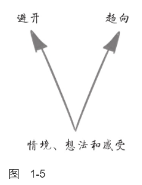

    作者: [澳]路斯·哈里斯
    出版社: 机械工业出版社
    副标题: 接纳承诺疗法简明实操手册(原书第2版）
    原作名: ACT Made Simple
    译者: 王静 / 曹慧
    出版年: 2022-7
    页数: 436
    ISBN: 9787111708575

[豆瓣链接](https://book.douban.com/subject/36009539/)

- [ACT是什么](#act是什么)
  - [人类的挑战](#人类的挑战)
    - [ACT的六个核心治疗过程](#act的六个核心治疗过程)
    - [ACT灵活三角](#act灵活三角)
    - [选择点](#选择点)
    - [选择点、灵活六边形和灵活三角](#选择点灵活六边形和灵活三角)
  - [被钩住](#被钩住)
    - [语言和头脑](#语言和头脑)
    - [认知融合](#认知融合)
    - [有关认知融合与认知解离的简单概括](#有关认知融合与认知解离的简单概括)
    - [有效性](#有效性)

# ACT是什么
## 人类的挑战
>ACT是一种创造性地运用价值和正念技术帮助人们建立丰富而有意义的生活的行为疗法。它基于六个核心过程：价值、承诺行动和四个正念过程，即认知解离、接纳、以己为景、接触当下。我们可以把它们重组为三个更大的过程：活在当下、开放和做重要的事。从技术角度讲，ACT的目的是帮助人们发展心理灵活性：一种专注并投入我们正在做的事情，对我们的想法和感受开放并为之腾出空间，从而在我们的价值引领下有效行动的能力。

在生活中我们每个人都不得不面对的重大挑战是：
1. 生活不易。
2. 完整的人生必然伴随着各种各样的情绪，苦乐参半。
3. 正常的人类头脑会自动放大心理痛苦。

`ACT`（acceptance and commitment therapy）旨在通过以下方式让人们最大程度地发挥潜力来过上丰富且有意义的生活：
- 帮助我们澄清什么是对我们真正重要和有意义的，即澄清我们的价值，并利用这个认知来引导、激励和驱动我们去做那些丰富生活和提高生活品质的事情。
- 教会我们心理技术（“正念”技术），使我们能够有效地处理痛苦的想法和感受，全情投入到当下我们正在做的任何事情中，并欣赏和品味我们生活中充实的方方面面。

### ACT的六个核心治疗过程
ACT中的六个核心治疗过程是接触当下、认知解离、接纳、以己为景、价值和承诺行动。
1. `接触当下（此时此地）`。接触当下意味着灵活地把注意力放到我们正在经历的这一时刻：根据什么是最有用的，来缩小、扩大、转移或维持你的关注点。接触当下应该包括有意识地关注我们周围的物质世界或我们内部的心理世界，或同时关注两者，与我们的体验相联结，并全情投入其中。
1. `认知解离（看见你的想法）`。解离意味着学会“退后一步”并从我们的想法、意象和记忆中脱离或分开。完整的学术名词是认知解离，但通常我们简称为解离。我们退后一步去观察自己的想法，而不是卷入其中。我们看见自己的想法本来的样子，只不过是文字或图片而已。我们只需轻轻地拿着而无须紧紧地攥住它们。我们允许它们引导我们，但不让它们支配我们。
1. `接纳（开放）`。接纳意味着开放，为不想要的个人体验腾出空间：想法、感受、情绪、记忆、欲望、表象、冲动和感觉。我们不是与之抗争，或抗拒、逃避它们，而是对它们开放并为它们腾出空间。我们允许它们在我们的内心自由流动，按照它们自己的安排，想来即来，想在即在，想走即走（只要这有助于我们有效地行动并改善我们的生活）。
1. `以己为景（观察性自我）`。用日常语言来说，头脑中有两个截然不同的部分：一部分是思考，另一部分是观察。当我们谈到“头脑”时，我们通常指的是思考部分——产生思想、信念、记忆、评价、幻想、计划等。我们通常指的不是“观察部分”：我们的那个部分会觉察任何时刻下我们想的、感受的、感觉的或者做的任何事。在ACT中，它的专业术语叫作：“以己为景。”
1. `价值（知道什么是重要的）`。你在生活中想要主张什么？你想怎么度过你在这个星球上生存的短暂时光？你想如何对待自己、他人以及你周围的世界？价值是身体或心理活动的理想品质。换言之，它们描述了我们希望在持续发展的基础上如何表现。我们经常把价值比作指南针，因为它们给我们指引方向，指引我们的人生旅程。
1. `承诺行动（为所当为）`。承诺行动意味着要在我们的价值指导下采取有效行动。它包括身体活动（我们用身体做什么）和心理活动（我们在内心世界做什么）。

如图1-1所示，称之为“ACT灵活六边形”（ACT hexaflex）。

### ACT灵活三角
这六个核心过程可以合并成我所说的灵活三角，灵活三角由三个功能单元组成，如图1-2所示。
1. `以己为景`（也称为`观察性自我`）和`接触当下`都涉及灵活地将注意力分配和投入到当下的体验中去（换言之，“活在当下”）。
1. `认知解离`和`接纳`是指与我们的想法和感受分开，看见它们的真实面目，并为它们腾出空间，允许它们按照自己的节奏自由来去（换言之，“开放”）。
1. `价值`和`承诺行动`包括发起并坚持能够提高生活品质的行动（换言之，“做重要的事”）。

因此，我们可以把心理灵活性描述为“活在当下、开放和做重要的事”的能力。

### 选择点
`选择点`是一个工具，它可以快速地描述问题，确定痛苦的来源，并形成处理问题与痛苦的ACT方案。我们可以在治疗的任意阶段引入它，也可以将它用于许多不同的目的。我通常是在新来访者的首次治疗的中段，作为知情同意（见第5章）的一部分来第一次介绍它。通常，它会这样进行：

治疗师：你同意我花点时间来画点东西吗？就是能帮助我们有效合作的路线图。（治疗师拿出一支笔和一张纸。）这样，你和我，以及这个星球上的任何其他人，我们总是在做一些事情。我们吃、喝、走、说、睡、玩……总是在做事情。即使我们只是盯着墙看，那也是在做事情，对吧？我们所做的一些事情是极为有用的，它们帮助我们趋向更好的生活。所以我称之为`“趋向”（towards moves）`。趋向主要是指那些如果我们在这里的合作成功的话，那你会想要开始做或更多去做的事情。

治疗师在说的同时，画了一个箭头（见图1-3），并写上“趋向”。

治疗师继续说：所以当我们趋向时，这意味着我们正在有效地行动，像我们想成为的人那样行动，去做那些可能使生活更有意义和更圆满的事情。问题是，这不是我们全部的行为。我们还会做效果相反的其他事情：它们会让我们远离我们真正想要的生活。所以我喜欢把这类行为叫作`“避开行为”（away moves）`，当我们避开时，意味着我们在无效地行动，不像我们想成为的人那样行动，做的事情从长期来看往往会让生活更糟。所以基本上，如果我们在这里的合作成功的话，“避开行为”是你将停止或少做的事情。

治疗师一边说，一边画了第二个箭头（见图1-4），然后写上“避开”。

治疗师继续说：这适用于我们所有人，是不是？一天下来，我们都会做出趋向和避开的选择，而且总是在时刻切换。而当生活不太艰难，当事情进展尚可，当我们得到了生活中想要的东西时，做出趋向的选择就会容易很多。但正如你所知的那样，生活中大部分时候都不是这样的。生活很艰难，很多时候我们得不到想要的。所以一天下来，我们总会遭遇各种困难情境，而令人痛苦的想法和感受都会出现。

在图1-5的底部，治疗师写上“情境、想法和感受”。（注：在本书中，“想法和感受”一词被用作想法、感受、情绪、记忆、欲望、冲动、图像和感觉等的简写。所有的个人经验都可以在选择点上被提及或写下来。）

治疗师继续说：问题是，我们中绝大多数人的惯常反应是当这些令人痛苦的想法和感受出现时，我们倾向于被它们“钩住”。它们在某种程度上把我们钩住，让我们卷进去，摆布我们，并且拖着我们到处走。

治疗师在“避开”箭头旁边写上“被钩住”（见图1-6）。

治疗师继续说：所以每个人或多或少都会做一些这样的事情，这很正常。没有人是完美的。但如果这类事情经常发生，就会产生很大的问题。事实上，几乎每一个我们所知道的心理问题——焦虑、抑郁、成瘾，凡是你能想出来的都可以归结为一个基本的过程：我们被痛苦的想法和感受钩住，并且开始避开。

然而，有时我们能够从这些痛苦的想法和感受中脱钩，转而采取趋向行为。我们在这类事情上做得越好……呃，生活就越美好。

在说这些的时候，治疗师在“趋向”箭头旁边写上“脱钩”（见图1-7）。

继续说：所以当我们处于这些充满挑战的情况下，这些痛苦的想法和感受出现时，对我们来说，这里就有一个选择机会：我们将如何应对？我们越是被钩住，就越有可能采取避开行为；但我们越能脱钩，就越容易采取趋向行为。

治疗师继续说：所以如果我们想做好这个（指着“趋向”箭头），我们就需要做两件事：学习一些脱钩技术，以及弄清楚我们想采取什么样的趋向行动。一旦这一切就绪，我们就有更多的选择来应对生活给我们带来的所有困难。这基本上就是这种疗法的全部：学习如何与这些东西脱钩（指着“想法和感受”），减少这些事情（指着“避开”），帮助你更好地做这些事情（指着“趋向”）。

现在，我只想标示出三个要点：
1. 选择点包括外显行为和内隐行为。在ACT中，我们把行为定义为“一个完整个体所做的任何事情”。这包括`外显行为`，如吃、喝、走、说话、观看《权力的游戏》等。外显行为基本上是指身体行为：你用胳膊、腿、手和脚采取的行动；面部表情；你所说、唱、喊或嘟囔的一切；你如何走路、吃、喝、呼吸；你的身体姿势等。然而，“行为”一词也指`内隐行为`，这基本上是指心理行为，如思考、专注、表征、正念、想象和回忆。例如，内隐的避开行为可能包括思维反刍、担忧、注意力分散、不投入、强迫思维，而内隐的趋向行为可能包括认知解离、接纳、重新集中注意力、投入、制定策略和做计划。
2. 要由来访者自己定义什么是避开行为。在治疗早期，来访者可能会将自我妨碍或自我毁灭行为视为一种趋向。例如，一个酒精或赌博成瘾的来访者最初可能会将饮酒和赌博归类为趋向。如果这样，我们也不要和来访者争论这个问题。我们只需要花点时间澄清一下：“我能不能确定一下我们对这些术语的理解是一样的？避开行为是那些如果我们在这里的合作成功了，你想停止或减少的行为，而如果我们在这里的合作成功了，你想开始做或多做的就是趋向行为。”如果来访者仍然将自我妨碍的行为标记为“趋向行为”，那么我们认可这一点，并将其写在趋向箭头旁边。为什么？因为这是来访者的生活掠影——他当下的所见所感，而不是治疗师该如何看待。我们的目标是了解来访者的世界观，了解来访者的自我觉察水平：来访者认为什么是问题，什么不是。在以后的治疗中，一旦来访者有了更高水平的心理灵活性，我们就可以回到这种行为上并重新评估：“你第一次来见我时，你把赌博归为一种趋向行为，现在你还这样认为吗？”通常，随着治疗的推进和来访者心理灵活性的发展，他会改变主意，将自我妨碍的行为归类为避开行为，特别是当他意识到它正在妨碍其他重要的生活目标时。
3. 任何行为都可以是“趋向行为”或“避开行为”，这取决于语境。当我主要是为了避免去健身房或为了拖延一些其他重要的工作而看电视时，或者当我为了逃避无聊或焦虑而不走心地吃了一块巧克力时，我会把它们归类为“避开行为”。但当我把电视作为一种有意识的、价值引导的选择来丰富我的生活时（例如追《行尸走肉》的最新一集），或者作为与朋友庆祝活动的一部分，我用心地吃巧克力，品味其滋味时，我会把它们归类为“趋向行为”。

### 选择点、灵活六边形和灵活三角
灵活六边形和灵活三角进程如何对应到选择点上（见图1-8）。
- `脱钩技术`是指ACT中的四个正念核心过程：认知解离、接纳、以己为景和接触当下。我们可以利用这些过程的任意组合让自己从痛苦的想法和感受中解脱出来，减少它们对外显行为和内隐行为的影响和冲击。
- `“趋向”`指的是身体上的和心理上的由价值引领的承诺行动。
- `“钩住”`指的是认知融合和经验性回避这两个核心过程，ACT认为这两个过程是造成我们大部分心理痛苦的罪魁祸首。认知融合基本上意味着我们被我们的认知“支配”。经验性回避是一种持续的挣扎，以回避或摆脱我们不想要的想法和感受。

## 被钩住
### 语言和头脑
人类语言是一种高度复杂的符号系统，包括文字、图像、声音、面部表情和身体姿势。人类的语言应用分为外显和内隐两大领域。外显语言的表现方式包括讲话、交谈、比画、姿势、书写、绘画、雕刻、唱歌、跳舞等。而内隐语言包括思考、想象、做白日梦、计划、表征、分析、担忧、幻想等。

“头脑”一词指的是一组极其复杂的交互式认知过程，包括分析、比较、评估、计划、记忆、表征等。所有这些复杂的过程都依赖于一套我们称之为人类语言的复杂符号系统。因此，在ACT中，当我们使用“头脑”这个词时，我们将其用作“人类语言”的隐喻。

### 认知融合
`认知融合`，通常简称为融合，基本意思是我们的认知在以一种自我挫败的或有问题的方式支配我们的行为（外显的和内隐的）。换句话说，我们的认知会对我们的行为和意识产生负面影响。

只有来访者在治疗前已经知道这个术语，我才直接用“融合”这个词。大多数情况下，我会用“被钩住了”——一个涵盖了融合和经验性回避的有用术语。我们可以谈论我们的想法和感受如何“钩住”我们：它们钩住了我们的注意力，困住我们，摆布我们，拉着我们偏离轨道。

认知融合主要表现在两个方面：
1. 我们的认知以有问题的方式支配身体行为。
2. 我们的认知以有问题的方式支配意识。

ACT中的一个普遍共识是，只有当这一心理过程导致了问题行为或自我挫败的行为时，才应该使用“融合”一词。

例如，如果我“迷失于自己的想法中”会提升生活品质，例如在度假时躺在沙滩上做白日梦，或者为了重要的演讲于适当的时间在心里进行排练，我们称之为“全神贯注”而不是融合。

### 有关认知融合与认知解离的简单概括
当我们与一种认知融合时，它就像：
- 我们必须遵守、屈从或遵循的某些东西；
- 我们需要避免或摆脱的一种威胁；
- 极为重要的必须占据我们所有注意力的某些事情。

当我们认知解离时，我们可以看到它本来的样子：一组“我们头脑中”的文字或图像。我们可以认识到它：
- 不是我们必须遵守、屈从或遵循的某些东西；
- 绝对不是对我们的一种威胁；
- 可能重要也可能不重要——我们可以选择对它分配多少注意力。

### 有效性
整个ACT模型依赖于一个关键概念：`有效性（workability）`。请将有效性这个词刻入你的大脑皮层，因为它是我们所做的每一次干预的基础。为了明确有效性，我们会问这个问题：“从长远来看，你现在的行为能否给你想要的生活？”如果答案是肯定的，那么我们说这是“有效的”，那就无须改变。如果答案是否定的，那么我们说它“无效”，此时，我们需要考虑更有效的替代方案。

当我们使用有效性的基本框架时，我们永远不需要将来访者的行为评价为“好”或“坏”、“正确”或“错误”；相反，我们可以不带评判地、充满关怀地问：“这是否会带给你想要的生活（对于带给你想要的生活，这是否有效）？”同样，我们也绝不需要把想法视为非理性的、功能失调的或消极的，也不需要去争论它们是真是假。相反，我们仅需要提出如下问题：
- 从长远来看，如果你让那个信念/想法/规则贯穿你的生活/决定你做什么/指导你的行动，它是否有效？
- 如果你被这些想法卷进去/钩住，这有助于你做想做的事吗？
- 如果跟着这些想法走，这会帮助你成为你想成为的人吗？

