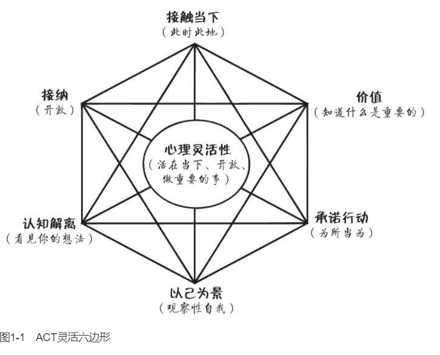
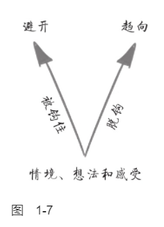

    作者: [澳]路斯·哈里斯
    出版社: 机械工业出版社
    副标题: 接纳承诺疗法简明实操手册(原书第2版）
    原作名: ACT Made Simple
    译者: 王静 / 曹慧
    出版年: 2022-7
    页数: 436
    ISBN: 9787111708575

[豆瓣链接](https://book.douban.com/subject/36009539/)

- [ACT是什么](#act是什么)
  - [人类的挑战](#人类的挑战)
    - [ACT的六个核心治疗过程](#act的六个核心治疗过程)
    - [ACT灵活三角](#act灵活三角)
    - [选择点](#选择点)
    - [选择点、灵活六边形和灵活三角](#选择点灵活六边形和灵活三角)
  - [被钩住](#被钩住)
    - [语言和头脑](#语言和头脑)
    - [认知融合](#认知融合)
    - [有关认知融合与认知解离的简单概括](#有关认知融合与认知解离的简单概括)
    - [有效性](#有效性)
    - [想法和感受不是问题](#想法和感受不是问题)
    - [融合的六大基本类型](#融合的六大基本类型)
    - [经验性回避](#经验性回避)
    - [关于接纳和回避的一个非常重要的观点](#关于接纳和回避的一个非常重要的观点)
    - [融合如何引发经验性回避](#融合如何引发经验性回避)
    - [心理僵化的六大核心病理过程](#心理僵化的六大核心病理过程)
  - [“正念”以及其他含混不清的词](#正念以及其他含混不清的词)
  - [来做ACT极客吧](#来做act极客吧)
- [启动ACT](#启动act)
  - [问题是什么](#问题是什么)

# ACT是什么
## 人类的挑战
>ACT是一种创造性地运用价值和正念技术帮助人们建立丰富而有意义的生活的行为疗法。它基于六个核心过程：价值、承诺行动和四个正念过程，即认知解离、接纳、以己为景、接触当下。我们可以把它们重组为三个更大的过程：活在当下、开放和做重要的事。从技术角度讲，ACT的目的是帮助人们发展心理灵活性：一种专注并投入我们正在做的事情，对我们的想法和感受开放并为之腾出空间，从而在我们的价值引领下有效行动的能力。

在生活中我们每个人都不得不面对的重大挑战是：
1. 生活不易。
2. 完整的人生必然伴随着各种各样的情绪，苦乐参半。
3. 正常的人类头脑会自动放大心理痛苦。

`ACT`（acceptance and commitment therapy）旨在通过以下方式让人们最大程度地发挥潜力来过上丰富且有意义的生活：
- 帮助我们澄清什么是对我们真正重要和有意义的，即澄清我们的价值，并利用这个认知来引导、激励和驱动我们去做那些丰富生活和提高生活品质的事情。
- 教会我们心理技术（“正念”技术），使我们能够有效地处理痛苦的想法和感受，全情投入到当下我们正在做的任何事情中，并欣赏和品味我们生活中充实的方方面面。

### ACT的六个核心治疗过程
ACT中的六个核心治疗过程是接触当下、认知解离、接纳、以己为景、价值和承诺行动。
1. `接触当下（此时此地）`。接触当下意味着灵活地把注意力放到我们正在经历的这一时刻：根据什么是最有用的，来缩小、扩大、转移或维持你的关注点。接触当下应该包括有意识地关注我们周围的物质世界或我们内部的心理世界，或同时关注两者，与我们的体验相联结，并全情投入其中。
1. `认知解离（看见你的想法）`。解离意味着学会“退后一步”并从我们的想法、意象和记忆中脱离或分开。完整的学术名词是认知解离，但通常我们简称为解离。我们退后一步去观察自己的想法，而不是卷入其中。我们看见自己的想法本来的样子，只不过是文字或图片而已。我们只需轻轻地拿着而无须紧紧地攥住它们。我们允许它们引导我们，但不让它们支配我们。
1. `接纳（开放）`。接纳意味着开放，为不想要的个人体验腾出空间：想法、感受、情绪、记忆、欲望、表象、冲动和感觉。我们不是与之抗争，或抗拒、逃避它们，而是对它们开放并为它们腾出空间。我们允许它们在我们的内心自由流动，按照它们自己的安排，想来即来，想在即在，想走即走（只要这有助于我们有效地行动并改善我们的生活）。
1. `以己为景（观察性自我）`。用日常语言来说，头脑中有两个截然不同的部分：一部分是思考，另一部分是观察。当我们谈到“头脑”时，我们通常指的是思考部分——产生思想、信念、记忆、评价、幻想、计划等。我们通常指的不是“观察部分”：我们的那个部分会觉察任何时刻下我们想的、感受的、感觉的或者做的任何事。在ACT中，它的专业术语叫作：“以己为景。”
1. `价值（知道什么是重要的）`。你在生活中想要主张什么？你想怎么度过你在这个星球上生存的短暂时光？你想如何对待自己、他人以及你周围的世界？价值是身体或心理活动的理想品质。换言之，它们描述了我们希望在持续发展的基础上如何表现。我们经常把价值比作指南针，因为它们给我们指引方向，指引我们的人生旅程。
1. `承诺行动（为所当为）`。承诺行动意味着要在我们的价值指导下采取有效行动。它包括身体活动（我们用身体做什么）和心理活动（我们在内心世界做什么）。

如图1-1所示，称之为“ACT灵活六边形”（ACT hexaflex）。

### ACT灵活三角
这六个核心过程可以合并成我所说的灵活三角，灵活三角由三个功能单元组成，如图1-2所示。
1. `以己为景`（也称为`观察性自我`）和`接触当下`都涉及灵活地将注意力分配和投入到当下的体验中去（换言之，“活在当下”）。
1. `认知解离`和`接纳`是指与我们的想法和感受分开，看见它们的真实面目，并为它们腾出空间，允许它们按照自己的节奏自由来去（换言之，“开放”）。
1. `价值`和`承诺行动`包括发起并坚持能够提高生活品质的行动（换言之，“做重要的事”）。

因此，我们可以把心理灵活性描述为“活在当下、开放和做重要的事”的能力。

### 选择点
`选择点`是一个工具，它可以快速地描述问题，确定痛苦的来源，并形成处理问题与痛苦的ACT方案。我们可以在治疗的任意阶段引入它，也可以将它用于许多不同的目的。我通常是在新来访者的首次治疗的中段，作为知情同意（见第5章）的一部分来第一次介绍它。通常，它会这样进行：

治疗师：你同意我花点时间来画点东西吗？就是能帮助我们有效合作的路线图。（治疗师拿出一支笔和一张纸。）这样，你和我，以及这个星球上的任何其他人，我们总是在做一些事情。我们吃、喝、走、说、睡、玩……总是在做事情。即使我们只是盯着墙看，那也是在做事情，对吧？我们所做的一些事情是极为有用的，它们帮助我们趋向更好的生活。所以我称之为`“趋向”（towards moves）`。趋向主要是指那些如果我们在这里的合作成功的话，那你会想要开始做或更多去做的事情。

治疗师在说的同时，画了一个箭头（见图1-3），并写上“趋向”。

治疗师继续说：所以当我们趋向时，这意味着我们正在有效地行动，像我们想成为的人那样行动，去做那些可能使生活更有意义和更圆满的事情。问题是，这不是我们全部的行为。我们还会做效果相反的其他事情：它们会让我们远离我们真正想要的生活。所以我喜欢把这类行为叫作`“避开行为”（away moves）`，当我们避开时，意味着我们在无效地行动，不像我们想成为的人那样行动，做的事情从长期来看往往会让生活更糟。所以基本上，如果我们在这里的合作成功的话，“避开行为”是你将停止或少做的事情。

治疗师一边说，一边画了第二个箭头（见图1-4），然后写上“避开”。

治疗师继续说：这适用于我们所有人，是不是？一天下来，我们都会做出趋向和避开的选择，而且总是在时刻切换。而当生活不太艰难，当事情进展尚可，当我们得到了生活中想要的东西时，做出趋向的选择就会容易很多。但正如你所知的那样，生活中大部分时候都不是这样的。生活很艰难，很多时候我们得不到想要的。所以一天下来，我们总会遭遇各种困难情境，而令人痛苦的想法和感受都会出现。

在图1-5的底部，治疗师写上“情境、想法和感受”。（注：在本书中，“想法和感受”一词被用作想法、感受、情绪、记忆、欲望、冲动、图像和感觉等的简写。所有的个人经验都可以在选择点上被提及或写下来。）

治疗师继续说：问题是，我们中绝大多数人的惯常反应是当这些令人痛苦的想法和感受出现时，我们倾向于被它们“钩住”。它们在某种程度上把我们钩住，让我们卷进去，摆布我们，并且拖着我们到处走。

治疗师在“避开”箭头旁边写上“被钩住”（见图1-6）。

治疗师继续说：所以每个人或多或少都会做一些这样的事情，这很正常。没有人是完美的。但如果这类事情经常发生，就会产生很大的问题。事实上，几乎每一个我们所知道的心理问题——焦虑、抑郁、成瘾，凡是你能想出来的都可以归结为一个基本的过程：我们被痛苦的想法和感受钩住，并且开始避开。

然而，有时我们能够从这些痛苦的想法和感受中脱钩，转而采取趋向行为。我们在这类事情上做得越好……呃，生活就越美好。

在说这些的时候，治疗师在“趋向”箭头旁边写上“脱钩”（见图1-7）。

继续说：所以当我们处于这些充满挑战的情况下，这些痛苦的想法和感受出现时，对我们来说，这里就有一个选择机会：我们将如何应对？我们越是被钩住，就越有可能采取避开行为；但我们越能脱钩，就越容易采取趋向行为。

治疗师继续说：所以如果我们想做好这个（指着“趋向”箭头），我们就需要做两件事：学习一些脱钩技术，以及弄清楚我们想采取什么样的趋向行动。一旦这一切就绪，我们就有更多的选择来应对生活给我们带来的所有困难。这基本上就是这种疗法的全部：学习如何与这些东西脱钩（指着“想法和感受”），减少这些事情（指着“避开”），帮助你更好地做这些事情（指着“趋向”）。

现在，我只想标示出三个要点：
1. 选择点包括外显行为和内隐行为。在ACT中，我们把行为定义为“一个完整个体所做的任何事情”。这包括`外显行为`，如吃、喝、走、说话、观看《权力的游戏》等。外显行为基本上是指身体行为：你用胳膊、腿、手和脚采取的行动；面部表情；你所说、唱、喊或嘟囔的一切；你如何走路、吃、喝、呼吸；你的身体姿势等。然而，“行为”一词也指`内隐行为`，这基本上是指心理行为，如思考、专注、表征、正念、想象和回忆。例如，内隐的避开行为可能包括思维反刍、担忧、注意力分散、不投入、强迫思维，而内隐的趋向行为可能包括认知解离、接纳、重新集中注意力、投入、制定策略和做计划。
2. 要由来访者自己定义什么是避开行为。在治疗早期，来访者可能会将自我妨碍或自我毁灭行为视为一种趋向。例如，一个酒精或赌博成瘾的来访者最初可能会将饮酒和赌博归类为趋向。如果这样，我们也不要和来访者争论这个问题。我们只需要花点时间澄清一下：“我能不能确定一下我们对这些术语的理解是一样的？避开行为是那些如果我们在这里的合作成功了，你想停止或减少的行为，而如果我们在这里的合作成功了，你想开始做或多做的就是趋向行为。”如果来访者仍然将自我妨碍的行为标记为“趋向行为”，那么我们认可这一点，并将其写在趋向箭头旁边。为什么？因为这是来访者的生活掠影——他当下的所见所感，而不是治疗师该如何看待。我们的目标是了解来访者的世界观，了解来访者的自我觉察水平：来访者认为什么是问题，什么不是。在以后的治疗中，一旦来访者有了更高水平的心理灵活性，我们就可以回到这种行为上并重新评估：“你第一次来见我时，你把赌博归为一种趋向行为，现在你还这样认为吗？”通常，随着治疗的推进和来访者心理灵活性的发展，他会改变主意，将自我妨碍的行为归类为避开行为，特别是当他意识到它正在妨碍其他重要的生活目标时。
3. 任何行为都可以是“趋向行为”或“避开行为”，这取决于语境。当我主要是为了避免去健身房或为了拖延一些其他重要的工作而看电视时，或者当我为了逃避无聊或焦虑而不走心地吃了一块巧克力时，我会把它们归类为“避开行为”。但当我把电视作为一种有意识的、价值引导的选择来丰富我的生活时（例如追《行尸走肉》的最新一集），或者作为与朋友庆祝活动的一部分，我用心地吃巧克力，品味其滋味时，我会把它们归类为“趋向行为”。

### 选择点、灵活六边形和灵活三角
灵活六边形和灵活三角进程如何对应到选择点上（见图1-8）。
- `脱钩技术`是指ACT中的四个正念核心过程：认知解离、接纳、以己为景和接触当下。我们可以利用这些过程的任意组合让自己从痛苦的想法和感受中解脱出来，减少它们对外显行为和内隐行为的影响和冲击。
- `“趋向”`指的是身体上的和心理上的由价值引领的承诺行动。
- `“钩住”`指的是认知融合和经验性回避这两个核心过程，ACT认为这两个过程是造成我们大部分心理痛苦的罪魁祸首。认知融合基本上意味着我们被我们的认知“支配”。经验性回避是一种持续的挣扎，以回避或摆脱我们不想要的想法和感受。

## 被钩住
>ACT模型是建立在有效性这一核心概念之上的：你正在做的事情会让你的生活更丰富、更充实吗？ACT的主要病理过程是认知融合，分为六大类：过去、未来、自我概念、理由、规则和评判。融合会产生很多问题，其中最常见的一种是经验性回避，因此，当我们在选择点中使用“被钩住”这个词时，它既指融合又指经验性回避。
>
>核心病理过程包括认知融合、经验性回避、僵化的注意、远离价值、无效行动、与自我概念融合，这些过程在所有人类身上都会或多或少地存在，这就是ACT适用于所有人的原因。

### 语言和头脑
人类语言是一种高度复杂的符号系统，包括文字、图像、声音、面部表情和身体姿势。人类的语言应用分为外显和内隐两大领域。外显语言的表现方式包括讲话、交谈、比画、姿势、书写、绘画、雕刻、唱歌、跳舞等。而内隐语言包括思考、想象、做白日梦、计划、表征、分析、担忧、幻想等。

“头脑”一词指的是一组极其复杂的交互式认知过程，包括分析、比较、评估、计划、记忆、表征等。所有这些复杂的过程都依赖于一套我们称之为人类语言的复杂符号系统。因此，在ACT中，当我们使用“头脑”这个词时，我们将其用作“人类语言”的隐喻。

### 认知融合
`认知融合`，通常简称为融合，基本意思是我们的认知在以一种自我挫败的或有问题的方式支配我们的行为（外显的和内隐的）。换句话说，我们的认知会对我们的行为和意识产生负面影响。

只有来访者在治疗前已经知道这个术语，我才直接用“融合”这个词。大多数情况下，我会用“被钩住了”——一个涵盖了融合和经验性回避的有用术语。我们可以谈论我们的想法和感受如何“钩住”我们：它们钩住了我们的注意力，困住我们，摆布我们，拉着我们偏离轨道。

认知融合主要表现在两个方面：
1. 我们的认知以有问题的方式支配身体行为。
2. 我们的认知以有问题的方式支配意识。

ACT中的一个普遍共识是，只有当这一心理过程导致了问题行为或自我挫败的行为时，才应该使用“融合”一词。

例如，如果我“迷失于自己的想法中”会提升生活品质，例如在度假时躺在沙滩上做白日梦，或者为了重要的演讲于适当的时间在心里进行排练，我们称之为“全神贯注”而不是融合。

### 有关认知融合与认知解离的简单概括
当我们与一种认知融合时，它就像：
- 我们必须遵守、屈从或遵循的某些东西；
- 我们需要避免或摆脱的一种威胁；
- 极为重要的必须占据我们所有注意力的某些事情。

当我们认知解离时，我们可以看到它本来的样子：一组“我们头脑中”的文字或图像。我们可以认识到它：
- 不是我们必须遵守、屈从或遵循的某些东西；
- 绝对不是对我们的一种威胁；
- 可能重要也可能不重要——我们可以选择对它分配多少注意力。

### 有效性
整个ACT模型依赖于一个关键概念：`有效性（workability）`。请将有效性这个词刻入你的大脑皮层，因为它是我们所做的每一次干预的基础。为了明确有效性，我们会问这个问题：“从长远来看，你现在的行为能否给你想要的生活？”如果答案是肯定的，那么我们说这是“有效的”，那就无须改变。如果答案是否定的，那么我们说它“无效”，此时，我们需要考虑更有效的替代方案。

当我们使用有效性的基本框架时，我们永远不需要将来访者的行为评价为“好”或“坏”、“正确”或“错误”；相反，我们可以不带评判地、充满关怀地问：“这是否会带给你想要的生活（对于带给你想要的生活，这是否有效）？”同样，我们也绝不需要把想法视为非理性的、功能失调的或消极的，也不需要去争论它们是真是假。相反，我们仅需要提出如下问题：
- 从长远来看，如果你让那个信念/想法/规则贯穿你的生活/决定你做什么/指导你的行动，它是否有效？
- 如果你被这些想法卷进去/钩住，这有助于你做想做的事吗？
- 如果跟着这些想法走，这会帮助你成为你想成为的人吗？

### 想法和感受不是问题
想法和感受本身不是问题，只有当我们以僵化、不灵活的方式，比如融合和回避，来回应它们时，它们才会带来有问题的结果。

在融合和（过度）经验回避的语境下，想法和感受很容易走极端或使生活扭曲。但是，如果我们灵活地用认知解离、接纳、以己为景和灵活注意来回应它们，那么在这个正念的新语境中，同样的想法和感受会带来不同的结果。当然，它们可能仍然是痛苦的或不愉快的，但它们不再具有损害幸福或生活质量的功能。

### 融合的六大基本类型
临床上有六大类融合需要探寻：与过去、未来、自我概念、理由、规则和评价的融合。

`与过去融合`。这一类是指所有基于过去的认知类型，包括：
- 思维反刍、后悔和沉浸在痛苦的记忆中（例如，关于失败、伤害和丧失）。
- 对过去事件的抱怨和不满。
- 理想化过去：在XYZ发生之前，我的生活曾经很美好。

`与未来融合`。这一类是指所有基于未来的认知类型，包括：
- 担忧、灾难化。
- 假设最坏结果、绝望感。
- 对失败、被拒绝、伤害、丧失等的预期。

`与自我概念融合`。这一类是指所有关于自我描述和自我评价的认知类型，包括：
- 消极的自我评判：我坏、不可爱、一文不值、肮脏、残缺、一无是处、支离破碎。
- 积极的自我评判：我总是对的，我比你好。
- 过度认同一个标签：我是边缘人，我抑郁了，我是酒鬼。

`与理由融合`。人类极为擅长“找理由”：关于我们为什么不能改变、不会改变甚至不应该改变的理由随时会浮现出来。这一类包括所有诸如此类的理由。我不能做X（重要行动），因为……
- 我实在太Y（Y = 抑郁、累、焦虑等）。
- Z可能发生（Z = 糟糕的结果，如失败、被拒绝、让自己看起来像个傻瓜等）。
- 这毫无意义，太难了，太可怕了。
- 我是B（B = 边缘人、害羞的、废物或其他自我概念）。
- C说我不应该（C = 父母、宗教、法律、文化信仰、工作场所要求等）。

`与规则融合`。这一类包括所有我认同的“规则”，是关于我、他人或世界应该是怎样的。规则通常可以通过诸如“应该”“不得不”“必须”“应当”“对”“错”“公平”或“不公平”这样的词来识别。并且它们常常给出限制条件，例如“直到……之前不能……”“不应该……除非……”“绝对不能……因为……”“为了……必须这样”“不能容忍，或不予准许”。下面是一些例子：
- 我绝对不能犯错误。
- 她先改变，我才改变。
- 当我有这种感觉时，我不能去上班。

`与评判融合`。这一类是指任何类型的评判或评估，无论是积极的还是消极的，包括对以下方面的评判：
- 过去和未来。
- 自我和他人。
- 我们自己的想法和感受。
- 我们的身体、行为、生活。
- 世界、地方、人、物、事以及几乎任何东西。
这六种融合类型相互重叠，很容易交织成一种这样的复杂叙事：因为坏事发生在我身上（过去），我受到了伤害（自我概念、评判），这意味着我不能做X（找理由），否则我就永远无法拥有Y（未来）。

### 经验性回避
让我们来考虑一下经验性回避是如何增加痛苦的。成瘾就是一个明显的例子。许多成瘾状况是为了回避或摆脱不想要的想法和感受，如无聊、孤独、焦虑、内疚、愤怒和悲伤。在短期内，赌博、毒品、酒精和香烟可能会帮助人们暂时回避或摆脱这些感受，但随着时间的推移，它反而会产生巨大的痛苦和折磨。

从长远来看，我们花在摆脱不想要的个人体验上的时间和精力越多，我们在心理上遭受的痛苦可能就越大。

### 关于接纳和回避的一个非常重要的观点
在ACT中，我们并不主张在任何情况下都接纳所有的想法和感受，这不仅十分僵化，并且完全没有必要。ACT在以下两种情况下提倡经验性接纳：
1. 当对想法和感受的回避受到限制或不可能时。
2. 当对想法和感受的回避是可能的，但长期来看，使用的方法会使生活更糟时。
如果经验性回避是可能的，并且回避有助于你按照价值生活，那就去做吧。

### 融合如何引发经验性回避
如果经验性回避变得过度，那么很大程度上是因为与两类想法的融合：评判和规则。我们的头脑把痛苦的想法和感受评价成“坏的”，并为之形成规则“我必须摆脱它们”！这通常比我们有意识的思考速度更快。一旦痛苦的想法和感受出现，我们就立刻开始试图回避或摆脱它们。（因此，将过度的经验性回避视为与这条规则（这些想法和感受是糟糕的，所以我必须摆脱）融合的副产品，可能会对你有帮助。）

综上所述，融合是ACT中最重要的病理过程，经验性回避是融合可能引起的诸多问题之一。所以，如果你曾经在做个案概念化时试图确定“这是融合还是回避”，那么答案通常是：两者都是！例如，一位来访者可能既会因为渴望而回避焦虑（经验性回避），又会因为与“我需要啤酒”的融合而饮酒。

这两个过程之间的重叠就是我使用术语“钩住”来指代融合和回避的原因。为了证实这一点，我经常提到两种不同的被钩住模式：自动化模式和回避性模式。

`自动化模式（automatic mode）`是指在一种融合的状态下，我们自动地服从我们的想法和感受，我们做认知让我们去做的任何事情。我们与愤怒的认知融合，我们就咄咄逼人。我们与焦虑的认知融合，我们就畏首畏尾。我们与我们的欲望和渴望的认知元素融合，我们就去做它们急于让我们做的任何事情，比如吸毒、吸烟、暴饮暴食等。

`回避性模式（avoidance mode）`是指在一种融合的状态下，我们尽一切可能回避或摆脱不想要的想法和感受。支配我们行为的是努力回避或摆脱这些痛苦的内心体验。换句话说，就是经验性回避。

### 心理僵化的六大核心病理过程
如图2-3所示，ACT的核心病理过程是：融合、经验性回避、不灵活的注意、远离价值、无效的行动以及与自我概念的融合。

`融合`意味着我们的想法支配着我们的身体行为和意识，并且达到了一种有问题的程度。例如，在抑郁的状态下，来访者可能会融合各种无用的想法：我很差劲，我不值得更好的，我无法改变，我将会一直如此，生活很糟糕，这一切太难了，治疗没用，这一切永远都不会有起色，当我有这种感觉时我就无法起床，我太累了以致什么都做不了。他们也常常与那些痛苦记忆融合在一起：拒绝、失望、失败或虐待。（与某一记忆的极度融合（到了那种好像这件事此时此刻真的正在发生的程度），通常被称为“闪回”。）在临床抑郁症中，融合常常表现为担忧、思维反刍、试图弄明白“我为什么会这样”，或者持续的负面评论：这个聚会糟透了；我宁愿躺在床上；留在这里究竟有什么意义，他们都那么开心；没人真的想要我待在这里。

`经验性回避`，持续地企图摆脱、回避或逃离不想要的个人体验，如想法、感受和记忆，是接纳的反面。抑郁的来访者通常很努力地回避或摆脱痛苦的情绪和感受，如焦虑、悲伤、疲劳、愤怒、内疚、孤独、困倦等。让我们举一个常见的社交退缩的例子。你的来访者正打算去参加她最好的朋友的生日派对，但随着时间的临近，她融合了诸如此类的想法，比如我很无趣，我是个累赘，我跟别人没什么可聊的，我不会享受到乐趣，我太累了，或者我不想被打扰，再加上最近那些不顺利的社交活动中的痛苦回忆。她感到焦虑，而且随着时间的推移，这种感觉变得越来越强烈，直到她完全被恐惧吞噬。所以她打电话给她的朋友，说她生病了，不能去了。在那一刻，她松了一口气：所有那些痛苦的想法和感受顿时烟消云散了。当然，这种解脱不会持续太久。过了一会儿，她又开始自怨自艾了：看啊，我真是个废物！甚至不能去参加我最好朋友的派对。但那短暂的解脱感，从恐惧中暂时的逃离，正在被高度强化。这加剧了她未来社交退缩的可能。

融合和回避是齐头并进的。我们的来访者融合了各种痛苦的认知（如思维反刍、担忧、自我批评或失败和失望的记忆），同时试图回避或摆脱它们（如通过药物、酒精、香烟、电视或睡觉）。

接触当下，或灵活注意，指与你的内外两个世界都进行充分的、有意识的接触，并基于有用与否来缩小、扩大、转移或维持你的关注点的能力。与之相反，`僵化的注意`指的是这种能力的不同形式的缺失，特别是“三D”开头的“三不”：不专注（Distractibility）、不投入（Disengagement）和不联结（Disconnection）。

- `不专注`是指难以将注意力持续集中在手头的任务或活动上，注意力很容易转移到其他无关的刺激上。在任何任务或活动中，我们越是分心，我们的表现就越差，满意度也就越低。
- `不投入`是指当我们意识上缺乏兴趣或并没有沉浸在自己的体验中时的各种各样的情况：走过场，做事情心不在焉，自动化，在一种无聊的、不感兴趣的或神情恍惚的状态中。
- `不联结`这个术语是我用来描述一种与我们自己的想法和感受缺乏有意识的联系的状态。如果我们不能注意自己在想什么或者我们的感受是什么，那么我们就缺乏自我觉察，因此以适合的方式来改变我们的行为就会难上加难，我们就容易情绪失调和进行冲动的、反应性的或无意识的行为。

`远离价值`：当我们的行为越来越受到融合和经验性回避的驱使时，我们的价值往往会被丢失、被忽视或被遗忘。如果我们不清楚自己的价值，或者无法与之接触，我们就不能用它们为我们的行动进行有效引导。例如，抑郁的来访者经常会与他们的价值失去联结，这些价值包括：关爱、联结、奉献，富有成效和乐于助人，自我关爱，玩耍，亲密，可靠，等等。

在ACT中，我们的目标是使行为越来越多地受到价值的引领，而不是被融合或回避控制。

术语`“无效行动”`（或“避开”）描述了拉着我们远离正念的、有价值的生活的行为模式。这些行为包括冲动的、反应性的或自动化的行为（与正念的、深思熟虑的或有目的的行为相反）；由融合或经验性回避（而不是价值）持续激发的行为；或当需要有效行动时却不作为或拖延。抑郁症（以及许多其他障碍）患者中无效行动的常见例子包括：嗑药或过度饮酒；社交退缩；停止以前感到愉悦的活动；睡觉、看电视或沉迷游戏以及企图自杀。

我们都有一则关于我是谁的故事。这个故事是复杂的和多层次的。它包括客观事实（如姓名、年龄、性别、婚姻状况、职业）、对我们的身份角色的描述和评估、我们的长处和短处、我们的好恶、我们的希望、我们的梦想和抱负。如果我们轻松地对待这个故事，那么它就可以帮助我们定义我们是谁，以及生活中我们想要什么。

但当我们`与我们的自我概念融合`时，似乎所有这些有关自我描述的想法就成了“我是谁”的本质内容。我们就会失去这样的能力：退后一步，看到这些自我概念无非是一种复杂的认知结构，一幅由丰富的文字和图像织成的锦缎罢了。

抑郁症来访者通常会融合一种非常消极的自我概念：我不好、一文不值、无可救药、不讨人喜欢等。然而，你也有可能融合的是“积极的”元素，例如，我是一个坚强的人，我本不应该这样反应的，我是一个好人，为什么这会发生在我身上。

## “正念”以及其他含混不清的词
`正念`是一套致力于有效生活的心理技术，包括在开放、好奇、友善和灵活的心态下保持专注。
1. 正念指的是一整套技术的组合，它涵盖了以下所有内容：从接纳痛苦的感觉到品味愉悦的体验，从温柔地观察你的想法到在崩溃的情绪中稳定自己。（正如你在阅读第1章时所知道的，在ACT中“正念”一词是指认知解离、接纳、接触当下和以己为景四个心理过程的任意组合，以及任何或所有能够用以支持和加强这些过程的技能、方法、实践、工具和技术。）
2. 正念是一个注意力集中的过程，而不是一个思考的过程。它让你关注自己的体验，而不是陷在你的想法中。
3. 正念涉及一种特殊的态度——一种开放和好奇的态度。即使你这一刻的经历是困难的、痛苦的或不愉快的，你也可以对它开放，对它充满好奇，而不是逃避或与之对抗。
4. 正念涉及注意力的灵活性——有意识地拓宽、缩小、维持或重新定向你的注意力的能力。这样你就可以根据需要来关注你在此时此地体验到的不同方面。
5. 正念的关注点包括友善的品质。不是科学家解剖老鼠时那种冷酷无情的临床关注，而是像慈爱的父母给予孩子的温暖、体贴的关注。

你会发现，每一个单独的正念练习，从一个10秒的ACT技术到一个10天的止语冥想静修，都有一个基本的操作：`“观察X”`。

“观察”一词的常见替代词包括“察看”“注意”“专注于”“觉察到”或“把你的觉察带入”。我们所观察的“X”可以是此时此地的任何事物：一个想法或一点感受、一种感觉、欲望或记忆；我们的身体姿势；我们的行为；我们能看到、听到、触摸、品尝或闻到的任何东西。X可能是从窗户看到的风景、爱人脸上的表情、洗热水澡的感觉、巧克力的味道、系鞋带的动作、肺部的运动或者房间内听到的声音。

有时，我们可能想拓宽我们的注意范围，例如，如果我们在乡村散步，我们就想将所有的风景、声音和气味都尽收于心。其他一些时候，我们可能想缩小注意力范围：如果我们在倾盆大雨中开车，我们就希望全神贯注于道路上，而不是与乘客聊天或者环顾四周来欣赏风景。有时，我们可能想把注意力引向想法、感受和感觉所在的内在世界；另一些时候，我们想把注意力引向我们身边的外在世界；还有很多时候，我们想把注意力同时引向两个世界，即根据环境的要求，把注意力从一个事物自由地转移到另一个事物上。这种能力在学术上被称为“灵活注意”。

“冥想”和“正念”澄清一下：它们不是一件事，两者不一样。首先，正念并不一定是指正式的冥想练习，例如观呼吸或身体扫描。当然，有时候它就是这个意思，但它也指一个更广范围内的正念技术、工具和练习，这与正式的冥想几乎没有，甚至是根本没有相似之处。

我们还要记住，冥想本身有许多不同类型的风格和实操方式，其中一些与正式的正念冥想也是极其不同的。例如，在某些类型的冥想中，目标是“从头脑中清空所有的念头”。这与正念冥想恰恰相反，在正念冥想中，你并不期望“头脑将被清空”，反之，你会对不断出现的各种念头持开放态度并对其感兴趣。

很多人把正念和佛教或冥想混为一谈，还有人把它与积极思考、放松或转移注意力相混淆，或者把它看作摆脱不想要的想法和感受的一种方法。正如我们已经探讨过的，正念（至少在ACT里的正念）与以上几种说法毫无关系。所以贯穿本书，我都将鼓励你用其他的词来代替：“脱钩”“投入”“抛锚”“专注于任务”“扩展”等。我会鼓励你和来访者澄清你到底在教授什么样的技术（也就是说，不要只是含糊其词地称之为“正念”），以及它可能如何帮助他们解决问题。

## 来做ACT极客吧
`功能语境主义`是奠定ACT模型基础的科学哲学。它是要考察在不同的语境中行为是如何发挥功能的，因此而得名。当我们问“这个行为的功能是什么”时，我们的意思是：“在这种情境中，这个行为会有什么影响？它会实现什么结果？”为了澄清这一点，让我们想象现在有五个不同的人，分别处于五种不同的情境中，每个人都在用一把锋利的刀来割自己的手臂。现在看看你是否可以为此行为设想出五种可能的功能。

以下是某些可能的功能：
- 引起注意
- 自我惩罚
- 缓解压力
- 从痛苦的情绪中转移出来
- 身体艺术创作
- 让你在“完全麻木”时能有所感觉
- 企图自杀

注意在所有这些情境下，行为方式都是相同的——用刀割手臂，但是行为的功能或行为在此情境下的效果，是不同的。现在，让我们假设你的朋友正陷入沉思，而你想要引起他的注意。想出可以达到这种效果的五种不同的行为方式。

以下是一些想法：
- 向他挥手
- 喊：“嗨，有人吗？”
- 把一杯水浇到他头上
- 大声地敲家具
- 说：“请注意一下我好吗？”

在这个例子中，你能看到很多不同的行为方式都具有同样的功能：在这种情境中，它们的效果都是引起注意。在功能语境主义中，我们对于一个行为的功能（它起到的效果）的兴趣，要比对这个行为本身形式的兴趣多得多。例如，当我们运用选择点时，我们就是在不断地分析来访者在他的生活语境中所表现的行为的功能（对于“语境”的意思，我们很快就会进行更多的说明）。我们会询问，它的功能是趋向还是避开。这让我们可以从一种毫不评判的视角来看待来访者的行为，而不是去评估它是好是坏、是对是错、是积极还是消极，我们只是从有效性的角度去看它。谨记：如果你行为的功能，是有效地帮助你过上你想要的生活，那么它就是有效的；如果它的功能相反，那么它就是无效的。

所有的行为都发生在一个语境当中。专业术语`“语境”`的意思是所有能够影响我们正在分析的行为的东西。这可能包括：
  -情绪、感受、心情
- 认知事件（想法、信念、态度、假设、计划）
- 认知过程（注意、记忆）
- 人际因素（还有谁在场，你与他们曾经的关系）
- 社会和文化事件（公共假期、传统庆典和仪式）
- 物理环境（地点、家具陈设、天气、时间、温度、味道）
- 基因和遗传外因素
- 生理状态，如干渴、饥饿和疲劳
- 药品、酒精和食物的使用
- 身体健康或疾病
- 社会和文化状态（社会阶层、地位和等级，同辈团体）
- 发展史和学习经历，包括依恋类型

我们可以方便地把任何语境分成两大影响类别：`前因`和`后果`。

`前因`是触发问题行为的因素，也就是说，问题行为是紧接着它们发生的，它们给问题行为的出现做出了提示。临床上，我们主要聚焦的前因是情境、想法和感受。正如下图所阐述的那样，当运用选择点时，前情永远放在底部。在这个例子中，任何形式的社交退缩都是避开。如图4-1所示，这类行为会有很多可能的前情。

通俗来讲，我们可以说我们的每一个行为都有回报（带来某种利益或收获）和代价（某种不利的结果）。

如果假以时日，一种行为的代价是导致这种行为减少或者停止，那么我们的专业术语称之为`惩罚性后果（punishing consequences）`。例如，如果来访者取消了一场社交活动，但是余下的夜晚时光他感到无比孤独和痛苦，因此他开始不那么频繁地取消社交活动，那么从技术上说就是一种惩罚性后果。

如果假以时日，一种行为的回报是导致这种行为持续或者增加，那么我们的专业术语称之为`强化性后果（reinforcing consequences）`。例如，如果来访者取消了一场社交活动，并且这么做让他有了巨大的解脱感，因此他开始更多地取消社交活动，那么这就是一种强化性后果。

在选择点上把代价和回报都包含进去，通常很有用。例如，在接下来的图4-2中，为了帮助来访者理解为什么他会一直有问题行为（如，是什么强化了它），治疗师在图上方加入了回报。

用这种方式标注出一种行为的前情和后果，通常是非常有用的，特别是当一位来访者说“我不知道为什么会一直这么做”时。这种标注的专业术语是`功能分析（functional analysis）`，更好玩的叫法是功能定点（function spotting）。当我们带着来访者一起经历这个过程时，能帮助他快速觉察，并将一些有价值的领悟带入他的行为中：是什么触发了它（前因）以及什么让它一直持续（强化性后果）。

与此同时，这种方式还为临床干预提供了一个完美的跳板。例如，在上面的图中，我们很容易就能识别出要用认知解离来应对的想法，要用接纳来应对的感受，以及要用由价值引导的问题解决、目标设定、行动计划（如果来访者在社交领域表现极差，那么还将会包括社交技术的训练）来应对的有挑战的情境。

# 启动ACT
## 问题是什么

